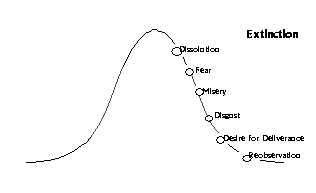

# Preface

This e-book is a pragmatic presentation of the Progress of Insight map by Kenneth Folk and Ron Crouch. 

# The Progress of Insight Map by Kenneth Folk

The following is a description of how the Progress of Insight stages might be experienced by an idealized meditator.

If the Progress of Insight were plotted on a graph, it would start out flat, rise until reaching a peak event, descend into a trough, stabilize, and then resolve.

1. The opening act is the flat line at the left, understanding that the cycle moves from left to right. (As it is a cycle, this whole process might be more accurately represented as a circle, but I have deliberately chosen a linear graph for ease of understanding.) In traditional language, what I am calling the opening act includes the first two insight knowledges: Knowledge of Mind and Body and Knowledge of Cause and Effect. [http://www.accesstoinsight.org/lib/authors/mahasi/progress.html]

2. The ascent. The third insight knowledge, Knowledge of the Three Characteristics.

3. The peak. The fourth and fifth insight knowledges, Knowledge of the Arising and Passing Away of Phenomena and Knowledge of Dissolution, respectively.

4. The descent. The 6th through 10th insight knowledges: Fear, Misery, Disgust, Desire for Deliverance, and Re-observation. These are collectively referred to as the dukkha ñanas or the dark night of the soul.

5. Consolidation and Resolution. Includes the 11th insight knowledge, Knowledge of Equanimity, the 12th through 16th insight knowledges, including Path and Fruition, all five of which are said to happen in one mome, and the 17th insight knowledge, Review.

Even though not everyone will recognize all of the stages or experience them as described, the general arc holds true in most cases. It’s usually easier to recognize the stages on hindsight.

## Knowledge of Mind and Body (Stage 1)

The opening stage feels solid. When our imaginary idealized meditator first begins to sit down to meditate, her experience will probably be fairly pleasant and unremarkable. Soon after starting, she will have her first insight: seeing that the mind and the body are two separate things, with each influencing the other. She sees a thought arise as separate from “herself,” the knower of the thoughts. She may a notice a sensation such as an itch and recognize that it is perceived in two parts: the physical sensation itself, and the mental impression of it.

This is the beginning of a meta-awareness, a stepping back from experience to be able to dispassionately observe experience, an ability that will strengthen throughout the meditator’s life.

Our imaginary yogi has reached the first insight knowledge, the aptly named Knowledge of Mind and Body. She is just beginning to settle into meditation, which can be pleasant. There’s often a deep sense of calm and subtle exhilaration upon beginning a meditation practice. Our meditator’s experience at this point can be described as solid, because she doesn’t yet have the perceptual resolution and acuity to see things changing at a fine level of detail. The ability to perceive at the level of micro-sensations is the very heart of the vipassana technique and that which gives it its unique transformative power.

A traditional example can help to illustrate what is meant by solid in this context, and how objects that initially appear solid can be broken down into their component parts through careful observation:

>Imagine that you are walking down a country road and you see what appears to be rope lying across the road, its ends disappearing into the brush on either side. As you draw closer, you notice that the rope is not lying still, as one would expect from a rope. It seems to be moving ever so slightly. Moving closer still, you realize that it is not a rope at all, but a line of ants crossing the road in both directions. Finally, you see that that line is composed of individual ants, each of which is composed of many constituent parts constantly in motion. The object of perception, which at first seemed to be a solid rope, is revealed to be a process rather than a thing.

This practice of deconstructing apparently solid objects of perception into their constituent parts is fundamental to the practice of vipassana [http://en.wikipedia.org/wiki/Vipassan%C4%81], which is translated into English as “seeing clearly.”

The meditator at the level of the first insight knowledge, however, has not yet done this. True vipassana doesn’t begin until the fourth insight knowledge, Knowledge of the Arising and Passing Away of Phenomena. It is for this reason that the A & P, as I call it, is the most important of the insight knowledges leading up to stream entry. Our imaginary yogi is not there yet, however; next in the typical sequence of events is the second insight knowledge, Knowledge of Cause and Effect.

## Knowledge of Cause and Effect (Stage 2)

The second insight knowledge is the direct, visceral understanding of what Buddhists call karma, as experienced in the meditator’s own life. She will feel in her gut the pain of her past unskillful actions and the joy of past good deeds. She may notice how recalling painful experiences or even imaginary arguments can lead to unpleasant sensations in the body. Likewise with pleasant memories: when she remembers the time she sent flowers to her mother for no reason, she will feel a deep happiness in mind and body. Our meditator is likely to be slightly less concentrated here than she was in the first stage, more prone to mind wandering and reflection, less able to stay focused on the objects of meditation, whether the sensations of breathing or the choiceless noting/noticing of various phenomena as they spontaneously arise. Like the first insight knowledge, this second stage is not necessarily a big deal in the meditator’s life and may go unnoticed.

## Knowledge of the Three Characteristics (Stage 3)
The name of this insight knowledge often leads to confusion. According to early Buddhism, the three universal characteristics of existence, also known as the three marks, are unsatisfactoriness (dukkha), impermanence (anicca), and not-self (anatta). Therefore, given the name of this, the third of the insight knowledges according to the progress of insight map, we might expect to gain deep understanding of all three characteristics at this stage. In practice, though, this stage is just unpleasant. The body feels tight, tense, and anxious. This is the stage of back pain, numb legs, distraction, discomfort, fidgeting, and boredom.

Our meditator may become obsessed with her posture at this point, looking for just the right way to sit in order to ease her discomfort.

A common landmark of the third insight knowledge is the experience of bright, persistent itching. Many mediators report solid, unbearable itches that seem to last for minutes and become more unpleasant with attention. I call the sharp, pinpoint itch the “kiss of concentration.” If you stay with one clear itch and become interested in it, it will carry you into concentration and eventually into the fourth insight knowledge, Knowledge of the Arising and Passing Away of Phenomena. If such an itch arises, become interested in it. If you are doing freestyle noting, it’s okay to just note “itching” over and over again as you focus on this one clear object. If you are using an anchor (primary object) such as the breath, drop the breath entirely and place your attention on the itch. Become the world’s greatest authority on that itch. What does it do? Does it get stronger, clearer, brighter? Does it fade, pulse or strobe? After it fades out, stay in that area of a few moments and see if it returns. Go back to random noting or your anchor only after you are certain that you have wrung every bit of useful information out of the itch (or the pulse or the throb or pain or whatever is the predominant object).

Eventually everything will open up into champagne bubble-like sensations, unitive experiences, rising energy waves, and a general sense of well-being, signaling the arrival of the fourth stage, the A&P. But you cannot skip over the unpleasantness of the third stage in order to get to the fourth. Stay with the sensations as they are, whether pleasant, unpleasant, or neutral, and let nature take its course.

The sticky places along the progress of insight are the third insight knowledge and the tenth, respectively, the ascent to the crest of the wave (3rd stage), and the descent into the trough that follows the crest (10 stage). The insight knowledge is significant in that if it is not overcome, the yogi will not progress to the all-important Arising and Passing Away of Phenomena (4th stage), and will therefore not gain access to the real fruit of contemplative practice. Having never penetrated an object of attention, the pre-4th ñana yogi will remain forever an outsider, looking in from behind the glass as others have transformitive experiences that the pre-4th ñana yogi can only imagine. Nonetheless, the 3rd ñana in itself does not present anything beyond ordinary human suffering. The pain is mostly physical, mostly experienced during formal meditation, and does not significantly affect the yogi’s life off the cushion. Such pre-4th ñana yogis, of which there are many, often become religious, adopting the ideas and trappings of whatever scene they are in. They may become devoted and much-valued members of their spiritual/religious community. But they have not yet understood the real value of this practice.

## Knowledge of the Arising and Passing away of Phenomena (Stage 4)

The fourth insight knowledge could be said to be the most significant event in a meditator’s career, and is often the most spectacular. This is the spiritual opening, often a completely life-changing event. This stage often involves unitive experiences, “God-union,” “the white light,” mystical visions, and sublime ecstasy. It signals the beginning of true spirituality, and while it is often mistaken for a culminating event and heralded as an experience of “enlightenment”, it is really the germination of the seed that will later come to fruition in stream entry and further developments over a lifetime.

The A&P is not a spectacular event for everyone, however; it can be a more subtle shift, with meditation becoming more pleasant and dynamic. Even if our meditator does not experience a full-blown peak experience, she will notice a change from the rough patch (3rd insight knowledge) that preceded this stage. She is likely to feel a deep gurgling joy bubbling up, rising through the body. The A&P is a very pleasant time in meditation, bringing with it a kind of orgasmic joy that dwarfs the pleasantness of the beginning stages.

It is common to experience brightness in the visual field during meditation in this stage, as if someone just turned on the lights, even with the eyes closed. Some people feel more energetic throughout the day and have trouble sleeping. Dreams may be more vivid or intense. A kind of manic joy may be experienced.

Bill Hamilton used to say that the A&P stage marks the first time the meditator has managed to completely “penetrate the object.” To use the metaphor from earlier, our meditator is now able to see the individual ants that make up what she previously saw as a rope.

The meditator has managed to reduce a seemingly solid thing to its component parts. A body sensation that was previously experienced as a solid pain in her knee while sitting is now experienced as waves of subtle twitching sensations. The clear, persistent itch from the third insight knowledge breaks down into pulses and vibrations. Thoughts, instead of sitting in the mind like stones, are seen to arise, live out their brief existence, and then vanish cleanly into the nothingness whence they came.

Sitting is effortless at this stage, and meditators tend to see their daily hours of formal practice spike upward. It is not unusual for someone in the throws of the A&P to sit for several hours a day. For a few days around the attainment of the fourth insight knowledge, all is right with the universe. The secular yogi feels enlightened, the religious yogi feels touched by God, and both expect to live out the rest of their lives at the crest of this infinite wave.

Waves, however, are not infinite, but temporal and cyclical in nature. Returning to our graph, we see that the fourth insight knowledge exists at the very peak of the cycle.

Because following the peak of every wave is a trough, there is trouble on the horizon. Mercifully, the first part of the descent is pleasant, though that may be viewed as a knife that cuts both ways as it does not prepare the meditator for the horror of what is to come. Next in line is the fifth insight knowledge, Knowledge of Dissolution.

## Knowledge of Dissolution (Stage 5)

The fifth insight knowledge, Knowledge of Dissolution, is a very chilled-out stage, especially compared to the overwhelming joy and excitement of the previous stage. If the A&P is orgasmic joy, dissolution is more akin to post-coital bliss.

Our meditator is in love with the world and everyone in it, but feels no compulsion to do anything about it. Our meditator’s experiences in meditation are noticeably more relaxed than they were in the previous stage, and she can easily sit for a long periods just grooving on the cool, diffuse, tingling sensations of the body.

The characteristic mind state of the fifth insight knowledge is bliss and the characteristic body sensations are coolness on the skin and tingles. The mental focus is diffuse; it’s possible to feel the skin all over the body, all at once. This is something that is difficult to do in any other stage, so when it happens, it’s a good indicator that you are moving through the dissolution stage. Bill Hamilton used to say of this stage that you feel like a donut; you can be aware of the edges of an object, but not the middle. During dissolution, if you try to notice fine detail within the body, or experience a single sensation clearly, or zoom in on a small area, you will become frustrated. Although zooming in to a point would have been easy at an earlier level of development, at this stage, everything is dissolving and disappearing, hence the name “dissolution.” The observing mind is only able to perceive the passing away of objects rather than their arising. If you are able to let this happen naturally, it will be blissful, but if you fight it, it will be frustrating. The mind is markedly unproductive at this stage. Conversations are difficult and it’s hard to concentrate. Attention is diffuse, often dreamy, and there’s a sense of being out of focus. By the time a thought is recognized, it is already gone.

This happy stupidity does not last long, however, as the dukkha ñanas are coming hard on its heels. We are about to enter the true low point of the cycle, territory so daunting that it has tested the resolve of many a yogi.

## The Dukkha Ñanas

[Ñana (pronounced “nyana”) is a word from the Pali language of ancient India, translated here as (insight knowledge).]

The next five insight knowledges together form the most difficult part of the Progress of Insight cycle. They are collectively called the dukkha ñanas, the insight knowledges of suffering. I also refer to them as the dark night of the soul, after the poem by 16th Century Spanish Christian mystic Saint John of the Cross, which describes his own spiritual crisis while practicing in a very different context. (The fact that Saint John of the Cross, among others, has described this mental territory in a way that is strikingly similar to Buddhist descriptions is evidence for a developmental process the potential for which is built-in to human beings, cutting across time spans, traditions, and individuals.)

It makes sense to group the five difficult stages of the progress of insight together as the dukkha ñanas because not every meditator is able to distinguish the individual stages while going through them. Although the Progress of Insight map describes a very particular sequence of unpleasant experiences, many people just experience it as one big blob of suffering while going through the cycle for the first time or even after having gone through it many times. It is not necessary to recognize each of the stages within the dukkha ñanas in order to make progress. It is, however, important to understand that you are highly likely to encounter difficult territory at some point. This is the value of seeing the stages laid out as a graph; meditation does not simply lead to a linear increase in happiness, and understanding this ahead of time can save a great deal of confusion. Forewarned is forearmed, and with a reasonable idea of what to expect as your own process unfolds, you will be better prepared to deal with difficulty as it arises.

### Knowledge of Fear (Stage 6)

The name says it all. Following the peak experience of the fourth ñana, the Arising and Passing Away of Phenomena, our meditator’s world began to dissolve. But this was not a problem for her, as the deep joy of the crest of the wave was smoothly replaced by cool bliss. Delicious tingling sensations ran down the arms and legs and thoughts disappeared before they could become the objects of obsession. Now, with the onset of the 6th ñana, Knowledge of Fear, all of that changes. The dissolution of thoughts and physical sensations continues, but the meditator now interprets it very differently; she is terrified to see her world falling apart.

About two weeks into my first three-month retreat at Insight Meditation Society in Massachusetts in 1991, having already experienced the high of the A&P (4th ñana) and the bliss of Knowledge of Dissolution (5th ñana), I was passing the time before lunch by doing walking meditation on the ancient, no-longer-used bowling alley of the former manor house when I was overcome by a wave of abject terror. The hardwood floor of the bowling alley no longer felt solid beneath my stockinged feet. The stark colors of the floor and walls punished my eyes and the walls themselves seemed to writhe and twist as I watched them. I pushed my hand against the wall beside me, seeking something solid. The wall felt spongy. I fell to my knees on the hardwood floor, oblivious to other yogis who may have been passing by, and pushed my fingertips against the oak floor boards, desperate to find something solid. My fingers seemed to sink into the floor. Tears streamed down my face and tapped onto the wooden floor as I found myself overcome by an unspeakable dread that I could not understand.

This experience, which lasted about ten minutes, was my first full-blown taste of the sixth insight knowledge, Knowledge of Fear. As intense as it was, momentarily plunging me into what seemed like a bad acid trip from a 1960s anti-drug propaganda film, it was mercifully brief and passed cleanly away by early afternoon.

A traditional description of the sixth ñana describes a mother who has just seen her husband and all but one of her sons executed. As her only surviving son prepares to suffer the same fate, the dread that his mother feels is akin to the dread of a yogi who attains to the sixth ñana. Personally, I find this story a bit over the top, but it certainly gets one’s attention. And while Knowledge of Fear can indeed be intense, as it was for me, for some yogis it is not spectacular at all, just unpleasant.

### Knowledge of Misery (Stage 7)

The next insight knowledge to arise, the aptly named Knowledge of Misery, is number seven of the 16 insight knowledges (ñanas). The body writhes, the skin feels like it is crawling with bugs, and the muscles of the neck and jaw contract unpleasantly, pulling the face into a rictus. It is hard to sit still on the meditation cushion, as the whole body feels unsettled. Unpleasant sensations arise quickly and pass away before the meditator can focus on them, thus taking away one of the strategies that has served her well until now, that of focusing on unpleasant body sensations in order to become concentrated. The experiences I have listed are just some of the many possible ways in which misery can arise. Each individual will have a unique experience. The seventh ñana will not last long, perhaps not more than a day or two, if that.

### Knowledge of Disgust (Stage 8)

The ancient ñana-naming commission once again scores a direct hit; the eighth insight knowledge, Knowledge of Disgust is just as it sounds. Food is repellant, the thought of sex is nauseating, and everyone smells bad. The nose may wrinkle up as it if noticing and unpleasant odor. Again, this ñana is generally short-lived.

### Knowledge of Desire for Deliverance (Stage 9)

Do you know what it feels like when you are sobbing, completely at wit’s end, overcome by grief and self-pity? The body shakes and rocks, and you feel the release of total surrender to your emotional pain. This is one way the ninth insight knowledge (9th ñana), Knowledge of Desire for Deliverance, can manifest. One way or the other, though, Desire for deliverance is just what the name says: you want out. Out of this situation, out of this experience, even out of this life. There is a pervasive sadness, and a feeling of hopelessness. Most of all, there is aversion. But it doesn’t last long and next in line is…

### Knowledge of Re-Observation (Stage 10)

This is where the ancient Buddhist namers of ñanas fell down on the job. The innocuous-sounding Knowledge of Re-Observation, tenth of the sixteen insight knowledges, is a wolf in sheep’s clothing. Books have been written about it. It is the stuff legends are made of. A better name might be Knowledge of Instability. This is the Dark Night of the Soul, and the Agony in the Garden. Although some yogis are able to pass through this stage relatively unscathed, it is common for a yogi’s life to be completely disrupted by the tenth ñana. It is the phase referred to in Zen as the “rolling up of the mat,” because the yogi has the intuitive sense that meditation is only adding to his misery, and abandons the sitting practice. The 10th ñana is St. John of the Cross’ Dark Night of the Soul, a realm of such gut-wrenching despair that the yogi may want to abandon all worldly (and otherworldly) pursuits, pull down the shades, roll up into a ball and die. In more modern terms, the 10th ñana can be indistinguishable from clinical depression.

Although all of the ñanas (insight knowledges) numbered six through eight are included in the dukkha ñanas, it is the 10th that causes the real hardship, as the Re-Observation stage is an iterative rehash of the Insight Knowledges of Fear, Misery, Disgust, and Desire for Deliverance, along with some nasty surprises all its own.

When the yogi attains to the crest of the wave in the fourth ñana, she believes that she has arrived at her destination. From here on in, she reasons, life should be a breeze. Even if she has been warned, she does not believe the warnings. She is completely unprepared for what is to come and is blindsided by the fury of the tenth ñana, which consists of the four previous ñanas of fear, misery, disgust, and desire for deliverance repeating themselves in a seemingly endless loop, and worse with each iteration. In addition, the strong concentration of the fourth ñana (the A&P) seems to have disappeared; one cannot escape into a pleasantly concentrated state, and there is no respite from the unpleasantness and negativity that flood the body and mind.

Actually, the yogi’s practice is even more concentrated than before, but she is accessing unstable strata of mind that are not conducive to restful mind states or happy thoughts. She obsesses about her progress, is sure that she is back-sliding, and devises all manner of strategies to “get back” what she has lost. The meditation teacher tries to reassure the meditator that she is still on track, but to no avail. The best approach at this point is to come clean with the yogi, lay the map on the table, and say “You are here. I know it isn’t easy, but it does not last forever. If you continue to practice, you will see through these unpleasant phenomena, just as you have seen through every phenomenon that has presented itself so far. You are here because you are a successful yogi, not because you are a failure. Let the momentum of your practice carry you as you continue to sit and walk and apply the vipassana technique.”

It is interesting to note that a yogi who is well-versed in jhana (pleasant states made possible by high levels of concentration) may navigate this territory more comfortably than a “dry vipassana” yogi, as concentration is the juice that can lubricate the practice.

The pre-4th ñana yogi who repeatedly fails to penetrate the object and proceed to the Arising and Passing Away of Phenomena is what Sayadaw U Pandita calls the “chronic yogi.” This yogi can go to retreat after retreat, over a period of years, and never understand what vipassana practice is all about. He will, upon hitting the cushion, quickly enter into a pleasant, hypnogogic state, maybe even discover jhana, but go nowhere with regard to the insight knowledges. U Pandita’s frequent exhortations to greater effort and meticulous attention to detail in noting the objects of awareness are aimed at this “chronic yogi.”

The “dark night yogi,” on the other hand, is Bill Hamilton’s “chronic achiever.” Having sailed through the all-important fourth ñana and subsequent ñanas five through nine, he hits a wall at the tenth, and can easily spend years there. But even the darkest night ends, and when it does, dawn is sure to follow. The next stop on the Progress of Insight, Knowledge of Equanimity, will make everything that came before it seem worthwhile.

## Knowledge of Equanimity (Stage 11)

The narrative of the ñanas continues with the 11th ñana, Knowledge of Equanimity. The equanimity ñana is generally a very happy time for a yogi. Having suffered through the solid physical pain of the third ñana and having endured the dark night of the tenth ñana, the yogi wakes up one day to find that everything is just fine. Dissolution of mind and body continue, but it is no longer a problem. In fact, nothing is a problem.

Compared with most of the other insight knowledge phases, the equanimity ñana is particularly vast and complex, so it’s useful to divide it three sections. We’ll discuss it in terms of low, mid, and high equanimity, each with its characteristic sign posts and challenges.

### Low Equanimity

I mentioned earlier that the third and tenth ñanas are the only places where a yogi gets hung up. I should perhaps include the early and middle stages of the eleventh on that list. In early equanimity, a meditator can get stalled-out here for lack of motivation. When everything feels fine, there seems little reason to meditate. Many of us are motivated to practice by our own suffering. And since there is very little suffering in the equanimity phase, it is tempting to stop meditating and enjoy the passing parade. The challenge, then, in early equanimity, is simply to keep meditating, whether you feel like it or not.

A typical pattern that I have seen repeated in dozens of meditators is this: shortly after attaining to the 11th ñana and feeling a great deal of relief from suffering, especially as contrasted with the difficulties of the dark night phase, the yogi becomes complacent and stops practicing regularly. Someone who has maintained a regular practice of an hour or more of formal sitting per days for months suddenly finds himself sitting sporadically, perhaps two or three times a week, and even then for less time than usual. The predictable consequence of this reduction in practice is to fall back into the dukkha ñanas, at which point the yogi, once again motivated by suffering, resumes a rigorous practice schedule, returns to low equanimity, feels relief, stops practicing again, and falls back into the dukkha ñanas. And so on. There is no theoretical limit to how many times this can happen. Sooner or later, the yogi figures it out; the key is to make a firm resolution to keep practicing systematically until stream entry, no matter what.

### Mid Equanimity

Back on a regular practice schedule, it doesn’t take long for our model meditator to pass from low equanimity to mid equanimity. At this stage, the challenge is slippery mind. By slippery mind, I mean an inability to stay focused on one object, and a tendency to drift into pleasant reverie. At first, this isn’t even noticeable to the meditator as she is having so much fun feeling calm and free. After a while, though, slippery mind becomes maddening; even if the meditator makes a firm resolution to stay with her objects of meditation (in choiceless vipassana, the objects of meditation are the changing phenomena of mind and body as they spontaneously arise), another random thought train has slipped in the back door almost before she has finished making the resolution. Slippery mind is a natural consequence of a mind that is unusually quick and nimble, together with the fact that the equanimity ñana is still part of the dissolution process. In the first stage of dissolution, the fifth ñana (Knowledge of Dissolution), the focus was on the passing away of gross physical sensations, so it was experienced as blissful. In the middle stages of dissolution, the dukkha ñanas (numbers 6-10), the mind itself was seen to be dissolving, along with the physical world and even one’s own sense of identity. The fear and grief induced by the loss of the apparent self were mind-shattering. Now, in the eleventh ñana, Knowlege of Equanimity, the yogi has entered the final stages of dissolution. Even the fear and grief are seen to disappear as soon as they arise. Things are as they are, and life is good. But the yogi will have to relearn the art of concentration.

One way to understand what is happening here is to hearken back to the phases of chicken herding. In order to master the equanimity ñana, the yogi has to completely develop the fifth and final phase of chicken herding. In this phase, the chicken herder has become one with the flock and is aware of the entire barnyard all at once. This takes a great deal of momentum, and a great deal of practice, because you can’t “do” this as much as you can “allow” it; the latter phases of concentration arise naturally when the momentum is strong. And in order to have momentum, you must practice. Frustrated by her slippery mind, however, the yogi may try to hold the objects of meditation too tightly. This will not work with slippery mind. Holding tightly will not allow the later phases of concentration to develop, and will result in yet more frustration.

This is a good place to mention wandering mind and its relationship to concentration. It is the nature of the mind to wander, and even advanced meditators have to deal with this phenomenon. Wandering mind cannot be defeated through brute force, but it can be managed. I once had a beginning meditation student tell me that she had just finished a sitting in which she thought about her kids, her husband, the shopping, her job, and the fact that she was never going to be good at meditation.

“Excellent,” I told her. “Just meditate in between all of that.”

There is no point in trying to will your mind to silence by brute force, because the effort to do so will make you even more agitated. Instead, cultivate concentration (the ability to sustain attention on an object with minimal distraction) a little bit at a time, in the same way that you would build a muscle by exercising it. As the concentration muscle gets stronger, you’ll be able to sustain it for ever longer periods of time. Since the developmental process of awakening is dynamic, it’s unavoidable that you will have to relearn concentration skills at various times along the way; every time your perceptual threshold changes, you gain the ability to notice phenomena you couldn’t see before. This is a double-edged sword; life is richer and more interesting, but there is also more potential for distraction. This potential for distraction has to be balanced by corresponding increases in your skill at concentration, which set the stage for yet another change in perceptual threshold, and so on. Think of it as an ongoing process rather than a discreet goal with a fixed end point, and be prepared to keep pushing this edge of development throughout your life.

During any meditation sitting, there are moments when the monkey-mind slows down enough that it’s possible to stay with an object for a few moments, whether the object is the breath, a kasina object, or whatever it may be. Those few moments of concentration condition the mind in such a way that there is a little less time before the next window of calm appears in between the passing storms of monkey-mind. This momentum, or snowball effect, where each little bit of calm conditions the next moment of calm, is an important principle in Buddhist meditation. In traditional teachings, the Buddhists identify “proximate causes” for various mental factors. For example, the proximate cause for metta (lovingkindness) is seeing goodness or “loveableness” in another person. The proximate cause for mudita (sympathetic joy at the good fortune of another) is seeing another’s success. And the proximate cause for concentration is none other than… concentration! With this in mind, it is easy to see how important the snowball effect is when you are trying to steady the mind. And from this point of view, there is no reason to feel frustrated even when an entire sitting goes by with just a few brief windows of calm. Every moment of concentration makes it more likely that the next moment of concentration will arise. Always keep in mind that it’s all right that you haven’t mastered this yet; you can learn, you can get better. It’s a process. Awakening itself is the developmental process of learning to see experience as process. And awakening, by this definition, is the crown jewel in the collection of skills, understandings, and developments that, taken together, are contemplative fitness.

Wandering mind, then, becomes ever more manageable with practice, and this is good because the later phases of concentration (chicken herding 4 and 5) will not arise if the mind is not still. This does not mean that thinking stops during deep concentration, but rather that it fades into the background, slows down, and does not pull the mind away from its intended target, i.e., the object or objects of meditation. When you are firmly abiding in a jhana and thinking arises, it is felt as subtle physical pain as it begins to pull you out of your pleasant state. With practice, this pain becomes a familiar signal that it’s time to turn the mind away from thoughts and toward the object of meditation… or face the consequences. The consequences are simply that you unceremoniously exit the jhana. The skill to exit a jhana according to the schedule you decided upon before entering the jhana as opposed to staying too long or being dumped out prematurely is, as we discussed earlier, the fourth parameter for mastery of a jhana.

So, how does the yogi get to equanimity in the first place? Why do some people get hung up for years in the preceding ñana? The key to coming to terms with the tenth ñana, Knowledge of Re-observation, is surrender. Once the yogi surrenders to whatever her practice brings, she is free. Having surrendered, it does not matter whether the present experience goes or stays, or whether it is pleasant or unpleasant. It this attitude of surrender, along with time on the cushion, that results in the full development of the strata of mind where fear, misery, and disgust live. Once those mental strata are developed, or (viewed through another lens) once the kundalini energy is able to move freely through those chakras, it is as if a groove has been worn through that territory. You now own that territory and although you move up and down through those same mental strata every day and in each meditation session, they no longer create problems in your meditation.

When it becomes obvious that slippery mind is the only thing standing between you and further progress, there is a specific remedy that you can apply. The trick is to target thoughts directly. Here are some effective ways to do this:

1. Turn toward your thoughts as though addressing another person, and say, “Speak! I am listening.” Try it now. Notice how thought suddenly has nothing to say! The mind becomes silent as a church. Do this as many times as you need to until the mind becomes still.

2. Repeat to yourself silently or aloud, “I wonder what my next thought will be.” [This highly effective practice comes from Eckhart Tolle’s *The Power of Now.*] Watch your mind the way a cat would watch a mousehole, alert to the exact moment the mouse (a thought) peeks its head out of the hole. By directly and continuously objectifying thought in this way, thoughts will subside, leaving blissful silence in the mind.

3. Note (label) your thoughts carefully. Put each thought into a category. Planning thought, scheming thought, doubting thought, self-congratulatory thought, imaging thought, evaluation thought, self-loathing thought, reflection thought. By objectifying your thoughts directly, you turn them into allies; the thoughts themselves become the object of your meditation rather than a problem.

4. Count your thoughts. By counting them, you have again made thoughts the object of your meditation. Thoughts are only a problem when they are flying under the radar. Light them up with attention and they cease to cause trouble.

5. Do a binary note (a noting practice that has just two choices) of “thinking/not thinking” or “noisy/quiet.”

Always think in terms of co-opting your enemies. Anything that seems to be a hindrance in your practice should immediately be taken as the object of your meditation. In this way, you turn the former hindrance into an ally in your process of awakening.

### High Equanimity

Once thoughts have been clearly objectified and are no longer flying under the radar, high equanimity naturally emerges. At this stage, sitting is effortless. The yogi can sit happily for hours at a time. If pain comes, no problem. Wandering mind, no problem. Objects present themselves to the mind one after another, obediently posing for inspection. This is where the yogi really gets a feel for what vipassana is all about, as she effortlessly deconstructs each thought and sensation that appears. In high equanimity, the mind is unwilling to reach out to any object. It doesn’t move toward pleasant objects or away from unpleasant objects. This is what makes if possible to sit for long periods of time; when pleasant is not favored over unpleasant, there is no particular reason to get up.

The mind state of equanimity is inherently appealing. On a hierarchy of desirable states, joy is higher than exhilaration, bliss is higher than joy, and equanimity is higher than bliss. Viewed through this understanding, it’s easy to see the natural logic in how the Progress of Insight unfolds; notwithstanding the occasional rough patches in the 3rd ñana and the dukkha ñanas, the progression has moved from the quiet exhilaration of the 1st ñana through the joy of the 4th, the bliss of the 5th, and has finally stabilized in the equanimity of the 11th. From my point of view as a teacher and coach, it’s interesting to track the hours of formal sitting as a yogi develops through the three phases of equanimity. When she gets to high equanimity, the hours will usually spike up. A meditator who has been struggling to find time in her busy life for two hours of daily meditation may suddenly find herself sitting three, four, or even five hours a day. Who knows where all these extra hours come from? People will give up television, reading, time with friends. They’ll sleep less and take less time eating than usual or leave aside habitual tasks that don’t really need to be done. When I ask why they are sitting so much now, students reply that there isn’t anything else they’d rather do. They just feel like meditating. This spike in practice hours is phase-specific and usually only lasts a few days or weeks. It ends when the yogi reaches stream entry (or the path moment of whichever cycle they happen to be working through at the moment), at which time their practice hours fall back to a more sustainable pace. Whenever I see a yogi’s practice hours spike in this way, I feel confident that they are about to complete a path and I tell them so. This particular trick of prognostication has proven remarkably accurate and I marvel every time this process unfolds as predicted by a 2,000 year-old map of human development.

## Path and Fruition

Let’s briefly review what we’ve seen so far:

Theravada Buddhism identifies Four Paths of enlightenment. The first of these Four Paths can be subdivided into 16 “insight knowledges” or ñanas. These ñanas arise one after the other, in invariable order, as a result of vipassana meditation (objectifying, investigating, and deconstructing the changing phenomena of mind and body). Most of the heavy lifting is done in the first three ñanas; taken together, the first three insight knowledges can be thought of as the pre-vipassana phase. During this first phase of practice, it’s as though the yogi is rubbing two sticks together in an effort to start a fire.[Thanks to Shinzen Young for this image of rubbing two sticks together to start a fire, thereby releasing the potential energy contained in the wooden sticks.] When the fire takes hold in earnest, the 4th ñana, the all-important Arising and Passing of Phenomena (A&P) has been attained. From this point on, the practice is more about constancy than heroics. Patience and trust are important; at times it is necessary to avoid the temptation to push too hard, understanding that just as you can’t force a young plant to grow by pulling on its stalk, you can’t force yourself to develop through the ñanas.

My hypothesis is that this process of development is hardwired into the human organism. Everyone has the potential to develop along this particular axis, and in order to do so one must simply follow the instructions for accessing and deconstructing each new layer of mind as it arises.

## Stages 12-16

We now continue to track the progress of our idealized yogi. It’s tempting to make a big deal out of the Path moment (the moment in which stream entry is attained). So much emphasis is put on attaining stream entry that we imagine there is some secret to it; surely there is some special bit of knowledge or some extra bit of effort required to “get us over this last hump.” In fact, it’s not like that at all. Just as all the previous insight knowledges arose, in order, on cue, the Path moment shows up out of nowhere when you least expect it. It’s a little bit like chewing and swallowing; when you put food into your mouth, you begin to chew. At some point, when sufficient chewing has taken place, you swallow. It’s an involuntary reflex. You don’t have to obsess about whether swallowing will occur or try to control the process. If you do, chances are you will just get in the way. Similarly, when you meditate according to the instructions, the various strata of mind are automatically accessed, the apparently solid phenomena are automatically deconstructed, the information is naturally processed, and you automatically move from one insight knowledge to the next without having to orchestrate the process at all. In just this way, our yogi is sitting there one day (or walking, or standing), and there is a momentary discontinuity in her stream of consciousness. It’s not a big deal. But, immediately afterward, she asks herself, “Was that it?” It seems that something has changed, but it’s very subtle. She feels lighter than before. Maybe she begins to laugh. “Was that it? Ha! I thought it was going to be a big deal. That was hardly anything. And yet…”

Something is somehow different. It would be very difficult to say exactly what. In many ways, things feel exactly the same.

In Mahasi Sayadaw’s classic The Progress of Insight, he explains that insight knowledges 12-16 happen all together, in a single instant. Stages 12-15 are one-time events signaling stream entry, while stage 16, fruition, can be re-experienced later as many times as desired. Mahasi’s descriptions, based on the 5th Century Buddhist commentary the Vissudhimagga (Path of Purification), itself based on an even earlier text, the Vimuddhimagga, are interesting and well worth the read.[http://www.accesstoinsight.org/lib/authors/mahasi/progress.html#ch7.17] From the point of view of the yogi, however, it’s much simpler; she develops through the first eleven insight knowledges and then something changes in her practice, completing the Progress of Insight. From a simple, subjective point of view, then, there are just twelve stages: the first eleven, including equanimity, and the Path and Fruition event, which somehow resets the clock and completes the cycle. Fruition is technically the 16th insight knowledge, and we’ll preserve that numbering system, although I will gloss over insight knowledges 12-15, understanding them as theoretical structures intended to explain changes the yogi will notice after the fact as opposed to discreet stages the yogi experiences is real time as they occur. In fact, the yogi, by definition, experiences nothing whatsoever during the momentary blip that is the Path and Fruition moment.

Later, as the days and weeks go by, it becomes more and more clear that the event was indeed First Path (stream entry). First of all, the practice is different now. Instead of having to sit for 10 or 15 minutes in order to work herself up to the 4th ñana, every sitting begins with the 4th ñana or A&P. From there, it takes only a short time, sometimes a few minutes, sometimes just seconds, to get to equanimity.

Second, our yogi may suddenly find that she has access to four or more clearly delineated jhanas, or “realms of absorption.” She may find that she can navigate these states simply by inclining her mind toward them, jumping between them and manipulating them at the speed of thought.

Third, there is the possibility of re-experiencing the 16th ñana, Knowledge of Frution; a yogi can learn to call up fruition, which, in classical terms, is said to be the direct apprehension of nibbana (nirvana), at will. There are said to be three doors to nibbana, namely the dukkha (suffering), anicca (impermanence), and anatta (no-self) doors. Each of these modes of accessing cessation leads to a slightly different experience of entering and exiting nibbana. The fascinating exploration known as fruition practice is only available to post-stream entry yogis and consists of systematically calling up, becoming familiar with, and comparing these phenomena.

And finally, there is the 17th ñana, “knowledge of review.” It is possible to learn to call up each of the ñanas 1-11 in addition to the 16th ñana of fruition and re-experience them as a kind of laboratory for understanding what the insight knowledges feel like and what insights they bring. (Ñanas 12-15 are one-time events marking the attainment of Path and as such cannot be reviewed.) The ability to review previously attained ñanas is especially helpful for those who plan to become meditation teachers, but is interesting and useful for everyone because the ñanas will continue to cycle throughout a yogi’s lifetime and it’s very empowering to be able to identify them as they arise. This ability to see sensations, thoughts, and mind states as process rather than identifying with them is part of the larger process of awakening. When we objectify (take as the object of attention) something that was previously seen as self, we move to more and more subtle forms of identification and ultimately come to the place where everything in experience can be seen as process, impersonal and ever-changing.

## Knowledge of Review

Question:

>Kenneth, I’m curious about the phenomenon called “cycling” and how that manifests. I relate well to the part of your commentary that explains the initial run-up to stream entry. I relate well to your explanation of a yogi’s practice and how it changes after achieving stream entry. In MCTB [http://www.amazon.com/Mastering-Core-Teachings-Buddha-Unusually/dp/1904658 407] Daniel Ingram makes reference to the part concentration plays in recognizing progress and he explains that a person with less concentration (attention?) will be less clued in to where they are and what’s going on. Your description below hints at the same kind of thing: “Third, there is the possibility of re-experiencing the 16th ñana, frution; a yogi can learn to call up fruition, which is said to be the direct apprehension of nibbana (nirvana) at will. There are three doors to nibbana, namely the dukkha (suffering), anicca (impermanence), and anatta (no-self) doors. Each of these modes of accessing cessation leads to a slightly different experience of entering and exiting nibbana. The fascinating exploration known as fruition practice is only available to post-stream entry yogis and consists of systematically calling up, becoming familiar with, and comparing these phenomena.” (I added the emphasis to highlight the parts of your comments I was referring to in the above.)
>
>Can you elaborate on the role concentration plays at this stage? I have not been paying very close attention to where I am according to the four path model (or any model) and I think I’m missing some important information due to my self-induced ignorance. I experience fruition, but it occurs infrequently and on the cushion. Is it possible to miss the experience of fruition if it happens during a meeting, walking along, driving, what have you? Will increasing my concentration help me recognize it?

Answer: A high level of concentration is required in order to complete the 16 ñanas and attain stream entry, but I wouldn’t say that concentration is the deciding factor in whether a yogi recognizes and can effectively review the territory; it would seem that attitude and training are more important. Here is an example that might help to make the point:

A Zen student attains stream entry. This happens in spite of the fact that neither ñanas nor Paths are mentioned in Zen training and is not surprising given that the ñana/Path model is just one way to describe and map a natural, organic process of human development. Having traversed the territory, though, the Zen student has no meta-perspective that will allow him to conceive of what he has been through. In fact, throughout the Zen training, the various phenomena that arise during meditation are actively invalidated by the teacher; all of the pleasant and unpleasant experiences are considered “makyo” (hallucination). A good Zen student learns very quickly not to attempt to make sense of meditative phenomena for fear of incurring the ire of the teacher. In this case, both attitude (the belief that thinking about or assigning importance to meditative experiences is dangerous) and a lack of training in identifying and systematically accessing various states conspire to prevent the Zen yogi from mastering this aspect of practice even though he has shown that he has sufficient concentration to access them.

In cases like this, a bit of remediation is in order for those who would like to understand and master the mental territory that has become available with the advent of stream entry. This is similar to the situation you now find yourself in, so I’ll bring this back to specifics and offer a prescription that is tailored to you.

You have already taken several important steps toward understanding your experience; you have begun to educate yourself about the phenomena by reading about the maps, you have identified fruition as a recurring phenomenon in your own experience, and you have made a commitment to learn more. The next step is to notice patterns in how your experience manifests both during a sitting and over a period of hours and days. Notice, for example, that a sitting will often follow a predictable pattern; beginning with very little concentration, you become more and more concentrated until you reach a climax of concentration, sometimes culminating in a fruition or series of fruitions, after which you become less concentrated again and have to work your way up to a concentrated state again.

Using more technical language, a stream-enterer’s sitting begins with the 4th ñana, progresses through ñanas 5-11, then leaps to the 16th ñana, fruition, often a momentary event and experienced as a blip-out or discontinuity of conscious awareness. After that, it resets to the 4th ñana and repeats the pattern. You can enhance your ability to notice the various states as they arise by keeping a journal of each sitting. Over time you see a pattern. For example, here’s a typical sequence of events that might unfold during a single sitting for a meditator in the review phase after stream entry:

- I started the sitting with my mind a jumble (the mind is not yet settled enough to access any Insight Knowledge).

- Almost immediately, my mind settled down and I felt pleasant tingling and vibrating in my leg, along with a feeling of well-being and lightness (4th ñana, Arising and Passing of Phenomena).

- Next, there were subtle, cool tingles all over my skin and I felt bliss (5th ñana, Dissolution).

- Next, I heard a sudden noise and was startled, frightened, and disoriented (6th ñana, Fear).

- Next, my jaw and neck started to tighten and writhe, and I felt itches on my skin (7th ñana, Misery).

- Next, I began thinking about snails and worms and ugly people, and my face pulled involuntarily into a sneer (8th ñana, Disgust).

- Next, my chest became tight, my breathing shallow, and I started thinking “Let me out of here!” (9th ñana, Desire for Deliverance).

- Next, my mind was full of all kinds of negativity, my concentration went to hell, and I began thinking I was wasting my time and I might as well get up and have another cup of coffee or watch some television. I started thinking about the argument I once had with someone, and how I had definitely been in the right (10th ñana, Knowledge of Re-observation).

- Finally, my mind settled down once again, the field of attention expanded to include the entire environment around me, and sitting was effortless. There was a pain in my leg, but it was no problem; I experienced it as a flow of sensations, some pleasant, some unpleasant, but none of it was a problem (11th ñana, Knowledge of Equanimity).

- I became even calmer. Then, when I wasn’t expecting anything, there was a momentary discontinuity in my awareness, followed by a deep breath and a feeling of bliss (16th ñana, Knowledge of Fruition).

- After that, I sat up straight, feeling energy returning to my body and mind and realized I was back at the beginning of the cycle (4th ñana, Knowledge of The Arising and Passing Away of Phenomena).

Sometimes these stages go by very quickly. You may get just a momentary taste of each ñana as you quickly move through it to the next. Nonetheless, with repeated observations, you can see that the mind is moving through a series of layers or strata as it becomes more concentrated throughout the sitting. Also remember that “concentrated” does not mean “focused on one small area or object.” Rather, it means “remaining undistracted with the mind resting in the object or objects of meditation.” In fact, as concentration deepens throughout the sitting, the movement is toward an ever-more-diffuse field of awareness.

Once you have a feeling for what each state or stage entails, you can make a resolution (Pali: adhitthana) to call up each state and review it in isolation. You can call up any state in any order in this way. This becomes your laboratory for really understanding and identifying each of the ñanas. The formal resolution does not have to be elaborate; it can be as simple as “May I review the 4th ñana now,” or “OK, I wanna do some fruitions.” The more you work with resolutions, the more confidence you have in them, until it becomes clear to you that all these states are available to you instantaneously by simply deciding to go there. Finally, the answer to the question “how do you get to such-and-such a ñana or such-and-such a jhana”? becomes as simple as the question “how do you get to the kitchen from the living room”? You just go there. You don’t even think about it. That level of proficiency with jhanas and ñanas is a realistic goal for anyone who has the interest and the willingness to train systematically toward it. Taken together, this kind of training is called adhitthana practice, and is usually undertaken during the 17th ñana (Knowledge of Review), review phase but can be done any time after First (or any other) Path.

The first time through the complete cycle usually takes months, sometimes years, and, by definition, results in the first path of enlightenment, using traditional Theravada Buddhist language. The first path attainment is also referred to as stream entry, which is what we will call it in this book. Having made it all the way through the cycle once, you now “own” it, and can learn to review all of the territory you have covered. Even without further practice, you will naturally cycle through this territory. At some point, though, the mind seems to get tired of this first package and moves on. You find yourself at the beginning of a new progress of insight, another run through the cycle you had completed to attain stream entry.

The cycles continue to occur whether or not the meditator pays attention to them. They become a natural part of life, like the breath, or the sleep cycle, or the seasons and the year. Just as one doesn’t get tired of breathing or sleeping, but surrenders to the natural rhythms of life, someone who has continued to practice beyond stream entry has integrated the cycles into his or her daily rhythms. And although we may get tired of the seasons, as we do when it is very hot in the summer or very cold in the winter, we are deeply confident that they will soon change.

## The map is not the territory

>“The map is not the territory.” -Alfred Korzybski

It would be tempting the imagine that one could walk through the insight stages exactly as they are described on the Progress of Insight map, with each phenomenon showing up exactly on cue. It is reassuring to see yourself as the perfect example of meditative development. As with any map of human development, however, there are infinite individual variations. It is one thing to accept that there is an overall sweep of progress that moves through predictable stages, each building upon the other, and it is another thing entirely to expect to see each developmental landmark the same way someone else saw it.

We must also remember that the Theravada Progress of Insight map and the Theravada practice approach and techniques reinforce one another; if you are practicing vipassana, you are training yourself to meticulously observe your own moment by moment experience. In traditions that emphasize the Progress of Insight map, you may also be trained to observe patterns over time. In such a program, you are likely to see things in a developmental sequence and you are likely to have the perceptual and conceptual tools to map your own experience and to be able to compare it to a standard map of development. In other systems, this may not be the case. In some Zen systems, for example, meditators are taught to see all temporal phenomena as illusion. [http://en.wikipedia.org/wiki/Makyo] They may be encouraged to ignore any thoughts they may have about the order in which experiences unfold. This would be a profoundly anti-mapping approach. The emphasis in such a case is on the momentary experience, to the exclusion of all else. A meditator might become very advanced in such a system and yet have no ability to track his or her progress through time.

Although maps are not necessary to progress, they are extremely useful for many people. This speaks to the fundamental assumption of pragmatic dharma: do what works. Maps work. We understand from modern methods of education that if you can clearly articulate a goal, subdivide that goal into smaller, attainable sub-goals, and provide clear feedback all along the way, the student has a high probability of success. Using the Progress of Insight map is consistent with what we now know about how people learn. Zen, on the other hand, is not. It should be no surprise, then that it is a truism in Zen that only one student in a hundred succeeds. This is a romantic notion that may appeal to a certain macho sense of specialness, but it is terrible pedagogy. So, we use the maps, understanding their limitations, because to date we have nothing else that approaches the success rate of pragmatic dharma.

Here’s what every student can reasonably expect:

In the beginning stages of a meditation practice, it is often possible to calm the mind after a few minutes of noting or following the breath. At this stage, students expect that the more they meditate, the calmer they will become, and that this will continue forever. But it doesn’t happen that way. Instead, after an initial period of success, meditation gets harder; meditators encounter rough patches and become discouraged. This happens to almost everyone, although details vary. For some, the distraction is caused by itching; for others, back pain; for still others, it is wandering mind. But the pattern of starting out optimistic and later getting discouraged almost always holds.

For those who continue with good technique and good coaching, there is a noticeable shift from this first difficult stage, in which meditation becomes effortless again. For some people, this will be a spectacular event, with lights, unitive experiences, and life-changing shifts in perspective… for others, it will be much less dramatic; they’ll simply that they are enjoying their meditation again. This is a good example of how the overall map holds while individual expression of the developmental phases varies. After some days or weeks in this new, easy and pleasant phase, meditation gets hard yet again. Then it gets easy again. And so on. Experienced teachers look for these changes, and are ready to give encouragement or suggest tweaks in technique or attitude to counter predictable challenges. One criticism of maps in general is that students will learn the maps and imagine themselves into the various states in order to convince themselves or the teacher that they are making progress. This is a legitimate concern, but it isn’t a big deal. In the first place, it is hard to fool an experienced teacher. For another thing, who cares if the student is mistaken about his progress? These things tend to work themselves out over time. When life kicks your ass again, it’s back to the cushion.

A metaphor is useful here; we see that a human being follows a typical developmental arc, from infant to toddler, to pre-adolescent, adolescent, young adult, mature adult, to old age, and finally death. This general sequence is a reliable predictor of the arc of a human life, albeit with infinite variations in the way an individual will experience these changes. With this in mind, it need not be so surprising that we develop through meditative insight in a more or less predictable sequence; humans have a lot in common with each other, and often develop along predictable lines.

Finally, understand that you will spend a lifetime learning at ever deeper levels that the map is not the territory. A map is a concept, an embarrassingly incomplete summary made possible by the extraordinary human powers of pattern recognition. The map will help you orient yourself, normalize your experience, and find motivation to practice. But your experience will be uniquely your own, rich and complex beyond imagining, and ultimately impervious to even the most sophisticated efforts at cartography. One of the last things Bill Hamilton said to me while on his death bed in a Seattle hospital in 1999 was, “All maps eventually fail.”

Use the maps wisely, accept that they will fail, and understand that your own experience supersedes any concept. The map is not the territory.

>“When the bird and the book disagree, always believe the bird.” - John James Audubon

# The Progress of Insight Map by Ron Crouch

When I first began meditating and read about things like the “path,” “way” and “journey” I assumed that these terms are just metaphors that describe a kind of personal growth that takes place on one’s spiritual quest. I had a vague notion that if I meditated I would gradually become a better person, and that it was this personal transformation that was referred to by the language of “paths” and “journeys.”

Boy was I wrong. What I did not know when I first started, and regrettably took me years to find out, is that there is a clear and richly detailed description of what happens to a meditator from their first sit all the way to enlightenment, and this is what is actually meant by the term “path.”

The map of the path has been developed collaboratively by many master meditators over thousands of years, and can be found in ancient meditation manuals like the Vimuttimagga<a href="#fn1" id="r1">[1]</a>
 (The Path of Freedom) and the Visudimagga<a href="#fn2" id="r2">[2]</a>
 (The Path of Purification). It is also in relatively newer guides like Mahasi Saydaw’s *The Progress of Insight*.
Some modern-day descriptions are out there as well, and can be found in Jack Kornfield’s Living Dharma<a href="#fn3" id="r3">[3]</a>
and A Path with Heart.<a href="#fn4" id="r4">[4]</a>
However, the clearest modern descriptions of the path can be found in Mastering the Core Teachings of the Buddha<a href="#fn5" id="r5">[5]</a>
by Daniel Ingram and In This Very Life<a href="#fn6" id="r6">[6]</a>
by Sayadaw U Pandita.<a href="#fn7" id="r7">[7]</a>

What the map shows is that there are a series of predictable states and stages that constitute the “path.” Like signposts on the way to enlightenment, the states and stages are signals that one is doing the technique correctly and making progress. These signposts are universal, automatic and impersonal. They happen to everyone who does the technique correctly and have nothing to do with personal growth or individual needs. Rather, they provide a way of seeing clearly into the nature of reality. There are 17 stages on the path to enlightenment, and I will describe each one in detail, but first I would like to present the theory upon which the whole thing sits…

## The Theory

To understand the map, and the path in general, it is useful (but not necessary) to understand the underlying theory. If the map describes what states and stages one experiences, the theory describes why one experiences them. In other words, the theory answers the question: what is it a map of?

To understand the theory it might help to start with what actually happens in meditation. Insight meditation, or Vipassana, is “clear seeing” of anything and everything that happens to us in the moment. So, when we do insight meditation we pay very close attention to our experience in the moment and try to see it as clearly as possible. When we do this we soon see that everything in experience follows a similar pattern of arising and disappearing in awareness. It doesn’t matter if it is a thought, feeling or a sensation, it arises and passes away in awareness in the same way. This might seem a little trivial at first glance, but it is actually a radical insight if you fully get it. Everything that you experience is impermanent in the sense that, no matter what it is, it follows the exact same pattern of arising and falling in awareness:

Any experience in awareness would roughly have that same shape through time, whether it was an itch, a thought, a craving for chocolate, or bad mood.

Our attention cannot clearly apprehend this arising and passing without special training, especially very quick successions of arising and passing away, and that is what meditation does: trains the mind to see how all things come and go in awareness at a very fine-grained level.

So this is all pretty geeky, but how does it lead to enlightenment? The reason that this knowledge is useful is because we can use it to experience Nirvana, and ultimately it is experiencing Nirvana which leads to enlightenment. Nirvana is essentially what you experience when you follow all sensations to their very end – they cease completely, and in that moment of cessation Nirvana is there. Nirvana is the unconditioned, the foundation, ground, background, the page upon which existence is written. All phenomena arise and fall out of existence, but Nirvana is always there when everything vanishes. By becoming an expert at watching phenomena closely and training your mind to follow all phenomena as they disappear, you are training the mind to catch a “glimpse” of Nirvana in that sweet spot when the sensations have ceased.

How does this actually work in practice? When we sit to meditate and begin noting our experience, the mind does a very surprising thing. All by itself, the mind begins to sync up on the arising part of the wave-form of all phenomena happening in that moment. For reasons that I have not yet fully understood, when meditation is done properly the mind begins to focus on just one part of the wave-form of phenomena, and it likes to start at the beginning. So, as you are sitting and you notice an itch, then a sound, then a thought and so on, the mind is actually noticing just the arising of those things, just the beginning. Then, an even more amazing thing happens, as you continue attention begins to move along the wave-like structure. You journey along and the mind syncs up on the peak of phenomena arising and passing, and rides the high crest of sensate experience. Then as you continue down the path the mind begins to sync up on the disintegration of phenomena in experience, noticing all the endings of things. Eventually, you get to the far end of the tail of the wave, and attention begins to focus on the instant where phenomena completely cease to be. When the mind fully syncs up with the complete ending of all phenomena it experiences a moment in which all phenomena disappear for an instant, and this is “the mind alighting upon Nirvana” as Mahasi Sayadaw put it so well.

The theory behind the “path” is that essentially it is a process of attention following the birth and arising of sensations, to their peak, their falling away, and utter disappearance. When the mind fully experiences their disappearance, or cessation, it experiences something that lays beyond all of the phenomenal world and which changes the mind of the meditator permanently. It is called it “Nirvana” in the ancient suttas, which simply means “extinction” or “to go out.” When the meditator experiences Nirvana enough times, a profound and subtle shift occurs within them, deep insights become permanently fixed in the forefront of awareness, and certain illusions are seen for what they are. This is enlightenment.

## The Map of the Path

I divide the map in five overall sections, each with a series of stages. While the stages themselves are standard and can be found in the Vissudimagga and Mahasi Saydaw’s The Progress of Insight, the sections are my creation. I created the sections because they help to organize the path in a way that, I believe, makes the overall experience more understandable. The sections are the Physio-Cognitive Stage (which covers the initial rising arc of the wave-form), The Arising and Passing Away (which rests upon the top of the wave), Extinction (which covers the downhill side of the wave-form), Equanimity (which is at the leveling-off on the far tail of the wave) and Cessation (where the wave ends).

The overall path, from first sit to Nirvana, looks like this.

**Physio-Cognitive Stage** 
1. Mind and Body 
2. Cause and Effect 
3. Three Characteristics 
4. Arising and Passing Away  
**Extinction** 
5. Dissolution 
6. Fear 
7. Misery 
8. Disgust 
9. Desire for Deliverance 
10. Re-Observation 
11. Equanimity  
**Cessation** 
12.  Insight Leading to Emergence 
13.  Adaptation 
14.  Maturity 
15.  Path 
16.  Fruit 
17.  Review 

## The Physio-Cognitive Stage

- Mind and Body
- Cause and Effect
- Three Characteristics
- Arising and Passing Away

I call the first phase of meditation the physio-cognitive stage because the insights associated with it are primarily about the body, mind, and their connection and characteristics. This stage can feel pretty mundane, and practioners often don’t even know that they are in this stage. I had no idea that I had gone through it the first time it happened. It wasn’t until things got exciting that it became clear that I must have already gone through these and it wasn’t until I went through them many times that I was even able to see them clearly.

### Mind and Body

The physio-cognitive section of the path begins when the meditator enters into the stage of Mind and Body. During this stage the meditator’s mind begins to sync up with the beginnings of phenomena, and when they note whatever comes into awareness the meditator begins to distinguish their thoughts from their bodily sensations. This can seem pretty mundane and uneventful, but it is actually pretty valuable information. It is an understanding that is needed before any further insights are possible. For those who are particularly attuned to their own states, they may notice a subtle shift from being the thoughts and sensations to watching them.

The primary insight that is gained in this stage is that the mind and the body are truly different. Of course we all know that this is so on a cognitive level, but there is a big difference between knowing this and seeing it in real time. Actually seeing these truths as they are happening has a profound effect on the mind. Oddly, while the effect can be profound, in that certain doubts vanish, it is an effect that can be easy to miss. This is often true of many of the insights that occur. This is because the insights do not leave an imprint on us at a cognitive level, but at a much deeper level.

### Cause and Effect

As the meditator continues to see the mental and physical phenomena arising in awareness, a moment happens (and it often is just a moment or two) where some connection or interaction between mind and body becomes apparent. For example, let’s imagine that a meditator is doing noting style meditation where they make a brief note of whatever arises in experience.  The meditator sees that there is an image in their mind of the car that cut them off in traffic that morning, they may note “image”, then directly following that is “anger” and then the next notes are “tightness”, “ache”, “tension”, etc. In that instant a connection between what the mind does and the body experiences becomes obvious (so obvious that we often miss it). Here we see that thoughts are connected to feelings are connected to behaviors are connected to thoughts and so on, in a chain of cause and effect.

Beginners usually do not know that they have even been through cause and effect, not only because it is brief and uneventful, but because this is usually stuff that we think we know already. But we only know it at a cognitive level, and if you haven’t guessed it already, I don’t give the cognitive level much respect when it comes to the path. Knowing something at the cognitive level can make it seem like we understand something, but the big difference between a cognitive understanding and a deep insight is that cognitive understandings change what we think, but deep insights change how we are.

An important thing to note about the stage of cause and effect is that some people can easily get stuck there. Because cause and effect is all about the connections between things, it can be a quagmire for one’s individual mental content, in other words, your “stuff.” But please remember that the path is not about understanding your stuff (though that can be a nice side-effect), it is about understanding reality itself. Getting caught in your stuff can be a very tempting distraction. For example, during this stage it is not unusual to think about something insensitive that you did or said and then notice tension in the face, or burning in the chest or abdomen. Before you know it, you’ll be spinning out scenarios about how your relationship issues or family problems are leading to emotional and physical distress. Will these scenarios be wrong? Not necessarily. But will they support you in seeing reality clearly? Not at all.

### Three Characteristics

At some point the meditator begins to notice three things about the mental and physical phenomena they are watching: none of them are really “me” (because “I” am watching them), all of them are impermanent, and almost all of them are actually pretty unpleasant or at least unsatisfactory in some ways that are obvious and some that are pretty subtle.  These three insights do not usually occur at a cognitive level (though they sometimes do). A meditator who has gone through this stage might not be able to name what it has taught them, but if they hear about these three characteristics they will instantly recognize the truth of them. From this point forward, there will be something compelling about the three characteristics – they will just make intuitive sense.

For some, this stage can be pretty unpleasant. The effects of seeing the three characteristics can lead to negative emotions for some meditators. It is impossible to tell ahead of time how strong the possible negative effects of this stage might be, but there is the potential to get stuck in the negativity that this stage can summon up in the meditator. If you are experiencing difficult emotions and wonder if they might be related to this stage, it is worth working it out with a meditation teacher. Don’t stay stuck in any stage longer than necessary to get the insights needed and move on.

### The Physio-Cognitive Stage and Modern Psychology

A couple of interesting points about these three stages are worth noting before moving on. First, people who are familiar with psychology and with cognitive-behavioral theory in particular will recognize that the first two stages constitute what is called the “cognitive model.” The cognitive model is the notion that thoughts, feelings and behaviors are directly linked and that if you change one of them the other two must change as well. It is the foundation of most modern psychotherapy. Needless to say, getting some direct experience of this and seeing the reality of it can certainly help one to see how to get into and out of problems. Modern CBT, sometimes called “Third Wave CBT”, takes advantage of this by encouraging people in treatment to practice mindfulness and see how thoughts, feelings and behaviors are connected in the moment.

Because the first two stages are essentially covering the ground that is the foundation of modern psychotherapy, most of what constitutes “mindfulness” training in most clinical settings is actually the experience of these two initial stages and sometimes the third. Mindfulness therapies like MBSR, DBT and ACT emphasize these three insight stages and the therapeutic benefit that can come with them. These kinds of therapies are particularly good at helping people to recognize when they are getting caught in cause and effect, and moving them on to three characteristics. I’d would venture to say that most basic mindfulness trainings that occur outside of clinical settings tend to cover just these three insight stages and end there. Sometimes these stages are even presented as the whole path. However, as you will discover, there is far more.

Once one has gained insight into mind and body, cause and effect and the three characteristics, the attention moves on and syncs up with the peak of sensate experience. The next stage is the Arising and Passing Away.

### The A&P
The next stage of the path is called the Arising and Passing away (A&P). At this point on the path the meditator’s attention has already synced up with the beginnings of phenomena. Now the attention moves along and syncs up with that point at the top of the arc where all observed phenomena are peaking. It is the point at which phenomena can be said to be both arising into and passing out of existence at once.

During the A&P the meditator begins to have their very first taste of what could be called “mystical” experiences. Exciting sensations run through the body: tingles, electric-like sensations run along the skin or percolate up along the body’s midline, lightness or feelings of floating occur, and in some of the more extreme cases even rapturous pleasure that can be difficult to handle. Along with these physical sensations the meditator might also perceive a sensation of light while their eyes are closed. This visual experience can be powerful and amazing. It may seem as if there are lights being turned up in the room, or that a flashlight is shining directly at you. Some people describe seeing what appear to be headlights, stars, or orbs of light of different colors. Needless to say, all this can be pretty exciting, and powerful emotions are another aspect of this experience. Joy, happiness, wonder, amazement – a full palette of positive emotions begins to color experience. The ways in which crossing the A&P can be expressed in an individual’s meditation are many and varied, so do not worry if your own experience does not line up with everyone else’s (or even with this brief description). However the most common experience, the one that really defines A&P, is a swift pulsing, flashing, flickering or tapping felt in the center of experience, as if everything is cycling in and out of existence very quickly.

Needless to say, reaching the A&P can be amazing. It often marks a milestone in one’s life. People can tell wonderful stories about the time when they first began crossing the A&P in their meditation. From that point forward you know with absolute certainty that there is something real about all this meditation stuff. That it isn’t just relaxation or self-hypnosis. That there really is something deep and wonderful about this practice, and to a larger extent, something beautiful and mysterious about life itself – and that you have directly touched it. It is as if you have discovered a secret world that is hidden right within the normal everyday world. This discovery can be extremely energizing and joyful. People who are experiencing the A&P are notorious for not getting enough sleep and being ridiculously cheerful (I was probably pretty annoying to my grad school cohort at that time, who were going through a lot of stress). A&P meditators often have a hard time not telling everyone about what they are experiencing and if they aren’t good at respecting others’ boundaries they could end up evangelizing about meditation to anyone who will listen. They can also become pretty self-righteous with other meditators if they are not careful. This is particularly true for folks who are just meditating to relax or are simply engaged in a basic mindfulness practice. There will be a part of you that wants to jump up and down, grab them by the shoulders, shake them and scream “you have no idea what you’re missing – here let me show you how to really do this!” Please resist this impulse  – it’s just obnoxious. Respect others’ individual process. They may not even be interested in having a real mystical experience (even if they talk new-agey). Just focus on your own journey along the path, because the hardest part is still ahead.

You begin to notice something new about your meditation practice: when you are off the cushion there are moments when you are experiencing A&P-like phenomena. They are not as strong or overwhelming off the cushion as they are when you are in the midst of meditation, but they are there. You are discovering a technical aspect of the path that rarely gets communicated to new meditators: throughout your daily life you will automatically cycle through the path to whatever your “cutting edge” is in meditation. It could happen many times in a given day and even while you sleep. It will strike you that this has actually been happening all along, but usually the experiences are so faint that you haven’t noticed them, until now, when the powerful sensations that accompany A&P show themselves to you in daily life. Why does this happen? I simply don’t know. But it has profound implications for you on the next stage of the path and for others in your life.

Another interesting effect from the A&P is that you finally start to understand what mystics are talking about. What once sounded like gibberish begins to make sense. Many great artists, musicians, poets and of course religious mystics throughout history have gone through this rapturous stage and they write about the experience of the A&P with great reverence and even romance. Often what they describe (e.g. “seeing the light”, “touched by the divine”, etc.) is taken as metaphorical language by lay people or academics who have not had this experience. But for an A&P meditator the words of poets, hermits, monks and other mystics are suddenly recognizable in terms of direct personal experience. You feel like you finally know what they are talking about, as if you were finally let in on the secret that seemed to be just out of reach in their haikus and aphorisms.

Along with this discovery comes another one: there have been a vast number of people who have had this experience throughout history, and they come from every conceivable background. This is not a Buddhist thing. It’s not even a meditation thing. It’s part of the human experience. You have simply followed one of many paths that lead to it. You begin to appreciate the pointers they left behind for others to find, as cryptic as they first appear, and you feel a grateful connection across time with these generous teachers. Some of them literally risked their lives to write down descriptions of this experience and how it can be enjoyed and fully integrated into life. This discovery is only the beginning too. The further along the path you go you will find that the words of even more accomplished mystics will resonate with you, and you will find deeply mysterious writings opening to you, yielding up powerful truths that clarify your own direct experiences. It is a wonderful part of the path that few discuss, but for me, part of the joy of waking up was finding fellowship with so many great people across time.

Once one crosses the A&P some other interesting things begin to happen, and one of the most common is that the meditation seems to take on a life of its own. The meditator no longer has to put so much effort into being mindful in the moment, into paying close attention to the instructions, because there is some mysterious momentum that has built up and is now moving one along the path. When one sits there are fewer distractions, fewer stories that are built up around sensations and thoughts, and it is much easier to stay with the moment, watch the sensations, feelings and thoughts and be content to do just that. One reason for this is that you are getting very good at it by this point, but another is that it literally feels good to do so. Each moment of meditation is rewarding in a very literal, behavioral sense. You are reinforced for doing the technique and doing it right, and when this happens it becomes effortless. The positive feedback of the A&P helps you to know right away if you are really meditating or just daydreaming, and with this kind of feedback your skills grow very quickly.

In ancient meditation manuals like the Visudimagga insight meditation does not actually begin until one reaches the A&P. It is considered the initial step into Vipassana. Once one has crossed this threshold they have traversed into very rarified territory that is strange and nothing like normal meditation. Before you have gone through the A&P you might disagree with this perspective, and perhaps even feel resentful at the suggestion that you are not really doing Vipassana. But, if you have gone through the A&P this perspective makes a lot of sense. After all, up until this point the meditation actually seemed quite mundane, required quite a bit of self-discipline and effort, and was frequently boring or even unpleasant. It was mostly a lot of work. Sort of like running each morning: for a while it is very difficult and you have to force yourself to do it, but at some point a wonderful thing happens and the running seems to do itself. Long-time runners might consider this to be the time when they really became a “runner.” This is what happens with meditation, and it seems to happen at the A&P. However, that does not mean that if you have not crossed the A&P you should not do the Vipassana technique – just the opposite! It is by doing the technique with diligence and right effort that you reach that A&P. So don’t give up and don’t fudge on the technique – really do it and give it your very best shot.

Don’t worry if you are not at A&P yet, if you know how to meditate and you do it properly, you will make progress and the A&P will be part of your meditation. However, don’t wish for it too soon, because directly following the A&P comes the stage of meditation that I call Extinction, and which has also been called “The Dark Night.”

## The Dark Night

- Dissolution
- Fear
- Misery
- Disgust
- Desire for Deliverance
- Re-Observation

As the meditator moves along the path and has already experienced their attention syncing up with the arising of phenomena, then the peak of phenomena, it then moves to the passing away of phenomena. I call the next section of the path the “Dark Night” and in the commentaries it is also called “the knowledge of suffering.”

As you can gather from the name, this is a pretty difficult part of the path. It is so difficult in fact, this is where most meditators get into trouble, and can become stuck. The sheer discomfort and negativity of this part of the path may lead the meditator to conclude that they are no longer “doing it right,” and they may decide to just quit meditating. After all, why keep at it when it pretty much hurts to meditate? In the Zen tradition, this part of the path is called the “rolling up of the mat” for just that reason – the meditator just wants to throw in the towel and stop.

This actually makes a lot of sense if you do not know the map. The memory of the rapturous A&P is still fresh in the mind of a meditator who initially steps into the Dark Night. Compared to the joy and wonder that was only just experienced, the Dark Night is a horrible let down. But it is important to know that the difficulty being experienced is a sign of progress – it means that you are doing the meditation correctly. Another important thing to know is that even though this section of the path is not pleasant, it is very important for insight into the nature of reality (which is not always very pleasant!).

What follows is a description of the stages that make up the Dark Night. These are not comprehensive and will not match everyone’s experiences. Some people have very strong and painful experiences while others have a very mild experience that they hardly notice at all. These descriptions capture some of the experiences that an average, moderate experience would encompass.

If you believe that you may be experiencing any of these, I strongly advise you to discuss it with a teacher. Experienced Dharma teachers know this territory very well and the best ones know how to guide people through it with care and understanding. Up to this point it has been pretty safe to be a bit of loner in meditation, but when it comes to the Dark Night, you should seek advice from someone more experienced.

### Dissolution

As the meditator moves through the A&P they notice that the excitement and joy gradually diminish, and what takes the place of those emotions is a feeling of slowing down or sinking. For those who are very mindful and aware, they will notice that the mind is now having trouble noticing anything but the endings of things. The way that this is sometimes experienced is that the meditator feels like they can no longer do noting correctly, that they can only note something once it has already passed away. Many people describe feeling lethargy and cool sensations on the skin while on the cushion, and difficulty keeping up with conversations or remembering things off the cushion.

The ways in which dissolution can be experienced vary a lot, in that for some it is a negative experience while for others it is quite pleasant. Some meditators describe a sinking feeling that accompanies an almost fatalistic awareness of the eventual aging, decay and death of all things. My own experience was more typical in that it was mild and pleasant. I can be a fairly hyperactive and over-committed person in general, and during this stage it was as if I was given a mild tranquilizer. I slowed down physically and mentally and took my time about everything. I found that I had trouble keeping up with things that normally were not a problem. There was a vague sense of the impermanence of things, and I wanted to savor life.

### Fear 

At some point when the meditator is in the midst of the sinking, slow and cool feelings of dissolution they will suddenly experience the stage of fear. Unlike dissolution, which feels like a gradual shift away from the thrill of A&P, fear does not come on gradually, but suddenly. One second you are feeling chilled out in dissolution and the next you are suddenly experiencing alarm and anxiety. For some this can seem like a panic attack, but for others it feels as if they are suddenly on edge and much more worried than usual.

It often comes out of the blue, but occasionally the shift from dissolution to fear can be triggered by something in the environment. I first experienced fear when meditating in a park and hearing a dog bark in the distance. When the dog barked, a warm tingling ran up the front of my body, my heart beat faster, and I became convinced that the dog was after me. It was a striking experience because it was so out of the blue – it sprang up in the midst of being so calm and chilled-out in dissolution. I realize now that the barking was merely a trigger that started the next stage, which would have started on its own anyway. I say all this to point out that you can easily confuse yourself and become a bit paranoid during this stage if you keep looking outside yourself for the source of fear. The fear was caused by the meditation and not the dog. When I opened my eyes to take a look, the dog was chasing a squirrel.

What is actually happening, down deep, is that as your attention is syncing up with the dissolution of phenomena you are finding that there is nothing in experience that the sense of “me” can hold onto as stable and permanent. It just can’t get any footing. You do not realize it at a cognitive level, but you are getting a deep insight into the impermanence of all phenomena, and along with that, into the impermanence of the self. This is something that is terrifying to one’s very roots. Needles to say this initial stage can be a great source of distress and people can become stuck here for some time if they do not have good guidance.

### Misery

Following the panicky, anxiety-inducing stage of fear, the meditator begins to move into the stage of misery, which is aptly named. The stage of misery feels awful both physically and psychologically. Aches, itches, weird pains and difficult thoughts arise and fly through body and mind so quickly that the meditator has little time to note or really notice them. There is only a strong sense of being in anguish, and it is common for meditators to grimace while sitting in meditation when they are in the midst of this stage. In my experience the stage of misery was a bit like having a bad case of flu, but without the sneezing or stuffiness. Mostly, there was the inescapable feeling that something was simply not right with me, but I couldn’t quite put my finger on what it was, and nothing seemed to help.

At a deeper level, the mind at the stage of misery has already got insight into the impermanence of self and this stage can best be conceived of as a terrible sense of grief that follows on the heels of that insight. Again, you may not “know” that this is happening at a cognitive level, but deep down there is a growing awareness that everything is impermanent, including the self and this is profoundly disturbing.

### Disgust

Following on the heels of misery is disgust. When disgust arises in meditation for the first time the grimace of misery is replaced by a scrunching around the eyes and nose – a face that clearly says “I’m grossed out.” In meditation the bodily sensations go from being irritating in the stage of misery, to feeling unbearably nasty in disgust. The mind can be flooded with images of filth and foulness that are revolting. Off the cushion the meditator can find themselves disliking things that they would normally crave. In many cases the thought of sex seems gross, food, and the whole act of feeding seems to have a surreal nastiness to it, and even entertainment and art that you normally love may seems empty and pointless. At this stage I personally felt mild nausea and had an overwhelming sense that my skin was filthy. Disgust typically does not last that long compared to misery, and it quickly resolves into desire for deliverance, however, do not discount the importance of this stage. Disgust is a clear insight into the unsatisfactoriness of the body and mind.

At this point, the difference between cognitive “insight” and contemplative insight should really be sinking in: the insights on the path do not just change how you think about things, they change how you are in the world. The insights of the Dark Night are experienced more than they are thought through. They seem to arise and happen on their own, and they seem to be altering your experience of life in ways you could not have anticipated when you began this journey.

### Desire for Deliverance

You have felt terrible panic, and you’ve felt like you’ve been through a miserable flu. You are feeling disgusted with all of existence. What is the next logical thing to follow? A strong desire for it to just be over with already. Desire for deliverance is the next stage on the path following disgust, and it is the most pitiful of the insight stages. At this point you really just wish the insights and the path would just stop and that things would go back to the way they were at A&P. In some cases you might wish that you’d never started to meditate at all, and might feel resentful that all this negativity is part of the path. It is not uncommon for meditators to unconsciously make little whining or grunting noises during meditation when going through this stage. There is a vague sense that all of this is just unfair and too terrible for words. Like disgust, this stage typically does not last very long, and many people can fly through it without realizing that it happened. It could be as fleeting as a single thought wondering when this will end, or as strong and lasting a strong bought of crying. Each person’s experience will be different.

### Re-Observation

With a nerdy name like “re-observation,” how bad can the next stage be? As it turns out, really bad. My teacher warned me ahead of time that re-observation is “the king-daddy of the dukkha nanas” and I’m glad he let me know. This stage is called re-observation because the meditator experiences all of the previous stages, one on top of the other, in quick succession. In other words, it is a stage in which all the previous dukkha nanas are wrapped up in one. When it starts you know something has changed because the whole field of awareness, body sensations, mental activity, everything, suddenly seems to be cycling through dissolution, fear, misery, disgust, and desire for deliverance over and over again. In the space of a few moments you can experience panic, aches, itches, nausea, disgusting mental images, crawling sensations on the skin, and an irritating sense that you can’t keep up with it all. At this stage in my meditation I described the experience as feeling like I was tumbling around in a clothes dryer full of negative mind-states.

It may seem cruel, but there is a very important insight to be gained through the experience of re-observation. You would not have reached this stage in the path if you were not strong enough to be here, and what you get out of all of this misery is a very very critical ingredient for your eventual liberation – equanimity.

At some point there is a shift in perspective, and the meditator feels like they are no longer tumbling around with the negative mind-states, but are simply watching them, and this is their first taste of equanimity. Moving through the dark night and into equanimity successfully requires a few things, but chief among them is the will to stick with it and not give up. Keep going and watch the experience evolve and change with as much mindfulness as you can muster. Along with this quality of sticking to it, which we might call resolve, determination, or stubbornness, we need a balancing quality that softens us and allows us to be open to the experience, as negative as it is. What is needed is acceptance. A lot of misunderstandings exist about the role of acceptance in meditation, and I hesitate to include it at all because it can be misconstrued to mean a vague sense that “everything is OK.” This is not at all what acceptance means in this instance. Rather, in this case, acceptance means a whole-hearted willingness to be with things just as they are, even if they are awful. The determination to carry on the meditation, along with the willingness to accept what it reveals, are valuable tools for skillfully moving through the Dark Night.

Remember that technical point about meditation that you discovered back at the A&P? That you seem to cycle through the path to your cutting edge throughout your day? This is the stage where that little detail has huge implications for your life. This is because if you are moving along the path and cycling up to a really nasty experience a few times or more each day, it can seriously wreck your mood. If you do not understand why this is happening to you, then you may end up constructing a lot of elaborate stories about why you feel so rotten all the time, and could end up engaging in some pretty unskillful behavior. People who are going through this and do not understand why might blame their jobs, their relationships, or some other facet of their life for how they are feeling. The result could be some poor decisions. At this point in the path it is very important to keep the practice and the rest of your life separate.

This is one of the most important reasons why I feel sharing the map is helpful for people who are starting to meditate. If you meditate according to the instructions and make progress you will inevitably head into this very negative experience. If you do not know it is coming and do not understand what is happening to you when it begins, it can be much worse than it needs to be. Sharing with students that this is a natural part of the path and giving them an informed choice about whether to proceed or not is what sharing the map is all about.

The fact that the Dark Night exist has, to my mind, serious ethical implications. Doctors are obliged to discuss the potential negative side effects of any medication that they recommend to their patients. Researchers must ensure that research participants are aware of the potential negative effects of their research. Yet meditation teachers often do not tell students up front about the negative effects of meditation. This is understandable in that teachers do not want to drive students away or scare them before they have any insight, and they also do not want to create any expectations that having a negative experience is part of what being a “good” meditator is about. But choosing not to tell beginning students about the Dark Night also raises the question of whether the student was given the information they needed to make an clear choice about whether this path was right for them. This is particularly important for students who have a history of depression or anxiety. There are many awakened practitioners that I know personally who made it through these stages just fine while they were also coping with depression or anxiety, but there is the potential that these stages could exacerbate those conditions. And that is just dangerous. This is simply a lengthy way for me to say that everyone deserves to know about the Dark Night up front. No one should find out about it when they are in the midst of going through it.

If you have crossed the A&P, then you are headed for the Dark Night. For meditators going through this I highly recommend having a teacher that understands this stuff. A good teacher will help you to move through these stages with greater ease and will also help you to get a clear understanding of the insights inherent in the experience. Navigating the Dark Night without a teacher is possible, but it is not recommended.

The next part of the path is the stage of Equanimity.

## Equanimity

You’ve been making your way through the Dark Night, and have been working through reobservation. Now a subtle but remarkable shift begins to happen: there is the clear sense that while all the aches and pains are still occurring, you have stepped aside and are simply watching them. Welcome to the stage of Equanimity.

The Buddha described equanimity as one of highest experiences a human being can have, a Brahma Vihara, or “divine abiding.” For someone who has just slipped into equanimity the idea that it is a divine abiding might not make a lot of sense at first, because it seems like nothing has really changed. You are simply watching everything in meditation just like you’ve always done, but now it just seems like you are doing it really well. But the reason that the Buddha pointed to this as a divine abiding is that in equanimity you are getting your first taste of real liberation.

This can actually be easy to miss, because the shift into equanimity is very subtle. Unlike A&P, which was stunning in its joy and otherworldly rapture, equanimity is very cool and calm. One gets the sense that everything is just fine as it is, and no matter what difficulty comes up in meditation you can observe it calmly and let it go.

Among some practitioners you will hear equanimity described as being one of two kinds, either “lower” or “higher.” While you will not find this division of equanimity in the ancient suttas or even in many of the commentaries, it makes a lot of sense once you have been through the stage yourself. This is because there is a gradual maturing of this stage, and the mature phase of equanimity feels very different to the meditator than the initial phase.

### Lower Equanimity

Equanimity begins with a subtle shift that occurs during the Dark Night. At this point you are in the midst of reobservation, which feels as if all of the Dark Night is coming at you at once. You probably feel overwhelmed by the discomfort and are continuing to meditate despite how it feels. You are learning to accept the experience rather than fight it. If you are using the noting technique you will be noting “itching”, “frustration”, “aching,” “desire for it to be over”, etc. Then at some point you notice that you are no longer bothered by the negative things that are happening. They are still happening, but you feel fine anyway. What you are noting doesn’t change. The content of the noting is still negative. But somehow it doesn’t bother you. It is as if you have stepped back from everything and are now watching it from a slight distance. Needless to say, this can be a big relief.

Along with the realization that you are fine despite the negative feelings comes the realization that everything in awareness has become crisp and clear. Many meditators actually stop noting at this point because it is slowing down attention, which is now capturing virtually everything that is happening, observing it clearly and dropping it immediately on its own. Meditators describe this part of the path as the moment when the ability to see phenomena arise and pass away became effortless. It is as if everything is simply marching up and presenting itself to you. All you have to do is let it happen.

Astute meditators who are investigating their experience can get an important insight into the nature of suffering when this shift first occurs. In this initial step into equanimity the pain and discomfort of reobservation are all still occurring but you are no longer suffering from them. Why? Upon reflection the meditator realizes that only one thing has really led to this relief: there is a sense that the meditator is merely watching the experience, and is not really involved in it. It’s all just happening on its own, and the belief that it is happening “to me” seems to have vanished. That makes all the difference. Suffering goes away when the belief that it is happening to a self goes away too. This is a powerful insight that foreshadows enlightenment itself, and when it is fully understood liberation is close.

As the forward progress continues the aches and pains of the Dark Night fade away completely, and you move into full equanimity. What replaces the negative phenomena is a calm and clarity that is remarkable. However, although you may feel calm and clear, you don’t necessarily feel anything wonderful. There is no joy or amazement. People sometimes describe this phase of equanimity as “just sitting.” And that is exactly what it feels like. No bright lights or big surprises, but rather a simplicity and clarity that have never been experienced before.

### Higher Equanimity

As the calm and clarity of equanimity sinks in, and the discomfort of the Dark Night fades away completely, the meditator begins to have some experiences that are reminiscent of A&P in that they are rather mystical.

Please keep in mind as I describe this that everyone’s experience of high equanimity is different, and while some people have mystical experiences so extreme that they literally hallucinate (check out Daniel Ingram’s description of “mush demons”) others like myself have very mild experiences. Neither is better or more desirable than the other and having a particular kind of experience will not move you through equanimity more quickly. Regardless of what you experience in equanimity the most important thing you can do is exactly what you have been doing that got you here: stay mindful and alert, allow the process to happen without forcing it, and balance concentration with investigation.

In high equanimity the meditator moves from “just sitting” to noticing a subtle and pervasive sense that the objects of meditation are vibrating. For example, you notice an itch on your cheek and it seems as if it is composed of thousands of fizzing bubbles rather than a single thing called an “itch”, you notice a feeling of tension in a muscle and it is almost sizzling with vibration, you notice a distant noise and it has a distinct humming quality about it like a microphone picking up dead air. For every object there is a clear visceral sense that it is vibrating.

Another important characteristic of this stage is that the vibrations are very fine and subtle. Reflecting on the speed at which things are vibrating, you’ll be amazed that you can detect them at all. Interestingly, while this would certainly qualify as a mystical experience, the crazy joy that first accompanied a mystical experience like this back at A&P is absent. The meditator is watching all of existence vibrate and hum along with a deep and noble calm that gives this stage its name. Along with this vibratory quality it is not unusual for meditators to experience lights and other similar phenomena that are like the A&P. Rather than be fascinated by them, you will simply notice that they too are vibrating.

As this experience matures another important shift occurs, and it is a very subtle one: it no longer seems as if the objects alone are vibrating, but rather that the entire field of awareness itself is vibrating. When this occurs the meditator begins to take the whole field of awareness itself as the object. All the things that are normally taken as objects still pop in and out of awareness, but now they are only part of what now constitutes the object, which is the vibratory nature of the whole field of awareness itself.

At this point you may be asking yourself what is meant by “field of awareness.” Admittedly, it is a pretty geeky term, but it is a very useful one to know at this stage of development. A useful analogy is a movie projected onto a screen. You can pay attention to anything in the movie, the characters, the scenes, the dialogue, etc., but the one thing all these things have in common is that they all are happening on the screen. When the mind shifts from taking individual things in the field of awareness as the meditation object to taking the entire field of awareness itself as the object, it feels as if you have gone from watching the movie to looking at the screen. There is a pulling back, a sense that you are taking it all in at once.

As one continues observing the entire field of awareness hum along in high equanimity, a substantial increase in concentration occurs. You’ve already acquired a good deal of concentration in order to get this far, but now it jumps in power quite a bit. Part of the reason that this happens is that in higher equanimity the mind stops moving from one object to the next and begins to focus on a single object, the field of awareness itself. Please keep in mind that this happens all by itself. There is no special technique or effort involved. At this point very little effort is needed and all that is required is that you allow the process to happen.

In theory, at this point the mind naturally takes a characteristic that all the objects and the field of awareness have in common and focuses in on that one thing, and as a result concentration increases even further and the meditation becomes very deep. Which characteristics can the mind take? It can focus in on the fact that the stuff you are aware of is clearly not you, or that everything is impermanent and whizzing in and out of existence, or it can focus on the characteristic that doing anything except letting go of any of it is very uncomfortable. Voila! – the three characteristics. When attention syncs up on on one of the three characteristics, concentration jumps, the power of the mind jumps, and the mind is readying itself to jump to something beyond awareness – Nirvana is at hand.

This is why the three characteristics are also known as the three “doors” to Nirvana. The reason why the three characteristics are so important is that in these final moments before complete cessation they are the only things that are stable enough to be taken as objects. If you are focusing on the entire field of awareness as it zooms in and out of existence, the only thing to take as an object is one of the three characteristics. Again, this is not a conscious process, and it is happening on its own at this point. You are just along for the ride.

That is the theory, and it makes sense, but in practice what it actually feels like is that the vibratory nature of everything gets stronger and stronger. You do feel as if you are focusing in on something, but in the moment you would not likely point to one of the three characteristics as the object of meditation (though some folks do). Rather you would simply say that the fact that all of awareness was humming in such a profound way was fascinating and you were zeroing in on that humming quality more and more.

As the mind gets stronger and stronger a few things begin to happen. The first is that the meditator begins to feel some excitement and anticipation. It is as if the mind knows that something profound is about to occur and is getting ready. This excitement can be an obstacle to progress, and I know this first hand. I stayed in high equanimity for some time, revisiting it over and over, and each time I became so excited and anticipated it so much that, like a kid in a candy shop, I couldn’t help myself and would impulsively try to hold onto the experience – bad idea. The forward momentum stalled under my interference and the concentration fell apart. After a while I got the message and learned to keep myself calm and focused on the moment.

The anticipation is a good sign though, and along with it you will experience a few other things that let you know you are very close. The whole field of attention begins vibrating in a way that is stronger and more clear in the mind. Some people describe a “tapping,” “silent popping” or “rushing in and out” that occurs at this point. What is happening is that the mind naturally begins to focus on the moments in the vibration when there is nothing rather than something. As equanimity matures the mind begins to focus in on the absolute moment of complete extinction. When the “nothing” in the vibration becomes fascinating, you are getting very close.

In the commentaries this point is described as the mind “inclining toward Nibbana.” At any moment your mind will fully sync up with the complete cessation of things, and when that happens, you find an amazing thing: not only do the objects of meditation disappear into a blissful nothingness – so do you. What this teaches the mind and the imprint that it leaves on one’s view of the self is extraordinary. The next section of the path is called Cessation, and it is all about this life-changing moment.

## Cessation

- Insight Leading to Emergence
- Adaptation
- Maturity
- Path
- Fruit
- Review

So far on the path, there has been a gradual development of insight and letting go of everything you once thought of as “me.” You began in a small way, looking at body sensations and thoughts and seeing them clearly as different but interdependent phenomena that aren’t really “me” (physio-cognitive stage). You then experienced rapturous joy and peak experiences as everything arose and passed away on its own (A&P), and then sunk down into the lowest lows as you discovered that nothing lasts and nothing can really be held onto (Dark Night). Now you are watching as all of reality wavers in and out of existence before you (Equanimity).

Take a moment to reflect on all this and thank yourself for sticking it out. You have come very far. Some mysterious truths have become real to you in a way that goes far beyond theory or ideology.  Your understanding of life itself is maturing in ways that you could not have anticipated when you started meditating. Now in these final moments of High Equanimity you are ready to have the culminating insight, the experience of Nirvana itself: Cessation.

### Insight Leading to Emergence

At this point you are deep in Equanimity, all of reality is vibrating before you and you are taking it all in with a calm and clarity that is miraculous. As the mind continues to concentrate you notice that you are compelled by the moments during the vibrations when there is nothing. It is as if something about these gaps in reality are pulling you in… and then the mind “leaps” into Nirvana, as a great meditation master once put it. The next four stages are not really stages in the sense that you have experienced them up to this point, but rather, the description of the path zooms in on the next four instants that occur during this leap and divides them into four distinct stages: Adaptation, Maturity, Path and Fruit.

### Adaptation and Maturity

According to the theory, just before the moment of the leap into Nirvana, the mind shifts from being trapped in illusions to being in full conformity with reality. This is called adaptation here, and is also called “conformity” in some commentaries. It represents the first moment of being fully awake, and Mahasi Sayadaw describes it as the “end of the purification by knowledge.” In other words, the mind now has enough insight to let go completely and make the leap into Nirvana.

Immediately following adaptation comes the stage of maturity, which is when the mind “falls for the first time” into Nirvana. This stage is the perception, however brief, of a moment when the cessation was beginning. This can be very hard to pick up and may not become clear even after it has happened.

### Path and Fruit

Now that you have reached the culmination of insight knowledge (adaptation) and the mind falls into Nirvana (maturity), the next thing that happens is the critical moment of apprehending Nirvana itself. This stage is called “path” and it represents the complete switch from the mundane level of reality to the supramundane. In the four-path model of enlightenment, this is the exact instant that the person goes from being unenlightened to enlightened. In the ten-fetters model of enlightenment, the path moment is the exact instant in which certain things that hold one back from enlightenment (fetters) are completely uprooted and eliminated. No matter which model you use, the important thing to know is that this is the moment when everything changes for you. You will never be the same again. The path moment is an instant in which the mind is reset, or as my teacher described it “the circuit of the first path is completed.” It is what finishes the first journey down the path.

Directly following the path moment is “fruit” and this actually gets a bit mixed up in the commentaries and among meditators. It is described by Mahasi Sayadaw as a moment directly following path which “dwells in” Nirvana.” And though there is a lot of conflicting stuff written about “fruit”, it is merely the moment of experiencing Nirvana that comes directly after the path moment.

So you might be thinking, “Why even divide it up and make fruit different from the path moment?” It turns out that what is great about the fruit moment is that while the path moment happens just once on the way to a first path, the fruit moment can reoccur many times in the future. For example, after a meditator has reached first path they are (usually) able to experience cessations again and again, and these cessations are technically not “paths” but “fruitions.” It is not unusual to hear advanced meditators describe “calling up fruitions” as part of advanced practice. Technically, they cannot be re-experiencing a path moment each time that happens (then they would be able to journey the entire way to Arahat in just three more moments!), they are calling up the fruit moment and re-experiencing it. Being able to call up fruitions is a sure sign that a path occurred, even if you weren’t fully aware of it. It is also a sign that something fundamental about the mind has changed.

Enough Technical Stuff, What’s it Really Like?

The obvious question that most people have at this point is: what is it like? After all, it’s Nirvana – which is synonymous with “heaven” in the minds of many. There are a lot of confused ideas about what it is (or isn’t). My recommendation is to expect nothing – literally.

Practitioners who have experienced the moment of Nirvana struggle to put it into words, because describing it can make it seem anticlimactic even though it is truly extraordinary. What it feels like is that there is “click”, “blip”, or “pop” that occurs for an instant. When it first happens it is so quick that the meditator could even miss it. However most people do stop and ask themselves “what was that?” It can be a bit baffling because it seems like nothing happened, and that is exactly right. For an instant absolutely nothing happened. There were no shining lights or angels, no pearly gates or choruses of joy, no transcendent experiences of unity with the cosmos or the divine. It is nothing like that at all. It may not be until you really think about it that you realize what an extraordinary thing that instant of absolute nothing really is.

As you reflect on it you see that there was something truly amazing about that moment. In that instant everything disappeared, including you. It was a moment of complete non-occurrence, the absolute opposite of everything that has ever happened in your life up to this moment, because it could not really be said to have happened to you. No doubt, it is a weird realization, but there it is. Following the experience of this absolute nothing is what my teacher aptly calls a “bliss wave.” For some time following this moment of alighting upon Nirvana you feel really relaxed and fresh. These two experiences, seeing that you disappeared and that you also feel great because of it, lead to a very important discovery that will shape how you view yourself from this point forward. You begin to understand in a very deep way that there really is something to this whole idea that the cravings of a “self” are the root of suffering. When it was gone, even for an instant, life suddenly got much better.

For me, when this moment first happened it felt as if all of reality “blinked.” Another way I put it at the time was that “emptiness winked at me.” It’s a funny way to put it, but it actually felt that way. As if a shade was quickly drawn or an eyelid closed from the top of the field of awareness down to the bottom and then suddenly released. At first I thought it was a moment in which I just lost focus and the meditation fell apart. But the bliss wave hit a few moments later and I started giggling and laughing out loud. My wife was in the other room and I was trying not to sound crazy. I kept wondering if this was really it. For some reason I couldn’t believe it actually happened. In the hours following the blink-out I felt more ease and energy than I had in a long time. For example, I’m a morning person, not a night person (I go to bed embarrassingly early), but I stayed up almost all night and still felt amazing the next day. I walked around with a big grin on my face for quite some time after that. I just felt wonderful.

There is an important insight to be had regarding cessation, and it is worth pondering though no conclusions are readily available. During the moment of cessation you were utterly gone, and yet there was an awareness there to witness it happen. What does that mean? In Buddhism, as well as other contemplative traditions, the interpretation of this has been an issue of deep debate among the great mystics and masters. Whole lineages and traditions have clashed on differing understandings of this deepest dharma. Is emptiness really empty? Is everything awareness? There is no consensus as to what it means, or if finding a meaning even makes sense. Frankly, I am not fully comfortable with any of the explanations out there. What is important for you to know as the person on the cushion is that for an instant you were there, then you “went out”, and yet you have a memory of it happening. This implies something profound about existence that you will need to explore. Fortunately, you will not be the first one to be flummoxed by this paradox, and there are a variety of profound interpretations out there to support your integration of this experience.

### Review

After you have experienced path and fruit, you have wrapped up first path, and are now ready to work toward second. But before you get onto second path there is an “in-between” stage that occurs called review. The review stage is essentially what it sounds like, you are reviewing the mental territory of first path.

During review you realize that you truly did master all the mental territory leading up to first path, because it is accessible to you like never before. When you sit to meditate you do not start out at the stage of Mind and Body, rather, your starting point is the Arising and Passing. This is pretty distinct in practice and it can be one way to find out if you got a path, if it is in question. When you sit you immediately go to the lights, joy and pulsing of the A&P. Then you quickly run through the Dark Night with very little stress or difficulty, then up into Equanimity and have a fruition. In review, this can happen in a really short amount of time, say 20 minutes (though sitting times like this vary a lot for people).

Another thing that happens in review is that you discover that you now have access to the Jhanas, the states of concentration that the Buddha himself used to work out the paths (according to the Pali suttas). For some people the Jhanas after a path are very strong while for others they are like a weak radio signal, you can tune into them but they aren’t very clear. Don’t worry if this is the case. You will develop deeper concentration as you make your way through second path. What will amaze you though is that the mind seems to know all by itself how to access a Jhana, even if you have never deliberately cultivated them before. All you have to do is direct the mind to, say, first Jhana and it tunes to that Jhana immediately. At the time it happened to me I described the mind as being “like a well-trained dog,” all I had to do is tell it to fetch a Jhana and it seemed to bring it to me with no effort on my part.

Another amazing thing that happens during review is that now that you have access to Jhanas, you discover that you can access any of the (rupa) Jhanas at any time in any order. You can start with the 3rd Jhana and then jump to the 1st and then to the fourth and so on. Normally a meditator who is practicing the Jhanas must first build up concentration, then access them in order from the first to fourth, but that is no longer the case. Review is a wonderful time to experiment with Jhana and find ways to combine and explore these amazing states.

Finally, if you are like most people you will be able to call up fruitions starting in review. This means that you do not have to go through the stages and up to equanimity to have a cessation. This takes a little practice, and once you have it mastered you will be able to simply dip right into to a cessation for an instant, wherever you are, anytime. This can be a great perk of the path. However, not everyone can do this after first path. I could not do it until third path for some reason, so don’t worry if it isn’t available to you.

During the review phase after first path the mind is extraordinarily powerful. A lot of wise people have recommended that you make resolutions at this point, because they have some extra oomph. Why is this the case? I simply do not know. But the mind has an amazing capacity to get things done at this point. The instructions for making an effective resolution are to come up with a clear concrete positive goal (something you will do, rather than not do), and clearly say that you resolve to do it. Saying it aloud is better than silently. At this point you could make a resolution to attain second path, and it could go something like, “I resolve to attain second path as quickly as possible.” If you are working on your compassion, you may wish to add “for the benefit of all beings” at the end. This may sound a little strange and way too formal for many people and I totally get that (I’m the same way), but give it a try. The worst that could happen is that it doesn’t work and you sound a little silly to yourself for a second.

Eventually the review phase resolves into the beginning of second path. You will know when this occurs because when you sit to meditate you will no longer start at A&P. Instead, every thing will feel solid and you will recognize the stage of Mind and Body. Do not be surprised if you jump back and forth between review and second path for a few days before the mind finally settles down to business and gets to work on the new path. This happened to me during every review phase. As you begin the new path you can do so with much more confidence than you did at first path. As the insight stages arise you will recognize them, and having been through the territory once you will be very skillful in navigating it this time. In the second and third paths new and more complicated challenges arise, and again, it is worthwhile to seek out a teacher or a group of dharma friends to get some advice on how to manage, or simply to vent about it and share.

## Life After Path

Life changes in some subtle ways after first path. It is very difficult to put into words, but as time goes on you will know that this is so. There is a clear sense that something is different, but you just can’t pinpoint what it is. Some of the old habits of mind and even old behaviors simply don’t come up anymore. Things that seemed important lose their luster, and your confidence that enlightenment is real and practical skyrockets.

According to the ten fetters model of enlightenment, at first path three fetters are eliminated: belief in a self (sometimes called “personality belief” in the commentaries), skeptical doubt, and faith in rites and rituals. While I’m no fan of the ten fetters model, and think many of the claims in the model do not withstand reality testing, there really is something to these first three. I would not go so far as to say that these things are completely eliminated, but they certainly are illuminated, and you no longer buy into them the way you once did.

You’ll find that you are less concerned about the self, and if you had insecurities like anxiety about your appearance, intelligence, accent, etc., these things tend to lose a lot of their sting. They simply take up less mental real estate in your day than they used to. This does not mean that all that personal “stuff” vanishes, far from it, but when it comes up you can see it for what it is, know it refers to an illusion, not take it personally and drop it. For some people this can be a huge relief. For others, who may have had some grandiose personality traits, they’ll find that they are humbled in a way that is not harsh or difficult. It feels as if the gravity that the “I” belief had over awareness has weakened, and this is liberating.

You will also notice that you really have lost a lot of doubt about the path. Up until this point you may have had some unconscious notions that enlightenment was more of an aspirational principle than something that was real. Those doubts are gone. You may continue to have doubts about new things that come up as you make your way through the higher paths, but any doubt that enlightenment is real diminishes significantly.

Finally, letting go of rites and rituals is one of the things the ten fetters model got dead right in my opinion. This was a big one for me personally, and it had an impact on my practice. Being in a post-modern world, many meditators aren’t clinging to the kinds of rites and rituals that used to have mass appeal, like the idea that certain blessings or merit will get you enlightened. But we still have rites and rituals in our own way, and they can be shockingly obvious after first path.

The most clear rites and rituals of post-modern meditators are the subtle but pernicious beliefs that owning certain things will help you out in your meditation. There is a whole industry devoted to catering to this. Look through any popular magazine targeting meditators to see what I am referring to here. There are special cushions, chairs or benches to meditate on, incense, timers, lanterns, statues, prints of Tibetan mandalas, beads, CDs and MP3s that tune your brainwaves toward enlightenment, and lots and lots of books that purportedly give you the special key to deeper meditation. Don’t feel bad if you bought a ton of this stuff, lots of people do, and I bought my fair share of it! But after first path your interest in those things just falls away. In fact, it all seems a little absurd, and you just want to tell people to stop relying on all that stuff.

Not long after first path I donated just about all of my books on meditation, the little statues I had, and lots of other meditation knick-knacks that I had accumulated over the years. As I went through it all I couldn’t believe how much faith I was putting into these things, how magical they seemed when I first got them, how hopeful I was with each purchase that I would finally make progress. At the time I was buying these things I would have totally denied that I was putting any faith in them. I knew the party-line: “Be a lamp unto yourself.” But that is what I was up to, and I now realize that I couldn’t really help it. The hungering for rites and rituals is a natural part of the confusion and growing pain that we experience on the path. I share all this to point out that if you are finding yourself in the midst of this kind of mindset, do not be too hard on yourself. We all go through it.

As this process unfolds for you, you will get an insight into how profound conditioning really is. You get an intuitive sense that you are programmed to look outside yourself for solutions to things that happen within you, and upon reflection you realize that this is the result of thousands upon thousands of interactions with a world that keeps promising to deliver happiness if you simply know what to do. This very moment, and your reactions to it, are conditioned by everything that came before it, and not seeing or understanding the misleading trends in these conditions is a prison we are all in. But now you have had your first peek outside the prison, and you know for certain that there is a way out.

As the deep changes of first path settle in on you, gradually, like snow building up on a roof, you realize these truths and your life changes to line up with them in a more harmonious way. You begin to understand the concept of a “homeless life” that the Buddha talked about in a new way. I always wondered why on Earth the Buddha advocated not having a home. But that was a misunderstanding. What he advocated was not relying on a home, or anything in the world, to deliver happiness. For the modern meditator, what is important is that you understand that liberation is not having the world give you what you want, it is finally being free of the wanting.

At this point you can rest assured that if you have finished first path you can finish the second, and then the third, and reach Arahathood, what my teacher aptly calls “the happiness beyond conditions.” You can do this.

---

**Footnotes**

<a href="#r1">1.</a> <a href="url">http://urbandharma.org/pdf1/Path_of_Freedom_Vimuttimagga.pdf</a>

<a href="#r2">2.</a> <a href="url">http://www.accesstoinsight.org/lib/authors/mahasi/progress.html</a>

<a href="#r3">3.</a> <a href="url">http://www.amazon.com/Living-Dharma-Jack-Kornfield/dp/1570621381</a>

<a href="#r4">4.</a> <a href="url">http://www.amazon.com/Path-Heart-Through-Promises-Spiritual/dp/0553372114/ref=pd_bxgy_b_img_b</a>

<a href="#r5">5.</a> <a href="url">https://www.mctb.org</a>

<a href="#r6">6.</a> <a href="url">https://www.amazon.com/This-Very-Life-Liberation-Teachings/dp/0861713117</a>

<a href="#r7">7.</a> <a href="url">http://en.wikipedia.org/wiki/U_Pandita</a>

# Notes

## Source 

This e-book is a compilation of the following texts written by [Kenneth Folk](https://kennethfolkdharma.com/) and [Ron Crouch](https://alohadharma.com/about).

### Source of text by Kenneth Folk:

[https://eudoxos.github.io/cfitness/html/index.html](https://eudoxos.github.io/cfitness/html/index.html)

### Sources of texts by Ron Crouch:

- [https://alohadharma.com/the-map](https://alohadharma.com/the-map)
- [https://alohadharma.com/2011/06/04/the-ap](https://alohadharma.com/2011/06/04/the-ap)
- [https://alohadharma.com/2011/06/12/the-dark-night](https://alohadharma.com/2011/06/12/the-dark-night)
- [https://alohadharma.com/2011/06/21/equanimity](https://alohadharma.com/2011/06/21/equanimity)
- [https://alohadharma.com/2011/06/29/cessation](https://alohadharma.com/2011/06/29/cessation)

## About this e-book

This e-book was created by [ahtrahddis](https://ahtrahddis.github.io) using [markdown](https://en.wikipedia.org/wiki/Markdown), [pandoc](https://pandoc.org/) and [calibre](https://calibre-ebook.com/).

## Version

V 1.3 - 2020-09-30