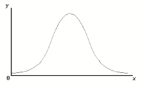
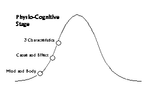
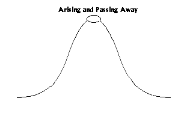
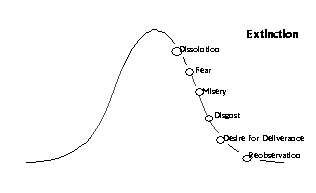
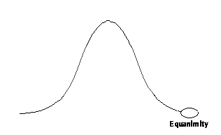
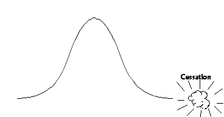

# Preface

This e-book is a collection of texts by the psychologist and meditation teacher [Ron Crouch](https://alohadharma.com/about).

The purpose of this e-book was to create a compilation of various blog posts from his personal website [Aloha Dharma](https://alohadharma.com) for easier reading on e-ink and tablet/smartphone devices.

# About Ron Crouch

## Who is Ron?

I am an American psychologist living in Europe who teaches meditation. I am a new dad (that picture is of me and my little boy), and a pretty ordinary guy. I began teaching meditation while living in Hawaii, and at the time named this site Aloha Dharma to emphasize how relaxed and open the teachings can be. You don’t have to be conversant in Pali or have been on a lot of retreats to learn meditation and even wake up.

## So what does Ron actually teach?

I teach insight or “Vipassana” meditation. There are several techniques for doing this, but the most useful one is the “noting” technique. Meditation with noting means that the practitioner literally makes a “note”, either silently or aloud, of what they are experiencing in that moment. As the meditator begins to master this practice there are specific states and stages that they go through. These are the insight stages or “nanas” and concentration states “jhanas.” My job as a teacher is to help students navigate through these parts of the path.

## Ron’s Bio

I started meditating around 1998 for reasons that I can’t remember. I think I saw some people on TV doing it or read an article about it. I had read a few Buddhist books before this and was really interested in the intellectual aspects of it, but hadn’t really put it into practice. I was living in Alaska, and during the long dark winters there the meditation gave me something to do with my time and helped me to shake off the restlessness of cabin fever. For a number of years (perhaps 3) I continued in a spotty way, just doing it to relax. It worked. I felt better and could handle stress with more ease.

At some point I got involved in a [Sri Lankan temple](http://www.buddhistvihara.com) in Washington DC, where I had moved to start college. As a volunteer project I was teaching the monks conversational english, and started taking meditation classes and going to Dharma talks. Getting ever more involved, but not in a purposeful way. It just happened. Eventually I even went to Sri Lanka and meditated in a monastery for a couple of weeks. I learned to meditate by concentrating the mind on the breath to the exclusion of all else.

It was around this time that I began to have more mystical type experiences: lights, exciting feelings running around my body, tingling, tickling sensations around the third eye area… I was hooked! Problem was, I had no idea what was happening. It was just about this time that I moved to Chicago to go to grad school, and lost contact with my monk friends.

For a few years, during breaks from studying and research, I prowled the internet and book stores trying to figure out what was happening to me when I meditated. I was now meditating regularly, and experienced the lights and other fireworks daily. It was like I was living a secret life. Mild-mannered grad student by day, mystical cosmonaut by night. I didn’t share any of this with anyone (who would believe me?) and I was really hungry to know more. To my surprise most of the books I found on meditation had nothing in them about what I was experiencing. Sometimes authors would speak of “light” or other things, but it was impossible to tell if they were speaking metaphorically or if they were referring to my experience. It was pretty disheartening and invalidating. After all, if none of these big name meditation gurus were describing what I experienced, how important could it really be?

Finally I ran across a description of the Jhanas. That sent me into a fit. I found a small number of authors who explained that symptoms like the ones I had were a prelude to entering into “Jhana.” They explained that there are eight Jhanas that meditators access in order and that these are the blissful states that progressively clarify the mind and set the conditions for enlightenment. I read everything I could and became a big fan of [Ajahn Brahm](https://en.wikipedia.org/wiki/Ajahn_Brahm), [Ayya Khema](https://en.wikipedia.org/wiki/Ayya_Khema), [Leigh Brasington](http://www.leighb.com), [Bhante Gunaratana](https://bhavanasociety.org/teachers/bg), [Tina Rassmussen and Steven Snyder](http://www.jhanasadvice.com).I still am a big fan. I became convinced that what was happening was that I was getting strong access concentration and that I was beginning to experience a “samadhi nimita” which is the sign that you are about to enter the first jhana. For about three years I tried and tried to get first jhana. I concentrated my butt off. Still, all I got were lights and a few fireworks. No jhana.

Then, when I was listening to the [Buddhist Geeks Podcast](http://podcast.buddhistgeeks.org)
I heard a meditation teacher explain that he knew for certain that “ordinary people can get enlightened… because it happened to me.” He went on to explain that he did it through following the insight meditation techniques and the maps laid out in the progress of insight. The teacher’s name was [Kenneth Folk](http://kennethfolkdharma.com) and I was shocked that he claimed enlightenment. I was also blown away that he did it with a technique I had never even tried. I had heard of vipassana, but hadn’t really given it a sincere try. By this point I felt so stuck in the mud that I was willing to try anything to make progress. I sent Kenneth an email and asked if he would teach me. My first real teacher.

With the guidance of a teacher I learned that along with the jhanas, there was another roadmap of the path to enlightenment called the “nanas”, or stages of insight. While there were eight jhanas, and I couldn’t access the first one, there were sixteen nanas, and by sincerely applying the technique I accessed the first four right away. In addition, I learned that the map didn’t end at the nanas. The first 16 nanas comprised the first section of four larger sections, or “paths”. According this map, also known as the “four path model”, once a person has worked their way through the fourth path, a shift in perception takes place, a deeply profound shift, and this shift is enlightenment. Under the guidance of a teacher, I navigated the traditional insight stages and found that they are real, and that awakening is real too.

# What is Buddhism, really?

I have been lax in writing for this blog because I have been writing a book. A year ago I predicted that I would have it done in a year. Well, I’ve learned a lot about my limitations since then, and now know that it will take a bit longer than that. But the reason why it will take longer is something that has fascinated me and may be interesting to others.

As I began writing the section of my book on what Buddhism is and how it relates to modern day insight meditation it began to dawn on me how little I know about what the historical and linguistic scholarship actually says about Buddhism. Having been an avid meditator and a lay teacher of insight meditation I have gobbled up the suttas and commentaries and popular interpretations of Buddhism, but these are really what Buddhism has to say about itself. It is the perspective that one gets from somewhere inside the bubble of the Buddhist worldview. But what does Buddhism look like from a point outside of that bubble? What do non-Buddhist scholars see when they look at Buddhism from a more critical or skeptical perspective? I realized that I actually had no idea what that perspective might be like, so for many months I have been digging deep into the academic literature, and what I have found has been eye-opening, to put it mildly.

The first thing I was curious about, since I’m a bit of a philosophy nerd, was how modern philosophers and linguists who study the history of religion make sense of the Buddha’s ideas. I don’t remember what I expected to find, but I assumed it would be something along the lines of an enthusiastic endorsement. After all, I love the Buddha’s ideas, who wouldn’t? What I found was neither an endorsement nor critique, but rather, a thoughtful study of how these ideas arose within their historical context. Something, I’m embarrassed to say, I hadn’t really considered. I’d read all the Buddhist books about Buddhism that present it as a timeless truth, a perfect realization of Reality with a capital “R,” but of course it had to be a product of a time and place, just like everything else. I became very curious about this.

I thought knew the story of the Buddha. That he was a prince who snuck out of his palace, saw suffering all around, decided to do something about it, and set off on his own to discover its cause. You know the rest. But that is who he is from inside the bubble of the Buddhist worldview. Scholars who look at him from outside this bubble focus much more on an aspect of the history that I peripherally knew about but which I had not given very much attention to. They focus on how he joined a radical group of what we modern people might call “social reformers” who were attempting to create an alternative to the Vedic view of life. Vedanta had already been in place for about a thousand years, and it kept the Brahmins, who were the ruling caste, in power. The social movement trying to change this called themselves the samanas. It was a revolutionary time. When the Buddha left his princely life to set out on his quest he did not simply go out on his own, he joined the samanas, and this was a very meaningful move on his part. The samanas were a mixed bag of freethinkers who were not just arguing against the Brahmins, most were arguing against each other. They were preaching all sorts of contrary ideas, like there is no permanent self, and that there is one, that one should remain skeptical of extreme positions, and one should be as extreme as possible in austerities, etc. The Buddha was not simply meditating during those years before his enlightenment, he was likely soaking up these ideas and inching closer to what would become his own realization.

The doctrines that became Buddhism, according to many scholars, seem to be a coherent system which blends samana and Vedic concepts, and this blend would appeal to those who wanted reform and those who wanted tradition. In fact, one scholar argues very persuasively that the doctrine of dependent origination is actually a thinly disguised version of the Vedic creation myth, but refashioned so as to undercut the core concept that gives the Vedic tradition its power: that the way to liberation is by finding one’s true self (atman) so one can unite with the ultimate source, Brahma. In the standard Buddhist mythology, after the Buddha’s enlightenment, when he looks into the links of dependent origination and sees that there is no atman to be found, Brahma himself shows up and bows down to the Buddha, begging him to teach the world. From a scholarly perspective this makes sense given that what the Buddha was trying to do was create an alternative to the Vedic cosmology that integrated the samana’s ideas with those that had already been fixed in the minds of his culture for a millenia, and he succeeded.

This way of looking at Buddhism is still new to me and I am still processing what it means, but it got me wondering about the source texts. The scholars kept referring to differing accounts in different early texts, and it struck me from what they were saying how little we actually know about the Buddha or early Buddhism. The pali canon is generally agreed to be the earliest source of information about this, so a lot of people who are eager to follow a “true” or “authentic” version of Buddhism are often drawn to it. Many will criticize the commentaries or Abhidhamma literature as inferior because they are not the “real” words of the Buddha, which are, of course, in the pali suttas. That makes sense until you find out how old the pali suttas actually are. Scholars do not agree on this, but even accounting for the disagreement, the earliest versions of the pali suttas date to somewhere between the first and sixth century CE, with the strongest evidence (gold plates with pali inscriptions found in Burma) favoring sometime around the 5th century. That means that everything we know about the Buddha and early Buddhism from the pali sources might come from writings made sometime nearly 1000 years after the Buddha. I am still learning about all this and if there are earlier sources I hope to find them. I always knew that the pali writings were copies of earlier writings, but I assumed that they were close enough in time to the Buddha to give a faithful account of what the Buddha actually taught. But now I’m not so sure about that. All scholars agree that from the earliest texts on there are changes made to the canon, some small, some large, and that many of the changes were not simply errors but deliberate additions, combinations, and redactions. Is there any reason to believe that these changes only began after the earliest texts we have found? Not really. It is much more likely that these kinds of changes were going on for centuries as differing groups of Buddhists developed differing accounts and interpretations of what came earlier, which was very likely a changed version of what came before that. When you add to this that the pali canon is merely the recorded outcome of 200 to 400 years of oral tradition during which time there were multiple schisms, the whole foundation on which people like me base their ideas of a “true” or “authentic” version of Buddhism becomes more than a little shaky.

There is one other line of scholarship that rocked my ideas about Buddhism, and I never thought about it before. I nearly slapped my forehead in a “doh” moment once I actually started looking into it – archeology. There has been some very interesting archeological work on the earliest sites in Buddhism and the physical evidence from these sites shows that the early Buddhists lived remarkably different lives from those depicted in the suttas or vinaya. For example, in one site archeologists found evidence that early Buddhist monks were coining money. That is a very different picture from that painted in the pali sources, and speaks to the early Buddhists having a relationship with the state and people that is completely unlike that found in the texts. There are a lot of other findings that I could go into but I am still in the process of absorbing this information.

So what have I learned from this excursion outside the Buddhist bubble? Essentially, it comes down to this. What we now take to be the authentic teachings of the Buddha are actually more likely to be a snapshot of what Buddhism evolved into after many centuries of changes and schisms. Those trying to limit themselves to the earliest parts of the pali canon in an attempt to adhere to a more authentic version of Buddhism are more likely to simply be practicing whatever Buddhism became sometime after the first century CE. This doesn’t mean one shouldn’t do this, but it is good to know what one is really doing. Overall, what Buddhism appears to be when seen from outside its own worldview is less a perfect source of unchanging wisdom than an evolving field of study, just like any other. It has branches, schools, factions, controversies, evidence and lack thereof for its claims, some of which stand up on their own, and some of which seem to address particular cultural and historical needs.

One could see all this and throw one’s hands up, deciding that there is no reliable source so there is nothing to be found, but this would be a big mistake. Because the thing that is unique about Buddhism, that is its real bedrock in light of all this information, is that it is something that one does not really believe but rather something that one does. As a field of study it is more like a science than an art, because it has specific claims (the three characteristics and nibbana) and methods for testing those claims (the three trainings). This is ultimately what matters, because these are the claims that are most independent of culture, history, worldview, and scripture. They are testable by ordinary people in today’s world. All one needs is the set of instructions for how to run the test, the motivation and curiosity to do it, and then you can see for yourself. So while most of what is called “Buddhism” is a body of knowledge that has changed over many centuries, it still has something at its core that matters in the sense that all things eventually matter: it is an accurate reflection of your reality here and now and you can see that for yourself. In the end, Buddhist meditation isn’t worth doing because we know exactly what the Buddha really taught, it is worth doing because it works.

# The Dharma

“Dharma” is the sanskrit translation of the Pali word “Dhamma” which roughly means “law”. But this isn’t law in a legal sense but in a natural sense, like the “law of gravity.” The law referred to by “Dharma” is the natural process that leads to enlightenment, moksha, awakening or liberation (pick your favorite term). To learn the Dharma is to learn how to wake up and become enlightened.

There are many teachers who have taught people how to wake up and become enlightened. For this reason, it is customary to put the teacher’s name as a prefix. This helps the listener know which Dharma is being discussed. Most of what is taught on this site is “Buddha-Dharma”, though not all of it is. The Dharma taught by great teachers such as [Lao Tzu](http://en.wikipedia.org/wiki/Laozi), [Ramana Maharshi](http://www.sriramanamaharshi.org), 
and [Nisargadatta](http://en.wikipedia.org/wiki/Nisargadatta_Maharaj) are examples of perfectly wonderful teachings from completely different traditions. If I were teaching you how to get to heaven through Christianity it would be perfectly acceptable (though a little weird) to call it “Jesus-Dharma.”

So why do I teach mostly Buddha-Dharma? Am I a Buddhist? Not really, or rather, if this self thinks it is a Buddhist then it is a rotten one. I honestly do not believe a lot of what is taught in Buddhism as a religion.  What I do believe is that learning how to become enlightened is a skill, no different than learning to play the piano or learning to cook. Enlightenment, as you’ll discover, actually has very little to do with what beliefs you have and everything to do with learning and practicing specific skills that liberate the mind. And as it turns out, the best teachings that I have found on these skills happen to come from the Buddha. That’s why most of what is taught here is Buddha Dharma. It is a choice based on pragmatism rather than faith or religion. If you were hoping for religion, I recommend searching elsewhere.

What many beginners to the Buddha’s Dharma don’t know is that Buddhism is not just one tradition, it is many different ones. They are all based on the teachings of the Buddha, but from that original set of teachings, the traditions became very different. A student could learn the Dharma in Tibetan center, but be absolutely lost at a Zen center or Theravadin temple. On the surface it would seem that there is not really one Dharma being taught. Lucky for me, a good friend who is a Sri Lankan monk helped me to get my head around these differences by explaining that while all these traditions look different, they are all really just “the same cake with different icing.” In other words, it only seems like these traditions are different on the outside, but on the inside the core teachings are actually the same. What I hope to focus on in this explanation of the Dharma are those core teachings.

So, what are these teachings? In the many traditions that make up Buddhism the Dharma is most often divided into three overall parts: morality (sila), concentration  (samadhi) and wisdom (panna). I really love this way of organizing the teachings because it chunks them together in a way that is both meaningful and manageable. It is an oversimplification for sure, but it is still helpful. I like to think of these three parts of the Dharma as “Getting your act together”, “Getting your head together” and “Getting it done”.

## Sila: Getting Your Act Together

The Dharma of getting your act together (sila) is all about behaving better. Some prefer to call sila “restraint” or “discipline” rather than “morality”, because morality is enmeshed with philosophical concepts of right and wrong. However, there really is no good English word for sila. All of them are chock-full of the shadows of ideas like “good” and “evil”, and their meanings do not really do sila justice. The English translations can often trigger a frame of mind that is punitive and judgmental, which is not at all what sila is about. For this reason people can have real hang-ups about sila. Some people dismiss it as old-fashioned, and others go way overboard with self-discipline to the point of unhealthy attitudes and behaviors. My hope is that this essay might clear up a few misconceptions.

While the other two parts of the Dharma, concentration and wisdom, refer mostly to practices and insights that take place in meditation, sila is the part of the Dharma that deals with “normal” day-to-day life. Getting an education? That’s part of sila. Being a loving member of family? That’s part of sila. Volunteering at the food bank? Sila. Doing an honest job at work, canvasing for a political cause that you think will help your neighbors, teaching the Dharma to people who want to become enlightened? All sila. Almost everything that we do that is not meditation or the insights related to it fall into the category of sila (though these distinctions get blurred during advanced practice). When you stop and think about it, most books on Buddhism are actually books on sila. Compassion, interconnectedness, gratitude, forgiveness,  – focusing on these are all part of the practice of sila. Needless to say, there is a good reason so much of what is described as Dharma is in the basket of sila. It is where everybody starts, and nobody can skip this critical practice. When we begin on the path, we realize that where we start our practice is with the whole of our lives. Everything that we do off the cushion is sila.

So why care? There are many reasons why people behave well: a sense of gratitude toward God, sense of community, personal identity as a moral person, compassion for those who are effected by your actions… The list of reasons could go on and on. All of the above reasons for moral behavior are fine. But the primary reason for moral behavior on the path to enlightenment is to prevent stupid or wrong-headed behavior from getting in the way of liberation. These teachings are all about one thing – getting you enlightened (that isn’t quite right but I’m going to keep it simple). So everything in the Dharma, from start to finish, aligns on this one end.

How does immoral behavior interfere with enlightenment? There are two levels (roughly speaking) on which behavior affects one’s ability to wake up. The first is what happens when you sit to meditate. If you’ve been up to no good in your daily life, and you are a normal healthy person with no personality disorders, then your mind will immediately begin to ruminate on your actions. You will not have a choice about this, and it will be a real shock if you’ve never really looked deeply at your own mind before. Ever notice that people who act badly are also the most cranky and difficult? That is because a person with poor behavior will always have at least a low level of frustration and irritability caused by rumination, as if an annoying song was stuck in their head. This effect is a form of what is called “Karma” in Buddhism, or to put it simply, it is an example of the law of cause and effect (more on Karma in a future post). Meditation is very difficult for a person suffering these psychological effects of negative behavior.

The second effect that bad behavior has on liberation is in the form of Karma that most people are familiar with, the kind that effects our daily lives. When we engage in behaviors that harm ourselves or others, we create the conditions for further harm to happen to us. It really is that simple. What that eventual harm might be is nearly impossible to tell (and totally a waste of time to speculate about), but suffice it to say that if you do something that you know has caused harm to another person you have just set the stage for something negative to happen to you. This is not meant in a mystical sense at all. It is very direct and simple. If you exercise you set the conditions for good health to happen to you, if you text while driving you set the conditions for a car accident to happen to you, and if you intentionally create harm you set the conditions for harm to happen to you in some form. So, how does all this interfere with awakening? In a pretty no-nonsense type of way: if you are constantly dealing with the fallout from negative actions, how are you going to meditate?

Because the purpose of morality in the dharma is to keep the path to enlightenment from becoming obstructed, there really are no concepts of “sin” or “judgement” in this way of thinking. Rather, there are guidelines, or “practice precepts” that are intended to keep the practicioner from doing things that would wreck meditation. This only makes sense. In any good set of instructions there are not only clear directions about what to do, but also what not to do.

The most famous of the instructions on what not to do are the “five practice precepts” taught by the Buddha. These five are:

1. abstain from killing

2. abstain from stealing

3. abstain from lying

4. abstain from intoxicants

5. abstain from sexual misconduct

These precepts are very basic and are intended to keep the practitioner from causing serious havoc with their meditation. If you are robbing or killing people you will have a very tough time meditating. However, it should be pretty clear from the outset that these precepts are not airtight rules that are black and white. Does the precept to abstain from killing mean that I need to be vegetarian? Is it stealing if I buy a foreclosed home that belonged to a family with a subprime mortgage? Am I breaking a precept if I have a beer with dinner? What the heck is sexual misconduct? There are lots of grey areas here, and that is the primary reason that I mention them at all. To point out what I hope will become obvious to every practitioner, that there really are no absolute rules that can take the place of your own conscience and critical judgment. While a good teacher can give you guidelines, it is up to the individual meditator to decide whether a behavior is interfering with their progress. What can be said with any real certainty is that the precepts, and all of sila, is about preventing the practitioner from intentionally causing harm to others or to themselves. If anything can be a sila litmus test it is that: intention to harm.

[Daniel Ingram](http://integrateddaniel.info) once referred to the teachings on morality as “the first and last practice”. I like this way of describing it, because it emphasizes the open-ended nature of our attempts to perfect our morality. Becoming moral is not a practice that is finished on the way to enlightenment, rather it is a practice that deepens with each insight. Even after enlightenment, you’ll find that you still don’t have perfect behavior. To your great chagrin, you will find that you are now fully awake to all your unskillful and unhealthy behavior. Once you fully wake up to your life, the first order of business is to rectify all the stupid stuff you get yourself into!

As your behavior becomes less harmful to yourself and others, more peaceful and compassionate, you will see a corresponding improvement in your meditation (and very likely a big improvement in your overall life). Once you have your act together and your meditation begins to deepen, it is worth your time to try and get a better understanding of meditation and its role in the path. The next part of Dharma covered here is on meditation and is what I call “Getting your head together.”

## Concentration: Getting Your Head Together

The second great part of the path is what I call “getting your head together” and it is all about meditation. Most of what is discussed in this site regards this part of the Dharma. Just like “Buddhism”, the word “meditation” is often used as if it were one thing, but actually there are many different kinds of meditation. It is way beyond the scope of this site to get into the many varieties of meditation, so I will limit this to the two big categories of meditation: concentration (samatha) and insight meditation (vipassana).

### Concentration Meditation

In English the word “concentrate” has a different meaning than it does in Pali (the Buddha’s original language). I grew up thinking that to concentrate meant to think really hard. But in meditation concentration more closely resembles the concept of concentration in chemistry. To concentrate a chemical you filter out the impurities and then gradually reduce a large amount of solution down into a tiny distilled essence. This essence is the chemical concentration. The same process takes place in concentration meditation, only what is being concentrated is the mind itself.

The meditation instructions for concentration meditation are wonderfully simple: pick an object, like the breath, and place your attention on it – to the exclusion of all else. You pick a spot to watch the breath, say the upper lip or the tip of the nose, and just watch it come and go right there. Like a carpenter watching a band saw blade cut through wood who only focuses on the spot where the blade and the wood meet, the meditator focuses all attention on that spot where the breath enters and leaves the body. Every other function of the mind, listening to noises in the environment, planning what to do later, noticing an ache in the knee – all other processes get “turned down” so to speak, as if they were on an internal dimmer switch. This process of narrowing attention down on a single small object and dimming all other functions “distills” the mind into a very concentrated form.

It won’t be long though before something comes up that distracts you and wrecks the concentration. To concentrate the mind  really well is to work with exactly this process, or to filter out the “impurities” in the mind (hence the title of the ancient meditation manual [“The Path of Purification“](http://en.wikipedia.org/wiki/Visuddhimagga). The impurities in this case are known as the five hindrances:

1. sensual desire

2. restlessness and worry

3. ill will

4. doubt

5. sloth and torpor

Many meditators will recognize at least one of these as their own personal super-villan. It is near impossible for a beginner to try an meditate without at least one of them getting in the way. And often that one will come back again and again. There are many practices for filtering out these impurities (sometimes called antidotes), but the most powerful practice for filtering them out of the mind is investigation. When a hindrance comes up in the mind, become a private eye of your own mind, and notice it and watch to see if it diminishes on its own. If it doesn’t, start picking it apart and ask questions about it until it falls apart under the purifying light of your mindfulness.

At some point the impurities will be reduced to a point that is sufficient for concentration to proceed. You will know when this has happened because some fascinating, mystical-type, experiences will begin. The most common experience is to see light with the eyes shut. This is meant literally. It actually seems as if there is a light that is brightening. At this point the meditation is getting really good and the meditator is cooking along and suddenly it will be as if someone is gradually turning the lights up in the room. You may even find yourself peeking to see if the lights are actually going up in the room.

From this point the meditator has a couple of choices about what to do, but to proceed with pure concentration meditation you would deepen attention on the object while simultaneously letting go of the effort involved in doing so. Needless to say, this takes some savvy skills, but it can be done. When attention is strong enough and the effort is of the right kind (with little ego control involved), the meditator begins to enter altered states called “Jhanas” (more about Jhanas in a future post).

How does concentration lead to enlightenment? Strictly speaking, it doesn’t. However, what it does do is purify the mind and make it so strong that when the mind is turned toward the work of insight, then the insights are powerful and easy to get. The difference between a normal mind that is diffuse and scattered among all the different senses and thoughts, and a concentrated mind that is deeply focused, is like the difference between a flashlight and a laser. With a flashlight you can look at what is around you, but with a laser you can actually do work and cut through things. In this case, the laser of the concentrated mind is used to cut through the illusions that keep us from waking up.

### Vipassana Meditation

The next type of meditation is Vipassana or “insight” meditation. Vipassana begins just like concentration meditation, but the goal of Vipassana is not to distill the mind down but rather to get it just strong enough to begin investigating experience in the moment. To go back to the analogy of the light and the laser, in vipassana the meditator does not concentrate the energy of the light to the point of a laser, nor does the meditator leave it diffuse. Rather, you focus the light in such a way that whatever it shines on becomes easy to see clearly.

The technique of vipassana is somewhat more complicated than that of concentration. With concentration meditation one gets the mind to stay on an object to the point where it becomes very strong, but with Vipassana it is not necessary to keep the mind on one thing and distill it, instead, the meditator puts effort and energy into focusing the beam of the flashlight just enough to get a clear look at things. In this case, the “light” of the flashlight beam is the mindfulness, or deepening momentary awareness, used to know each object as it changes from one thing to the next. This is a very different experience than concentration meditation, because there is no need to stick with a single object. Rather, the effort is in the quality of knowing the objects that come up. So, when the mind starts off on the breath and then shifts to a new object – there is no problem at all! Let the mind wander, but stay with it in the moment. The intention is to follow the mind as it does what it does.

For example let’s say you sit down and place your attention on the breath (just like in concentration meditation), but then a motorcycle goes by outside your window, and your mind begins to focus on the sound. No problem. Now you just notice the sound and watch what happens to it the same way you would with the breath. But then the mind creates a mental image of a motorcycle and begins to focus on that. No problem. You notice the image and be as attentive as you can to that image and the process of the mind creating that image. But then the mind begins judging the person riding the motorcycle for being so loud. No problem. Just notice everything you can about the judging, and so on… The mind loves to wander, it is in its nature really. The beauty of Vipassana is that you truly go with the flow of the mind, letting it lead you to the next object rather than bringing it back to your chosen object.

What is most important to know about Vipassana (and is the very thing that most beginning meditators keep forgetting!) is that you don’t want to get caught up in the content that the mind generates, instead you just want to watch it. This is like the difference between a sports broadcaster describing a game on the air and a player in the game. When you are doing Vipassana you are the sports broadcaster, who is outside of the game but is still watching every little nuance of it as it unfolds. The player that remains in the game is the mind itself, which keeps on generating content and going about its business. The mind is in the midst of all the things that it typically does, building up scenarios, having opinions, taking positions, remembering things, etc., but the mind’s interpretations and ideas about all these things is not at all important. Rather, it is the process of what the mind is doing from moment to moment that really matters. And your job as the meditator is to be aware of it all without getting caught up in it.

Sound tricky? It can be! With this kind of meditation there is a real danger of discovering that you just spent 20 minutes wrapped up in a fantasy or reminiscing about the past. Such experiences are totally normal for new meditators (and even old ones). Just recognize when it happens and put effort into getting back on track. Just like with concentration meditation, in Vipassana you run right into the five hindrances. However, rather than turning your attention back to your chosen object, you simply take the hindrance as the new object and get to know it as best as you can. This will often take the wind out of the sails of the hindrance and the mind will simply jump to another object.

A note about vipassana: it can often be a problem for a meditator who is having a “big issue” in their life. If you are going through a difficult time, it can be hard not to get caught up in the content related to the problem when you are watching your thoughts. But please know that Vipassana is NOT the same as therapy. It is not even close and it was never intended to be. It is a modern myth that insight meditation is somehow similar to “insight” in therapy. In meditation the word “insight” has a very different meaning than in therapy, because it does not refer to the content of the mind or to the issues of the individual who is getting the insight. Rather, meditative insights are about understanding how reality is presenting itself at this very moment. The insights gained through meditation are highly impersonal. They have nothing to do with the dramas of the individual doing the meditation, but rather, they relate to the way the universe operates. These are insights of an entirely different order than the personal ones that come to us in therapy.

So how does vipassana lead to enlightenment? It leads to enlightenment by getting to the third chunk of the Dharma right away: getting it done. And it does this by seeing whatever is in the mind in that moment as clearly as possible. That clarity attacks ignorance at the roots – and it is ignorance which is keeping us from enlightenment. Ignorance has a special meaning in Buddhism. There is no original sin in Buddhism, but if there were it would be ignorance. Ignorance in this case refers to our lack of knowledge about the true nature if reality. The more clearly we see reality, the less ignorance there is and the more wisdom dawns on us. When we see things clearly enough, long enough, then enlightenment happens (more details on this in “Getting it done”).

### The Double Helix of Meditation

Now that I’ve presented meditation in this way, as two overall different types (concentration and insight), I’m going to muddy these clear waters by explaining that these are, in reality, not two different types of meditation but one type of meditation, but each with a different emphasis in technique. In order to do concentration meditation you need a fundamental level of investigation and insight. And to do vipassana you need a basic level of concentration called “access concentration.” Each type of meditation contains the other within it as a necessary practice. The famous meditation teacher Ajahn Chah once explained that insight and concentration are like the front and back of your hand. If you look at one side of your hand you can rest assured that the other side is right behind it. So, you can select a technique that emphasizes concentration or insight, but you will really always be doing both. I call this the double helix of meditation. For a gene to be fully expressed, DNA requires two strands woven together to hold the genetic material. For wisdom to be fully expressed, the strands of both concentration and insight are needed to hold the meditation together. Whichever strand of meditation you choose to emphasize, you can rest assured that if you are making progress you are truly doing both.

Once meditation begins to deepen and the insights into the nature of reality begin to alter how your mind functions, you are well on your way to enlightenment. This is discussed in the next section on awakening wisdom, which I call “Getting it done.”

## Wisdom: Getting it Done

You have worked on getting your act together and are perfecting morality. You have sat in meditation and are starting to experience deep concentration and are beginning to investigate your experience in the moment. Now you are ready to move toward the deepest, most profound experience a human being can have: enlightenment, or what I call “getting it done.”

The whole trajectory of the Dharma leads the meditator toward enlightenment. Practitioners often want to ask “…what is enlightenment?” but are afraid to do so because teachers can be evasive or even dismissive of students who ask such questions. But it is absolutely a fair question. After all, the practice of perfecting morality and deepening meditation can be a tremendous amount of work, and while there is a lot of talk among some teachers and meditators about doing practice for its own sake, there is nothing wrong with wanting to know what enlightenment is and why it is so special. Monks give up all the normal comforts of life to pursue it, and even lay practitioners will withstand intense deprivation and difficulty if it means getting closer to enlightenment (sometimes with [tragic results](http://www.nytimes.com/2011/03/02/us/02sweat.html)). Before the Internet, people would literally travel around the world, climb mountains and walk hundreds of miles to learn how to become enlightened from somebody who was rumored to have done it. Clearly, enlightenment is worthwhile, but what is it?

This is where the Dharma begins to break down under the inexpressibility of what is being taught. It is where the teachings begin to sound mystical and nonsensical to students. The reason for this is that we are attempting to understand enlightenment with the mind, and the mind is just not good at getting it. Your mind cannot really grasp enlightenment in the same way that your hand cannot reach out and grasp “love” or “boredom” – it is just not able to work in that way. The mind deals in concepts, symbols and representations, but what happens during enlightenment is strictly non-conceptual. Language can’t express it and it can’t be represented in an image. This is why when students asked the Buddha what enlightenment is he simply gave them a very long explanation of what it isn’t. Even he, probably the best teacher ever on the topic, couldn’t explain it.

So the hard truth is that no one can simply say what it is. While I cannot express what enlightenment is in a way that the mind can actually grasp, what I can say is this: the predominant experience of enlightenment is one of relief. When I asked my teacher, Kenneth Folk, about it he explained that, “You just feel done”. This might not sound like anything special, and it isn’t – and yet at the same time it really is (see how confusing this can get?).

I’m not a big fan of “faith.” It is not something that I recommend to people who are serious about waking up. After all, to lay the groundwork for enlightenment, you need to investigate your experience with the precision and clarity of a scientist. Faith can create expectations that obscure honest observations. However, when it comes to waking up, some faith is needed.

### How do I get enlightened?

Strictly speaking, “you” never get enlightened. Enlightenment is very impersonal, and does not really happen to an individual. It happens when the awareness that mistakenly thinks it is an individual is liberated from that illusion. It is a bit misleading (but I believe useful) to describe enlightenment as “getting it done” because there is no “self” that can actually make this happen. Rather, the “self” creates the conditions under which insight can ripen into a full-blown realization. After enlightenment it becomes clear that while the path to enlightenment was traveled by an individual, the leap into enlightenment is something that the “self” could not, and did not, really do. It happened. But who did it really happen to? Once the leap is made, the paradoxes become simultaneously unending and irrelevant. You cannot do this with an act of will or with a plan of action, but you can create the conditions under which it is likely to happen.

### How do I create the conditions for enlightenment?

The conditions for enlightenment are created by deepening meditation to a point where you begin to move along what is called “the progress of insight“: a series of stages in the meditation that provide the insights needed to awake (look for more on states and stages in a future post).

The way to enlightenment is often called a “path” for a very good reason. In the same way that the Appalachian Trail has mile-markers and sections, the path of meditation has specific markers and recognizable sections which vary in difficulty. Students progress along this path in a fairly predictable and repeatable sequence. While “path” is a metaphor, it is much more accurate than most students realize. The path arises in our experience when we sit in meditation and follow the directions exactly. If the meditator daydreams or gets caught up in the content of the mind, it is like leaving the trail to explore the woods. Before you know it, the trail is lost. However, by following the directions exactly, using the maps, and getting some guidance, you will stay on the path and will experience the series of developmental stages that make up that path to enlightenment.

The progress of insight is a series of 16 stages, called “insight knowledges” that arise in a specific sequence. The first few stages are pretty mundane and easy to miss, a lot like trail markers hidden in tall grass. But eventually the markers become pretty easy to spot. There are sections of the path which are blissful and joyful, and some that are rough and difficult. Having a teacher to keep you moving through the tough times and keep you grounded through the joyful times is nearly essential as you make your way. If the meditator sticks with it and makes progress along all the states, eventually the path leads to a very important moment, called a “cessation,” where everything, including the sense of self, disappears for an instant. It happens so quick that some people miss it, and those who do notice it often wonder, “what was that?” It is a very important moment in the life of the meditator, because it is, for an instant, a direct experience of Nirvana. As time goes on they can master cessations, and experience them whenever they like (I take lots of breaks at my desk at work by dipping into Nirvana periodically).

When the meditator experiences a cessation there is a fundamental change that is made at a very deep level called a “path moment.” In the metaphor we are using here, it represents a switch in the trail you are on. You start over, so to speak, on a new trail. As you progress along the new trail, the 16 markers appear again and you eventually get to the direct experience of Nirvana again, and then to a new path moment and so on. Each time you switch to a new trail and the 16 markers arise again, and are the same each time. When this progression along the paths is done enough times it creates the conditions for the profound shift called enlightenment to occur. You could say that moving along through the 16 insight knowledges and experiencing Nirvana ripens the meditator in a way that increases the chances that enlightenment will happen. In the traditional models, the progress of insight, through the 16 insight stages, is done four times, and then the meditator is fully enlightened. In this four-path model, when the meditator has experienced the first path moment, they have attained the first stage of Enlightenment, and are known as a “Sotapanna” or “stream-winner”, second path is “Sakadagami”, third is “Anagami” and the fourth is “Arahat.” An Arahat is an enlightened being and is finished with the work of awakening (it is actually a little more complicated than that in reality).

The progress of insight and four-path model is the overall map that I use to guide students. I use them because the 16 stages are fine-grained enough to be verifiable in the student’s direct experience, while the four-paths are broad enough to encompass the whole path. But it is important for all students to know that there are many other maps out there from many different traditions, and not all the maps agree on what the path looks like. For example large parts of the Tibetan maps don’t really fit well with the Theravadin maps, and in the Zen tradition they refuse to use maps (to my knowledge). While there are some critical differences in the maps (sometimes profound differences), what is more remarkable than the differences are the similarities. A practitioner who has awakened can look at most of the maps and recognize what is being described in terms of personal experience, regardless of which map that practitioner used.

### Arguments Against the Maps

I should state at this point that there are teachers who feel that focusing on the maps is a bad idea. And this has led to a situation in which a lot of experienced and serious practitioners don’t even know the maps exist, or think that they shouldn’t know them. Teachers worry that the maps will create expectations that interfere with “natural” progress (though I must wonder if there is such a thing as “unatural progress”). In particular there is a concern that practitioners reporting experiences in their meditation may just “script” the experiences from the maps. Additionally, students could get competitive about where they are on the maps, or become so focused on attainments that they lose sight of becoming liberated from the ego that is attaining. These are legitimate concerns, however they beg the question: if the maps are not really helpful to students, why have the major traditions developed them, refined them and passed them down for literally thousands of years?

As it turns out, using the maps in practice is not nearly as fraught with problems as might be believed. It turns out that students rarely deliberately make stuff up when reporting their meditation, and when they do it is easy to see. If they are unconsciously scripting their experience, that can be handled easily by a competent teacher. To go back to the metaphor of the Appalachian Trail, there is a huge difference in the descriptions of a section of trail from someone who actually hiked it and someone who only read about it. Experienced hikers can tell the difference in the descriptions easily. This is one of the marks of a solid Dharma teacher, they know the territory first hand and when you describe it, they’ll know exactly what you’re talking about.

### Beyond the maps

Even though there is a good map that leads from first sit to awakening, astute students might begin to wonder what is really going on. After all, the maps simply explain what you experience along the way, but not why these experiences lead to awakening.

As it turns out, the insights that you experience along the path have a gradual but profound effect on the mind. Over time, the insights mature into what is called “wisdom” (panna). This kind of wisdom is not cognitive. It has very little to do with thinking and is closer in experience to the faculty of sight than thought. Wisdom is the ability to directly see what is true and what is not. It is a bit like seeing an optical illusion. What you thought was a vase suddenly resolves into two faces. In the same way, what you thought was real turns out to be false. What you could never have believed before becomes obvious. What you’ll discover as wisdom builds is that there are a lot of things that we take to be true which simply are illusions. The three illusions that are really important for enlightenment are:

1. The illusion that what is perceived as a “self” is real or has a core essence

2. The illusion that this “self” (or anything) is somehow permanent

3. The illusion that the things that make the self happy are truly satisfying

Corresponding with these three illusions are three core truths of reality, what are called the “three characteristics” in Buddhism. These are characteristics of reality that are so fundamental that deep and honest investigation of your experience at any given moment of your life will reveal them:

1. The self is a fiction (anatta)

2. Everything, including the perceived self, is in a constant state of change (anicca)

3. Most of the life of this “self” is very dissatisfying and often very painful (dukkha)

A close examination will reveal that the three characteristics are so interrelated that if you deeply understood one of them, the other two logically follow and become obvious to you. These are simply three ways of understanding one fundamental reality. The insights into the nature of reality that occur during meditation don’t seem to do much at first, but they have a cumulative effect on the mind. As the three characteristics become clearer, so do the illusions that obscured them. As these illusions weaken reality becomes more obvious to us, not in a conceptual sense, but in a way that is felt moment by moment.

The way that the progress of insight leads to awakening is that each of the insight knowledges experienced by the meditator has something important to reveal about the three characteristics. It is useful to think of each insight knowledge as a class on the three characteristics. When you “pass” the class you move on to the next insight knowledge, and when you experience a path moment, you graduate to the next level of your education. Eventually you get a complete education, and that is awakening.

It is this – fully understanding through the insights gleaned in meditation that you have been running on illusions, and really getting the three characteristics in your daily life – that sets the conditions for enlightenment to happen. Getting it done is all about fully comprehending the insights gleaned in meditation and letting them erode illusions at a very deep level.

# What is Pragmatic Dharma?

I’ve been thinking a lot about what “pragmatic dharma” is lately. This is partly because I’m trying to get my own head straight as I write about it, and partly because [Jack Kornfield](https://www.jackkornfield.com) recently criticized it on [Buddhist Geeks](http://podbay.fm/show/211752923/e/1442707200?autostart=1).
Kornfield, in his usual gentle style, was mostly circumspect in his criticism, but he did say that the leaders of the pragmatic dharma movement (I’m assuming he means Kenneth Folk and Daniel Ingram) have redefined key concepts in Buddhism. He suggested that the attainments aimed for in pragmatic dharma are, in essence, not the real thing. Coming from the author of *A Path with Heart*, one of the most easy-going, downright cuddly dharma books out there (while also covering some deep wisdom), such direct criticism is pretty harsh stuff. He also pointed out that the idea that people could attain enlightenment in lay life, a key idea in pragmatic circles, is something that does not make a lot of sense to him and that the experiences and insights a person has in lay life are not the same, not as “transformative,” as what occurs in a more rigorous monastic setting like the Mahasi centers in Burma. He seemed to imply that he understood what goes on in those places while Kenneth and Daniel do not, and so they are redefining things out of misunderstanding. This is odd, because both Kenneth and Daniel spent significant stretches of time in the Asian centers Kornfield is referring to, in the exact same lineage as him, so something isn’t quite making sense. It really seems like a he said/she said sort of situation. I disagree with him here, so hope I didn’t just distort his point of view too much.

Given that Kenneth Folk was my teacher and I benefited immeasurably from the pragmatic approach he used, I was a bit taken aback by Kornfield’s critique. I love his work, and generally think he knows what he is talking about in such matters, so I wondered if there was a misunderstanding or clash of personalities at work rather than a substantial critique. I mean, does he really understand what pragmatic dharma is? Does anyone? What is it really? As I thought about this I came up with a handful of characteristics that I think give pragmatic dharma its shape at present.

**Pragmatism** – this one is so important it is right in the name. I think that it is the defining characteristic because it stands in contrast to the way the dharma is being taught in mainstream Buddhism in the west. The mainstream has key elements of the Buddhist practice, but it often seems to be more a kind of lifestyle, identity, or a spiritualized form of psychotherapy, rather than a focus on awakening itself or the working elements of practice. It strongly emphasizes uncoupling meditation from attainments, as a sort of de-stressing strategy for a harried western world. This is a very different version of Buddhism from the traditional approach, which strongly emphasizes attaining specific outcomes, like insight knowledges or stream entry, which are viewed as imminently practical. In the westernized version of Buddhism these practical attainments, and even awakening itself, seem to go out of focus and become a kind of aspirational concept rather than a reality. Kornfield actually said as much in his Buddhist Geeks interview, and what is interesting about this from a historical perspective is that he had a very important role to play in this transformation of Buddhism in the west, which is documented in the book [Mindful America](http://www.amazon.com/Mindful-America-Transformation-Buddhist-Meditation/dp/0199827818).
This new style of dharma, unique to the west, was dubbed the “mushroom culture” by [Bill Hamilton](http://www.amazon.com/Saints-Psychopaths-William-L-Hamilton/dp/0964490404)
(the teacher of both Daniel Ingram, Kenneth Folk, and founder of the [Dharma Seed audio library](http://dharmaseed.org) who reportedly explained that this new western approach is like growing mushrooms, you “keep them in the dark and feed them shit.” Pragmatic dharma is a reaction against this new westernized style. It is a move to focus on what matters in the dharma – awakening and what leads to it – rather than the things that seem to be more lifestyle or therapy oriented. It is ironic that Kornfield critiques pragmatic dharma as redefining Buddhism away from the traditional meanings, because that is exactly the critique pragmatic dharma folks are making of mainstream Buddhism in the west.

**Transparency** – pragmatic dharma is big on breaking the taboo on talking about attainments. It means coming right out and saying so if you attained a jhana, had a cessation, or know what an insight is like because you had it first hand. The upside of this is that it invites people to see these things as real rather than fairy tales (which the mushroom culture seems to encourage). It also eliminates the weird game of spiritual marco polo that sometimes gets played when people talk around their own attainments rather than about them. The downside is that it provides an opening for people who simply want to make things up. If it becomes chic to say you attained jhana then no doubt people are going to start redefining jhana to match whatever they experience in meditation, that’s going to lead to a lot of confusion. So on this I can see the validity of the criticism. But does that mean we really need a taboo that leads people to not take these things seriously? Perhaps there can be a middle ground here. I can imagine a situation in which people are encouraged to be open about their attainments within select company. There are plenty of aspects of our lives that we keep private except with a close group, perhaps attainments can start to fall into a similar category. Not quite public, not quite taboo, but something we are open about with those who are going to understand and not overreact.

**Digital** – pragmatic dharma is a sangha in the cloud. There are communities, but they are mostly online communities. Message boards, forums, blogs, podcasts, and other online mediums are the spaces where ideas pop up and are explored. [The Hamilton Project has a great list of pragmatic dharma sites](http://thehamiltonproject.blogspot.com.ee/2011/04/pragmatic-dharma-on-rise.html).
Buddhist Geeks has an [online training program](http://www.buddhistgeeks.com/dojo) that looks fantastic, and pragmatically minded lay teachers (like myself) often teach people meditation online, via skype or other forms of live online interaction. Small groups meet in person in cities all over the world, but for the most part it is an online phenomenon. This gives it an interesting radical quality. There is something rebellious in spirit about pragmatic dharma that is found in many web-based movements. It is untethered to institutions and traditional hierarchies, and in this sense it is the dharma equivalent of Bitcoin or Wikipedia. A decentralized, crowdsourced fund of emerging wisdom and experimentation, that is unpredictable and destabilizing to established approaches. Some of the ideas that come out of it are destined to fail, like so many internet phenomena, but some are very good and deserve to be taken seriously. The internet is the perfect medium for this kind of experimentation.

**Secularism** – not everyone who is interested in pragmatic dharma is secular, but so many are it is difficult not to see a trend. Kenneth Folk is openly secular in his approach, eschewing the religious tradition and dogma for a more scientific and modern view of meditation as “brain training” or “contemplative fitness.” As he said in a 2013 article for [Wired Magazine](http://www.wired.com/2013/06/meditation-mindfulness-silicon-valley) “All that woo-woo mystical stuff, that’s really retrograde.”  This trend in pragmatic dharma makes sense because secularism is in essence a scientific perspective, and the scientific perspective is almost pragmatic by definition. From a scientific perspective things only cross the threshold from woo-woo to reality when they’ve been shown to actually work in some fundamental way. This is a version of what pragmatic dharma is doing by focusing on attainments. The moment one takes attainments seriously then one has a sensible way to gauge whether things actually work or not. The threshold is the attainment. And the test of whether something works is whether it leads one closer to the attainment or is merely, to use Kenneth’s phrase, woo-woo. A secular focus means that those aspects of practice that actually work to produce insight and awakening take primary importance, while dogma, doctrine, and cultural additions tend to fall away. This leads to pragmatic dharma’s focus on techniques, maps, or even practices outside of any tradition, while downplaying mainstream Buddhism’s lifestyle-oriented focus.

**A focus on ordinary life** – most people involved in pragmatic dharma fall into the category of lay practitioners, but what makes them different from lay sangha in the past is that they are not (for the most part) focused on building merit by serving a monastic community in the hope of awakening in future life. They are focused on awakening in this life. This is an idea taken whole from the vipassana revival in Asia that led to the mindfulness movement in the west (see [The Birth of Insight](http://www.amazon.com/The-Birth-Insight-Meditation-Modernity/dp/022600080X)
for a history of this movement in Burma). Ledi Sayadaw, Mahasi Sayadaw, Goenka, and others spread the idea that lay people could practice Satipatthana meditation and learn Abhidhamma well enough to move along the path while also participating in ordinary life. As a result of this movement great lay teachers such as [Anagarika Munindra](https://en.wikipedia.org/wiki/Anagarika_Munindra) and [Dipa Ma](https://en.wikipedia.org/wiki/Dipa_Ma), who were major influences on the western mindfulness movement, were able to teach and spread the idea that awakening is possible in lay life. As the vipassana movement landed in the west it brought this idea with it, and the idea that one could practice meditation and study Buddhism in lay life flourished. Yet the idea that awakening is possible in lay life is deemphasized as attainments take a back seat to a focus on de-stressing and coping with lay life effectively. Pragmatic dharma takes the idea that awakening is possible in ordinary life literally and seriously.

These five characteristics, *pragmatism, transparency, a digital community, secularism,* and focusing on *awakening in ordinary life*, are what gives pragmatic dharma its current shape. But there is something else that is worth understanding about them. They are occurring within a much larger picture that, I think, defines the disagreement that leads someone like Kornfield to criticize this upstart movement, and that is the presence of what I have come to call the “silent sangha.” Right now there is a vast group of people in the west who meditate regularly, practice mindfulness at the office, or are going through mindfulness based stress reduction courses on their doctor’s advice, who are gradually getting deeper and deeper into the world of meditation. They love meditation, but they really do not care much about Buddhism. There is a disconnect between them and a fuller understanding of meditation, beyond mindfulness, and in the coming decades the challenge for Buddhism will be to package and deliver the deeper teachings to them in a way they can understand and which will help them take the next step toward awakening. The silent sangha is a massive and paradigm-shaping group. More than any teacher, more than any blog, magazine, book or traditional institution, it is they who will shape what the dharma is going to look like in the west. What will Buddhism look like in the west when they start to take awakening seriously? If you think this is not a possibility, I’d urge you to read [10% Happier by Dan Harris](http://www.amazon.com/10-Happier-Self-Help-Actually-Works-A/dp/0062265423) and get an inside look at his transformation from skeptic, to mindfulness fan, to someone who tentatively wonders if awakening is possible in this life. I think there are millions of people just like Harris, and their minds are gradually opening to this possibility.

It is in this context that a new approach to Buddhism, a truly western approach friendly to the western worldview, is going to emerge. Will it focus on attainments and awakening in this life? Or will it remain lifestyle and therapy oriented? Will it find a way to combine the two? What will western Buddhism become once the silent sangha collectively decides to go deeper? These are the big questions that are the backdrop for the disagreement that Kornfield is having with pragmatic dharma, and that pragmatic dharma is having with mainstream Buddhism. It isn’t really about what Buddhism from Asia is, or whether particular claims about attainments are true or not, it is really about what western Buddhism is going to become. In this context these disagreements seem healthy and vital rather than divisive or harsh. They are a sign that bigger trends are on the move and growth is occurring.

I’m curious to see where it all goes.

# Why Meditate?

People meditate for a lot of reasons. I’ve heard people explain that they meditate to be a “better person”, or as a kind of low-cost alternative to therapy, or simply to relax. However, there is a big difference between what is often promoted as meditation and real insight meditation. Many versions of meditation that are taught are not much more than mystical versions of self-soothing. However, if you learn to do insight meditation properly you will find that there is a huge difference between what we are told meditation is for and what it is actually like. We find that with true insight meditation we do not necessarily become a better person and it is likely that we will become a lot less relaxed (at least for a time).

With real insight meditation you will find yourself identifying less and less with the very idea of being a “better” person. All those personal goals that might have prompted you to meditate in the first place will start to ring hollow. If you do the technique properly you will indeed relax somewhat at first, and this a great thing. However, this will be a prelude to moving along the [progress of insight](http://www.accesstoinsight.org/lib/authors/mahasi/progress.html)
and right into what St. John of the Cross called the [Dark Night](http://en.wikipedia.org/wiki/Dark_Night_of_the_Soul).

## The Downside of Meditation – What you need to know

The “Dark Night” in Christianity, also known as “the knowledge of suffering” in Buddhism, is a stage in which the meditator experiences “misery”, “fear” and “desire for deliverance.” During this part of the path you are likely to be a pretty unhappy camper, and for those living with you, they’ll likely wonder why on earth you chose to meditate in the first place. As my wife once diplomatically explained, living with a meditator in the midst of the Dark Night “is the opposite of fun.” Not only will you not be a better person or more relaxed, you may seem a lot worse off than before!

So if good meditation leads to misery, makes you cranky and disconnects you from what you once thought were valuable personal goals, why would anyone ever do it?

## Enlightenment: The purpose of meditation

Forget what you have been told about meditation making you more relaxed, less irritable, or a better person. Forget about any goal related to “me” in meditation. Because ultimately, the reason to meditate is to outgrow all of that, and completely let go of “me.” The reason to meditate is to become enlightened.

Enlightenment is the completion of the process that is started when one begins to meditate seriously. Enlightenment happens when the process of waking up to the truth of non-self becomes irreversible. It is the shift from being all-consumed by the drama of a “self” to the realization that the self and all its problems and fantasies were never real in the first place. Being a better person? As insight deepens the idea of becoming a better self seems a bit laughable. After all, who becomes better?

## Making a Fully Informed Choice

Why would you, a self, want to wake up? What is the benefit of enlightenment? A lot of the sales-pitches of meditation out there make it sound like a great thing for the self: being more relaxed and a better “me”, who wouldn’t want that? But now that you know that the sales-pitch is essentially BS, you have to ask yourself, why meditate? The path is not easy. Like any other serious goal in life – getting a college degree, running a marathon, raising a family – it is a lot of work and not always a lot of fun. The truth is that, to a “self,” there really is no tangible benefit at all. From the perspective of the self it just makes no sense at all to wake up, in the same way that it makes no sense to the dreamer to get out of bed. The dream is awfully interesting, so why wake up?

If you are not interested in waking up – then don’t. If you simply cannot understand why anyone would ever want to see the self as a fiction, do not start meditating. This might seem like radical advice, but it really isn’t. If you have not started down the path of awakening in earnest, and you really aren’t interested in enlightenment, I’d recommend not getting started at all.

The reason that I give this advice is because there is what I would call a “point of no return” on the path, where the meditator has to finish. Unfortunately, this point comes right at the Dark Night, and if you don’t finish the path you remain stuck in the Dark Night. That sucks. You cannot go back to sleep, so to speak, and yet you aren’t fully awake. You know something is wrong, and feel terribly out of sync with reality. If you stop meditating at this point you stop making progress and stay in misery.

The reason to meditate that most experienced meditators give is “to end suffering.” And though it is correct to understand this to mean the suffering of life itself, there is also a deeper meaning: that the reason to meditate is to end the suffering inherent in the path itself. Advanced practitioners want to awaken because they are tired of being on the path, tired of being stuck in the twilight between awake and asleep. If you aren’t prepared to work your way through that twilight, don’t begin the path, and do not take up a meditation practice.

## So Why Do It?

Ultimately, the answer to the question “why meditate?” is “I don’t know.” That is meant very literally. The “I” cannot know.

Even though the sense of “I” doesn’t know why, there is still a drive that impels some people to meditate. It is an undercurrent in your life that nags at you that is much deeper than the “I.” You may not fully understand what it is, and you will likely express it in all kinds of ways, but when you hear that there is a way to wake up from the dream of the self, you will be intrigued.

If you are one of these people, you just know it. For you, the reason to practice is because you are driven to do so. You’ve likely tried to be a “better person” and that seems empty. Trying to relax seems like a temporary fix to a problem with no name. The drive that moves you to meditate is the same one that has moved thousands of enlightened folks over centuries: you know something isn’t right but you can’t quite put your finger on it.

This is what is meant by the first noble truth of Buddhism; that life is “suffering.” More accurately, the dream called “me” is dissatisfying. If you feel that in your heart, if you are tired of being in the dream, you don’t need any more reason than that to meditate.

# How to Meditate (Instructions for Vipassana)

*"Time to tame the monkey-mind"*

## What to do with your body

One thing that beginning meditators often get confused about is the importance of posture. It simply isn’t as important as it is often made out to be. Forget what you may have been told about sitting in full lotus and becoming like a Buddha statue – you don’t need any of that. There is nothing magical about difficult sitting poses, and if they are painful for you please don’t use them. They are the product of a particular culture and time, and have very little to do with waking up itself. If you find that sitting on a meditation cushion gets you in the right frame of mind, then go for it, but please don’t think that the cushion or the particular posture does anything special to wake you up. It doesn’t.

What is needed for productive meditation is to simply strike a balance between being comfortable and alert. You should not be in pain and you should not be too comfy. You don’t want to spend the whole meditation session gritting your teeth and wishing it were over, and you also don’t want to be so relaxed that you fall asleep. I prefer to meditate on a folding beach chair that is not very cushy. It is comfortable enough that I can sit for extended periods of time, without being so comfortable that I snooze.

Pick a spot to meditate where you aren’t going to be too disturbed by what others are doing. If you are sitting in a room where everyone likes to come and watch TV, then you’re setting yourself up to veg-out with TV, not meditate. However, you do not need to go into a cave or to a mountain top. Just go to your own room. I prefer to meditate on a on my back porch (called a “lanai” in Hawaii). I can usually get a solid 20 minutes of quiet time there.

## How long should I meditate?

If you have never kept a regular meditation, you’ll find it hard to sit for very long at all. Five minutes will seem like a lot of time, and you’ll be checking your watch in disbelief after three minutes. I recommend being kind to yourself and not pushing too hard (that could end up backfiring in the meditation). So if you are finding it hard to sit for longer than 10 minutes, then make 10 minutes your goal. Do 10 minutes once a day for four days. Then add five minutes and maintain that for four days. Keep adding time gradually until you are at 30 minutes. A daily 30-minute sit, accompanied by periodic longer sits should be your goal in the beginning. Once you are more advanced, you can explore lots of ways to vary sitting times and work retreats into your schedule (however, retreats are not necessary).

## What to do with your mind

So you’ve got a good chair and a nice secluded spot. You are committed to sitting for at least 10 minutes and want to work up to 30. But once your butt is on the chair, what do you actually do?

### First, Build Some Concentration

Concentration is the ability to put the mind on one thing, called an “object”, and leave it there. It is not Vipassana, but it is part of Vipassana, and you need it to get the meditation going. If you were to think of Vipassana as running, getting concentrated is like the warm-up. You need to get stretched and moving before you can run a few miles, especially if you are not used to running. With Vipassana, you need to get the mind steady, stable and strong before you start using it for Vipassana, and that is what concentration does.

To concentrate the mind watch the breath go in and out at one spot (you pick the spot – I watch it at the upper lip or at the tip of the nose, but you can watch it at the abdomen or anywhere), and count 10 breaths. If you can count ten breaths without getting lost, then you are building concentration pretty well, but if you are a beginner then a lot of thoughts will pop up and distract you. You may even lose count of the breaths. No problem. Just go back to 1 and start counting back up to 10. No one needs to know but you, and it is certainly not a competition, so don’t worry about it. If you notice a thought popping up but haven’t lost count, make a brief note in your mind of what the thought is. Give it a label, such as “memory” or “planning” or “fantasy.” As soon as you give it a label just get right back to counting. By giving it a label you are taking away the thought’s power to pull you into a story and get you off-track in the meditation, so practice labeling often! You will need it in the next part of the meditation.

Continue with the counting meditation until you can count up to 10 breaths without losing track, and once you have done so then continue from 10 back to 1. This practice helps to increase your mindfulness of what is occurring in the present moment by giving you instant feedback if you are being unmindful (you’ll forget what number you’re on). This practice also builds concentration by helping you to focus on one thing: the breath. Once you have been able to go up to 10 and back down to 1 several times without losing track of what number you are on, then you have sufficient concentration to begin Vipassana. (This is a bit of an arbitrary cut-off. Each person’s need for concentration practice will be a little different and I highly recommend getting with a teacher to work these things out).

### Next, Make Some Notes

Now that you can keep your mind stable enough to stay with one thing for a short period of time, you are ready to use that stability to investigate reality and do Vipassana proper.

When we think of “investigating” something what normally comes to mind is asking lots of questions, and “investigating reality” can sound like a philosophical exercise, but it is not – it is the opposite. Philosophical contemplation requires discursive thinking where the mind is allowed to follow a line of questioning wherever it goes. In meditation though, you want to NOT follow your thoughts, but rather just watch them arise and drop them. This is a subtle shift, but it is fundamental. It is a very different thing to have a thought and take it up and get interested in it, and to have that same thought but simply to recognize that it is only a thought and not get caught up in it. The same with body sensations. You can experience a body sensation as something of great interest or simply watch it. Same with emotions, and the same with liking, disliking and being neutral to things. All of these things can be objectified and transformed into meditation objects that the mind simply watches without getting caught up in them. This is the essence of Vipassana: you objectify whatever you experience in the moment, watch it dispassionately, and don’t get caught up in it. By doing this, the awareness that is doing the watching becomes “disembedded” as my teacher describes it. As disembedding happens you begin to experience liberation from all the things that the body and mind are normally caught up in, what the Buddha described as “samsara.” The more effectively you disembed the more powerful the experience of liberation.

To disembed from thoughts, sensations, emotions and preferences, you only need to do one thing: note them. Simply make a mental note of the experience as it is happening. For example if you have a thought, note “thought”, if you have an itch, note “itch” and so on. It may sound too simple to really work, but it does. By making a note of what you are experiencing in the moment you are taking a clear snapshot of that split second of reality and seeing it for what it is. You are not getting caught up in the story of what is happening, you are simply watching the process of what is happening. At first it will feel a little awkward, and you may have difficulty finding the right words to note what you are experiencing, but don’t worry, keep trying. It takes some time and practice to get to a point where it feels easy and natural.

So, you’ve got the right chair, you have a place to sit, you’ve sat and counted your breath up to 10 and back to 1 several times and you are ready to begin Vipassana. You begin by noting what it is that you have been focused on thus far: the breath. Note “breathing”, or “rising” or “falling” or whatever suits you. Now that you have shifted to Vipassana you do not have to keep the mind on the breath, so let it wander, but use the breath as an anchor object and return to it periodically. You notice a sound outside, so you note “hearing”, and the mind immediately recognizes that the sound is the dog barking and an image of the dog pops into the mind and you note “image.” You love that dog, and begin experiencing warm feelings. You note “love” and as memories of the times you have played with the dog come up in your mind you note “remembering.” Then you remember that the neighbor has complained about the barking, and you note “irritation” and an image of the neighbor comes into your mind and you note “image.” You notice the breath leaving your nose and note “falling”, and then notice the feeling of the chair on your legs and note “pressure.” And so on…

This is the technique for Vipassana: note your experience as it happens in the moment. Imagine that reality is sending thoughts, sensations, and emotions to you down a conveyor belt and you have to put a post-it note on each one as it goes by, and on each post-it note is a one or two-word phrase summarizing what it is. You do not take anything off the conveyor belt, and you do not get caught up in any new shiny thing that comes down the conveyor belt. You simply do your job and note it and let it go.

## Why is it called “practice?”

When we sit in meditation we are building up skills that we will use all day long. During a period of sitting meditation you are practicing concentration and practicing Vipassana, but when you get up from meditation you are no longer practicing them – you’re using them. Noting seems awkward at first and you are likely to only do it during sitting meditation, but the goal is to note your experiences throughout your day, to be more mindful, more aware and awake, during each moment of our lives. This transition, from practicing the technique “on the cushion” to using the technique “off the cushion”, is an important turning point for a meditator. When this begins to happen, first with great effort, then with more and more ease, the effect of the meditation becomes very powerful. One makes swift progress along the path, and soon insights begin to arise during wakeful moments throughout the day. If you have managed to take your sitting practice and use the skills in daily life, you are well on your way to waking up.

# The Path

When I first began meditating and read about things like the “path,” “way” and “journey” I assumed that these terms are just metaphors that describe a kind of personal growth that takes place on one’s spiritual quest. I had a vague notion that if I meditated I would gradually become a better person, and that it was this personal transformation that was referred to by the language of “paths” and “journeys.”

Boy was I wrong. What I did not know when I first started, and regrettably took me years to find out, is that there is a clear and richly detailed description of what happens to a meditator from their first sit all the way to enlightenment, and this is what is actually meant by the term “path.”

The map of the path has been developed collaboratively by many master meditators over thousands of years, and can be found in ancient meditation manuals like the [Vimuttimagga](http://urbandharma.org/pdf1/Path_of_Freedom_Vimuttimagga.pdf)
 (The Path of Freedom) and the [Visudimagga](http://thepathofpurification.blogspot.com/) (The Path of Purification). It is also in relatively newer guides like Mahasi Saydaw’s *The Progress of Insight* (see footnote 29).
Some modern-day descriptions are out there as well, and can be found in [Jack Kornfield’s](https://jackkornfield.com/) [Living Dharma](http://www.amazon.com/Living-Dharma-Jack-Kornfield/dp/1570621381) and [A Path with Heart](http://www.amazon.com/Path-Heart-Through-Promises-Spiritual/dp/0553372114/ref=pd_bxgy_b_img_b).

However, the clearest modern descriptions of the path can be found in [Mastering the Core Teachings of the Buddha](https://www.mctb.org) by Daniel Ingram and [In This Very Life](https://www.amazon.com/This-Very-Life-Liberation-Teachings/dp/0861713117) by [Sayadaw U Pandita](http://en.wikipedia.org/wiki/U_Pandita).

What the map shows is that there are a series of predictable states and stages that constitute the “path.” Like signposts on the way to enlightenment, the states and stages are signals that one is doing the technique correctly and making progress. These signposts are universal, automatic and impersonal. They happen to everyone who does the technique correctly and have nothing to do with personal growth or individual needs. Rather, they provide a way of seeing clearly into the nature of reality. There are 17 stages on the path to enlightenment, and I will describe each one in detail, but first I would like to present the theory upon which the whole thing sits…

## The Theory

To understand the map, and the path in general, it is useful (but not necessary) to understand the underlying theory. If the map describes what states and stages one experiences, the theory describes why one experiences them. In other words, the theory answers the question: what is it a map of?

To understand the theory it might help to start with what actually happens in meditation. Insight meditation, or Vipassana, is “clear seeing” of anything and everything that happens to us in the moment. So, when we do insight meditation we pay very close attention to our experience in the moment and try to see it as clearly as possible. When we do this we soon see that everything in experience follows a similar pattern of arising and disappearing in awareness. It doesn’t matter if it is a thought, feeling or a sensation, it arises and passes away in awareness in the same way. This might seem a little trivial at first glance, but it is actually a radical insight if you fully get it. Everything that you experience is impermanent in the sense that, no matter what it is, it follows the exact same pattern of arising and falling in awareness:

Any experience in awareness would roughly have that same shape through time, whether it was an itch, a thought, a craving for chocolate, or bad mood.

Our attention cannot clearly apprehend this arising and passing without special training, especially very quick successions of arising and passing away, and that is what meditation does: trains the mind to see how all things come and go in awareness at a very fine-grained level.

So this is all pretty geeky, but how does it lead to enlightenment? The reason that this knowledge is useful is because we can use it to experience Nirvana, and ultimately it is experiencing Nirvana which leads to enlightenment. Nirvana is essentially what you experience when you follow all sensations to their very end – they cease completely, and in that moment of cessation Nirvana is there. Nirvana is the unconditioned, the foundation, ground, background, the page upon which existence is written. All phenomena arise and fall out of existence, but Nirvana is always there when everything vanishes. By becoming an expert at watching phenomena closely and training your mind to follow all phenomena as they disappear, you are training the mind to catch a “glimpse” of Nirvana in that sweet spot when the sensations have ceased.

How does this actually work in practice? When we sit to meditate and begin noting our experience, the mind does a very surprising thing. All by itself, the mind begins to sync up on the arising part of the wave-form of all phenomena happening in that moment. For reasons that I have not yet fully understood, when meditation is done properly the mind begins to focus on just one part of the wave-form of phenomena, and it likes to start at the beginning. So, as you are sitting and you notice an itch, then a sound, then a thought and so on, the mind is actually noticing just the arising of those things, just the beginning. Then, an even more amazing thing happens, as you continue attention begins to move along the wave-like structure. You journey along and the mind syncs up on the peak of phenomena arising and passing, and rides the high crest of sensate experience. Then as you continue down the path the mind begins to sync up on the disintegration of phenomena in experience, noticing all the endings of things. Eventually, you get to the far end of the tail of the wave, and attention begins to focus on the instant where phenomena completely cease to be. When the mind fully syncs up with the complete ending of all phenomena it experiences a moment in which all phenomena disappear for an instant, and this is “the mind alighting upon Nirvana” as Mahasi Sayadaw put it so well.

The theory behind the “path” is that essentially it is a process of attention following the birth and arising of sensations, to their peak, their falling away, and utter disappearance. When the mind fully experiences their disappearance, or cessation, it experiences something that lays beyond all of the phenomenal world and which changes the mind of the meditator permanently. It is called it “Nirvana” in the ancient suttas, which simply means “extinction” or “to go out.” When the meditator experiences Nirvana enough times, a profound and subtle shift occurs within them, deep insights become permanently fixed in the forefront of awareness, and certain illusions are seen for what they are. This is enlightenment.

## The Map of the Path

I divide the map in five overall sections, each with a series of stages. While the stages themselves are standard and can be found in the Vissudimagga and Mahasi Saydaw’s The Progress of Insight, the sections are my creation. I created the sections because they help to organize the path in a way that, I believe, makes the overall experience more understandable. The sections are the Physio-Cognitive Stage (which covers the initial rising arc of the wave-form), The Arising and Passing Away (which rests upon the top of the wave), Extinction (which covers the downhill side of the wave-form), Equanimity (which is at the leveling-off on the far tail of the wave) and Cessation (where the wave ends).

The overall path, from first sit to Nirvana, looks like this.

**Physio-Cognitive Stage** 
1. Mind and Body 
2. Cause and Effect 
3. Three Characteristics 
4. Arising and Passing Away  
**Extinction** 
5. Dissolution 
6. Fear 
7. Misery 
8. Disgust 
9. Desire for Deliverance 
10. Re-Observation 
11. Equanimity  
**Cessation** 
12.  Insight Leading to Emergence 
13.  Adaptation 
14.  Maturity 
15.  Path 
16.  Fruit 
17.  Review 

## The Physio-Cognitive Stage

- Mind and Body
- Cause and Effect
- Three Characteristics
- Arising and Passing Away

I call the first phase of meditation the physio-cognitive stage because the insights associated with it are primarily about the body, mind, and their connection and characteristics. This stage can feel pretty mundane, and practioners often don’t even know that they are in this stage. I had no idea that I had gone through it the first time it happened. It wasn’t until things got exciting that it became clear that I must have already gone through these and it wasn’t until I went through them many times that I was even able to see them clearly.

### Mind and Body

The physio-cognitive section of the path begins when the meditator enters into the stage of Mind and Body. During this stage the meditator’s mind begins to sync up with the beginnings of phenomena, and when they note whatever comes into awareness the meditator begins to distinguish their thoughts from their bodily sensations. This can seem pretty mundane and uneventful, but it is actually pretty valuable information. It is an understanding that is needed before any further insights are possible. For those who are particularly attuned to their own states, they may notice a subtle shift from being the thoughts and sensations to watching them.

The primary insight that is gained in this stage is that the mind and the body are truly different. Of course we all know that this is so on a cognitive level, but there is a big difference between knowing this and seeing it in real time. Actually seeing these truths as they are happening has a profound effect on the mind. Oddly, while the effect can be profound, in that certain doubts vanish, it is an effect that can be easy to miss. This is often true of many of the insights that occur. This is because the insights do not leave an imprint on us at a cognitive level, but at a much deeper level.

### Cause and Effect

As the meditator continues to see the mental and physical phenomena arising in awareness, a moment happens (and it often is just a moment or two) where some connection or interaction between mind and body becomes apparent. For example, let’s imagine that a meditator is doing noting style meditation where they make a brief note of whatever arises in experience.  The meditator sees that there is an image in their mind of the car that cut them off in traffic that morning, they may note “image”, then directly following that is “anger” and then the next notes are “tightness”, “ache”, “tension”, etc. In that instant a connection between what the mind does and the body experiences becomes obvious (so obvious that we often miss it). Here we see that thoughts are connected to feelings are connected to behaviors are connected to thoughts and so on, in a chain of cause and effect.

Beginners usually do not know that they have even been through cause and effect, not only because it is brief and uneventful, but because this is usually stuff that we think we know already. But we only know it at a cognitive level, and if you haven’t guessed it already, I don’t give the cognitive level much respect when it comes to the path. Knowing something at the cognitive level can make it seem like we understand something, but the big difference between a cognitive understanding and a deep insight is that cognitive understandings change what we think, but deep insights change how we are.

An important thing to note about the stage of cause and effect is that some people can easily get stuck there. Because cause and effect is all about the connections between things, it can be a quagmire for one’s individual mental content, in other words, your “stuff.” But please remember that the path is not about understanding your stuff (though that can be a nice side-effect), it is about understanding reality itself. Getting caught in your stuff can be a very tempting distraction. For example, during this stage it is not unusual to think about something insensitive that you did or said and then notice tension in the face, or burning in the chest or abdomen. Before you know it, you’ll be spinning out scenarios about how your relationship issues or family problems are leading to emotional and physical distress. Will these scenarios be wrong? Not necessarily. But will they support you in seeing reality clearly? Not at all.

### Three Characteristics

At some point the meditator begins to notice three things about the mental and physical phenomena they are watching: none of them are really “me” (because “I” am watching them), all of them are impermanent, and almost all of them are actually pretty unpleasant or at least unsatisfactory in some ways that are obvious and some that are pretty subtle.  These three insights do not usually occur at a cognitive level (though they sometimes do). A meditator who has gone through this stage might not be able to name what it has taught them, but if they hear about these three characteristics they will instantly recognize the truth of them. From this point forward, there will be something compelling about the three characteristics – they will just make intuitive sense.

For some, this stage can be pretty unpleasant. The effects of seeing the three characteristics can lead to negative emotions for some meditators. It is impossible to tell ahead of time how strong the possible negative effects of this stage might be, but there is the potential to get stuck in the negativity that this stage can summon up in the meditator. If you are experiencing difficult emotions and wonder if they might be related to this stage, it is worth working it out with a meditation teacher. Don’t stay stuck in any stage longer than necessary to get the insights needed and move on.

### The Physio-Cognitive Stage and Modern Psychology

A couple of interesting points about these three stages are worth noting before moving on. First, people who are familiar with psychology and with cognitive-behavioral theory in particular will recognize that the first two stages constitute what is called the “cognitive model.” The cognitive model is the notion that thoughts, feelings and behaviors are directly linked and that if you change one of them the other two must change as well. It is the foundation of most modern psychotherapy. Needless to say, getting some direct experience of this and seeing the reality of it can certainly help one to see how to get into and out of problems. Modern CBT, sometimes called “Third Wave CBT”, takes advantage of this by encouraging people in treatment to practice mindfulness and see how thoughts, feelings and behaviors are connected in the moment.

Because the first two stages are essentially covering the ground that is the foundation of modern psychotherapy, most of what constitutes “mindfulness” training in most clinical settings is actually the experience of these two initial stages and sometimes the third. Mindfulness therapies like MBSR, DBT and ACT emphasize these three insight stages and the therapeutic benefit that can come with them. These kinds of therapies are particularly good at helping people to recognize when they are getting caught in cause and effect, and moving them on to three characteristics. I’d would venture to say that most basic mindfulness trainings that occur outside of clinical settings tend to cover just these three insight stages and end there. Sometimes these stages are even presented as the whole path. However, as you will discover, there is far more.

Once one has gained insight into mind and body, cause and effect and the three characteristics, the attention moves on and syncs up with the peak of sensate experience. The next stage is the Arising and Passing Away.

### The A&P
The next stage of the path is called the Arising and Passing away (A&P). At this point on the path the meditator’s attention has already synced up with the beginnings of phenomena. Now the attention moves along and syncs up with that point at the top of the arc where all observed phenomena are peaking. It is the point at which phenomena can be said to be both arising into and passing out of existence at once.

During the A&P the meditator begins to have their very first taste of what could be called “mystical” experiences. Exciting sensations run through the body: tingles, electric-like sensations run along the skin or percolate up along the body’s midline, lightness or feelings of floating occur, and in some of the more extreme cases even rapturous pleasure that can be difficult to handle. Along with these physical sensations the meditator might also perceive a sensation of light while their eyes are closed. This visual experience can be powerful and amazing. It may seem as if there are lights being turned up in the room, or that a flashlight is shining directly at you. Some people describe seeing what appear to be headlights, stars, or orbs of light of different colors. Needless to say, all this can be pretty exciting, and powerful emotions are another aspect of this experience. Joy, happiness, wonder, amazement – a full palette of positive emotions begins to color experience. The ways in which crossing the A&P can be expressed in an individual’s meditation are many and varied, so do not worry if your own experience does not line up with everyone else’s (or even with this brief description). However the most common experience, the one that really defines A&P, is a swift pulsing, flashing, flickering or tapping felt in the center of experience, as if everything is cycling in and out of existence very quickly.

Needless to say, reaching the A&P can be amazing. It often marks a milestone in one’s life. People can tell wonderful stories about the time when they first began crossing the A&P in their meditation. From that point forward you know with absolute certainty that there is something real about all this meditation stuff. That it isn’t just relaxation or self-hypnosis. That there really is something deep and wonderful about this practice, and to a larger extent, something beautiful and mysterious about life itself – and that you have directly touched it. It is as if you have discovered a secret world that is hidden right within the normal everyday world. This discovery can be extremely energizing and joyful. People who are experiencing the A&P are notorious for not getting enough sleep and being ridiculously cheerful (I was probably pretty annoying to my grad school cohort at that time, who were going through a lot of stress). A&P meditators often have a hard time not telling everyone about what they are experiencing and if they aren’t good at respecting others’ boundaries they could end up evangelizing about meditation to anyone who will listen. They can also become pretty self-righteous with other meditators if they are not careful. This is particularly true for folks who are just meditating to relax or are simply engaged in a basic mindfulness practice. There will be a part of you that wants to jump up and down, grab them by the shoulders, shake them and scream “you have no idea what you’re missing – here let me show you how to really do this!” Please resist this impulse  – it’s just obnoxious. Respect others’ individual process. They may not even be interested in having a real mystical experience (even if they talk new-agey). Just focus on your own journey along the path, because the hardest part is still ahead.

You begin to notice something new about your meditation practice: when you are off the cushion there are moments when you are experiencing A&P-like phenomena. They are not as strong or overwhelming off the cushion as they are when you are in the midst of meditation, but they are there. You are discovering a technical aspect of the path that rarely gets communicated to new meditators: throughout your daily life you will automatically cycle through the path to whatever your “cutting edge” is in meditation. It could happen many times in a given day and even while you sleep. It will strike you that this has actually been happening all along, but usually the experiences are so faint that you haven’t noticed them, until now, when the powerful sensations that accompany A&P show themselves to you in daily life. Why does this happen? I simply don’t know. But it has profound implications for you on the next stage of the path and for others in your life.

Another interesting effect from the A&P is that you finally start to understand what mystics are talking about. What once sounded like gibberish begins to make sense. Many great artists, musicians, poets and of course religious mystics throughout history have gone through this rapturous stage and they write about the experience of the A&P with great reverence and even romance. Often what they describe (e.g. “seeing the light”, “touched by the divine”, etc.) is taken as metaphorical language by lay people or academics who have not had this experience. But for an A&P meditator the words of poets, hermits, monks and other mystics are suddenly recognizable in terms of direct personal experience. You feel like you finally know what they are talking about, as if you were finally let in on the secret that seemed to be just out of reach in their haikus and aphorisms.

Along with this discovery comes another one: there have been a vast number of people who have had this experience throughout history, and they come from every conceivable background. This is not a Buddhist thing. It’s not even a meditation thing. It’s part of the human experience. You have simply followed one of many paths that lead to it. You begin to appreciate the pointers they left behind for others to find, as cryptic as they first appear, and you feel a grateful connection across time with these generous teachers. Some of them literally risked their lives to write down descriptions of this experience and how it can be enjoyed and fully integrated into life. This discovery is only the beginning too. The further along the path you go you will find that the words of even more accomplished mystics will resonate with you, and you will find deeply mysterious writings opening to you, yielding up powerful truths that clarify your own direct experiences. It is a wonderful part of the path that few discuss, but for me, part of the joy of waking up was finding fellowship with so many great people across time.

Once one crosses the A&P some other interesting things begin to happen, and one of the most common is that the meditation seems to take on a life of its own. The meditator no longer has to put so much effort into being mindful in the moment, into paying close attention to the instructions, because there is some mysterious momentum that has built up and is now moving one along the path. When one sits there are fewer distractions, fewer stories that are built up around sensations and thoughts, and it is much easier to stay with the moment, watch the sensations, feelings and thoughts and be content to do just that. One reason for this is that you are getting very good at it by this point, but another is that it literally feels good to do so. Each moment of meditation is rewarding in a very literal, behavioral sense. You are reinforced for doing the technique and doing it right, and when this happens it becomes effortless. The positive feedback of the A&P helps you to know right away if you are really meditating or just daydreaming, and with this kind of feedback your skills grow very quickly.

In ancient meditation manuals like the Visudimagga insight meditation does not actually begin until one reaches the A&P. It is considered the initial step into Vipassana. Once one has crossed this threshold they have traversed into very rarified territory that is strange and nothing like normal meditation. Before you have gone through the A&P you might disagree with this perspective, and perhaps even feel resentful at the suggestion that you are not really doing Vipassana. But, if you have gone through the A&P this perspective makes a lot of sense. After all, up until this point the meditation actually seemed quite mundane, required quite a bit of self-discipline and effort, and was frequently boring or even unpleasant. It was mostly a lot of work. Sort of like running each morning: for a while it is very difficult and you have to force yourself to do it, but at some point a wonderful thing happens and the running seems to do itself. Long-time runners might consider this to be the time when they really became a “runner.” This is what happens with meditation, and it seems to happen at the A&P. However, that does not mean that if you have not crossed the A&P you should not do the Vipassana technique – just the opposite! It is by doing the technique with diligence and right effort that you reach that A&P. So don’t give up and don’t fudge on the technique – really do it and give it your very best shot.

Don’t worry if you are not at A&P yet, if you know how to meditate and you do it properly, you will make progress and the A&P will be part of your meditation. However, don’t wish for it too soon, because directly following the A&P comes the stage of meditation that I call Extinction, and which has also been called “The Dark Night.”

## The Dark Night

- Dissolution
- Fear
- Misery
- Disgust
- Desire for Deliverance
- Re-Observation

As the meditator moves along the path and has already experienced their attention syncing up with the arising of phenomena, then the peak of phenomena, it then moves to the passing away of phenomena. I call the next section of the path the “Dark Night” and in the commentaries it is also called “the knowledge of suffering.”

As you can gather from the name, this is a pretty difficult part of the path. It is so difficult in fact, this is where most meditators get into trouble, and can become stuck. The sheer discomfort and negativity of this part of the path may lead the meditator to conclude that they are no longer “doing it right,” and they may decide to just quit meditating. After all, why keep at it when it pretty much hurts to meditate? In the Zen tradition, this part of the path is called the “rolling up of the mat” for just that reason – the meditator just wants to throw in the towel and stop.

This actually makes a lot of sense if you do not know the map. The memory of the rapturous A&P is still fresh in the mind of a meditator who initially steps into the Dark Night. Compared to the joy and wonder that was only just experienced, the Dark Night is a horrible let down. But it is important to know that the difficulty being experienced is a sign of progress – it means that you are doing the meditation correctly. Another important thing to know is that even though this section of the path is not pleasant, it is very important for insight into the nature of reality (which is not always very pleasant!).

What follows is a description of the stages that make up the Dark Night. These are not comprehensive and will not match everyone’s experiences. Some people have very strong and painful experiences while others have a very mild experience that they hardly notice at all. These descriptions capture some of the experiences that an average, moderate experience would encompass.

If you believe that you may be experiencing any of these, I strongly advise you to discuss it with a teacher. Experienced Dharma teachers know this territory very well and the best ones know how to guide people through it with care and understanding. Up to this point it has been pretty safe to be a bit of loner in meditation, but when it comes to the Dark Night, you should seek advice from someone more experienced.

### Dissolution

As the meditator moves through the A&P they notice that the excitement and joy gradually diminish, and what takes the place of those emotions is a feeling of slowing down or sinking. For those who are very mindful and aware, they will notice that the mind is now having trouble noticing anything but the endings of things. The way that this is sometimes experienced is that the meditator feels like they can no longer do noting correctly, that they can only note something once it has already passed away. Many people describe feeling lethargy and cool sensations on the skin while on the cushion, and difficulty keeping up with conversations or remembering things off the cushion.

The ways in which dissolution can be experienced vary a lot, in that for some it is a negative experience while for others it is quite pleasant. Some meditators describe a sinking feeling that accompanies an almost fatalistic awareness of the eventual aging, decay and death of all things. My own experience was more typical in that it was mild and pleasant. I can be a fairly hyperactive and over-committed person in general, and during this stage it was as if I was given a mild tranquilizer. I slowed down physically and mentally and took my time about everything. I found that I had trouble keeping up with things that normally were not a problem. There was a vague sense of the impermanence of things, and I wanted to savor life.

### Fear 

At some point when the meditator is in the midst of the sinking, slow and cool feelings of dissolution they will suddenly experience the stage of fear. Unlike dissolution, which feels like a gradual shift away from the thrill of A&P, fear does not come on gradually, but suddenly. One second you are feeling chilled out in dissolution and the next you are suddenly experiencing alarm and anxiety. For some this can seem like a panic attack, but for others it feels as if they are suddenly on edge and much more worried than usual.

It often comes out of the blue, but occasionally the shift from dissolution to fear can be triggered by something in the environment. I first experienced fear when meditating in a park and hearing a dog bark in the distance. When the dog barked, a warm tingling ran up the front of my body, my heart beat faster, and I became convinced that the dog was after me. It was a striking experience because it was so out of the blue – it sprang up in the midst of being so calm and chilled-out in dissolution. I realize now that the barking was merely a trigger that started the next stage, which would have started on its own anyway. I say all this to point out that you can easily confuse yourself and become a bit paranoid during this stage if you keep looking outside yourself for the source of fear. The fear was caused by the meditation and not the dog. When I opened my eyes to take a look, the dog was chasing a squirrel.

What is actually happening, down deep, is that as your attention is syncing up with the dissolution of phenomena you are finding that there is nothing in experience that the sense of “me” can hold onto as stable and permanent. It just can’t get any footing. You do not realize it at a cognitive level, but you are getting a deep insight into the impermanence of all phenomena, and along with that, into the impermanence of the self. This is something that is terrifying to one’s very roots. Needles to say this initial stage can be a great source of distress and people can become stuck here for some time if they do not have good guidance.

### Misery

Following the panicky, anxiety-inducing stage of fear, the meditator begins to move into the stage of misery, which is aptly named. The stage of misery feels awful both physically and psychologically. Aches, itches, weird pains and difficult thoughts arise and fly through body and mind so quickly that the meditator has little time to note or really notice them. There is only a strong sense of being in anguish, and it is common for meditators to grimace while sitting in meditation when they are in the midst of this stage. In my experience the stage of misery was a bit like having a bad case of flu, but without the sneezing or stuffiness. Mostly, there was the inescapable feeling that something was simply not right with me, but I couldn’t quite put my finger on what it was, and nothing seemed to help.

At a deeper level, the mind at the stage of misery has already got insight into the impermanence of self and this stage can best be conceived of as a terrible sense of grief that follows on the heels of that insight. Again, you may not “know” that this is happening at a cognitive level, but deep down there is a growing awareness that everything is impermanent, including the self and this is profoundly disturbing.

### Disgust

Following on the heels of misery is disgust. When disgust arises in meditation for the first time the grimace of misery is replaced by a scrunching around the eyes and nose – a face that clearly says “I’m grossed out.” In meditation the bodily sensations go from being irritating in the stage of misery, to feeling unbearably nasty in disgust. The mind can be flooded with images of filth and foulness that are revolting. Off the cushion the meditator can find themselves disliking things that they would normally crave. In many cases the thought of sex seems gross, food, and the whole act of feeding seems to have a surreal nastiness to it, and even entertainment and art that you normally love may seems empty and pointless. At this stage I personally felt mild nausea and had an overwhelming sense that my skin was filthy. Disgust typically does not last that long compared to misery, and it quickly resolves into desire for deliverance, however, do not discount the importance of this stage. Disgust is a clear insight into the unsatisfactoriness of the body and mind.

At this point, the difference between cognitive “insight” and contemplative insight should really be sinking in: the insights on the path do not just change how you think about things, they change how you are in the world. The insights of the Dark Night are experienced more than they are thought through. They seem to arise and happen on their own, and they seem to be altering your experience of life in ways you could not have anticipated when you began this journey.

### Desire for Deliverance

You have felt terrible panic, and you’ve felt like you’ve been through a miserable flu. You are feeling disgusted with all of existence. What is the next logical thing to follow? A strong desire for it to just be over with already. Desire for deliverance is the next stage on the path following disgust, and it is the most pitiful of the insight stages. At this point you really just wish the insights and the path would just stop and that things would go back to the way they were at A&P. In some cases you might wish that you’d never started to meditate at all, and might feel resentful that all this negativity is part of the path. It is not uncommon for meditators to unconsciously make little whining or grunting noises during meditation when going through this stage. There is a vague sense that all of this is just unfair and too terrible for words. Like disgust, this stage typically does not last very long, and many people can fly through it without realizing that it happened. It could be as fleeting as a single thought wondering when this will end, or as strong and lasting a strong bought of crying. Each person’s experience will be different.

### Re-Observation

With a nerdy name like “re-observation,” how bad can the next stage be? As it turns out, really bad. My teacher warned me ahead of time that re-observation is “the king-daddy of the dukkha nanas” and I’m glad he let me know. This stage is called re-observation because the meditator experiences all of the previous stages, one on top of the other, in quick succession. In other words, it is a stage in which all the previous dukkha nanas are wrapped up in one. When it starts you know something has changed because the whole field of awareness, body sensations, mental activity, everything, suddenly seems to be cycling through dissolution, fear, misery, disgust, and desire for deliverance over and over again. In the space of a few moments you can experience panic, aches, itches, nausea, disgusting mental images, crawling sensations on the skin, and an irritating sense that you can’t keep up with it all. At this stage in my meditation I described the experience as feeling like I was tumbling around in a clothes dryer full of negative mind-states.

It may seem cruel, but there is a very important insight to be gained through the experience of re-observation. You would not have reached this stage in the path if you were not strong enough to be here, and what you get out of all of this misery is a very very critical ingredient for your eventual liberation – equanimity.

At some point there is a shift in perspective, and the meditator feels like they are no longer tumbling around with the negative mind-states, but are simply watching them, and this is their first taste of equanimity. Moving through the dark night and into equanimity successfully requires a few things, but chief among them is the will to stick with it and not give up. Keep going and watch the experience evolve and change with as much mindfulness as you can muster. Along with this quality of sticking to it, which we might call resolve, determination, or stubbornness, we need a balancing quality that softens us and allows us to be open to the experience, as negative as it is. What is needed is acceptance. A lot of misunderstandings exist about the role of acceptance in meditation, and I hesitate to include it at all because it can be misconstrued to mean a vague sense that “everything is OK.” This is not at all what acceptance means in this instance. Rather, in this case, acceptance means a whole-hearted willingness to be with things just as they are, even if they are awful. The determination to carry on the meditation, along with the willingness to accept what it reveals, are valuable tools for skillfully moving through the Dark Night.

Remember that technical point about meditation that you discovered back at the A&P? That you seem to cycle through the path to your cutting edge throughout your day? This is the stage where that little detail has huge implications for your life. This is because if you are moving along the path and cycling up to a really nasty experience a few times or more each day, it can seriously wreck your mood. If you do not understand why this is happening to you, then you may end up constructing a lot of elaborate stories about why you feel so rotten all the time, and could end up engaging in some pretty unskillful behavior. People who are going through this and do not understand why might blame their jobs, their relationships, or some other facet of their life for how they are feeling. The result could be some poor decisions. At this point in the path it is very important to keep the practice and the rest of your life separate.

This is one of the most important reasons why I feel sharing the map is helpful for people who are starting to meditate. If you meditate according to the instructions and make progress you will inevitably head into this very negative experience. If you do not know it is coming and do not understand what is happening to you when it begins, it can be much worse than it needs to be. Sharing with students that this is a natural part of the path and giving them an informed choice about whether to proceed or not is what sharing the map is all about.

The fact that the Dark Night exist has, to my mind, serious ethical implications. Doctors are obliged to discuss the potential negative side effects of any medication that they recommend to their patients. Researchers must ensure that research participants are aware of the potential negative effects of their research. Yet meditation teachers often do not tell students up front about the negative effects of meditation. This is understandable in that teachers do not want to drive students away or scare them before they have any insight, and they also do not want to create any expectations that having a negative experience is part of what being a “good” meditator is about. But choosing not to tell beginning students about the Dark Night also raises the question of whether the student was given the information they needed to make an clear choice about whether this path was right for them. This is particularly important for students who have a history of depression or anxiety. There are many awakened practitioners that I know personally who made it through these stages just fine while they were also coping with depression or anxiety, but there is the potential that these stages could exacerbate those conditions. And that is just dangerous. This is simply a lengthy way for me to say that everyone deserves to know about the Dark Night up front. No one should find out about it when they are in the midst of going through it.

If you have crossed the A&P, then you are headed for the Dark Night. For meditators going through this I highly recommend having a teacher that understands this stuff. A good teacher will help you to move through these stages with greater ease and will also help you to get a clear understanding of the insights inherent in the experience. Navigating the Dark Night without a teacher is possible, but it is not recommended.

The next part of the path is the stage of Equanimity.

## Equanimity

You’ve been making your way through the Dark Night, and have been working through reobservation. Now a subtle but remarkable shift begins to happen: there is the clear sense that while all the aches and pains are still occurring, you have stepped aside and are simply watching them. Welcome to the stage of Equanimity.

The Buddha described equanimity as one of highest experiences a human being can have, a Brahma Vihara, or “divine abiding.” For someone who has just slipped into equanimity the idea that it is a divine abiding might not make a lot of sense at first, because it seems like nothing has really changed. You are simply watching everything in meditation just like you’ve always done, but now it just seems like you are doing it really well. But the reason that the Buddha pointed to this as a divine abiding is that in equanimity you are getting your first taste of real liberation.

This can actually be easy to miss, because the shift into equanimity is very subtle. Unlike A&P, which was stunning in its joy and otherworldly rapture, equanimity is very cool and calm. One gets the sense that everything is just fine as it is, and no matter what difficulty comes up in meditation you can observe it calmly and let it go.

Among some practitioners you will hear equanimity described as being one of two kinds, either “lower” or “higher.” While you will not find this division of equanimity in the ancient suttas or even in many of the commentaries, it makes a lot of sense once you have been through the stage yourself. This is because there is a gradual maturing of this stage, and the mature phase of equanimity feels very different to the meditator than the initial phase.

### Lower Equanimity

Equanimity begins with a subtle shift that occurs during the Dark Night. At this point you are in the midst of reobservation, which feels as if all of the Dark Night is coming at you at once. You probably feel overwhelmed by the discomfort and are continuing to meditate despite how it feels. You are learning to accept the experience rather than fight it. If you are using the noting technique you will be noting “itching”, “frustration”, “aching,” “desire for it to be over”, etc. Then at some point you notice that you are no longer bothered by the negative things that are happening. They are still happening, but you feel fine anyway. What you are noting doesn’t change. The content of the noting is still negative. But somehow it doesn’t bother you. It is as if you have stepped back from everything and are now watching it from a slight distance. Needless to say, this can be a big relief.

Along with the realization that you are fine despite the negative feelings comes the realization that everything in awareness has become crisp and clear. Many meditators actually stop noting at this point because it is slowing down attention, which is now capturing virtually everything that is happening, observing it clearly and dropping it immediately on its own. Meditators describe this part of the path as the moment when the ability to see phenomena arise and pass away became effortless. It is as if everything is simply marching up and presenting itself to you. All you have to do is let it happen.

Astute meditators who are investigating their experience can get an important insight into the nature of suffering when this shift first occurs. In this initial step into equanimity the pain and discomfort of reobservation are all still occurring but you are no longer suffering from them. Why? Upon reflection the meditator realizes that only one thing has really led to this relief: there is a sense that the meditator is merely watching the experience, and is not really involved in it. It’s all just happening on its own, and the belief that it is happening “to me” seems to have vanished. That makes all the difference. Suffering goes away when the belief that it is happening to a self goes away too. This is a powerful insight that foreshadows enlightenment itself, and when it is fully understood liberation is close.

As the forward progress continues the aches and pains of the Dark Night fade away completely, and you move into full equanimity. What replaces the negative phenomena is a calm and clarity that is remarkable. However, although you may feel calm and clear, you don’t necessarily feel anything wonderful. There is no joy or amazement. People sometimes describe this phase of equanimity as “just sitting.” And that is exactly what it feels like. No bright lights or big surprises, but rather a simplicity and clarity that have never been experienced before.

### Higher Equanimity

As the calm and clarity of equanimity sinks in, and the discomfort of the Dark Night fades away completely, the meditator begins to have some experiences that are reminiscent of A&P in that they are rather mystical.

Please keep in mind as I describe this that everyone’s experience of high equanimity is different, and while some people have mystical experiences so extreme that they literally hallucinate (check out Daniel Ingram’s description of “mush demons”) others like myself have very mild experiences. Neither is better or more desirable than the other and having a particular kind of experience will not move you through equanimity more quickly. Regardless of what you experience in equanimity the most important thing you can do is exactly what you have been doing that got you here: stay mindful and alert, allow the process to happen without forcing it, and balance concentration with investigation.

In high equanimity the meditator moves from “just sitting” to noticing a subtle and pervasive sense that the objects of meditation are vibrating. For example, you notice an itch on your cheek and it seems as if it is composed of thousands of fizzing bubbles rather than a single thing called an “itch”, you notice a feeling of tension in a muscle and it is almost sizzling with vibration, you notice a distant noise and it has a distinct humming quality about it like a microphone picking up dead air. For every object there is a clear visceral sense that it is vibrating.

Another important characteristic of this stage is that the vibrations are very fine and subtle. Reflecting on the speed at which things are vibrating, you’ll be amazed that you can detect them at all. Interestingly, while this would certainly qualify as a mystical experience, the crazy joy that first accompanied a mystical experience like this back at A&P is absent. The meditator is watching all of existence vibrate and hum along with a deep and noble calm that gives this stage its name. Along with this vibratory quality it is not unusual for meditators to experience lights and other similar phenomena that are like the A&P. Rather than be fascinated by them, you will simply notice that they too are vibrating.

As this experience matures another important shift occurs, and it is a very subtle one: it no longer seems as if the objects alone are vibrating, but rather that the entire field of awareness itself is vibrating. When this occurs the meditator begins to take the whole field of awareness itself as the object. All the things that are normally taken as objects still pop in and out of awareness, but now they are only part of what now constitutes the object, which is the vibratory nature of the whole field of awareness itself.

At this point you may be asking yourself what is meant by “field of awareness.” Admittedly, it is a pretty geeky term, but it is a very useful one to know at this stage of development. A useful analogy is a movie projected onto a screen. You can pay attention to anything in the movie, the characters, the scenes, the dialogue, etc., but the one thing all these things have in common is that they all are happening on the screen. When the mind shifts from taking individual things in the field of awareness as the meditation object to taking the entire field of awareness itself as the object, it feels as if you have gone from watching the movie to looking at the screen. There is a pulling back, a sense that you are taking it all in at once.

As one continues observing the entire field of awareness hum along in high equanimity, a substantial increase in concentration occurs. You’ve already acquired a good deal of concentration in order to get this far, but now it jumps in power quite a bit. Part of the reason that this happens is that in higher equanimity the mind stops moving from one object to the next and begins to focus on a single object, the field of awareness itself. Please keep in mind that this happens all by itself. There is no special technique or effort involved. At this point very little effort is needed and all that is required is that you allow the process to happen.

In theory, at this point the mind naturally takes a characteristic that all the objects and the field of awareness have in common and focuses in on that one thing, and as a result concentration increases even further and the meditation becomes very deep. Which characteristics can the mind take? It can focus in on the fact that the stuff you are aware of is clearly not you, or that everything is impermanent and whizzing in and out of existence, or it can focus on the characteristic that doing anything except letting go of any of it is very uncomfortable. Voila! – the three characteristics. When attention syncs up on on one of the three characteristics, concentration jumps, the power of the mind jumps, and the mind is readying itself to jump to something beyond awareness – Nirvana is at hand.

This is why the three characteristics are also known as the three “doors” to Nirvana. The reason why the three characteristics are so important is that in these final moments before complete cessation they are the only things that are stable enough to be taken as objects. If you are focusing on the entire field of awareness as it zooms in and out of existence, the only thing to take as an object is one of the three characteristics. Again, this is not a conscious process, and it is happening on its own at this point. You are just along for the ride.

That is the theory, and it makes sense, but in practice what it actually feels like is that the vibratory nature of everything gets stronger and stronger. You do feel as if you are focusing in on something, but in the moment you would not likely point to one of the three characteristics as the object of meditation (though some folks do). Rather you would simply say that the fact that all of awareness was humming in such a profound way was fascinating and you were zeroing in on that humming quality more and more.

As the mind gets stronger and stronger a few things begin to happen. The first is that the meditator begins to feel some excitement and anticipation. It is as if the mind knows that something profound is about to occur and is getting ready. This excitement can be an obstacle to progress, and I know this first hand. I stayed in high equanimity for some time, revisiting it over and over, and each time I became so excited and anticipated it so much that, like a kid in a candy shop, I couldn’t help myself and would impulsively try to hold onto the experience – bad idea. The forward momentum stalled under my interference and the concentration fell apart. After a while I got the message and learned to keep myself calm and focused on the moment.

The anticipation is a good sign though, and along with it you will experience a few other things that let you know you are very close. The whole field of attention begins vibrating in a way that is stronger and more clear in the mind. Some people describe a “tapping,” “silent popping” or “rushing in and out” that occurs at this point. What is happening is that the mind naturally begins to focus on the moments in the vibration when there is nothing rather than something. As equanimity matures the mind begins to focus in on the absolute moment of complete extinction. When the “nothing” in the vibration becomes fascinating, you are getting very close.

In the commentaries this point is described as the mind “inclining toward Nibbana.” At any moment your mind will fully sync up with the complete cessation of things, and when that happens, you find an amazing thing: not only do the objects of meditation disappear into a blissful nothingness – so do you. What this teaches the mind and the imprint that it leaves on one’s view of the self is extraordinary. The next section of the path is called Cessation, and it is all about this life-changing moment.

## Cessation

- Insight Leading to Emergence
- Adaptation
- Maturity
- Path
- Fruit
- Review

So far on the path, there has been a gradual development of insight and letting go of everything you once thought of as “me.” You began in a small way, looking at body sensations and thoughts and seeing them clearly as different but interdependent phenomena that aren’t really “me” (physio-cognitive stage). You then experienced rapturous joy and peak experiences as everything arose and passed away on its own (A&P), and then sunk down into the lowest lows as you discovered that nothing lasts and nothing can really be held onto (Dark Night). Now you are watching as all of reality wavers in and out of existence before you (Equanimity).

Take a moment to reflect on all this and thank yourself for sticking it out. You have come very far. Some mysterious truths have become real to you in a way that goes far beyond theory or ideology.  Your understanding of life itself is maturing in ways that you could not have anticipated when you started meditating. Now in these final moments of High Equanimity you are ready to have the culminating insight, the experience of Nirvana itself: Cessation.

### Insight Leading to Emergence

At this point you are deep in Equanimity, all of reality is vibrating before you and you are taking it all in with a calm and clarity that is miraculous. As the mind continues to concentrate you notice that you are compelled by the moments during the vibrations when there is nothing. It is as if something about these gaps in reality are pulling you in… and then the mind “leaps” into Nirvana, as a great meditation master once put it. The next four stages are not really stages in the sense that you have experienced them up to this point, but rather, the description of the path zooms in on the next four instants that occur during this leap and divides them into four distinct stages: Adaptation, Maturity, Path and Fruit.

### Adaptation and Maturity

According to the theory, just before the moment of the leap into Nirvana, the mind shifts from being trapped in illusions to being in full conformity with reality. This is called adaptation here, and is also called “conformity” in some commentaries. It represents the first moment of being fully awake, and Mahasi Sayadaw describes it as the “end of the purification by knowledge.” In other words, the mind now has enough insight to let go completely and make the leap into Nirvana.

Immediately following adaptation comes the stage of maturity, which is when the mind “falls for the first time” into Nirvana. This stage is the perception, however brief, of a moment when the cessation was beginning. This can be very hard to pick up and may not become clear even after it has happened.

### Path and Fruit

Now that you have reached the culmination of insight knowledge (adaptation) and the mind falls into Nirvana (maturity), the next thing that happens is the critical moment of apprehending Nirvana itself. This stage is called “path” and it represents the complete switch from the mundane level of reality to the supramundane. In the four-path model of enlightenment, this is the exact instant that the person goes from being unenlightened to enlightened. In the ten-fetters model of enlightenment, the path moment is the exact instant in which certain things that hold one back from enlightenment (fetters) are completely uprooted and eliminated. No matter which model you use, the important thing to know is that this is the moment when everything changes for you. You will never be the same again. The path moment is an instant in which the mind is reset, or as my teacher described it “the circuit of the first path is completed.” It is what finishes the first journey down the path.

Directly following the path moment is “fruit” and this actually gets a bit mixed up in the commentaries and among meditators. It is described by Mahasi Sayadaw as a moment directly following path which “dwells in” Nirvana.” And though there is a lot of conflicting stuff written about “fruit”, it is merely the moment of experiencing Nirvana that comes directly after the path moment.

So you might be thinking, “Why even divide it up and make fruit different from the path moment?” It turns out that what is great about the fruit moment is that while the path moment happens just once on the way to a first path, the fruit moment can reoccur many times in the future. For example, after a meditator has reached first path they are (usually) able to experience cessations again and again, and these cessations are technically not “paths” but “fruitions.” It is not unusual to hear advanced meditators describe “calling up fruitions” as part of advanced practice. Technically, they cannot be re-experiencing a path moment each time that happens (then they would be able to journey the entire way to Arahat in just three more moments!), they are calling up the fruit moment and re-experiencing it. Being able to call up fruitions is a sure sign that a path occurred, even if you weren’t fully aware of it. It is also a sign that something fundamental about the mind has changed.

Enough Technical Stuff, What’s it Really Like?

The obvious question that most people have at this point is: what is it like? After all, it’s Nirvana – which is synonymous with “heaven” in the minds of many. There are a lot of confused ideas about what it is (or isn’t). My recommendation is to expect nothing – literally.

Practitioners who have experienced the moment of Nirvana struggle to put it into words, because describing it can make it seem anticlimactic even though it is truly extraordinary. What it feels like is that there is “click”, “blip”, or “pop” that occurs for an instant. When it first happens it is so quick that the meditator could even miss it. However most people do stop and ask themselves “what was that?” It can be a bit baffling because it seems like nothing happened, and that is exactly right. For an instant absolutely nothing happened. There were no shining lights or angels, no pearly gates or choruses of joy, no transcendent experiences of unity with the cosmos or the divine. It is nothing like that at all. It may not be until you really think about it that you realize what an extraordinary thing that instant of absolute nothing really is.

As you reflect on it you see that there was something truly amazing about that moment. In that instant everything disappeared, including you. It was a moment of complete non-occurrence, the absolute opposite of everything that has ever happened in your life up to this moment, because it could not really be said to have happened to you. No doubt, it is a weird realization, but there it is. Following the experience of this absolute nothing is what my teacher aptly calls a “bliss wave.” For some time following this moment of alighting upon Nirvana you feel really relaxed and fresh. These two experiences, seeing that you disappeared and that you also feel great because of it, lead to a very important discovery that will shape how you view yourself from this point forward. You begin to understand in a very deep way that there really is something to this whole idea that the cravings of a “self” are the root of suffering. When it was gone, even for an instant, life suddenly got much better.

For me, when this moment first happened it felt as if all of reality “blinked.” Another way I put it at the time was that “emptiness winked at me.” It’s a funny way to put it, but it actually felt that way. As if a shade was quickly drawn or an eyelid closed from the top of the field of awareness down to the bottom and then suddenly released. At first I thought it was a moment in which I just lost focus and the meditation fell apart. But the bliss wave hit a few moments later and I started giggling and laughing out loud. My wife was in the other room and I was trying not to sound crazy. I kept wondering if this was really it. For some reason I couldn’t believe it actually happened. In the hours following the blink-out I felt more ease and energy than I had in a long time. For example, I’m a morning person, not a night person (I go to bed embarrassingly early), but I stayed up almost all night and still felt amazing the next day. I walked around with a big grin on my face for quite some time after that. I just felt wonderful.

There is an important insight to be had regarding cessation, and it is worth pondering though no conclusions are readily available. During the moment of cessation you were utterly gone, and yet there was an awareness there to witness it happen. What does that mean? In Buddhism, as well as other contemplative traditions, the interpretation of this has been an issue of deep debate among the great mystics and masters. Whole lineages and traditions have clashed on differing understandings of this deepest dharma. Is emptiness really empty? Is everything awareness? There is no consensus as to what it means, or if finding a meaning even makes sense. Frankly, I am not fully comfortable with any of the explanations out there. What is important for you to know as the person on the cushion is that for an instant you were there, then you “went out”, and yet you have a memory of it happening. This implies something profound about existence that you will need to explore. Fortunately, you will not be the first one to be flummoxed by this paradox, and there are a variety of profound interpretations out there to support your integration of this experience.

### Review

After you have experienced path and fruit, you have wrapped up first path, and are now ready to work toward second. But before you get onto second path there is an “in-between” stage that occurs called review. The review stage is essentially what it sounds like, you are reviewing the mental territory of first path.

During review you realize that you truly did master all the mental territory leading up to first path, because it is accessible to you like never before. When you sit to meditate you do not start out at the stage of Mind and Body, rather, your starting point is the Arising and Passing. This is pretty distinct in practice and it can be one way to find out if you got a path, if it is in question. When you sit you immediately go to the lights, joy and pulsing of the A&P. Then you quickly run through the Dark Night with very little stress or difficulty, then up into Equanimity and have a fruition. In review, this can happen in a really short amount of time, say 20 minutes (though sitting times like this vary a lot for people).

Another thing that happens in review is that you discover that you now have access to the Jhanas, the states of concentration that the Buddha himself used to work out the paths (according to the Pali suttas). For some people the Jhanas after a path are very strong while for others they are like a weak radio signal, you can tune into them but they aren’t very clear. Don’t worry if this is the case. You will develop deeper concentration as you make your way through second path. What will amaze you though is that the mind seems to know all by itself how to access a Jhana, even if you have never deliberately cultivated them before. All you have to do is direct the mind to, say, first Jhana and it tunes to that Jhana immediately. At the time it happened to me I described the mind as being “like a well-trained dog,” all I had to do is tell it to fetch a Jhana and it seemed to bring it to me with no effort on my part.

Another amazing thing that happens during review is that now that you have access to Jhanas, you discover that you can access any of the (rupa) Jhanas at any time in any order. You can start with the 3rd Jhana and then jump to the 1st and then to the fourth and so on. Normally a meditator who is practicing the Jhanas must first build up concentration, then access them in order from the first to fourth, but that is no longer the case. Review is a wonderful time to experiment with Jhana and find ways to combine and explore these amazing states.

Finally, if you are like most people you will be able to call up fruitions starting in review. This means that you do not have to go through the stages and up to equanimity to have a cessation. This takes a little practice, and once you have it mastered you will be able to simply dip right into to a cessation for an instant, wherever you are, anytime. This can be a great perk of the path. However, not everyone can do this after first path. I could not do it until third path for some reason, so don’t worry if it isn’t available to you.

During the review phase after first path the mind is extraordinarily powerful. A lot of wise people have recommended that you make resolutions at this point, because they have some extra oomph. Why is this the case? I simply do not know. But the mind has an amazing capacity to get things done at this point. The instructions for making an effective resolution are to come up with a clear concrete positive goal (something you will do, rather than not do), and clearly say that you resolve to do it. Saying it aloud is better than silently. At this point you could make a resolution to attain second path, and it could go something like, “I resolve to attain second path as quickly as possible.” If you are working on your compassion, you may wish to add “for the benefit of all beings” at the end. This may sound a little strange and way too formal for many people and I totally get that (I’m the same way), but give it a try. The worst that could happen is that it doesn’t work and you sound a little silly to yourself for a second.

Eventually the review phase resolves into the beginning of second path. You will know when this occurs because when you sit to meditate you will no longer start at A&P. Instead, every thing will feel solid and you will recognize the stage of Mind and Body. Do not be surprised if you jump back and forth between review and second path for a few days before the mind finally settles down to business and gets to work on the new path. This happened to me during every review phase. As you begin the new path you can do so with much more confidence than you did at first path. As the insight stages arise you will recognize them, and having been through the territory once you will be very skillful in navigating it this time. In the second and third paths new and more complicated challenges arise, and again, it is worthwhile to seek out a teacher or a group of dharma friends to get some advice on how to manage, or simply to vent about it and share.

## Life After Path

Life changes in some subtle ways after first path. It is very difficult to put into words, but as time goes on you will know that this is so. There is a clear sense that something is different, but you just can’t pinpoint what it is. Some of the old habits of mind and even old behaviors simply don’t come up anymore. Things that seemed important lose their luster, and your confidence that enlightenment is real and practical skyrockets.

According to the ten fetters model of enlightenment, at first path three fetters are eliminated: belief in a self (sometimes called “personality belief” in the commentaries), skeptical doubt, and faith in rites and rituals. While I’m no fan of the ten fetters model, and think many of the claims in the model do not withstand reality testing, there really is something to these first three. I would not go so far as to say that these things are completely eliminated, but they certainly are illuminated, and you no longer buy into them the way you once did.

You’ll find that you are less concerned about the self, and if you had insecurities like anxiety about your appearance, intelligence, accent, etc., these things tend to lose a lot of their sting. They simply take up less mental real estate in your day than they used to. This does not mean that all that personal “stuff” vanishes, far from it, but when it comes up you can see it for what it is, know it refers to an illusion, not take it personally and drop it. For some people this can be a huge relief. For others, who may have had some grandiose personality traits, they’ll find that they are humbled in a way that is not harsh or difficult. It feels as if the gravity that the “I” belief had over awareness has weakened, and this is liberating.

You will also notice that you really have lost a lot of doubt about the path. Up until this point you may have had some unconscious notions that enlightenment was more of an aspirational principle than something that was real. Those doubts are gone. You may continue to have doubts about new things that come up as you make your way through the higher paths, but any doubt that enlightenment is real diminishes significantly.

Finally, letting go of rites and rituals is one of the things the ten fetters model got dead right in my opinion. This was a big one for me personally, and it had an impact on my practice. Being in a post-modern world, many meditators aren’t clinging to the kinds of rites and rituals that used to have mass appeal, like the idea that certain blessings or merit will get you enlightened. But we still have rites and rituals in our own way, and they can be shockingly obvious after first path.

The most clear rites and rituals of post-modern meditators are the subtle but pernicious beliefs that owning certain things will help you out in your meditation. There is a whole industry devoted to catering to this. Look through any popular magazine targeting meditators to see what I am referring to here. There are special cushions, chairs or benches to meditate on, incense, timers, lanterns, statues, prints of Tibetan mandalas, beads, CDs and MP3s that tune your brainwaves toward enlightenment, and lots and lots of books that purportedly give you the special key to deeper meditation. Don’t feel bad if you bought a ton of this stuff, lots of people do, and I bought my fair share of it! But after first path your interest in those things just falls away. In fact, it all seems a little absurd, and you just want to tell people to stop relying on all that stuff.

Not long after first path I donated just about all of my books on meditation, the little statues I had, and lots of other meditation knick-knacks that I had accumulated over the years. As I went through it all I couldn’t believe how much faith I was putting into these things, how magical they seemed when I first got them, how hopeful I was with each purchase that I would finally make progress. At the time I was buying these things I would have totally denied that I was putting any faith in them. I knew the party-line: “Be a lamp unto yourself.” But that is what I was up to, and I now realize that I couldn’t really help it. The hungering for rites and rituals is a natural part of the confusion and growing pain that we experience on the path. I share all this to point out that if you are finding yourself in the midst of this kind of mindset, do not be too hard on yourself. We all go through it.

As this process unfolds for you, you will get an insight into how profound conditioning really is. You get an intuitive sense that you are programmed to look outside yourself for solutions to things that happen within you, and upon reflection you realize that this is the result of thousands upon thousands of interactions with a world that keeps promising to deliver happiness if you simply know what to do. This very moment, and your reactions to it, are conditioned by everything that came before it, and not seeing or understanding the misleading trends in these conditions is a prison we are all in. But now you have had your first peek outside the prison, and you know for certain that there is a way out.

As the deep changes of first path settle in on you, gradually, like snow building up on a roof, you realize these truths and your life changes to line up with them in a more harmonious way. You begin to understand the concept of a “homeless life” that the Buddha talked about in a new way. I always wondered why on Earth the Buddha advocated not having a home. But that was a misunderstanding. What he advocated was not relying on a home, or anything in the world, to deliver happiness. For the modern meditator, what is important is that you understand that liberation is not having the world give you what you want, it is finally being free of the wanting.

At this point you can rest assured that if you have finished first path you can finish the second, and then the third, and reach Arahathood, what my teacher aptly calls “the happiness beyond conditions.” You can do this.

# A Psychological Profile of Awakening

In my work as a psychologist I rely on lists. A lot. What are “symptoms” really? Lists. They are a rundown of the qualities of experience a person has when struggling with a problem. Depression, anxiety, trauma, and so on are actually baskets into which lists of qualities are placed. But what about the opposite of mental disorders? Can healthy states be thought of in the same way? The short answer is yes. [Positive psychology](http://www.viacharacter.org/www/Character-Strengths/VIA-Classification) has begun to group positive qualities into larger constructs such as “kindness,” “bravery,” and “wisdom.” While some dislike the reductionist overtones of such an approach, it is nothing new. In fact, Buddhism is one of the earliest examples of how to do this well.

Buddhism is, in my opinion, the oldest and most sophisticated psychological science in the world. So it is not surprising that so many parallels exist with modern psychology, which is, in many ways, reinventing the wheel the Buddha set in motion millennia ago. Lists play a large role in Buddhism, especially when it comes to “diagnosing” rare states and transformations of consciousness. One of these lists is especially important. Think of it as the psychological profile of someone ready to awaken. The seven factors of enlightenment.

## The Seven Factors

The seven factors are: mindfulness, investigation, concentration, energy, relaxation, rapture, and equanimity.

These seven arise in the meditator at certain stages of development, building gradually toward awakening. Then, when the first moment of awakening (stream entry) is close, all seven reach a peak. Six of them fall into balance with each other. The odd one out is mindfulness, which does not need anything to balance it. I often imagine these factors as being like a dog sled team. Mindfulness is the lead dog at the front of the team, followed by three equally matched pairs that balance each other perfectly.

**Mindfulness** – this one stands alone. Mindfulness is not merely bare attention to the present moment, it is also intuitively recognizing the kinds of things that are coming up and their significance (that is the fourth foundation of mindfulness). It sees what is happening and its significance right this instant. Mindfulness knows insights as they arise (the insight knowledges), and remembers what to do (or not do) at each development of the insight path. At first mindfulness is effortful. It is the first factor to come up, and it needs to be deliberately called up and entrained. When it begins to gain strength the meditator experiences the first stage of insight (knowledge of mind and body). So one way to tell if you are developing mindfulness, versus bare attention, is to see if you are able to experience the first stage of insight. As mindfulness is practiced in and out of meditation it becomes more automatic, taking on a life of its own.

This is where the dog sledding analogy is helpful. Mindfulness is like the lead dog, and lead dogs are very special. People build very close relationships with them and gradually turn over more of the responsibility for knowing the trail to the lead dog. Once a lead dog has experience with a path, it intuitively recognizes where the soft spots are, where the ice is thin, where the snow looks wet and where it is firm. It knows which turn to take and keeps the team moving down the center of the path and away from the slippery banks at the edges. It takes time and patience for a lead dog to learn, but once it knows a path, it can guide you along automatically, and you can let go and allow the team to take you to your destination. This is how mindfulness works as it matures and deepens. As a meditator gains experience, she learns to trust mindfulness more and more and to allow it to take the lead.

**Investigation/Concentration** – Investigation is the process of looking at an object and seeing that it is not what it appears to be at first glance. It is looking at something mundane, like the the sensation of the breath at the tip of the nose, and seeing that it is not just a single sensation called “breath,” but a dynamic field of flickering vibrations (anicca), that are not the observer (anatta), and are uncomfortable to hold on to (dukkha). It is balanced by concentration, which is the ability to keep the mind still for long enough that objects can be seen with sufficient clarity. It involves building a calm focus that is unwavering. Investigation is like the focusing of a camera lens. Concentration is like holding the camera still long enough to focus. When both of these factors are strong and in balance things can be seen clearly for what they really are.

**Energy/Relaxation** – These may seem contradictory, but they are actually complimentary. The great meditation teacher Ayya Khema sometimes described “energy” as “willpower.” This makes sense, although it is a translation that has lost popularity. It is the sense of applying oneself, giving all of oneself to the process and not holding back. It is the raw impulse that puts the other factors to work. It is balanced by relaxation, which is just what is sounds like. If you apply yourself, but are tight and clenched in body or mind, then the meditation is likely to stall out. Relaxation is that which allows the process to run smoothly, while energy keeps it running. These two, in a sense, feel like surrendering to the meditation, no matter how intense it becomes, with great alertness. To get an idea of what a peak balance between energy and relaxation feels like, reflect on how you feel right after a good workout, when you are letting go and not striving any longer but still full of energy.

**Rapture/Equanimity** – Rapture is a combination of joyful feeling and physical “pleasure.” That word is in quotes because it isn’t pleasure in the normal sense. It doesn’t come from the five senses. A pleasant feeling fills the body in one of several different ways, electrical tingles, fine vibrations, pulses, warm light – it can be percieved differently by different people, but it is always very pleasurable. There is a kind of erotic feeling to it for many people, and this can throw off many westerners who read over and over about renouncing worldly pleasure and not becoming attached to anything. It is important to understand that this kind of pleasure is essential to the development of deeper meditation. However, it needs to be balanced with equanimity, which is that quality of mind which does not grasp or cling to experiences, good or bad. Of all the factors, equanimity may be the most odd one, because there are few experiences in normal life that are similar to it. It is a sense of calm that remains interested and focused, without feeling like anything occurring is consequential to the observer. As my teacher once put it, “you no longer feel like you have a dog in the fight.” And yet, with all the rapture you are still deeply interested in what is occurring. These two balance each other beautifully.

When all seven factors are working well, they feel almost as though they take over, pulling the meditator toward awakening. Along the way the meditator puts in work and effort to develop the insights and the factors, but once things mature the combination of factors seem to grow in strength, balance, and in a sense, it feels as though they take over. It is at this point that the admonitions to “do nothing” and simply “let go” make the most sense. With the right factors in place, the process can now do itself, you simply have to hold on and watch.

# Modern hindrances

Anyone who has meditated, even for a minute, is familiar with at least one of the five hindrances. While they are still the best overview of the issues that come up during meditation, some meditators are facing modern versions of these that can be confusing. Here is a list of some of the most common.

## Intellectualism

The meditation intellectual. You’ve met this person. You might be this person (I’ve been this guy on a few occasions). He or she can quote from the suttas and knows the original Pali, Chinese and Sanskrit for lots of obscure Buddhist, Taoist and non-dual concepts. While this might be an advantage when debating on internet forums, it can be a hinderance when one sits down to settle the mind and meditate. Nothing gets in the way of meditation more than thinking about meditation so much that one thinks about meditation during meditation.

## Being a technique-o-phile or a technique-o-phobe

I once worked as a mechanic. In the shop we loved to argue about which tools were the best. One group loved Snap-on, another loved Mac, and still others swore by Matco and so on. The debates were heated and endless. Meditative techniques, like noting, breath concentration or visualizations, are also tools. They are employed to support a process of change in the mind and heart, and are valuable only for that reason. However, just like the mechanics in my old shop, meditators often divide themselves up into camps and swear by one technique or another. Some refuse to use any technique at all. Being too wedded to any technique or to no technique is missing the point. The tool is not important. It is the work the tool is intended to accomplish that matters.

## Internal debate (lack of confidence)

External debates are a big distraction for some, but internal debates plague most meditators. Am I doing it right? Is this the right technique? Maybe I could let go more. Could this be the wrong time to meditate? Although it is normal for beginning meditators to debate with themselves and try new things in starts and fits, the speculation over how to improve one’s meditation could literally go on forever. For some people it feels as though it does, and they find themselves struggling with this years into a regular sitting practice. The internal debate is the wicked little child of the hindrances of doubt and restlessness, so it is best to target those. The solution to this hinderance will be a little different for everyone, but generally it will be a combination of calming the mind through concentration and setting clear resolutions or goals at the start of each sit that clarify what one will do. Having someone you are checking in with, whether it is a teacher or a friend, can help as well.

## Self-psychotherapy

We have all been there. You are sitting in meditation, watching the breath, when the memory of something painful comes up and… you realize that you’ve been afraid of the pain of that awful event that happened when you were four and which eventually led to your defensiveness in so many relationships and your fear of your own success, and because of that fear you have never been comfortable with your own body and compensated by all sorts of behaviors that eventually led to difficulty in your family which then led to…

Meditation can bring up a lot of things in the mind but few are as “sticky” as self-psychotherapy. Examining and rehashing our own personal story is extremely tempting when meditating, but it rarely leads to insight into the nature of reality. Instead it leads to insight into the nature of this ego and its problems. Aim higher. Go bigger. Don’t settle for putting yourself on the couch when you could be seeing through all of that and getting in touch with something much more profound.

## Seriousness

Some Western meditators just can’t shake their puritan roots no matter how hard they try. Pursuing awakening is not always fun (it can be very difficult and harsh), but the pursuit should not kill one’s sense of fun in life. The meditator suffering from too much seriousness has a mind that is too rigid, too hard, unable to be flexible and meet the challenge of the moment. Eventually, the major challenge of meditation is to completely surrender, and this only happens when the tight fist of rigidity unclenches. When you see any “fun” with meditation as unskillful, then you are in trouble. One useful antidote to this is to ask yourself how things got so serious in the first place. Often you’ll find that the rigidity is tied to a sense of identification around the meditation itself. For example, folks who want to be a “good Buddhist,” or a “real yogi” sometimes end up in this trap. Question your vision of “good” practice.

## Mapping

As is pretty clear from this website, I’m a fan of mapping out the path. But knowing that map, while empowering when you are getting up and started, can become a hinderance. Most students who know the insight path well know that they can become obsessive about where they are and what is going on. Am I in the dark night or equanimity? Is this dissolution or the arising and passing? Was that stream entry or something else? Knowing the map can lead to a lot of thinking about the map – during meditation. The problem is that this can feed the sense of self that thinks it is making its way along the path. In the larger scheme of things this is a self-correcting problem (pardon the pun) because when one gets to a certain point on the map dropping the self is the only way left. The key is to be an informed meditator. Knowing the map is fine and using it is skillful. But when you are in the midst of meditation, set it aside. A good driver wouldn’t try to read a map while driving, so don’t try to use the map while meditating.

## Seeking the mystical, ignoring the mundane

Mystical states, strange powers, psychic intimations, bliss and peak experiences – these are obstacles to insight when they become the goal of practice. Chasing a grand experience leads to a dead end because seeing the truth of matters is often mundane. This is not to say that mystical and strange things do not occur, they often do. It is when one seeks these experiences that problems arise. One of the characteristics of awakening is that while it is consciously recognized as something extraordinary, it also feels very mundane. This paradox is always so unexpected that it often feels like a cosmic joke. Don’t worry about rarified experiences. Aim to have the cosmic joke played on you.

## Striving/efforting

Putting too much or too little effort into the practice is a common obstacle, and it’s tricky to recognize in the beginning. When a person puts too much effort into their meditation, it stalls out under their attempts at control. The first instinct is often to try harder, and the problem gets worse. And for those who have come to believe that any effort is the wrong way to go, when they start spacing out or getting lost in daydreams the first impulse is to “just be” even more. The key is to find that balance in effort that allows you to stay present with whatever arises without trying to control the experience. The antidote to this is to see that it is happening and run a few experiments when you meditate. Try a little less effort or a little more. What happens?

## The self-improvement project

The path of insight is one in which the self becomes less important, not more. As one sees more deeply into moment-to-moment experience, the very creation of the sense of self in each instant becomes observable, and this dramatically changes one’s view of the self. However, this process can get derailed if the meditator is trying to become something from the meditation. Any attempt to create a better version of yourself will stall out the process. This doesn’t mean you can’t have a sincere wish to become a better person. Serious meditators often start off with this kind of self-improvement project when they take their first steps toward meditation. I started off by wanting to be a more relaxed version of myself. However, as the path unfolds, you need to abandon the self-focused motivation in favor of the motivation to see reality clearly. If you can’t abandon the self-improvement project, you can’t abandon the self.

## Abandoning all goals

To put it simply, it is a mistake to do this too early in your practice. There are excellent reasons to meditate with no goals and to abandon all goals entirely, however this approach fits best into an advanced practice. Too many novice meditators (pre stream-entry) read about goal-lessness and end up with no real way to start. Some can get stuck in a relaxing spaciness that leads nowhere and end up doing this as their practice for years. It is absolutely reasonable to set goals for your meditation early on. In the beginning it could be as simple as sitting for a certain length of time. Then it could be to count a certain number of breaths. And as the practice matures and one starts to see the path unfold you can aim your efforts at stream entry. Goals are important. Especially before the first taste of awakening. Once practice has matured to a certain point, the logic of setting goals for your meditation will seem foolish and silly. Then you  will know that you have outgrown them and the time for abandoning goals in practice has arrived.

## Great expectations or no expectations (believing the biased sample)

The internet has been one of the biggest turnings of the wheel of the Dhamma ever. More people have more access to information on meditation than ever before. This is literally true and a bit amazing to ponder. However, those who post their experiences with meditation on the internet often have something unique or compelling to share. When so many people share their compelling experiences, it can seem as if everyone is having unusual and mind-blowing experiences. The average meditator can sometimes feel as if their perfectly normal experience is anything but. The reports found on the internet can sometimes be what social scientists call a “biased sample” in that those meditators who share on the internet have a bias, or an unusual experience, compared to the general population. For meditators who are starting out, it is important not to expect unusual experiences. And for those who have some sitting time behind them it is important not to discount it.

This list of modern hindrances is in no way exhaustive. There are others not included, but my hope is that by bringing up some of the most common ones, others will be easier to work on as well. As with everything, the key to overcoming the hindrances is to first see them for what they are, and having a name for them helps.

# Psychological Self vs. No-Self

As a therapist and a meditation teacher, I live a surreal life. At the office I’m helping people to gain greater self-esteem, more positive self-regard, and encouraging them to see themselves as competent, empowered and strong. But when I teach meditation I strongly encourage people to see that the self is an illusion. On the outside it could seem as if I’m working against myself.

It’s the same for a lot of people who meditate. Most meditators accept that no-self is a core truth of reality. But many have also taken intro to psychology classes and have read a lot of self help books that promote healthy acceptance of the self. It is not unusual for people who regularly attend meditation retreats to also do a lot of self-development, such as adult education and travel. Clearly, in meditation circles, it can seem like we are pretty mixed-up about ourselves. It’s as if we have a love-hate relationship with the “self.”

How are we to make sense of this apparent paradox? The self is indeed an illusion, but why care for and cater to it?

## The Psychological Self vs. No-Self

The self in Western psychology is viewed as that function of the mind that helps us to organize our experiences. It takes raw sense data, memories, and other cognitive functions and turns them into recognizable narratives. It is critical for everything that we do. Without a strong sense of self, we literally could not make sense of anything that happens to us.

What is fascinating is that in the western psychological view, the “self” or the “executive function” is actually a process and not really a thing. It waxes and wanes all the time, goes into the foreground and background of awareness depending on how much we need it, disappears when we sleep, is not the same as it was when we were little, much less the same as it was last year, and is even subtly different than it was last week.

So far, this should make a lot of sense to both psychologists and meditators. But here is where things get interesting: we all know that processes are not solid and change all the time, yet in this particular process there is a nagging sense that there is a solid permanent “me” hiding in that process somewhere. As if the process itself were a real solid thing in the same way that a table or chair is.

It is this unshakable sense of a solid “me” in the midst of this process that is the “self” that is referred to in the Dharma. When we talk about “no-self” in Buddhism, we are pointing to this sense of a solid self in and calling it an illusion. The process of “selfing” is real, the belief that it is somehow a permanent “me” is not.

To help understand how important this illusion is imagine that another mental process had this same illusion tied to it. Take memory for example. When we experience a memory we know that it isn’t “real” in the sense that it does not have a reality outside or our mental functioning. We know that memories come and go, are subject to change and can be forgotten. But what if every time you remembered something you assumed that the memory itself was “real” in the same way that a table or chair is real. That it was substantial and lasting. Even though you could not literally see or experience the memory with your five senses, you still had the unshakable belief that it was a real and solid thing that is supposed to last. Wouldn’t this be a set-up for frustration? Memories slip and slide out of consciousness and like every other mental function they are subject to dramatic change. If we expected them to never go away and always be there, we would constantly be in distress. This is exactly what is happening with us in terms of the self-process.

While the self-process creates narratives that organize our experiences into something recognizable, the illusion of self is inserted as a main character into all these narratives. We expect the character to be the same all the time, to never change or go away, to be “real.” And yet each moment we are running into a stark reality: the self is not as real as we believe it to be, and it certainly does not last. Over time this sense of solid “me” becomes the most salient feature of all of our experience and our greatest source of anxiety. The fact that we see this constantly changing process as a solid “me” creates endless problems for us because it sets up a never-ending fight between us and reality (and reality never loses).

What is odd is that according to psychology, this sense of a solid self is not an issue. In fact it is not really addressed at all. One part of the psychological literature explains that the self is a cognitive process like any other, and then another part of the literature goes on about protecting and promoting a healthy “self.” The fact that we are taking a process and turning it into a solid thing in our minds is simply not addressed.

In psychology, this point may have been missed because of the bias to study and theorize about pathology rather than health. The illusions and problems inherent in a “normally” functioning mind just don’t get a lot of research lab-time. So most theory in psychology works to get damaged selves back to “normal functioning.” Buddhism on the other hand, starts with the assumption that normal functioning is full of suffering caused by a false sense of self, and works to get people from a state of “normal” to enlightened.

## Joining the Psychological Self with No-Self

In the book Transformations of Consciousness Jack Enlger, a psychologist and meditation teacher, attempts to reconcile the eastern and western approaches to self by proposing that these two traditions should be joined in a “spectrum model of self development.” The central idea being that the illusion of a solid self is a necessary developmental step that supports people in their learning and growth, but that once resilient mental health has been attained the direction for further growth lies in the shedding of this illusion.

What is great about this model is that it proposes that you can support someone in building their self-esteem and support another person in seeing through the illusion of self, and you are really doing the same thing: encouraging growth along the spectrum of self development, but from two different points. Further, Engler suggests that movement along the spectrum is a fairly linear process. People must begin with a strong solid self in order to move to the next developmental step of seeing it as an illusion. Engler is famous for boiling this idea down into the phrase: “you have to be somebody before you can be nobody.”

I see a lot of value in Engler’s model, but given my own experiences I would change it sometwhat. Rather than a linear model where the person goes from developing a self to seeing through the illusion of self, I would propose a dimensional model, where self development and insight develop concurrently. This can be imagined as an x/y axis with self development and insight development as separate axes.

This model makes more sense for a number of reasons. First, people who attain very high levels of insight also tend to be greatly engaged in further self development: travel, education, career changes, relationships, etc. They also tend to make the same mistakes that go with self development that people without insight make (any review of the scandals of meditation teachers should confirm this). This is something that you really wouldn’t expect with the linear model, because self development should stop when you reach that part of the spectrum where you are attaining insight into no-self.

In my personal experience, growth in insight has in no way inhibited or stopped self-development, rather it has made the process more fun and easier to understand. At the core of this dimensional model is an assumption that is somewhat different than Engler’s: seeing through the illusion of self does not make the self disappear. The self remains, it continues on in the lived experience, but it is no longer the center of experience anymore. It is put in its proper perspective, as a simple, natural process of the mind, like any other. The sense that this organizing process is a real permanent “me” diminishes with insight. Even with great insight the natural process of growth and change, of what we would call “self development” continues to unfold, but the self is no longer believed to be “real”, it is simply an experience like any other.

So, while on the surface it can seem like we in the enlightenment traditions are pretty mixed up about the self, the opposite is actually true: we are clear about who we are. That does not stop us from growing, having fun and being human. It simply gives us greater awareness of the process.

# The Myth of Mindfulness

Mindfulness has become a wildly popular concept. It is rare that a term from a contemplative tradition breaks into popular culture with such vividness and recognition. Self-help sections in bookstores are now chock-full of guides on mindfulness for everyday living. In psychology, an alphabet soup of therapies capitalize on mindfulness, such as MBSR, MB-CBT, ACT, and DBT. It is no longer unusual to hear business gurus describe mindfulness as a way to increase productivity, sports trainers claim it as way to get in the zone and or celebrities tout it as fashionable. Mindfulness has struck a nerve in our popular culture, and people are looking to it for answers to their problems.

Mindfulness is sometimes presented as a panacea, a magic bullet that will strike down our illusions in a moment and make us smarter, happier and stress-free. This hype around mindfulness, while bringing greater attention to meditation, also blurs mindfulness in the public imagination into a vague cure-all. This snake-oil approach to mindfulness is what I call the Myth of Mindfulness.

With so much hype about  mindfulness, it would be easy to assume that everyone knows what it is. Students who are new to meditation are often not clear on what mindfulness really is, and are too embarrassed to ask, because they assumed that if everyone is talking about it, then everyone else gets it. But in reality, pop culture definitions show that it is greatly misunderstood. So sincere practitioners get confused and are too embarrassed to ask about it. It sometimes gets defined as “attention,” “focus” or “being completely in touch.” In more mystical writings I have seen it described as “presence,” “surrender” or “being in the here and now.” In the psychological and stress reduction literatures there is a focus on mindfulness as being “nonjudgmental attention” and “radical acceptance.”

This is where meditators are often left scratching their heads. If mindfulness boils down to nonjudgmental acceptance of everything, and paying full attention in the moment, then how does it liberate us from our illusions? After all, someone deeply engrossed in a rampage during a game of Grand Theft Auto has great mindfulness by that definition. Someone breaking into a house is very mindful of every little noise they make, and is totally “present”. If you stop to think about it, I’m sure you can imagine many scenarios in which people can be “mindful” and do awful or even stupid things. So for someone trying to awaken, mindfulness by some of the most popular definitions doesn’t make a lot of sense. In the context of Buddhist meditation what does mindfulness really mean?

## Mindfulness in four easy pieces 

The reason why the popular definitions confuse beginning meditators is because they are meant to serve totally different ends than those in meditation. In the therapy literature mindfulness is intended to help the person relax and get in touch with their feelings, which is not the focus of mindfulness in Buddhist meditation (though it is often a nice side-effect). In the self-help literature mindfulness is often intended as a way to help the ego accomplish something or get something – which is actually the opposite of what mindfulness is used for in contemplative traditions. It may be cynical to say, but celebrity versions of mindfulness are simply meant to enhance a public persona and will remain in the public eye until mindfulness has jumped the shark. If the meditator relies on pop concepts of mindfulness, they will be working against the path rather than moving forward.

Many definitions of mindfulness that are out there leave out three-fourths of the picture. They have it right when they include attention, so we can think of that as the first piece. What follows is a discussion of the other three missing pieces.

### Piece 2: Mindfulness of… a meditation object

In order to pay attention, accept, or be nonjudgmental you need something to pay attention to and be nonjudgmental about. What you need is called an “object” in meditation. An “object” has a special place in the world of meditation; it is what the meditator selects as the focus and centerpiece of the meditation. Objects come in all shapes and sizes. Just about anything (and literally “no-thing”) can be an object. Objects are what the mind uses to get the meditation going and keep it going. Some traditional objects are the breath, sensations in the body, a repeated word or phrase, a question, the flow of thoughts, mental images, painted discs called kasinas, emotions and hundreds of other things. In some traditions the goal of the meditation is to maintain an awareness of the object through literally every waking moment. In specialized practices the mind is allowed to freely wander and whatever it naturally focuses on becomes an object for an instant, before it moves on to something else. In the context of practice it is important to remember that mindfulness is always “mindfulness of…” there is always an object to which the attention is applied. This crucial piece is what is often missing in pop definitions of mindfulness, as if it were a disembodied process with nothing to anchor it in reality.

### Piece 3: The Quality of Attention – Falling in love with the object

But this is not the whole picture. Mindfulness is not just being present in the moment. It is not simply attention, and it is not the object either. And it is not both. It is an intimacy between the meditator and object that is unique depending on the person and object. At this point, the attitude of the meditator plays a great role in mindfulness. The meditator begins to build a relationship with the object, to learn about it, understand it, and become deeply alive to it. The meditator needs to generate curiosity, interest and affection for the object. I once heard the concentration meditation teacher Tina Rasmussen describe this process as “falling in love with the object.” This is a perfect way of describing it.

### Piece 4: Remembering to remember

Adding to the complexity, and depth, of this practice-oriented view of mindfulness is that it also includes the act of remembering – the last piece of the picture. Staying focused on an object, even for a few minutes, can be difficult. There is effort involved in staying with the object, especially at first, because the mind likes to wander off. What is needed is a constant act of remembering to pay attention to the object. This act of remembering is also referred to with the shorthand: “mindfulness.” This is the work of meditation and it can be very difficult for some meditators. I have been meditating for years and I still need to put effort in each time I choose an object and “put mindfulness before” me, as the Buddha described it. That initial effort gets easier and easier as time goes on, and eventually you will even take joy in that effort, as if the act of remembering brings with it the inspiration to keep at it.

## Myth busting

A mature practitioner will see that though mindfulness does indeed include attention to the present moment, it is so much more. Mindfulness is the gentle, recurring, building of a relationship between the mind of the meditator and an object of meditation. To build this relationship the meditator constantly guides the mind back to the object and surrenders as much attention to the object as they can. In this process, the mind becomes quiet and still, and the object starts to become more and more joyful to watch. Once the meditator begins to master mindfulness, they will find that they are wondering “…is this it? There must be more than this.” And the answer is that there is much, much more. When mindfulness increases, so do the other factors of meditation, particularly concentration, energy and investigation. At this point, two things can happen, the meditator can increase attention so much that they experience “absorption” with the object, in which the object seems to absorb the whole of experience, or the meditator can begin investigating the object to see if the teachings of the Dharma are true (check out the General Dharma page for more). What the meditator will inevitably discover though, is that mindfulness is not all that there is to meditation and awakening. Mindfulness is the foundation upon which more complex and subtle meditative techniques rest. It is the first skill a meditator learns, the one that is done throughout all of one’s practice as a supporting background, and the one that continues to need refreshing even after enlightenment.

Once the meditator has mastered mindfulness, they may be surprised by what he or she is not experiencing. The meditator finds that mindfulness does not translate into a complete lack of stress, or a solution to the problems of life. The meditator will not become more beautiful, begin to make genius business decisions or suddenly dunk baskets like a star. In fact, becoming even more sensitive and attentive in general might make you more irritable, not less! This might seem like a let down to those who have bought into the myth of mindfulness, but that is only because the myth caters to the very thing that all of pop culture caters to: the ego. In developing and truly experiencing mindfulness, the meditator cannot help but gradually shed illusions, and the biggest illusion of all is the self. This can happen in a sudden wallop of absorption, on through the gradual erosion of illusion that insight produces. Either way, if you engage in a sincere practice of mindfulness you will find that while the myth sounded nice, the reality is far far better.

# Loving-Kindness Meditation (Metta)

Metta meditation, also known as “loving-kindness” meditation, is a concentration meditation in which the meditator cultivates of a loving state of mind. Rather than taking the breath or a kasina as an object the meditator takes the feeling of love, warmth and caring as the object. This kind of meditation is very useful in the development of all three parts of the path: morality, concentration and wisdom.

## Metta vs “Love”

In English “love” is an emotion that comes with attachment built-in. We love another person and we want to be with them. We view our lives, and in some cases even ourselves, as incomplete without the other person. This kind of love is not bad or unwholesome, far from it. Falling in love and being in love is great (if a little crazy). But it is not the same kind of love that is referred to by “metta,” which is love without clinging or attachment. In this sense it is very pure.

The Buddha evoked the image of a mother’s love for her newborn as an analogy for metta. A mother’s love for a baby is completely unconditional – there are truly no strings attached. The baby can be totally cranky and ridiculously self-centered (as babies tend to be), but the mother will still love the baby and expect nothing in return. If the baby does show love in return, well, that’s just a nice bonus but not expected (most people with a kid will know intuitively what metta feels like). With metta there is no sense that the other person needs to do something to fulfill one’s needs or complete the love – this kind of love is complete all by itself.

## Metta is Learned

Metta and similar mind states are often mistaken as innate aspects of one’s personality. People can get stuck in the belief that this kind of unconditional love is inborn and you either have it or you don’t. While there is a grain of truth that loving-kindness can be easier for some people than others, the reality is that these qualities are learned skills. The more you practice feeling unconditional love the easier it gets.

If this is the first time you have come across this information, or if you’ve never considered it deeply, take a moment to do so now. This has some pretty big implications for your life. It turns out that with some work, you can become more loving toward yourself and others. So the question is, how do you want to live? What would life be like if more of your life was spent feeling loving-kindness?

## Metta Creates a Well-Trained Mind

Oddly, if we do nothing and allow the mind states to come and go with no deliberate cultivation, a surprising thing happens: we feel pretty lousy. In a mind with no training or cultivation we tend to get a spectrum of negative to neutral mind-states. I am sure most people have experienced this for themselves. If you leave the mind to its own devices it soon drifts into worries, planning, rumination or boredom. It is as if the negative mind-states are weeds that will sprout all on their own if you do nothing to stop them.

Metta meditation is like weeding the garden. When you take the time to make the mind loving, calm and kind, then for that period of time no negative states can take root. Negative states that are already present, and even those that are deeply habitual, what we might mistake for character traits, begin to wither away with consistent metta practice. It is as if you have removed the sunlight of your attention from them. The way to understand this process is that each mind state conditions the next one over time. By deliberately cultivating metta you create the conditions for future mind-states to be more loving.

## How to do Metta

For a beginner, metta can be a little tricky. After all, you are taking a feeling as the object of concentration. This can be pretty different from the breath, which takes up a position in space and can be felt directly through the sensation of touch. In this case you are taking an emotion as the object, which is a whole different animal. It is tempting to sit and simply try to feel loving, but that just doesn’t work until you have done metta successfully for quite a while. You will know you are proficient with metta when you sit and simply incline the mind to feel metta and it immediately does so. But before you can get there you need a way to get from a normal state of mind to a mind filled with metta. What is needed is a bridge to metta, something easy you can focus attention on that will lead to the feeling of metta. Once you get the feeling, then you can let go of the bridge and the feeling will become the object.

I have found two very good bridges to metta that I will share here. The first is what I call “classic metta” and it combines imagery with subvocal (or aloud) intentions for the well being of others. The second type is what I call “Mahamudra metta” and it involves generating positive mind-states that are conducive for metta.

### Classic Metta

This approach begins with the meditator feeling either neutral or even being in a negative mind state. This approach is sometimes jokingly referred to as a “fake-it-till-you-make-it” path to Metta, but even if it feels fake at the beginning it actually works, so don’t dismiss it without first giving it a sincere try.

One way to imagine this approach is to visualize a set of concentric circles with yourself in the center. Each circle, going outward from the center, represents people who are progressively more distant from you (emotionally). Your job in this meditation is to start at the center, generate a feeling of love and sincere wish for happiness, and move it progressively farther outward while keeping the center filled with love and happiness.

Step 1: To begin, start by wishing yourself love and happiness (after all, if you don’t feel love for yourself how can you really feel it for anyone else?). Begin with a verbal intention that you can memorize and repeat to yourself. The one that I use is this:

*May I be happy and loved.*

*May I be peaceful.*

*May I be safe and healthy.*

*May I have the patience, courage, wisdom and understanding*

*to meet and overcome the problems of life.*

In the beginning I recommend that you go slow, going over each line over the course of a slow relaxing breath. Say it to yourself with the intention to be real and sincere, even if you don’t feel loving yet, start out with the intention to feel it. Do not be hard on yourself if you do not feel it.

Some people find that feeling love toward themselves is very hard to do. If you have difficulty feeling love for yourself, start by imagining yourself as a small child or a baby. We all have at least one picture of ourselves as a kid, take a look at it. Wouldn’t you want the best for that kid? Imagine giving that child a hug, being comforting and helping the kid to feel loved and safe. Every child wants to be loved unconditionally. Use that image as a way to start the meditation and cultivate a sincere wish for happiness for yourself. Another technique is to imagine yourself as very old, close to death. Visualize yourself sitting next to the bed of this elderly you, reaching out and holding onto your own frail hand. Wouldn’t you want this person to be comfortable? To feel cared for? To feel like they have meaning in these final moments of life? Use that sincere wish to generate those loving feelings for yourself. If neither of these approaches work for you, then switch the order and put yourself at the end of the meditation rather than at the beginning.

Be patient. This approach takes some time to develop, and what will likely happen in the beginning is, well, not much. But it builds up gradually, like rain filling up a bucket. With each sincere wish for happiness and peace, for yourself and others, you add a drop to the bucket. With enough time and effort, it will fill.

Step 2: Next, use the same phrase to wish happiness and well-being to someone else. Pick someone close to you who you love already, who is easy to love. A spouse, a child, a parent or grandparent, a particularly close friend or a sibling; picture them in your mind. Picture them with as much detail as you can, and imagine that they are right in front of you. Repeat the phrase again but change it to be about them:

*May you be happy and loved.*

*May you be peaceful.*

*May you be safe and healthy.*

*May you have the patience, courage, wisdom and understanding*

*to meet and overcome the problems of life.*

Imagine looking directly at them and seeing the stress, unhappiness and suffering melt away from them. Soak this feeling in while sharing it with them, remembering that all of the comfort and love you are giving to them is felt by you as well.

At this point, you might feel a tingling, wiggling, or warmth in the chest where we would point to the heart. If you don’t feel it, don’t worry. Just keep going and keep nudging the mind in the direction you want it to go with the images and verbalizations. It may take many meditations before the feeling arises fully. No problem.

If you do feel it, focus your attention on that physical sensation and see if you can expand it or intensify it. Having that physical sensation is a strong sign that metta is beginning to develop, and by bringing attention to the sensation you further cultivate metta. Experience the sensation expanding and intensifying in the chest as you move to the next step. It is helpful to imagine the breath coming in and out from the spot on the chest where the sensation is strongest

Step 3: Take a neutral person as the object of metta. This is a person who is not easy to love, but who is also not a pest or a problem. It could be a coworker a few cubicles away, a neighbor a few doors down, a friend of a friend. Again, say the phrase to yourself, wishing them happiness and love. If you feel the physical sensation of metta, imagine that it is extending out from your chest is reaching them, encompassing them, filling them with comfort and relief. Imagine the stress leaving their body and all worries just falling away.

Step 4: Now for the hardest part. Imagine a person that you dislike. They could be someone you know personally, or they could be a famous person who represents something that you have a fundamental disagreement with (I have a few politicians and talk-show hosts who work for me). Now, extend this feeling of metta to them. Repeat the phrase with this difficult person in your mind’s eye. Be as sincere as possible, wishing them happiness and love. If any feelings of anger or irritation come up, turn the loving feeling toward yourself and make sure that you wish yourself peace and comfort. Allow the feelings to vie for dominance and always make a conscious choice to go with love, forgiveness, compassion and peace. This is where the work of metta can be deepest and most healing.

Step 5: Finally, imagine the feeling pouring out of you in waves. It can come from the chest with every breath or from your entire body. Sense the emotion as a physical sensation as best as you can, feel the warmth of it, the mix of joy, compassion and aching that is part of it, and expand it outward as far as your imagination will allow. It may help to visualize it as a golden light pouring outward.

Imagine all the people in your town or neighborhood and wish them well, all the creatures that live alongside you and share your environment with you, and wish them well. Then continue outward, imagining that metta is filling the world and touching every being. Take every living thing as the object of your meditation and spread loving feelings to all of creation. No one is left out. Every cell of every creature is held in this wish to be happy and loved.

If this last step is possible for you, then stay immersed in it for the majority of the meditation. This is metta meditation.

### Mahamudra Metta

I jokingly refer to Mahamudra metta as a top-down approach to loving-kindness, because you begin with such high emotion and work toward loving kindness from there. It involves starting the meditation with such a wealth of positive feeling that you automatically feel compassion and love for yourself and others. My teacher has called this “the generosity of the rich.” When you are feeling peace, bliss and joy, loving-kindness becomes easy. If you simply incline the mind toward metta, it jumps at the chance.

To begin Mahamudra metta meditation you engage in Kenneth Folk’s Mahamudra Noting practice. I have found that this is a very effective way of cultivating a wonderfully open, peaceful and joyous state of mind.

With this approach you first cultivate Mahamudra by directing the mind toward emptiness in such a way that peace instantly settles in. Folk teaches that a simple way of doing this is to “listen for the ships in the harbor.” In this teaching, he directs students to listen for ships that are in a harbor which is many miles away, so far in fact, that it is literally impossible to hear the ships. In the moment when a student directs their attention toward listening for something they know cannot be heard, the mind is turned toward emptiness.

If you haven’t tried this before, try it now, it only takes a few seconds… There is a perfection to that emptiness, a sense that it is pregnant with potential. Rest your attention there long enough, and peace becomes a default state. For Mahamudra Noting, the next step is to begin to note the positive mind-states or enjoyable physical sensations that come up. The idea is to cherry-pick the positive states and not give attention to the negative states. What happens is that the positive states begin to grow in intensity while the negative states diminish and fall away altogether. With a little practice, I have found that this can happen quite quickly.

Now, with the mind suffused with happiness, gently switch from Mahamudra noting to metta. To make the switch, start by looking for anything about yourself in this moment that is suffering. A physical suffering is usually easiest to start with. Are there any tensions, aches, or any discomfort? If not, look for psychological suffering. Is there any part of yourself that you typically dislike or wish was different? Are you hard on yourself for not having the body you would like, or the personality or smarts you would like? Take that suffering or self-criticism as the object and shower it with the love, comfort and the wish for happiness.

The mind that is filled with joy and peace will do this automatically, and you’ll find that you need very little effort to get the metta meditation going. As you hold the suffering in awareness, the mind turns toward it in the same way that it would turn toward a whimpering puppy or a baby – with a sincere wish for it to be happy. You simply want to hold it and comfort it, and this is exactly the feeling you want to cultivate. Now, shift attention from yourself outward.

Go directly to Step 5 in the classic metta approach, and visualize the metta pouring out from you and reaching everyone nearby. Enjoy this feeling, and imagine it suffusing the people it touches, giving them comfort and happiness. Expand it even further, until your whole town or city is swimming in metta, and even further, outward until you feel it is limitless.

# Notes

## Source 

This e-book is a compilation of the following texts written by [Ron Crouch](https://alohadharma.com/about):

- [https://alohadharma.com/about](https://alohadharma.com/about)
- [https://alohadharma.com/2015/10/16/what-is-buddhism-really](https://alohadharma.com/2015/10/16/what-is-buddhism-really)
- [https://alohadharma.com/general-dharma-teaching](https://alohadharma.com/general-dharma-teaching)
- [https://alohadharma.com/general-dharma-teaching/sila-getting-your-act-together](https://alohadharma.com/general-dharma-teaching/sila-getting-your-act-together)
- [https://alohadharma.com/general-dharma-teaching/concentration-doing-it](https://alohadharma.com/general-dharma-teaching/concentration-doing-it)
- [https://alohadharma.com/general-dharma-teaching/getting-it-done](https://alohadharma.com/general-dharma-teaching/getting-it-done)
- [https://alohadharma.com/2015/11/03/what-is-pragmatic-dharma](https://alohadharma.com/2015/11/03/what-is-pragmatic-dharma)
- [https://alohadharma.com/why-meditate](https://alohadharma.com/why-meditate)
- [https://alohadharma.com/how-to-meditate](https://alohadharma.com/how-to-meditate)
- [https://alohadharma.com/the-map](https://alohadharma.com/the-map)
- [https://alohadharma.com/2011/06/04/the-ap](https://alohadharma.com/2011/06/04/the-ap)
- [https://alohadharma.com/2011/06/12/the-dark-night](https://alohadharma.com/2011/06/12/the-dark-night)
- [https://alohadharma.com/2011/06/21/equanimity](https://alohadharma.com/2011/06/21/equanimity)
- [https://alohadharma.com/2011/06/29/cessation](https://alohadharma.com/2011/06/29/cessation)
- [https://alohadharma.com/the-map/the-physio-cognitive-stage](https://alohadharma.com/the-map/the-physio-cognitive-stage)
- [https://alohadharma.com/2016/01/06/a-psychological-profile-of-awakening](https://alohadharma.com/2016/01/06/a-psychological-profile-of-awakening)
- [https://alohadharma.com/2012/12/13/modern-hindrances](https://alohadharma.com/2012/12/13/modern-hindrances)
- [https://alohadharma.com/2011/05/02/psychological-self-vs-no-self-one-psychologists-perspective](https://alohadharma.com/2011/05/02/psychological-self-vs-no-self-one-psychologists-perspective)
- [https://alohadharma.com/2011/03/31/the-myth-of-mindfulness](https://alohadharma.com/2011/03/31/the-myth-of-mindfulness)
- [https://alohadharma.com/loving-kindness-meditation](https://alohadharma.com/loving-kindness-meditation)

All URL links were revised (replaced dead URLs, removed duplicates, etc..) by [atrahhdis](https://github.com/atrahhdis).

Note that even though these texts are freely accessible, **their copyright holder is [Ron Crouch](https://alohadharma.com/about)**.

The cover image was taken from:

-  [The Hamilton Project](http://thehamiltonproject.blogspot.com)

## About this e-book

This e-book was created by [mahasivipassana.com](https://mahasivipassana.com) using [markdown](https://en.wikipedia.org/wiki/Markdown), [pandoc](https://pandoc.org/) and [calibre](https://calibre-ebook.com/).

## Version

V 1.19 - 2020-02-07
