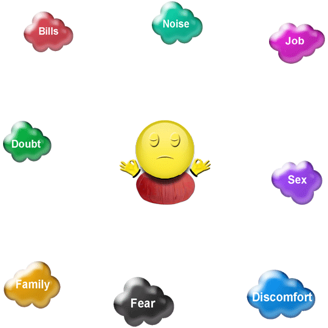
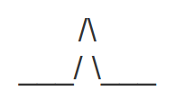
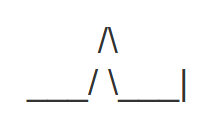

# Preface

This e-book is an unofficial collection of texts by [Kenneth Folk](https://kennethfolkdharma.com/). 

It was created for archiving purposes only, using the material found on various copies of [Kenneth Folk's old website](https://web.archive.org/web/2013*/http://kennethfolkdharma.wetpaint.com) on [archive.org](https://web.archive.org).

# Introduction

People do contemplative practice for different reasons. Some people want to be free from suffering. Some people want to have interesting experiences. Some people want to find out what is true. For me, the best reason to practice is to find the happiness that is not dependent upon conditions. When happiness becomes your baseline, it frees up a lot of energy to be free, have interesting experiences, and find out what is true. In actual practice, all of these things are likely to happen to anyone who commits to contemplative practice, so you get to have your cake and eat it too.

Below is a prescription for the happiness that is independent of conditions. I call it the 3-Speed Transmission. It's like driving a car; when you are cruising along and everything is fine, third gear is the place to be. But sometimes the going gets rough and you know that if you stay in high gear you'll stall out. That's when it's useful to be able to downshift.

In pedagogy (the science of teaching and learning) there is a concept called "scaffolding." It means offering students a way to build their understanding step by step, so that each new understanding fits into what they've already learned. It's like building a scaffold around a house; you can climb up the scaffold to reach the high places you haven't finished building yet. If learning is carefully scaffolded, there will always be something to hang each new bit of learning on as it comes in. This association of each new bit of understanding with what has gone before helps you to retain knowledge better because anything you learn within a larger context is hard to forget or confuse. Later, as we shall see, the understanding we are most interested in is not related to knowledge in the usual sense. And it doesn't need anywhere to hang. All of the scaffolding is only a temporary device to help you find the confidence to abandon the building project entirely and find that you already are the happiness you seek.

The most gifted among you may find that you can just stay in third gear nearly all the time. For you, the happiness that does not depend on conditions may become second nature as soon as it is pointed out to you. For many of us, though, the conditioning to live in our thoughts is very strong. In that case, it's helpful to have 2nd and 1st gear so that when things get tough or confusing we can still do a practice that is accessible and that doesn't leave us feeling overwhelmed.

So, without further ado, here is the 3-Speed Transmission: (First I'll present the thumbnail version, then elaborate on each theme.)

**3rd gear:** If you can just **let it be**, understanding in your heart and in your bones that the happiness and peace you seek are your own true nature, then let it be. This is known as recognizing buddha nature or dwelling in buddha mind.

If you are distracted and unable to rest in buddha mind, downshift to:

**2nd gear:** Ask "Who am I?" until awareness turns back on itself. Cultivate **the "witness,"** becoming absorbed in the perspective of awareness taking itself as object.

If, for whatever reason, dwelling as the witness isn't feasible, downshift to:

**1st gear: Balance investigation (vipassana) and concentration (samatha).** Use mental noting until the noticing is automatic, then just concentrate and notice. The genius of vipassana is that there is never a time when it can't be done. So it's the ultimate safety net and 1st gear practice. It also has the feature of being effective all the way to arahatship (the Fourth of the Four Paths of Enlightenment as described in Theravada Buddhism). So, it's by no means a low-grade or substandard practice. Quite the opposite, it's a very sophisticated technology of enlightenment. Used correctly, together with the other practices listed in this recipe, it's a rocket ship to the moon.

# Goals

Anytime you embark upon a program of study, it's a good idea to have goals; if you decide to practice the 3-Speed Transmission, it will be helpful for you to know where you hope to end up. Do you want to be free from suffering? Do you want to be a meditation master? Do you want to know what all the fuss is about? Do you want to experience altered states of consciousness? Do you just want to be happy?

May I be so bold as to tell you my view on this? Nothing you can get or become will satisfy. I set out twenty-seven years ago to get enlightened and to become a meditation master. I feel that I have achieved both of those goals; the Four Paths of Enlightenment of the Theravada Buddhists all make sense to me now. I can access all sorts of wonderful jhanic states whenever I want to. I can manifest an astral body and fly through the air and dive into the earth. It's all very nice, and if you dedicate yourself to this practice, you'll be able to do it too. But the happiness that is independent of conditions has nothing to do with any of that, and the happiness that is independent of conditions is what I would most like to share with you. So, here are some goals for each of the 3 Speeds, understanding that in the end you can do no better than to surrender to what is already the case in this moment.

I will suggest some goals that I believe make sense at each level of the 3-Speed Transmission and you can accept or reject them and come up with goals that make sense to you.

**1st Gear Goals: Balancing Concentration (samatha) and Investigation (vipasssana).**

There are two distinct but intimately interrelated aspects to this practice. One is to master a number of altered states and the other is to progress along a continuum of physio-energetic development until you reach the point where you feel you are no longer a slave to this developmental process. With that in mind, the goals I suggest for 1st Gear are:

1. Become familiar with the samatha jhanas, including the four rupa (material) jhanas, the four arupa (immaterial) jhanas, the Pure Abodes (suddhavasa), and Nirodha Samapatti.

2. Move progressively through the Four Paths of Enlightenment until you reach Arahatship (Fourth Path), at which time you will not longer feel that there is anything more to be done in this regard. You won't stop developing after that, but you will feel that you are off "the ride" that began with your first spiritual opening.

**2nd Gear Goals: Dwelling as the Witness**

The "Witness" is both a transitional practice designed to help you attain 3rd gear and a way to maintain a connection with what is truer than your thoughts as you go about your daily life activities. As such, the goal here is simply to identify the "I" sense in your own experience, learn to become absorbed in this apparent witness and continue to practice in that way. Eventually, even the Witness dissolves, leaving only pure non-local awareness, which pervades and is not other than the entire manifest universe. Even after gaining unfettered access to 3rd Gear, however, you may find the witness to be an extremely empowering tool for remaining sane during all the waking hours of your day. This is because 3rd Gear, the non-dual experience of primordial awareness, is best done when you don't have any other cognitively demanding tasks to attend to. For those of us who live as householders, balancing awakening and family life, the Witness can serve as a bridge between ordinary dualistic consciousness and the unborn.

**3rd Gear Goals: Be as you are.**

The goal at this level is the happiness that is not dependent upon conditions. This means that no matter what is going in your life, be it good or bad, pleasant or unpleasant, there is deep, abiding happiness. This comes from realizing, in this moment, things as they really are.

May you come to know the happiness that is independent of conditions.

## Realistic Expectations 

It's good to have some idea of where you are headed. The inspiration that comes from imagining a happier future can be a real support for your practice. As you continue to practice, you will find out for yourself what practice leads to; meanwhile, it's not a bad idea to have some dreams and goals.

One good source of inspiration is a role model. If you can find someone who seems to embody the happiness you seek, then you can ask that person how they got that way. If they can then outline for you a clear course of study or action, you have only to put their suggestions into effect.

I recommend finding a living person to serve as your role model. There are lots of people to choose from, and you can even change role models as your understanding develops. I don't recommend choosing someone who is long dead, simply because we have no reliable biographies of such people. Until recently, biographies were only considered worth reading if they included miracles, virgin births, improbably heroic acts, magic powers, omniscience, etc. It was a kind of formula; if you wanted someone to be taken seriously, you had to include this laundry list of remarkable events. In other words, until recently, biographies were not biographies at all, but rather hagiographies. Hagiography is the study of saints.

From Wikipedia: "The term 'hagiographic' has... been used as a pejorative reference to the works of biographers and historians perceived to be uncritical or 'reverential' to their subject."

So, while there is a wealth of excellent teaching available from people who are long dead, it's important to acknowledge that we don't know very much about the real, everyday lives of those people, and it would therefore be naive of us to attach much significance to the legends we hear about how wonderful those people were.

By extension, it is unwise to form expectations of what your own enlightened life will look like based on descriptions of ancient saints. Such expectations, while romantic, would not be based in reality, but in mythology. One sign of spiritual maturity is the willingness to give up childhood dreams in favor of expectations that are firmly rooted in observable reality. Once you can make this extraordinary leap (and I am not suggesting for a moment that it will be easy or that you won’t bounce back and forth), you can get down to the serious business of waking up.

It is possible to be happy. But unless you are already awake, you don’t know quite what that will look like. As you work toward finding out, here are some guidelines to help keep your expectations grounded in reality:

- Be skeptical of claims that in olden times people were different than they are now, or that we live in a “degenerate age.” There is no credible evidence to support this view.

- Look around for someone you admire and find out how they became admirable. Try to own your projections and cut that person some slack when they turn out to have feet of clay.

- Be skeptical of your need to be special. You don’t need to be holy, omniscient, blameless, or immaculately conceived. You need only find out how to be happy. The rest is just your ego talking.

- Get to work. Find a contemplative practice that has led to happiness for a real, flesh-and-blood human being, and do that practice until it bears fruit.

Enlightenment is both much better and much worse than you think. It’s much worse because it will not result in you becoming a saint. It’s much better because you don’t have to change in order to have it. The happiness you seek is what you already are. And if it takes you another twenty years to notice what you already are, it will have been worth every minute. On the other hand, you might notice now...

## Dynamic Jhana vs Static Jhana

[**editor's note:** missing animation]

The animation above introduces the concepts of “dynamic jhana” and “static jhana.” The dynamic yogi, left, has the goal of moving up and down through the entire spectrum of consciousness, objectifying phenomena at each stratum of mind and thereby dis-embedding from each stratum. He understands that to objectify and dis-embed from his experience is enlightenment. He is not concerned with spending a great deal of time at any particular stratum or becoming expert at dwelling in any particular place.

The static yogi, on the right, has the goal of mastering each stratum of mind via the samatha (pure concentration) technique, presumably with the goal of eventual enlightenment.

The dynamic yogi moves up and down the jhanic arc in each sitting, getting a little bit higher up the arc each time. When he reaches the top, he has objectified and dis-embedded from the entire range of experience and is enlightened, as symbolized by the eye above his head. After enlightenment, he continues to move up and down the arc, cultivating and deepening his understanding.

The static yogi goes to the first jhana, becomes absorbed there and spends some period of time attempting to master that level. He eventually feels comfortable moving on to the next level, and so on. Since this kind of extreme mastery of each stratum of mind takes a long time, he grows old, grey, and toothless long before he reaches the top... but he has a very blissed-out smile on his face!

I recommend dynamic jhana. The goal is enlightenment and the happiness that is not dependent upon conditions. In order to be enlightened, you must dis-embed from your experience. Anything you can take as object (see clearly and label) is not “you” by definition. Surely you must be the one who is looking. And since even the sense of “I” can be taken as object, there is no place for the supposed “I” to hide. Every experience can be objectified and dis-embedded from. Finally, there is only Awareness, which gives rise to and is not other than the manifest world.

## How to Get Enlightened

 What would I say if I had just five minutes to give comprehensive instructions for awakening?

You are unenlightened to the extent that you are embedded in your experience. You think that your experience is you. You must dis-embed. Do that by taking each aspect of experience as object (looking at it and recognizing it) in a systematic way. Then, surrender entirely.

Do these practices, exactly as written:

**First Gear:**

1) Objectify body sensations. If you can name them, you aren't embedded there. Notice sensations and note to yourself: "Pressure, tightness, tension, release, coolness, warmth, softness, hardness, tingling, itching, burning, stinging, pulsing, throbbing, seeing, tasting, smelling, hearing." If I am looking at something it is not "I".

2) Objectify feeling-tone. Are sensations pleasant, unpleasant, or neutral? If you can sit there for five minutes and note pleasant, unpleasant, or neutral every few seconds, you are not embedded at that layer of mind.

3) Objectify mind states. Investigation, curiosity, happiness, anxiety, amusement, sadness, joy, anger, frustration, annoyance, irritation, aversion, desire, disgust, fear, worry, calm, embarrassment, shame, self-pity, compassion, love, contentment, dullness, sleepiness, bliss, exhilaration, triumph, self-loathing. Name them and be free of them. These mind states are not "you;" we know this because if there is a "you" it is the one who is looking, not what is being looked at. Below, we will challenge the notion that there is any "you" at all.

4) Objectify thoughts. Categorize them: planning thought, anticipating thought, worrying thought, imaging thought, remembering thought, rehearsing thought, scenario spinning thought, fantasy thought, self-recrimination thought. Come up with your own vocabulary and see your thoughts as though they belong to someone else. The content of your thoughts is not relevant except to the extent that it helps you to label and therefore objectify them.

**Second Gear:**

5) Objectify the apparent subject. Who am "I"? Turn the light of attention back on itself. Who knows about this experience? Are you causing this experience in this moment? To whom is this happening?

**Third Gear:**

6) Surrender entirely. This moment is as it is, with or without your participation. This does not mean that you must be passive. Surrender also to activity.

May you awaken now. (If it takes you another twenty years it will have been worth every minute.)

## A 9 Stage Map of Developmental Enlightenment

Enlightenment is not binary (as in “you either have it or you don’t), but exists on a continuum from totally clueless on one end of the spectrum to full and complete enlightenment on the other. Every person on Earth can be plotted at some point on this continuum at some particular point in time. The hope is that one moves further and further along the scale throughout his or her life. Below is a 9 stage map of this developmental process. The model is a work in progress; I will add more detail and update it as I learn more, including adding additional levels if necessary. I am publishing it now in the hope that meditators will find it useful in their own practice and in helping others to awaken. There are some obvious flaws in this kind of map, not least of which is that in order to make sense of it, one must have a solid working knowledge of Theravada Buddhist concepts including the Progress of Insight, jhana, and nirodha samapatti. I apologize for these shortcomings and welcome feedback on how to make the map more accessible across traditions without losing the high level of resolution included here.

**Stage 1** (sometimes called KF1 for convenience and to distinguish from similar stage maps): 

The 4th Insight Knowledge, Arising and Passing away of Phenomena, aka A&P. *Read about the first five Insight Knowledges here* [**editor's note:** link to the "Progress of Insight 1-5 stages text"]. How common is this stage? I expect all my students to attain this. It usually takes just a few weeks of weekly Skype coaching or several days in intensive retreat. I’ve guided dozens of students to this stage and many of my students already have it by the time they contact me. This is the point at which someone is well and truly bitten by the meditation bug.

**Stage 2**: Stream Entry. Practitioner has completed all 16 Insight Knowledges. (Mahasi 1st Path) *Read about the Insight Knowledges 5-10 here* [**editor's note:** link to the "Progress of Insight 5-10 stages text"]. There are inaccuracies in this essay and places where my current understanding no longer matches what I wrote there, but in the interest of getting this all in one place, I’ll save the revisions for later. How common is stream entry? I expect all my students to attain this stage and they nearly always do. I’ve seen dozens of students get this far.

**Stage 3**: Practioner has developed through all 16 Insight Knowledges for a second time. (Mahasi 2nd Path). How common is this stage? I expect all my students to attain this stage and they almost always do if they stick with the program. Anyone who has attained KF2 has all the tools necessary to attain KF3. It’s just a matter of continuing on with regular, targeted practice.

**Stage 4**: Practioner has access to the Pure Land jhanas and Nirodha Samapatti. (One interpretation of Mahasi 3rd Path) [Here is a fascinating insight map from the Theravada, based on the 31 Realms of Existence](https://web.archive.org/web/20130127135147/http://www.accesstoinsight.org/ptf/dhamma/sagga/loka.html). Notice numbers 23-27, which are said to only be available to 3rd Path practitioners and beyond. These are the Pure Land jhanas. The “Pure Land jhanas” terminology is my own invention; I first accessed “PL1” by doing a Pure Land Buddhist practice of invoking the name of Amitabha Buddha, which is said to transport you instantly to the Pure Land. It worked, after a fashion, so I dubbed the experience a "Pure Land jhana." This was circa 1994, and the name has stuck. How common is this stage? Many of my students get this far, but it is not as common as the first 3 stages because it requires a greater level of concentration.

**Stage 5**: The tipping point. Practitioner has a profound sense of completion, as though “done is what needs to be done.” (One interpretation of the [4th Path of Enlightenment](https://en.wikipedia.org/wiki/Four_stages_of_enlightenment). And *here is my 2010 commentary on interpretation of the 4-Path model.* [**editor's note:** dead link]) The longing to be enlightened seems to have melted away. With further ripening at this stage, it will be seen that there is more to be done; the practitioner still experiences many of the old neurotic patterns, but has some distance from them. “It’s still happening, but it doesn’t seem to be happening to me,” is a common report. How common is this stage? As a rough estimate, I’ve guided 20-25 or so folks to this stage over the last 5 years. I occasionally meet someone who has come to this through some other system. At this stage, the practitioner is identified with emotional feelings rather than a conceptual self. So he or she will resist and argue with more advanced practitioners about what comes next...

**Stage 6**: Emotional transformation. Marked attenuation of feelings. (See Damasio’s Looking for Spinoza for the distinction between emotions and feelings. Feelings are the subjective component of emotions. Emotions can and do carry on without the corresponding feelings, as emotions and feelings happen in different parts of the brain.) Practitioner may still display full range of emotions as observed by others while reporting only contentment, well-being, acceptance, etc. This new emotional stability sets the stage for...

**Stage 7**: Proprioceptive selfing is seen clearly. From the platform of the emotionally stable mind, it becomes possible to see that certain sensations, especially around the face, eyes, and forehead, are sporadically signaling “this is I, me, mine.” See Metzinger’s comments about Ronald Melzac’s neuromatrix and “a kind of proprioception that is so subtle, it’s almost unconscious” ([paraphrased from memory, but here is the video](https://www.youtube.com/watch?v=mthDxnFXs9k)). When the moments of operation of this proprioceptive selfing are juxtaposed, moment by moment, with non-selfing moments, the selfing is seen as painful and the mind conditions itself to stop doing it. This proprioceptive selfing seems to operates at several layers, however, because it comes back at a subtler level, as do feelings of fear, irritation, and aversion. *Here is a Youtube video in which I sketch out the first 7 stages.* [**editor's note:** the video cannot longer be found] (At the time, I did not know there were more stages available.)

**Stage 8**: A deepening of the insights from stages 6 and 7, plus a crushing blow to the ownership and agency aspects of selfing. (See Metzinger, The Ego Tunnel, for more on ownership and agency as components of selfing.) Practitioner feels very “enlightened” at this point, even somewhat alien as compared to “normal” people. Lots of disorientation. At times some sense of “divine retardation,” in which practitioner feels him or herself losing interest in some things that mattered previously, while simultaneously feeling profoundly OK with these changes. Life gets simpler as unnecessary ideas and attachments slough off. Friends can drift apart if some neurotic need no longer needs to be fulfilled. Conventions and concepts soften in favor of “this is happening now.” Disorientation becomes the norm and one adapts to it. Some motivations, e.g., need for social status, need to be right, need to please others, which began to lose steam at KF5, fade further. How common is this stage? I personally know at least seven people, five of whom are my students or former students. As of this writing (April, 2012), I also consider myself to be at this stage.)

**Stage 9**: Edit, 26JUL2012: Hmmm... Don't know yet. Staying open to possibilities.

# 1st Gear

First Gear: Balancing Concentration (samatha) and Insight (vipassana).

My first spiritual opening came in 1982, when I was 23 years old. It was a glimpse of what I now call "the Witness" otherwise known as 2nd Gear in the 3-Speed Transmission. This first, powerful awakening to the fact that there was a deeper reality than my habitual way of seeing the world completely changed my life; having had a taste of this deeper reality, all I wanted to do was "get it back." I began reading everything I could find about meditation, enlightenment, and spirituality, hoping to find a way back "home." All of the authors I was reading said that one should meditate, so I did. But the models of enlightenment I learned about in the books did not satisfy me. It seemed that there was some nebulous, airy-fairy kind of wisdom that Zen masters had, but that couldn't be explained. If you did Zen meditation, maybe it would happen to you too, but there was no guarantee, and in fact the odds were against it.

So, when I met a Theravada Buddhist teacher named Bill Hamilton in 1990 and learned about another way of modeling enlightenment, I was immediately hooked. According to Theravada Buddhism, enlightenment is a clearly mappable, linear process that is reproducible from one practitioner to the next. "Insights" arise in an invariable order, and it is possible to place yourself on a map of attainment and see where you have been and where you are going. This was just what my rational mind wanted to hear! Having grown up in a culture that sees everything as having a beginning, a middle, and an end, I could easily wrap my mind around this map of progressive development and get to work. My new teacher was honest with me about where he believed himself to be on the map and spoke of the meditation techniques and the fruits of the practice in such clear terms that I had no doubt I would be able to succeed within this system.

Theravada Buddhism describes four Paths of Enlightenment, each of which builds upon one before it. When I met Bill Hamilton in 1990, he let it be known through broad hints that he considered himself to have attained 2nd Path and was working toward 3rd. The more I practiced the vipassana (insight meditation), the more my faith in this system was verified. The insights into suffering, impermanence, and no-self came fast and furious, just as my teacher and the old texts said they would. The main point I want to make here about vipassana meditation is that it performs as advertised and a diligent yogi truly can progress through a series of stages that were already clearly described and mapped over 2,000 years ago. This is an exciting and dynamic process that brings benefits much too numerous to describe here.

Each of the four Paths of Enlightenment unfolds through a series of sub-stages, called the Progress of Insight. Once you have completed all 16 stages of the first Progress of Insight, you have, by definition, attained to the First Path of Enlightenment, at which time your understanding of your relationship to yourself and your experience is permanently altered in subtle but profound ways. This new understanding further deepens during the 2nd Progress of Insight, which looks and feels similar to the 1st and culminates in 2nd Path. After this, the Progress of Insight speeds up and cycles repeatedly. Eventually, 3rd and 4th Path are attained, resulting in what the Theravada Buddhists consider "full enlightenment." The kind of thumbnail sketch I've provided here makes this all sound fairly straightforward and perhaps even easy, but most people will not find it so. To reach the highest levels of enlightenment within this system requires a tremendous amount of concentration, which in turn requires great dedication and for most people many years of dedicated effort and considerable sacrifice. Nonetheless, it is possible and well worth doing; balancing concentration and insight brings about what I call "physio-energetic" development, a kind of human development that seems to be optional. In other words, the majority of people on Earth will not develop their potential in this arena and many will not even believe that such a possibility exists.

## Detailed Noting is Better 

When doing noting practice, preferably aloud, you have to decide whether to do a very detailed noting or a more sparse or skeletal noting. A skeletal noting technique, for example, would be to just choose from these six notes: seeing, hearing, tasting, touching, smelling, and thinking.

Detailed noting, however, is better than skeletal noting. That's because detailed noting "uses up" the available processing power of your mind, and that is exactly what you want to do. If you are noting in a way that requires all of your attention, your mind will not wander and you will not suffer. It's that simple. If, on the other hand, you use a noting technique that only requires 30% of the processing power of your mind, what are you going to do with the other 70%? You're going to suffer! Try it and see! :-)

Here is a systematic way to use your own mind to best advantage in waking up:

1) Note body sensations, e.g., pressure, coolness, warmth, tightness, stretching.

2) Note "pairs" (body sensations + feeling tone), e.g., "pressure-neutral, coolness-pleasant, itching-unpleasant."

3) Note "triplets" (body sensations + feeling tone + mind-state), e.g., "pressure-neutral-investigation; coolness-pleasant-contentment; itching-unpleasant-aversion."

If doubt arises, note "doubt." If speculation arises, note "speculation." If comparing arises, note "comparing." Everything goes in the hopper. There is no such thing as a hindrance. Whatever arises, including distraction, agitation, anger, doubt, etc. can be noted. Co-opt your enemies. You will find that that scariest monsters in your mind can be allies in your own awakening as soon as you note them.

You do not have to be concentrated to note. Note "agitation, dullness, unhappiness, dissatisfaction, doubt, anger, distrust, frustration, exasperation, confusion, fear, self-loathing, judging."

You don't have to figure this out in advance. Every moment that you spend making love to ideas is a moment you could have been noting. Imagine a surfer who thinks he has to understand wave theory before he gets in the water. Just get in there and surf!

## Walking Meditation

I used to hate walking meditation as taught by my American vipassana teachers. The slowness of it was painful to me, and I rarely felt that I was doing it right. I practiced walking meditation between sits on retreat because there was nothing else to do. Then, while on a one-year retreat in Asia, I noticed that the Burmese yogis often walked fast, or at normal speed. They didn't even always walk in a straight line. Sometimes they walked in a circle, or wandered. My whole idea of what walking meditation could be opened up to almost infinite possibilities, as did my relationship to it. Where I used to grudgingly use walking as a way to kill time or to set up the sittings, nowadays I use the sittings to set up walking. Formal walking meditation is just one step away from awareness during daily life activities, so I love the utilitarian aspect of it. I walk fast, I walk in the woods, I stop, I squat down, I stand still, I stare off into space... what I rarely do, though, is pay attention to my feet. I do breath-counting 1-10, starting over when I get lost, or I notice the breath at the mouth and nostrils, or I play with putting the locus of awareness outside the body, and watching as from above; I love walking meditation.

Here is just one creative way to do it:

Walking with expanding and contracting energy

Set aside some time to walk without distraction. Decide in advance how much time to spend on this session and do what I call the "mental mezuzah;" imagine touching the mezuzah and saying, "for this period of time, I'm leaving all of my planning and worries with you. I'll pick them up on the way out." This conscious commitment, for a finite period of time, is the key to remaining relatively undistracted during the session. Without it, the mind worries that all of the important things that need to be done will never get done, leading to catastrophe. So you make a bargain with your "thinker;" you promise that you'll get back to those important things, but for this 15 or 30 minute period, we're going to let go of all that and just be present. It's a mini-vacation.

The walking can be done outside, preferably when few people are around, or it can be done in your own living room. You just need 15 feet or so to pace back and forth. Walk at whatever speed is comfortable for you. Stop and start whenever you feel like it. Follow your gut, there are no rules.

Imagine an energy field around your body, something like a magnetic field or a cocoon. Don't worry if it isn't clearly defined.

Notice that in any given moment, the energy seems to be either expanding or contracting. It's either moving outward infinitely toward the ends of the universe, or it's pulling back into the core of your being. If it's expanding, gently and silently note to yourself, "out." If it's contracting, gently note to yourself, "in." At first it will seem subtle, as though you are imagining it. Later, it will be obvious and undeniable. Don't rush. If you feel yourself tensing up, remember to breathe, and relax the tension.

Expect nothing. See what happens.

## Access Concentration

You are sitting, struggling to pay attention to your primary object, assaulted by sounds from the outside and thoughts from the inside. It gets worse. You feel an almost unbearable tension and anxiety and you have to resist the urge to get up and run screaming from the meditation hall.

Suddenly, just when you think you can’t stand it any more, everything gets quiet. You might feel a quick, short vibration in your leg or foot, you might hear a sudden ringing in your ears or a feeling similar to the moment when they pressurize the cabin in an airplane. You might feel as though you are inside a car and somebody just rolled up the car windows. Sounds become muted, thoughts are no longer compelling, and you are able to easily maintain attention on your meditation objects.

What happened? You just entered access concentration. Think of access concentration as a protective membrane, bubble, or force field. It wraps around you and insolates you from distraction and helps you meditate. From within the safety of access concentration, you can either note the changing phenomena of mind and body (vipassana) or become absorbed in the sensations and mind states that arise due to concentration (samatha).

Access concentration is a natural function of concentration (samadhi) and occurs whenever the mind settles down and gathers together in one place. The mind may be focused down to a small point or it may have a very diffuse focus like a wide angle lens; both of these situations are possible within concentration.

Any exercise that coaxes the mind into settling in one place can bring about access concentration. You might be following the breath at the area around the mouth and nose or at the abdomen. You might be gazing at a kasina object. Sometimes, access concentration might occur spontaneously during a conversation with someone or during lunch, when you didn’t even realize you were concentrating. Here is just one exercise to help you cultivate access concentration. It’s useful to do this at the beginning of a sitting so you don’t spend too much of your sitting time distracted by thoughts and sounds.

Count the breath from one to ten, counting only on the exhalation. If you get lost, start over at one. Be gentle and persistent. Don’t be frustrated when you have to start over many times during the exercise; this is natural, even for experienced meditators. It can take time for the mind to settle down and gather itself together. Read my essay on chicken herding to understand how this works. About the time that you can count to ten without losing your place three times in a row, you are probably in access concentration and have enough momentum to effectively do vipassana or samatha meditation.

Try not to make too big a deal out of this concept. In other words, don't make it yet another attainment to strive for and feel bad about if you think you aren't getting it. Often you will be in access concentration and not know it. At times there won't be any overt signs that you have entered; you'll just feel able to meditate well. The important take-away here is that when you are sitting and feeling a lot of anxiety and building tension, it may be that you are just on the verge of passing inside the bubble of access concentration. Be patient and don't get up or start distracting yourself every time it gets a little difficult. Take an interest in the process and see if things get better just when you think they couldn't get any worse. Be kind to yourself and think tortoise, not hare, constancy, not heroics. It's the gentle pressure of applying attention over extended periods of time both on and off the cushion that does the most work, as opposed to short periods of intense effort.

## Practice Tips

### Vipassana technique

Q: So, what do you think? Bear down and increase concentration on primary object? Or keep letting it play out?

A: Well, you never want to bear down, as that implies "over-efforting." You want just enough energy/effort (viriya) to make contact with the object in this moment. No more, no less. It's very dynamic and the amount of effort required from one moment to the next is constantly changing. This ability to dynamically change the amount of effort in response to the changing objects of attention is key to mastering vipassana. See how flexible you can be, how lightly you can touch the object without overshooting it. Imagine a peanut floating in a bucket of water. Put your finger on it just enough to feel it, but not hard enough to roll off. Now introduce some waves into the water. Maintain contact with the peanut as it moves up and down, back and forth. Reestablish contact when you lose it.

How do you know if you have contact with the object? Easy. If you can name it, you know you are contacting it. This is the true value of noting; it keeps you honest. If you are noting, you are doing vipassana. You cannot note without doing vipassana. That does not mean hypnotize yourself into noting "rising, falling," and pretend that you are awake, mind you. You have to know something about the object. Go ahead and note "rising, falling," but know that you are experiencing coldness, warmth, softness, hardness, stinging, burning, aching, pulsing, throbbing, or whatever it is. Noting (knowing clearly what you are experiencing and naming it) is biofeedback.

### Choosing a teacher

-- Original Message -- 
From: refred 
To: kennethfolk 
Sent: Feb 8 2010, 3:28 pm EDT 
Subject: RE: meditation report

Refred:Hey Kenneth -

Thank you for the responses. I have a question about meditation teachers. I have recently become aware of a meditation teacher in my area. He is Indian (India) and completely self-taught. He said he started meditating as a young boy. I asked him if he would be able to tell if someone had any realization or enlightenment and he said only the individual would know that, but at the same time I asked if he could ascertain where a student was on the path and therefore teach to where the student is. He said yes. I asked him flat out if he was enlightened and he said yes. I am trying to figure out how to know if this person can point to where I need to go. Can you help?

Kenneth: Refred, I have to say I really like the answers he has given you so far. But you'll have to follow your gut. The question of whom to trust as your teacher is one of the most perplexing of all. Human relationships are complex in the best of cases. The first thing to keep in mind is to take care of yourself, understanding that there are people in the world who will not hesitate to use the mask of the meditation teacher to gain power over or unscrupulously extract money from others. At the same time, there are many sincere and gifted teachers, some of whom are enlightened. I recommend that you work with this man a bit, honor his time as your own, don't give him any power over you, and see if you are making progress under his guidance. It may take you several years to really evaluate your relationship with him, but meanwhile your practice might grow immensely. If it feels weird or creepy at any point along the way, back off and get some wise counsel from friends, family, other teachers, and fellow meditators. The more these things are out in the open, the healthier they tend to be.

### Masculine vs Feminine Approach to Practice:

The hardest thing to accept is that there isn't any experience that's better than any other. The work is done when you objectify something in this moment, thereby dis-embedding from it. That's it. You can do it just as easily off the cushion as on, and in fact you will have to do it all day long to get enlightened. At first, there's a tendency to favor cushion practice over off-cushion practice. Later, they are the same. No hurry, but understand that that's where you are headed.

I once saw a move called Harlem Nights. Terrible movie, but it had one funny and important scene. Richard Pryor's character and his wife are in bed together. The wife says, "Let's make love all day, real slow and sensual. Then we'll make love allllll night. Then, we'll make love alllll morning."

Richard Pryor is getting this uncomfortable look on his face. He says, "Baby, how 'bout we make love real hard... for twenty minutes?"

In order to get enlightened, you have to take the feminine approach to practice. The masculine approach will never work. Doing it really hard for twenty minutes is a recipe for anxiety, frustration, and failure. If, on the other hand, you can keep up the gentle pressure of attention all day long, from the time you wake up in the morning until the time you go to sleep at night, you can't help but awaken.

## The Progress of Insight

One way to think of the Progress of Insight would be to plot it on a graph. It might look like this:

It starts out flat, rises to a climax, reaches a peak event, descends to a trough, stabilizes, then resolves. In order to better show the resolution, we could add an upright bar at the end, like this:

The first time through the complete cycle might take months, usually years, and, by definition, results in the First Path of Enlightenment, using traditional Theravada Buddhist language. Having made it all the way through once, you now "own" it, and can learn to review all of the territory you have covered. Even without further practice, you will naturally cycle through this territory. At some point, though, the mind seems to get tired of this first package and moves on. You find yourself at the beginning of a new Progress of Insight.

The second complete cycle might again take months or years, and results in Second Path. But then the cycle speeds up and repeats many times before Third Path is reached. At times a complete cycle might take just a day or two, often a few weeks. At times, it feels as though you have completed the cycle in a few minutes or even a few seconds, or many cycles in one second. I don't know if there is an exact number of cycles that must be completed in order to attain Third Path. If there is, it might be in the hundreds or thousands. In my own experience it is not feasible to keep count. I've only spoken to two other people about this, and neither of them could nail down a number. Suffice to say that by Third Path one is thoroughly tired of cycles and wishing they would end.

They don't end. They do become less annoying though, as, with attainment of Third Path, the focus turns away from what is changing, toward something deeper and more stable. I remember feeling, at times, as though I were in the eye of the hurricane, looking out from a place of calm as the winds whipped around me. While working toward Fourth Path, the cycles are still coming fast and furious, sometimes several or many in one day, but often one cycle every week or every few weeks.

It is important to note that through all of this there is the feeling of being pulled toward some inevitable conclusion, a sort of dharmic gravity pulling you toward the core of existence. You sense that, if given enough time, the maddening instability of the cycles will resolve. It does, with the advent of Fourth Path, or arahatship. If fact, it is the feeling of finally being "off the ride" that I believe is the defining characteristic of arahatship.

The cycles, however, don't end with the Fourth Path. Rather, they become a natural part of life, like the breath, or the sleep cycle, or the seasons and the year. Just as one doesn't get tired of breathing or sleeping, but surrenders to the natural rhythms of life, someone who has reached Fourth Path has integrated the cycles into his or her daily rhythms. And although we may get tired of the seasons, as we do when it is very hot in the summer or very cold in the winter, we are deeply confident that it will soon change. The Progress of Insight is like that for somebody who has come to the end of the process that I think of as physio-energetic development. I use that word in order to distinguish the Progress of Insight from a psychological process. Psychology involves the contents of the mind, i.e. thought, and the cycle I'm speaking of has very little if anything to do with that. Rather, it involves an energy that is felt in the body, and is therefore physiological. Although we don't yet have the scientific tools to measure this energy, I won't be surprised if we someday do. Meanwhile, cultures around the world have been talking and writing about this energy for millenia. The words kundalini, chi, and ki, among others, all refer to this physio-energetic phenomenon. The chakras are nexuses of energy, and when developed, are stable places where the concentrated mind can rest. This resting is called jhana.

What then, does the early part of the cycle feel like? It feels solid. Here again, is the graph:

We can divide the graph into five parts:

1. __ (The opening, as in "the opening act.")

2. / (The ascent.)

3. /\ (The peak.)

4. \ (The descent.)

5. __ (Consolidation and Resolution.)

1. The opening act is the flat line at the left, understanding that the cycle moves from left to right. (As it is a cycle, this whole process might be more accurately represented as a circle, but I have deliberately chosen a linear graph for ease of understanding.) In traditional language, what I am calling the opening act includes the first two insight knowledges, Knowledge of Mind and Body and Knowledge of Cause and Effect.

2. The ascent. The third insight knowledge, Knowledge of the Three Characteristics.

3. The peak. The fourth and fifth insight knowledges, Knowledge of the Arising and Passing Away of Phenomena and Knowledge of Dissolution, respectively.

4. The descent. The 6th through 10th insight knowledges: Fear, Misery, Disgust, Desire for Deliverance, and Re-observation (the dukkha ñanas).

5. Consolidation and Resolution. Includes the 11th insight knowledge, Knowledge of Equanimity, the 12th through 15th insight knowledges, including Path and Fruition, all four of which are said to happen in one moment, permanently completing the cycle, and the 16th insight knowledge, Review.

### First insight knowledge, Knowledge of Mind and Body

So, the opening stage feels solid. The easiest way to picture this is to imagine a new yogi on his first retreat. (For lack of a non-awkward alternative, I'm going to adopt the convention of the generic masculine pronoun, with apologies to the majority of humankind who do not consider themselves male.) The idealized imaginary yogi, on the first day of his first vipassana retreat, will reach a concentrated state and have his first insight. He will see that he is not his body, and he is not his thoughts. He will further see that mind and body are two separate things, with each influencing the other. He may even see a thought arise, as separate from "himself," the knower of the thoughts. This is an enormous development, as he has not previously considered himself to be other than his thoughts. This is the beginning of a meta-awareness, a stepping back from experience to be able to dispassionately observe experience, an ability that will strengthen throughout his life.

Our imaginary yogi has reached the first insight knowledge, the aptly named Knowledge of Mind and Body. He has not, however, fully penetrated the object, which, as we shall see, is the very heart of the vipassana technique and that which gives it its unique transformative power. Having not yet penetrated the object, the yogi's experience can be described as solid.

A traditional example can help to illustrate what is meant by solid in this context:

You are walking down a country road and you see what appears to be rope lying across the road, its ends disappearing into the brush on either side. As you approach more closely, you notice that the rope is not lying still, as one would expect from a rope. It seems to be moving ever so slightly. Moving closer still, you realize that it is not a rope at all. It is a line of ants crossing the road in both directions. Finally, you see that that line is composed of individual ants, each of which is composed of many constituent parts constantly in motion. At this point you have penetrated the object. The object of perception, which at first seemed to be a solid rope, is revealed to be an illusion.

This practice of deconstructing apparently solid objects of perception into their constituent parts is vipassana, which is translated into English as "seeing clearly." The yogi at the level of the first insight knowledge, however, has not yet done this. True vipassana doesn't begin until the fourth insight knowledge, Knowledge of the Arising and Passing Away of Phenomena. It is for this reason that the A & P, as I call it, is the most important of the insight knowledges, and that which opens the door for the development and final integration of the physio-energetic process called the Progress of Insight.

While the stages of the Progress of Insight are described by the Theravada Buddhists as insights, it seems clear that there is something at work here that goes much deeper than thought. In order for similar insights to appear to diverse individuals in an invariable sequence, there must be something structural underlying the thoughts. This sequence of development must be somehow hardwired into all human beings. The very fact that there is a map of insight suggests that every yogi goes through a similar process. While this seems incredible, considering the infinite variability of individual human minds, there is ample precedent for it; the key is to see it as a fundamentally physiological, as opposed to mental, phenomenon. It surprises no one to hear that each of us started out as a zygote, developed into a fetus, was born as an infant, progressed through early and middle childhood, blossomed into adolescence and finally became an adult. Upon reaching adulthood, our progress along what I would call the vertical axis of development reaches its zenith; at that point, if we are to develop further, we must do so along the infinite horizontal axis of mental, psychological and spiritual growth. Similarly, the fact that a yogi's progress along the vertical axis of development through the ñanas, jhanas, and Paths is predictable and mappable points to an underlying physiological or physio-energetic development. (While other thinkers have used the idea of vertical and horizontal axes of development somewhat differently, I have chosen the vertical axis to represent development through ñanas because that is what feels most intuitive to me. The actual experience of gradual enlightenment involves an initial upward movement of energy within the body. Later, this energy is seen/felt to exit the body from the crown chakra, curve back down, and make a complete circuit. In short, it feels more vertical than horizontal.)

In fact, it was this predictability, this repeatability of the process across individuals, across cultures, and across millenia, that first drew me to vipassana and Theravada Buddhism. Until I met Bill Hamilton in 1990, I had been reading mostly zen literature, and had come to think of enlightenment as some nebulous, airy-fairy kind of wisdom that some people possessed for some inexplicable reason. So, when Bill began to speak, during our very first meeting, about a kind of enlightenment that could be systematically developed by anyone, I was immediately hooked. Over time, I came to understand that vipassana is simply a technology by which to achieve a development that, while completely natural and organic, is optional. Most people, for better or worse, will not develop this potential. Many will live their entire lives without even knowing it exists. Some will be told of its existence, but will not believe it. Such is the way of the world.

### Second insight knowledge, Knowledge of Cause and Effect

On the second day of his retreat, as our ideal yogi continues to deepen his concentration, he will reach the second insight knowledge, Knowledge of Cause and Effect. This is the direct, intuitive understanding of karma, as experienced in his own life. With his mind quiet and undistracted, he will feel in his gut the pain of his past unskillful actions and the joy of past good deeds. Much of his time on the cushion and walking around the retreat center will be spent reflecting on past actions and their karmic fruit. These revelations are by no means ordinary thoughts, but rather deep intuitions backed up by physical sensations. When he remembers the time he sent flowers to his mother for no reason except that he felt like it, he will feel a deep happiness in mind and body. When he remembers the time he shoplifted candy as a child he will feel pain, and will instantly make the connection between cause and effect; skillful action leads inevitably to happiness, while unskillful action leads inevitably to suffering. Karma is no longer an abstraction to him, but a law of nature. He has attained the second insight knowledge, Knowledge of Cause and Effect. But he has still not fully penetrated the object.

### Third Insight Knowledge, Knowledge of the Three Characteristics

The three fundamental characteristics referred to so often by the Buddha in the Pali canon are Dukha, Anicca, and Anatta. These three Pali words are worth teaching in their original Pali form, as the English translations, especially in the case of Dukkha, do not capture the full sense of the words. Dukkha is usually translated into English as "suffering," and this is as good a single-word translation as any. But the word dukkha also carries the sense of "unsatisfactoriness." The Buddha said "Life is dukkha." In fact, that was his First Noble Truth. The idea that life is inherently unsatisfactory is fundamental to Buddhism, and is often repeated by Buddhist teachers in order to motivate students to meditate. The Buddha promised that, by applying his techniques, ordinary people "could come to the end of dukkha." Is that true? The short answer is "yes." The long answer involves explaining a subtle and profound word game. For now, let's just say that to be enlightened is to completely internalize the experience that, although there is suffering, there is no one to suffer.

Anicca means "impermanence. Like the rope in our story, things are not static. Even the most solid-appearing things are made up of small things, and ultimately, everything consists of energy in motion. Modern physics teaches us the same. The Buddha, 2500 years after his life and death, has been vindicated. Anicca is indeed one of the fundamental characteristics of existence.

Anatta is the Pali word for "no self." Just as there is no rope lying across the road, there is no inherently existing self. It is an illusion, caused by a misperception. To look closely at the myriad processes that make up our sense of self is to see through them. To see through them is to have no self. Anatta.

On the third day of his first retreat, our ideal yogi experiences all three of the fundamental characteristics first hand. Above all, he feels dukkha. As he sits on the meditation cushion, his knees hurt, his back is giving out, he has a headache, and he feels sick to his stomach. Dukkha, to be sure. He goes to the meditation teacher to beg for relief. Could he sit in a chair, instead of on the floor? Perhaps he could skip a few sittings? He might even ask if he might go home and return when he feels better.

But the meditation teacher has seen this a thousand times before. He knows the map, sees that the yogi is about to make a breakthrough in his practice, and manages to convince the yogi to stay. "Stay just one more day," he encourages, "and we'll talk about it again tomorrow." The next day, of course, our yogi attains to:

### The fourth insight knowledge, Knowledge of the Arising and Passing away of Phenomena

The fourth insight knowledge could be said to be the most significant event in a yogi's career, and is often the most spectacular. The nondescript name, Knowledge of the Arising and Passing Away of Phenomena, in no way does justice to the reality. This is the peak spiritual experience, often a completely life-changing event. While for some people it can be fairly subtle, often it involves unitive experiences, "God-union," "the white light," mystical visions, and sublime ecstasy. It signals the beginning of true spirituality, and while it is often mistaken for a culminating event, it is really the germination of the seed that will later come to fruition, first in the partial resolution that is First Path, and later in the final resolution that is arahatship.

So, what are the mechanics of this remarkable event? What is actually going on in the yogi's mind/body? Viewed through a purely mechanistic lens, the yogi has managed, for the very first time, to completely penetrate an object. He has reduced a seemingly solid thing to its component parts. A body sensation that was previously experienced as a solid pain in his knee while sitting is now experienced as waves of subtle tingling sensations. Thoughts, instead of sitting there in the mind like stones, are seen to arise, live out their brief existence, and then vanish cleanly into the nothingness from whence they came. For a few days around the attainment of the fourth insight knowledge, all is right with the universe. The secular yogi feels enlightened, the religious yogi feels touched by God, and both expect to live out the rest of their lives at the crest of this infinite wave.

Waves, however, are not infinite, but temporal and cyclical in nature. Returning to our graph, we see that the fourth insight knowledge exists at the very peak of the cycle.

And because following the peak of every wave is a trough, there is trouble on the horizon. Mercifully, the first part of the descent is pleasant, though that may be viewed as a knife that cuts both ways as it does not prepare the yogi for the horror of what is to come. Next in line is:

### The fifth insight knowledge, Knowledge of Dissolution

Returning, for a moment, to the energetic model, we can say that up until now the energy within the body and mind has been rising, and has reached its apex with the fourth insight knowledge. With the fifth insight knowledge, Knowledge of Dissolution, the energy is clearly perceived by the yogi to be subsiding. This is a very chilled-out stage, akin to post-coital bliss. The yogi is in love with the world and everyone in it, but feels no compulsion to do anything about it. Things are fine, just as they are, and the yogi can sit in the meditation hall for hours, grooving on the cool, diffuse, tingling sensations of the body. Before, at the peak of the cycle, it was possible to see the beginning, middle, and end of a thought or sensation. Now, only the end is seen. It is like driving in the slow lane on the highway, with no rear view mirror. All you can see is the receding tail lights of the other cars as they pass you and disappear in the distance. There is no oncoming traffic. The mind is markedly unproductive at this stage. By the time a thought is recognized, it is already gone. Conversations are difficult. One is grateful for the safe and undemanding environment of the silent retreat. This happy stupidity does not last long, however, as the dukkha ñanas are coming hard on its heels. We are about to enter the true low point of the cycle, territory so daunting that it has been the undoing of many a yogi.

### The Dukkha Ñanas

There are just two places on the Progress of Insight where yogis get stuck.

The sticky places are the 3rd ñana and the 10th, i.e. the ascent to the crest of the wave, and the descent into the trough that follows the crest. The 3rd ñana is significant in that if it is not overcome the yogi will not progress to the Arising and Passing Away of Phenomena, and will therefore not enter the realm of true spirituality. Having never penetrated an object of awareness, the pre- 4th ñana yogi will remain ever an outsider, looking in from behind the glass as others have transformative experiences that the pre- 4th ñana yogi can only imagine. Nonetheless, the 3rd ñana in itself does not present a great deal of suffering. The pain is mostly physical, mostly experienced on retreat, and does not affect the yogis life outside the retreat setting. Such pre- 4th ñana yogis, of which there are many, often become religious, adopting the ideas and trappings of whatever scene they are in. They may become devoted and much-valued members of their spiritual/religious community.

The 10th ñana, on the other hand, is a different kind of animal. It has the power to destroy lives. It is the phase referred to in zen as the "rolling up of the mat," because the yogi has the intuitive sense that meditation is only adding to his misery, and abandons the sitting practice. The 10th ñana is St. John of the Cross' Dark Night of the Soul, a realm of such gut-wrenching despair that the yogi may want to abandon all worldly (and otherworldly) pursuits, pull down the shades, roll up into a ball and die.

Although all of the ñanas numbered six through eight are included in the dukkha ñanas, it is the 10th that causes the hardship, as the tenth is an iterative rehash of the Insight Knowledges of Fear, Misery, Disgust, and Desire for Deliverance, along with some nasty surprises all its own.

#### The Sixth Ñana: Knowledge of Fear

The name says it all. Following the peak experience of the fourth ñana, the Arising and Passing Away of Phenomena, the yogi's world began to dissolve. But it was not a problem for the yogi, as the deep orgasmic joy of the crest of the wave was smoothly replaced by a cool bliss. Delicious tingling sensations ran down the arms and legs and thoughts disappeared before they could become the objects of obsession. Now all that changes. The dissolution continues in the sixth ñana, Knowledge of Fear, but the yogi experiences it very differently. He is terrified to see his world falling apart.

About two weeks into my first three-month retreat in Massachusetts in 1991, having already experienced the high of the A & P and the bliss of Knowledge of Dissolution, I was passing the time before lunch by doing walking meditation on the old bowling alley when I was overcome by a wave of abject terror. The hardwood floor of the bowling alley no longer felt solid beneath my stockinged feet. The stark colors of the floor and walls punished my eyes, and the walls themselves seemed to writhe as I watched them. I pushed my hand against the wall beside me, seeking something solid. The wall felt spongy. I fell to my knees on the hardwood floor, oblivious to other yogis who may have been passing by, and pushed my fingertips firmly against the oak, desperate to find a solid place to rest. My fingers seemed to sink into the floor. Tears streamed down my face and tapped onto the wooden floor as I allowed myself to be overcome by an unspeakable dread that I could not understand.

This experience, which lasted about ten minutes, was my first full-blown taste of the sixth insight knowledge, Knowledge of Fear. As intense as it was, momentarily plunging me into what seemed like a bad acid trip from a 1960s anti-drug propaganda film, it was mercifully brief and passed cleanly away by lunchtime.

A traditional description of the sixth ñana describes a mother who has just seen her husband and all but one of her sons executed. As her only surviving son prepares to suffer the same fate as his brothers, the dread that his mother feels is akin to that dread of a yogi who attains to the sixth ñana. Personally, I find this story a bit over the top, but it certainly gets one's attention. And Knowledge of Fear can be very intense, although for some yogis it is not spectacular at all, just unpleasant.

#### The Seventh Ñana: Knowledge of Misery

The next insight knowledge to arise, the aptly named Knowledge of Misery, is number seven of 16. The body writhes, the skin feels like it is crawling with bugs, and the muscles of the neck and jaw contract unpleasantly, pulling the face into a rictus. It is hard to sit still on the cushion, as the whole body feels unsettled. Unpleasant sensations arise quickly and pass away before the yogi can focus on them, thus taking away one of the strategies that has served the yogi well until now, that of focusing on unpleasant body sensations in order to become concentrated. The experiences I have listed are just some of the many possible ways in which misery can arise. Each individual will have a unique experience. But the seventh ñana will not last long, perhaps not more than a day or two, if that.

#### The Eighth Ñana: Knowledge of Disgust

The ancient ñana-naming commission once again scores a perfect hit; the eighth insight knowledge, Knowledge of Disgust is just as it sounds. Food is repellant, the thought of sex is nauseating, and everyone smells bad. Again, this ñana is generally short-lived.

#### The Ninth Ñana: Knowledge of Desire for Deliverance

Do you know what it feels like when you are sobbing, completely at wit's end, overcome by grief and self-pity? The body shakes and rocks, and you feel the release of total surrender to your emotional pain. This is the ninth insight knowledge, Knowledge of Desire for Deliverance.

#### The Tenth Ñana: Knowledge of Re-Observation

This is where the ancient Buddhist names of ñanas fell down on the job. The innocuous-sounding Knowledge of Re-Observation, tenth of the sixteen insight knowledges, is a wolf in sheep's clothing. Books have been written about it. It is the stuff legends are made of. This is the Dark Night of the Soul, and the Agony in the Garden. Although some yogis are able to pass through this stage relatively easily, it is common for a yogi's life to be completely disrupted by the tenth ñana.

When the yogi attains to the crest of the wave in the fourth ñana, he believes that he has arrived at his destination. From here on in, he reasons, life should be a breeze. Even if he has been warned, he does not believe the warnings. He is completely unprepared for what is to come and is blindsided by the fury of the tenth ñana, which consists of the four previous ñanas of fear, misery, disgust, and desire for deliverance repeating themselves in a seemingly endless loop, and worse with each iteration. In addition, the strong concentration of the fourth ñana seems to have disappeared; there is no respite from the unpleasantness and negative mind states that flood the body and mind.

Actually, the yogi is even more concentrated than before, but he is accessing unstable strata of mind that are not conducive to restful mind states or happy thoughts. The yogi obsesses about his progress, is sure that he is back-sliding, and devises all manner of strategies to "get back" what he has lost. The meditation teacher does his best to reassure the yogi that he is still on track, but to no avail. The best approach at this point is to come clean with the yogi, lay the map on the table, and say "You are here. I know it isn't easy, but it does not last forever. If you continue to practice, you will see through these unpleasant phenomena, just as you have seen through every phenomenon that has presented itself so far. You are here because you are a successful yogi, not because you are a failure. Let the momentum of your practice carry you as you continue to sit and walk and apply the vipassana technique."

It is interesting to note that a yogi who is well-versed in jhana may navigate this territory more comfortably than a "dry vipassana" yogi, as jhana is the "juice" that can lubricate his practice.

The pre-4th ñana yogi who repeatedly fails to penetrate the object and proceed to the Arising and Passing Away of Phenomena is what Sayadaw U Pandita calls the "chronic yogi." This yogi can go to retreat after retreat, over a period of years, and never understand what vipassana practice is all about. He will, upon hitting the cushion, quickly enter into a pleasant, hypnogogic state, maybe even discover jhana, but go nowhere with regard to the insight knowledges. U Pandita's frequent exhortations to greater effort and meticulous attention to detail in noting the objects of awareness are aimed at this "chronic yogi."

The "dark night yogi," on the other hand, is Bill Hamilton's "chronic achiever." Having sailed through the all-important fourth ñana and subsequent ñanas five through nine, he hits a wall at the tenth, and can easily spend years there. But even the darkest night ends, and when it does, dawn is sure to follow. The next stop on the Progress of Insight, Knowledge of Equanimity, will make everything that came before it seem worthwhile.

#### The 11th ñana, Knowledge of Equanimity

I once had an experience while on retreat in Rangoon of seeing a perfectly formed and brightly colored mandala. It was during my afternoon nap that I awoke into an alternate reality. I somehow knew that my body was still sleeping, and that I was having a vision, but I was completely immersed in this other world. As I looked more closely at the mandala, it became an entire landscape, with buildings and trees and rivers. It was full of detail at every level of scale, the shapes and colors were sharply defined, and it was perfect in every way. If fact, it was much more vivid than my ordinary waking state, with colors that don't exist here on Earth. I found myself flying over this wonderful city, saw a person walking far below, and flew down to investigate. It was my brother, smiling at me! He said, "If you want to fly, you have to help me first." I was overwhelmed with joy at seeing him, and I took him by the hand and pulled him into the sky.

Today I'd like to continue the narrative of the ñanas with the 11th ñana, Knowledge of Equanimity. The equanimity ñana is generally a very happy time for a yogi. Having suffered through the solid physical pain of the third ñana and having endured the dark night of the tenth ñana, the yogi wakes up one day to find that everything is just fine. Dissolution of mind and body continue, but it is no longer a problem. In fact, nothing is a problem. In the early stages of the eleventh ñana (Knowledge of Equanimity), the yogi can sit happily for hours at a time. If pain comes, no problem. Wandering mind, no problem. Objects present themselves to the mind one after another, obediently posing for inspection. This is where the yogi really gets a feel for what vipassana is all about, as he effortlessly deconstructs each thought and each sensation that appears.

I mentioned earlier that the third and tenth ñanas are the only places where a yogi gets hung up. I should perhaps include the middle stages of the eleventh on that list, as it is possible for a yogi to get stalled-out here for lack of motivation. When everything feels fine, there seems little reason to meditate. Many of us are motivated to meditate by our own suffering. And since there is very little suffering in the eleventh ñana, it is tempting to stop meditating and enjoy the passing parade.

This lack of motivation works together with the inherently slippery mind of the middle stages of the equanimity ñana to slow down a yogi's progress. By slippery mind, I mean an inability to stay focused on one object, and a tendency to drift off into pleasant reverie. Slippery mind is a natural consequence of a mind that is very quick and nimble together with the fact that the equanimity ñana is still part of the dissolution process. In the first stage of dissolution, the fifth ñana (Knowledge of Dissolution, appropriately enough), the focus was on the passing away of gross physical sensations, so it was experienced as blissful. In the middle stages of dissolution, the dukkha ñanas (numbers 6-10), the mind itself was seen to be dissolving, along with the physical world and even one's own sense of identity. The fear and grief induced by the loss of the apparent self were mind-shattering. Now, in the eleventh ñana, Knowlege of Equanimity, the yogi has entered the final stages of dissolution. Even the fear and grief are seen to disappear as soon as they arise. Things are as they are, and life is good. But the yogi will have to relearn the art of concentration.

One way to understand what is happening here is to hearken back to the phases of chicken herding. In order to master the equanimity ñana, the yogi has to completely develop the fifth and final phase of chicken herding. In this phase, the herder has become one with the flock and is aware of the entire barnyard all at once. This takes a great deal of momentum, and a great deal of practice... momentum because you can't "do" this as much as you can "allow" it... the latter phases of concentration arise naturally when the momentum is strong. And in order to have momentum, you must practice. Frustrated by his slippery mind, however, the yogi may try to hold the objects of meditation too tightly. This will not work with slippery mind. Holding tightly will not allow the later phases of concentration to develop, and will result in yet more frustration. At this point, a concentration practice like counting the breath or gazing lightly at a kasina object can be very helpful.

This is a good place to mention wandering mind and its relationship to concentration. It is the nature of the mind to wander, and even the most advanced meditators have to deal with this phenomenon. Wandering mind cannot be defeated, but it can be managed. I once had a beginning meditation student tell me that she had just finished a sitting in which she thought about her kids, her husband, the shopping, her job, and the fact that she was never going to be good at meditation.

"Excellent," I told her. "You just kind of meditate in between all that."

During any meditation sitting, there are moments when the monkey-mind slows down enough that it's possible to concentrate on an object for a few moments, whether the object is the breath, a kasina object, or whatever it may be. Those few moments of concentration condition the mind in such a way that there is a little less time before the next window of calm appears in between the passing storms of monkey-mind. This momentum, or snowball effect, where each little bit of calm conditions the next moment of calm, is an important principle in Buddhist meditation. In traditional teachings, the Buddhists list "proximate causes" for various mental factors. For example, the proximate cause for metta (lovingkindness) is seeing goodness or "loveableness" in another person. The proximate cause for mudita (sympathetic joy at the good fortune of another) is seeing another's success. And the proximate cause for concentration is none other than... concentration. With this in mind, it is easy to see how important the snowball effect is when you are trying to steady the mind. And from this point of view, there is no reason to feel frustrated when an entire sitting goes by with just a few brief windows of calm. Every moment of concentration makes it more likely that the next moment of concentration will arise.

Wandering mind, then, becomes ever more manageable with practice, and this is good because the later phases of concentration (chicken herding 4 and 5) will not arise if the mind is not still. This does not mean that thinking stops during deep concentration, but rather that it fades into the background, slows down, and does not pull the mind away from its target. When you are firmly abiding in a jhana and thinking arises, it is felt as subtle physical pain as it begins to pull you out of your pleasant state. With practice, this pain becomes a familiar signal that it's time to turn the mind away from thoughts and toward the object of meditation... or face the consequences. The consequences are simply that you unceremoniously exit the jhana. The skill to exit a jhana according to the schedule you decided upon before entering the jhana as opposed to staying too long or being dumped out prematurely is, as we discussed earlier, the fourth parameter for mastery of a jhana.

So, how does the yogi get to equanimity in the first place? Why do some people get hung up for years in the preceding ñana? The key to coming to terms with the tenth ñana, Knowledge of Re-observation, is surrender. Once the yogi surrenders to whatever his practice brings, he is free. Having surrendered, it does not matter whether the present experience goes or stays, or whether it is pleasant or unpleasant. It this attitude of surrender, along with time on the cushion, that results in the full development of the strata of mind where fear, misery, and disgust live. Once those mental strata are developed, or once the kundalini energy is able to move freely through those chakras, it is as if a groove has been worn through that territory. You now own that territory and although you move up and down through those same mental strata every day and in each meditation session, they no longer create problems in your meditation.

It is helpful to think of the Progress of Insight as a vertical movement upward through ever more subtle layers of mind, culminating in the Path moment, in which Nibbana is seen for the first time at that level, forever removing the energy blockages in that section of the mind. Each of the first three Paths then becomes a platform from which to continue transforming the energy on the next leg of the journey. And while the territory to be covered is vast, it is finite. It is for this reason that it is said to be possible to become "fully enlightened;" once you have cleared the energy pathways and developed the chakras throughout the body/mind, there is no more to be done on that score. Recall the traditional words of the Arahats upon their attainment of Fourth Path: "Done is what needed to be done, there is no more coming into being, etc."

This consensus that there is a resolution to this particular process of physio-energetic development is important, because it gives hope to people who are tortured daily by the poorly understood but very clearly felt sensation that there is something to be done with regard to meditative development. These people should be told clearly and often that they can resolve this feeling of unease in this very life, as U Pandita points out in his book by that title. Where U Pandita has failed us (and understandably so, as the rules of his monastic order prevent him from claiming any attainment) is that he does not speak from the authority of personal experience. He uses traditional language, reminding us that "the Buddha said this, the Buddha said that," etc. We need someone to stand in front of us in the flesh and say, "I did this, I did that, and I came to the end of this process. I am no longer tortured by the burning hunger that tortured me for so many years." It is the need for such honesty and clarity that inspires me to come out of the closet with regard to my own attainment in spite of the heat that will inevitably follow as people rightly point out that I am no superman.

It must also be pointed out again and again that Arahatship is not the end of anything except this one particular process of energy development. We can speak here of two kinds of development: the vertical and the horizontal. Vertical development, with regard to jhanas, ñanas and Paths, is finite. Horizontal development is infinite. There is no limit to how much one could explore the mind at every step of the way from before the first ñana before First Path to the sixteenth ñana that results in Fourth Path. So an arahat is by no means done with his development; no human being will ever be done with horizontal development.

We have so far limited our discussion to the physio-energetic development that culminates in Fourth Path/Arahatship. There are many other ways for a human being to develop, from the emotional and the psychological to the social and the professional. All of these are valid and important, as most of us do not aspire to be emotionally immature arahats with poor social skills and no job. I hope that, as people become better educated about what "spiritual" development can and cannot do for us, they will stop expecting too much from their gurus. And I hope the gurus will stop imagining themselves to be above the petty concerns of the masses. From what I've seen, many enlightened sages could benefit from a good twelve-step program, or perhaps some kind of therapy.

I'll continue the narrative of the ñanas in the next installment. Next stop: nibbana.

### Path and Fruition (Nibbana)

Let’s briefly review what we’ve seen so far:

Theravada Buddhism identifies Four Paths of enlightenment. The first of these Four Paths can be subdivided into 16 “insight knowledges” or ñanas. These ñanas arise one after the other, in invariable order, as a result of balancing insight (vipassana) and concentration (samatha). Most of the heavy lifting is done in the first three ñanas; taken together, the first three insight knowledges can be thought of as the pre-vipassana phase. During this first phase of practice, it’s as though the yogi is rubbing two sticks together in an effort to start a fire. When the fire takes hold in earnest, the 4th ñana, the all-important Arising and Passing of Phenomena (A&P) has been attained. From this point on, the practice is more about constancy than heroics. The focus becomes concentration rather than insight. Patience and trust are important; at times it is necessary to avoid the temptation to push too hard, understanding that just as you can’t force a young plant to grow by pulling on its stalk, you can’t force yourself to develop through the ñanas.

This process of development is hardwired into the human mind/body system. Everyone has the potential to develop along this particular axis, and in order to do so one must simply follow the instructions for accessing and deconstructing each new layer of mind as it arises.

We now continue to track the progress of our idealized yogi. It’s tempting to make a big deal out of the Path moment. So much emphasis is put on attaining First Path that we imagine there is some secret to it; surely there is some special bit of knowledge or some extra bit of effort required to “get us over this last hump.” In fact, it’s not like that at all. Just as all the previous insight knowledges arose, in order, on cue, the Path moment shows up out of nowhere when you least expect it. It’s a little bit like chewing and swallowing; when you put food into your mouth, you begin to chew. At some point, when sufficient chewing has taken place, you swallow. It’s an involuntary reflex. You don’t have to obsess about whether swallowing will occur or try to control the process. If you do, chances are you will just get in the way. Similarly, when you meditate according to the instructions, the various strata of mind are automatically accessed, the apparently solid phenomena are automatically deconstructed, the information is naturally processed, and you automatically move from one insight knowledge to the next without having to orchestrate the process at all.

In just this way, our yogi is sitting there one day (or walking, or standing), and there is a momentary discontinuity in his stream of consciousness. It’s not a big deal. But, immediately afterward, he asks himself, “Was that it?” It seems that something has changed, but it’s very subtle. He feels lighter than before. Maybe he begins to laugh. “Was that it? Ha, ha! I thought it was going to be a big deal. That was hardly anything. And yet...”

Something is somehow different. It would be very difficult to say exactly what. In almost every quantifiable way one could imagine, things feel exactly the same. And yet...

As the days and weeks go by, it becomes ever clearer that the experience was indeed First Path. First of all, the practice is different now. Instead of having to sit for a few minutes in order to work himself up to the 4th ñana, every sitting begins with the 4th ñana or A&P. From there, it takes just a short time to get to equanimity.

Second, our yogi may suddenly find that he has access to four or more clearly delineated jhanas, or “realms of absorption.” He may find that he can navigate these states simply by inclining his mind toward them, jumping between them and manipulating them at the speed of thought.

Third, there is the possibility of re-experiencing the 15th ñana, fruition; a yogi can learn to call up fruition, which is said to be the direct apprehension of nibbana (nirvana) at will. There are three doors to nibbana, namely the dukkha (suffering), anicca (impermanence), and anatta (no-self) doors. Each of these modes of accessing cessation leads to a slightly different experience of entering and exiting nibbana. The fascinating exploration known as fruition practice is only available to post-First Path yogis and consists of systematically calling up, becoming familiar with, and comparing these phenomena.

And finally, there is the 16th ñana, “knowledge of review.” It is possible to learn to call up each of the ñanas 1-11 in addition to the 15th ñana of fruition and re-experience them as a kind of laboratory for understanding what the insight knowledges feel like and what insights they bring. (Ñanas 12-14 are one-time events marking the attainment of Path and will not happen again.) The ability to review previously attained ñanas is especially helpful for those who plan to become meditation teachers, but is interesting and useful for everyone because the ñanas will continue to cycle throughout a yogi’s lifetime and it’s very empowering to be able to identify them as they arise. This ability to see sensations, thoughts, and mind states from the outside rather than identifying with them is part of the larger process of awakening. When we objectify (take as the object of awareness) something that was previously seen as self, we move to more and more subtle forms of identification and ultimately come to the place where there is nothing left to identify with; there is only pure, non-local awareness, which can never be taken as object and can never be mistaken for "me." This Realization of primordial awareness is the happiness that does not depend upon conditions.

### The 16th Ñana: Knowledge of Review

"Kenneth, I'm curious about the phenomenon called "cycling" and how that manifests. I relate well to the part of your commentary that explains the initial run-up to first path. I relate well to your explanation of a yogi's practice and how it changes after achieving first path. In MCTB Daniel Ingram makes reference to the part concentration plays in recognizing progress and he explains that a person with less concentration (attention?) will be less clued in to where they are and what's going on. Your description below hints at the same kind of thing:

'Third, there is the **possibility** of re-experiencing the 15th ñana, fruition; a yogi can **learn** to call up fruition, which is said to be the direct apprehension of nibbana (nirvana) at will. There are three doors to nibbana, namely the dukkha (suffering), anicca (impermanence), and anatta (no-self) doors. Each of these modes of accessing cessation leads to a slightly different experience of entering and exiting nibbana. The fascinating exploration known as fruition practice is only available to post-First Path yogis and consists of systematically calling up, becoming familiar with, and comparing these phenomena.'

(I added the **'s to highlight the parts of your comments I was referring to in the above.)

Can you elaborate on the role concentration plays at this stage? I have not been paying very close attention to where I am according to the four path model (or any model) and I think I'm missing some important information due to my self-induced ignorance. I experience fruition, but it occurs infrequently and on the cushion. Is it possible to miss the experience of fruition if it happens during a meeting, walking along, driving, what have you? Will increasing my concentration help me recognize it?

I'm just confused about what to expect and how to better recognize what's up.

Thanks in advance! "-cmarti

Hi Chris,

A high level of concentration is required in order to complete the 16 ñanas and attain First Path, but I wouldn’t say that concentration is the deciding factor in whether a yogi recognizes and can effectively review the territory; it would seem that attitude and training are more important. Here is an example that might help to make the point:

A Zen student attains First Path. This happens in spite of the fact that neither ñanas nor Paths are mentioned in Zen training and is not surprising given that the ñana/Path model is just one way to describe and map a natural, organic process of human development. Having traversed the territory, though, the Zen student has no meta-perspective that will allow him to conceive of what he has been through. In fact, throughout the Zen training, the various phenomena that arise during meditation are actively invalidated by the teacher; all of the pleasant and unpleasant experiences are considered “makyo” (hallucination). A good Zen student learns very quickly not to attempt to make sense of meditative phenomena for fear of incurring the ire of the teacher. In this case, both attitude (the belief that thinking about or assigning importance to meditative experiences is dangerous) and a lack of training in identifying and systematically accessing various states conspire to prevent the Zen yogi from mastering this aspect of practice even though he has shown that he has sufficient concentration to access them.

In cases like this, a bit of remediation is in order for those who would like to understand and master the mental territory that has become available with the advent of Path. This is the situation you now find yourself in, so I’ll bring this back to specifics and offer a prescription that is tailored to you.

You have already taken several important steps toward understanding your experience; you have begun to educate yourself about the phenomena by reading about the maps, you have identified fruition as a recurring phenomenon in your own experience, and you have made a commitment to learning more. The next step is to notice patterns in how your experience manifests both during a sitting and over a period of hours and days. Notice, for example, that a sitting will often follow a predictable pattern; beginning with very little concentration, you become more and more concentrated until you reach a climax of concentration, sometimes culminating in a fruition or series of fruitions, after which you become less concentrated again and have to work your way up to a concentrated state again.

Using more technical language, a stream-enterer’s sitting begins with the 4th ñana, progresses through ñanas 5-11, then leaps to nibbana with the 15th ñana, fruition. After that, it resets to the 4th ñana and repeats the pattern. You can enhance your ability to notice the various states as they arise by keeping a journal of each sitting. Over time you see a pattern. For example:

I started the sitting with my mind a jumble (the mind is not yet settled enough to access any Insight Knowledge).
As soon as my mind settled down, I felt pleasant tingling and vibrating in my leg, along with a feeling of well-being and lightness (4th ñana, Arising and Passing of Phenomena).
Next, there were subtle, cool tingles all over my skin and I felt bliss (5th ñana, Dissolution).
Next, I heard a sudden noise and was startled, frightened, and disoriented (6th ñana, Fear).
Next, my jaw and neck started to tighten and writhe, and I felt itches on my skin (7th ñana, Misery).
Next, I began thinking about snails and worms and ugly people, and my face pulled involuntarily into a sneer (8th ñana, Disgust).
Next, my chest became tight, my breathing shallow, and I started thinking “Let me out of here!” (9th ñana, Desire for Deliverance).
Next, my mind was full of all kinds of negativity, my concentration went to hell, and I began thinking I was wasting my time and I might as well get up and have another cup of coffee or watch some television. I started thinking about the argument I once had with someone, and how I had definitely been in the right (10th ñana, Knowledge of Re-observation).
Finally, my mind settled down, the field of awareness expanded, and sitting was effortless. There was a pain in my leg, but it was no problem; I experienced it as a flow of sensations, some pleasant, some unpleasant, but none of it was a problem (11th ñana, Knowledge of Equanimity).
I became more and more calm. Then, when I wasn’t expecting anything, there was a momentary discontinuity in my awareness, followed by a deep breath and a feeling of bliss (15th ñana, Knowledge of Fruition).
After that, I sat up straight, feeling energy returning to my body and mind and realized I was back at the beginning of the cycle (4th ñana, Knowledge of The Arising and Passing Away of Phenomena).

Sometimes these stages go by very quickly. You may get just a momentary taste of each ñana as you quickly move through it to the next. Nonetheless, with repeated observations, you can see that the mind is moving through a series of layers or strata as it becomes more concentrated throughout the sitting. Also remember that “concentrated” does not mean “focused on one small area or object.” Rather, it means “remaining undistracted with the mind resting in the object or objects of awareness.” In fact, as concentration deepens throughout the sitting, the movement is toward an ever-more-diffuse field of awareness.

Once you have a feeling for what each state or stage entails, you can make a resolution (Pali “adhitthana”) to call up each state and review it in isolation. You can call up any state in any order in this way. This becomes your laboratory for really understanding and identifying each of the ñanas. The formal resolution does not have to be elaborate; it can be as simple as “May I review the 4th ñana now,” or “OK, I wanna do some fruitions.” The more you work with adhitthanas (resolutions) the more confidence you have in them, until it becomes clear to you that all these states are available to you instantaneously by simply inclining your mind toward them. Finally, the answer to the question “how do you get to such-and-such a ñana or such-and-such a jhana”? becomes as simple as the question “how do you get to the kitchen from the living room”?

You just go there. You don’t even think about it. That level of proficiency with jhanas and ñanas is a realistic goal for anyone who has the interest and the willingness to train systematically toward it. Taken together, this kind of training is called adhitthana practice, and is usually undertaken during the 16th ñana (Knowledge of Review), but can be done any time after First (or any other) Path.

## The Idiot's Guide to Dharma Diagnosis

*The Idiot’s Guide to Diagnosing the 16 Insight Knowledges*

One of the questions that yogis ask most often is “Where am I on the Theravada Progress of Insight map?” This is a legitimate question and there can be real benefit in knowing the answer. If you are able to align your own experience with the traditional descriptions of insight it helps you to have faith that this practice works, which in turn can motivate you to practice more. Furthermore, your teacher may suggest different practices depending on how far along you are in the process.

Below is a simple guide, designed to be “idiot-proof.” It only includes the most obvious landmarks along the way. Familiarize yourself with these diagnostic criteria and use them to place yourself on the map.

**Case Study # 1:**

Report: “My meditation used to be good, but now there’s nothing but solid pain when I sit. I sometimes feel nauseous and I want to leave the retreat."

Diagnosis: 3rd ñana, Knowledge of the Three Characteristics.

“But I also have all kinds of cool insights about this and that.”

Doesn’t matter. If you have persistent solid pain, you’re in the 3rd ñana.

**Case Study # 2:**

Report: “I had this incredible energy coursing through my body, tingled all over, saw white lights, and had unitive experiences.”

Diagnosis: 4th ñana, Knowledge of the Arising and Passing Away of Phenomena.

“But I had it while on drugs (or in a dream). I never even meditated.”

Doesn’t matter. 4th ñana. Have a nice day.

“But it was so real. I saw God. I know it was enlightenment.”

No, it was the 4th ñana.

**Case Study # 3:**

Report: “At some time in the past, I had white lights, unitive experiences and delightful tingles. Now my meditation sucks and I hate everything.”

Diagnosis: Dukkha ñanas 6-10, aka Dark Night of the Soul.

“But I feel super enlightened.”

Doesn’t matter. Dukkha ñanas. Thanks for asking.

**Case Study # 4:**

Report: I went through the 3rd, 4th, and dukkha ñanas (as described above) and now I feel fine every time I sit.

Diagnosis: 11th ñana, Knowledge of Equanimity.

“But I’m not having any insights.”

Right. Knowledge of Equanimity.

**Case Study # 5:**

Report: I went through the 3rd, 4th, dukkha ñanas, and Equanimity ñana, (as described above), and then one day I was just sitting (or standing, or walking), there was a little blip, and I knew that something was different. It was as though a weight had lifted from me. I felt light and wanted to laugh for a couple of days. After that, my practice was noticeably different than anything that had gone before.

Diagnosis: 14th and 15th ñana, Path and Fruition (1st Path).

“But it was no big deal. More like an anticlimax. But it’s clear that some cycle was completed.”

Exactly. Path and Fruition.

## Physio-energetic and Psychological Models of Enlightenment

There are, generally speaking, two ways to model enlightenment. One way involves what happens in the body, while the other describes changes in the mind. We can refer to these two contrasting modeling styles as physio-energetic and psychological, respectively. While this kind of artificial duality is simplistic, it is useful in understanding and creating effective models. An effective model is one that both describes the experience of enlightened people at the various levels, and predicts the experience of those who are working toward enlightenment.

### A Physio-energetic Model

An example of a purely physio-energetic model would be a modified Theravada Buddhist model that describes observable phenomena, without regard to what a yogi thinks. For example, you might say that at some point a yogi experiences solid physical pain. With continued practice, the pain breaks up into its constituent parts of tingling and vibration. I have just described the 3rd and 4th ñanas of the Theravada model, without any reference to what the yogi thinks about his experience. We could go on to say that the yogi feels cool tingling on the skin and what seems to be a descending flow of energy in the body (5th ñana). Soon thereafter, he feels discordant pulsing and vibrating in various parts of the body, as well as unpleasant mental vibrations. These vibrations happen all at once, at various frequencies and levels of intensity, so that the overall effect is similar to that of jarring, dissonant music. This corresponds to the 10th ñana, knowledge of re-observation. Later, the vibrations become smooth and pleasant, and meditation becomes effortless (11th ñana, knowledge of equanimity.)

At no point in the presentation of this model has it been necessary to resort to the yogi’s thought process. This is in direct contrast to a psychological model, which is all about what a yogi thinks.

### A Psychological Model

My favorite psychological model is that of the “Five Ranks of Tozan.” According to this system, a yogi will eventually come to the point where he can see, in real time, that there “aren’t two things;” all of experience is an undivided whole, permeated by and not other than awareness. At this stage, the yogi is officially enlightened. But his understanding is limited, as he is ignoring the fact that, although there aren’t two things, most people experience life as divided into thoughts of self and other. The enlightened yogi of the Third Rank can keep himself above the petty concerns of daily life, but has isolated himself from those who do not share his advanced vision. Although he can be a great inspiration to others who seek to emulate his detachment, he cannot relate to them on the most basic human level, a level which frankly requires the perception of duality. The Third Rank yogi is manifesting the notorious “stink of enlightenment” for all to see.

At some point, the enlightened Third Rank yogi, who has become accustomed to thinking of himself as unaffected by trivial human concerns may come to the rude awakening that he is still walking around in a human body, and thus subject to karma. He will step in a big bucket of dukkha and be unceremoniously ejected from his throne. This is the fall from grace, the Fourth Rank of Tozan. He will feel humble and human, and seek to pick up the tattered threads of his life.

After living as an ordinary chump for some period of time, the yogi may find that although he cannot escape his own karma he is still infinitely better off than he was before his enlightenment. He still has access to the glorious non-duality of the Third Rank. He can manifest it at will, and finds that, if wielded skillfully, the stink of enlightenment tempered by the humility of the fall can be of great benefit to others. He realizes that there is nothing left to do with his life but to help “others” discover what he has learned. He consciously chooses to spend his time pretending to be “other,” for the benefit of those around him. He has reached the Fifth Rank of Tozan, the ideal of Zen Buddhism.

Notice that throughout the explication of the five ranks it was not necessary to refer to any physio-energetic phenomenon whatsoever. The five ranks model deals exclusively with what is going on in the yogi’s mind. This is a purely psychological model.

### Hybrid Models

It is, of course, possible to combine aspects of the physio-energetic and psychological models in an effort to provide a more complete picture of the yogi’s progress. The Theravada model of jhanas and ñanas is one such hybrid. The insight knowledges (ñanas) are described by Mahasi Sayadaw and others using both physical and psychological language. The 4th ñana (knowledge of the arising and passing away of phenomena), for example, is characterized by subtle vibrations, the perception of lights, great happiness, and feelings of unity. This kind of hybridization works well up to a point, and provides a more comprehensive description of the stages than either the physio-energetic or psychological models can do in isolation. But, while this kind of modeling does an excellent job of describing the insight knowledges, it fails to capture the overall trajectory of the process of enlightenment. In other words, to use Theravada Buddhist language, the hybrid model does not work across Paths.

### The Problem with Hybrid Models

It is tempting to create a model describing what a typical yogi is able to “see” at each of the Four Paths of Enlightenment. You might, for example, say that a sotappana (First Path yogi) can see w, a sakadagami (Second Path yogi) can see x, an anagami (Third Path yogi) can y, and an arahat (Fourth Path yogi) can see z. Unfortunately, there are too many instances of sotapannas who can see y and arahats who cannot see x. To give a concrete example, we may define sakadagami as someone who can clearly see the cycling of the insight knowledges in his daily life. While this is likely true of someone who has trained in vipassana and been exposed to the concepts and maps that describe these cycles, it is clear that some who have progressed well beyond this stage and have even gone on to the level of arahat do not see these cycles. What to do with data that does not fit the model? We are now in the uncomfortable position of either ignoring inconvenient data or completely overhauling the model. Another example is the pre-sotappana who can see emptiness in real time, an ability that is sometimes associated with anagamis. The more we ask around, the more we find people who do not behave as our model would have them behave.

My latest thinking is that we need to do a lot more research and investigation before we can confidently build a model that integrates physio-energetic and psychological phenomena across the whole spectrum of enlightenment. Meanwhile, we should be hesitant use hybrid models to draw conclusions about the relative enlightenment of others, particularly when they are trained in a tradition other than our own.

## Jhana and Ñana

### Five phases of concentration

Concentration means different things to different people. I'll first explain what I mean by concentration, then talk about current western Buddhist ideas and misconceptions about it, misconceptions that I believe have contributed greatly to the glass ceiling effect.

By concentration, I mean the focusing of the mind. This can be a very tight focus or a very diffuse focus, but in either case, the mind is gathered together in one place or direction. One way to illustrate this idea is to think of herding chickens. Chickens are interesting creatures in that, although they naturally tend to move together as a flock, they will not hesitate to scatter when they are agitated or startled. I will describe the five phases of herding chickens. Maybe someday I'll draw the five chickenherding pictures, ha, ha.

**Phase one:** With great effort and determination, you thrust yourself into the middle of the flock with the intention of focusing on just one chicken. The chickens, however, are much quicker than you, and scatter in all directions. You chase them, but the minute you get one of them in your sights, it veers off and scurries away. You turn your attention to the next nearest bird and continue the chase. You are not able to follow any one bird for more than a moment. The very act of singling out an individual chicken causes it to flee. You feel anxious and frustrated. This tendency of a chicken to flee when pursued, however, is built into the dynamics of chicken herding. It doesn't mean you are doing it wrong, it's all part of the natural unfolding of the process. Although you may be tempted to abandon chicken herding as futile, do not despair. With perseverance, phase two will eventually arise.

**Phase two:** You are able, through continuous focus and the application of just the right amount of effort (learned through trial and error) to single out one bird and stick to it like glue. Your eyes do not waver from the target. Wherever it goes, you are sure to follow. If it speeds up, you speed up. If it slows down, you slow down. When it turns left or right, you are right on its tail, at just the proper following distance. A subtle exhilaration arises and you feel happy and alert.

**Phase three:** Chickens are, after all, flock animals, and they like nothing better than to run together as a group. If you relax your gaze just slightly from the chicken in front of you, you will notice that you are now in the midst of an entire flock of chickens that are moving as one. You are part of the flock now. You let yourself sink into this experience, absorbing into and becoming one with the flock. There is much less effort required here than at stage two, which, in turn, required less than stage one. You feel a deep joy, a sense of unity with the world.

**Phase four:** Your attention becomes even more diffuse and you become aware of the edges of the flock. The bird in front of you almost disappears. You are now noticing the entire flock, all at once. Any effort to tighten the focus of awareness, or single out an individual bird would pull you back to the earlier stages. You surrender to the diffuse, almost effortless experience of the fourth stage of chicken herding. You feel a profound bliss. Having accomplished your end, you are now free to relish the fruits of your labor. It is good to be alive, surrendered to the flock.

**Phase five:** You are fully integrated with the flock, and have become just another chicken. You are effortlessly aware of not only the chickens, but of the entire barnyard. Whether standing or sitting, running uphill or down, happily grubbing for worms or painfully tripping over chicken wire, you have no preference. Everything is fine with you. This is the final phase of chicken herding.

The five phases of chicken herding correspond to the five phases of concentration. My wife pointed out to me the other day that if I wanted to talk about concentration I should carefully explain what I mean by the word, as many people think that concentration only refers to the very tight focus that I refer to as phase two. She is right that this must be very explicitly taught, because if a yogi believes that only a very tight focus qualifies as true concentration he or she will never relax enough to let the higher phases develop.

#### How does a yogi know whether to practice samatha or vipassana?

There are two very different instructions, depending on whether a yogi is pre- or post- fourth ñana. A pre- fourth ñana yogi, i.e. one who has not attained to the level of the Arising and Passing Away of Phenomena, must put his focus on penetrating the object. A post- fourth ñana yogi must concentrate. It's that simple. And the reason, in my opinion, that the western dharma scene has been so spectacularly unsuccessful in producing high levels of attainment in its students is that western dharma teachers give beginning instruction to intermediate and advanced students; they tell post- fourth ñana students to ratchet up the intensity of their vipassana, when they should be telling them to concentrate their behinds off.

This, in my opinion tragic situation, is due to a misunderstanding that arose out of a cultural difference. The western vipassana scene, as exemplified by Insight Meditation Society, is influenced primarily by Burmese Mahasi-style vipassana. It seems that Burmese people, by and large, concentrate so well that it is difficult for them to learn vipassana. This, at least, is the conventional wisdom, and my experience in Burma in the early and mid-'90's led me to believe that it is, although a stereotype, generally accurate. Burmese yogis very quickly attain a deeply concentrated state and it is all the teachers can do to get them to look clearly at an object. Westerners, on the other hand, have no concentration whatsoever. We watch television, drink coffee, and obsess endlessly about our careers and our relationships. We are so goal-oriented that if you so much as suggest to us that there is something to gain by striving we will strive from here to eternity. When Burmese monks give instructions that were designed for Burmese yogis to American yogis, the result is too much effort and too little concentration. Without concentration, the strata of mind that contain advanced insight are never reached. This leads to the chronic achiever, as Bill Hamilton put it, the yogi who has attained to the all important fourth ñana, but is unable, year after year, to attain to the Paths.

Once a yogi, whether American, Asian, or otherwise, reaches the fourth ñana, it is imperative that the teacher recognize this and change the instruction from effort to concentration. A post 4th ñana yogi is in no danger of becoming "lost in concentration." He or she has all the tools to deconstruct whatever object presents itself to the mind. The important thing now is to access the relevant mental strata. These strata are accessed through concentration. There are various techniques to encourage the development of concentration. Two of my favorites are counting the breath from one to ten, and kasina practice.

### Two techniques for developing concentration

#### Counting the breath from one to ten

This deceptively simple but powerful practice is one of my favorites. While walking, sitting, or reclining, count each exhalation of the breath. When you arrive at ten, start over. The beauty of this practice is that it has a built-in feedback monitor. If the mind wanders, you will keep counting past ten, or lose count entirely. When that happens, start over at one. I like to do this practice while walking, and often use it as a warmup for sitting. If, for example, I plan to do kasina practice (described below), I find it helpful to attain a concentrated state before sitting down. This saves me the usual five to ten minutes of fidgeting and allows me to get directly to work. How do I know I am concentrated enough? Because I was able to count to ten two or three consecutive times without losing count. It takes the guesswork out of concentration.

#### Kasina practice

This is the gold standard practice for attaining "hard" concentration and jhana. A kasina is a colored disk that is used as a visual object. It doesn't much matter what color, but I favor pastels or earth tones. I use a cereal bowl. For years I carried around one of those cheap plastic bowls they use for bathing from tanks in Burma. Mine happened to be brown, about 8 inches in diameter. You prop the bowl up against the wall, sit a comfortable distance from it (about 5 to 8 feet) and stare at it. That's it. Your mind will go through the five chicken herding stages described above. At some point you will enter jhana. You will recognize it as an altered state of consciousness that feels very stable and very pleasant. Note that the first four jhanas correspond to chicken herding stages 2 through 5. Each jhana develops in the five stages, so it is like nested Russian dolls. Jhanas 5-8 are a subset of jhana 4, so there is always this nested relationship.

I have found both counting and kasina practices to be applicable to both retreats and daily practice at home. The more I go back and forth between deep concentration states and daily life activities, the easier it gets to make a quick and easy transition between them. In fact, there is a thing I sometimes do for my dharma friends that I call my "parlor trick," in which I sit down and cycle through all eight of the material and immaterial jhanas in less than two minutes. It doesn't look like much; I just sit there and shake and roll my eyes up into my head, holding up fingers to signal jhana numbers. (Although in the higher jhanas, I always forget which fingers to hold up and the signal system breaks down.) So they have to take my word for it that I attained all those jhanas. But I began doing it as a way to show people that jhanas aren't something abstract, or something for other people, but rather for ordinary people like us; they can be learned and cultivated to high levels and called up instantly, even during daily life. Also, I must admit, I began doing it as a way to rebel against a western Buddhist culture that teaches that it is wicked or shameful to admit that you "have the power of jhana." What rubbish.

### Jhana, ñana, and Path

There is a relationship between jhana, ñana and Path. In 1995, I spent two months at Sayadaw U Kundala's monastery in Rangoon. U Kundala, a former disciple of the late Mahasi Sayadaw, is a senior monk, much beloved, and widely reputed to be an arahat. A few weeks into the retreat, I began reporting to U Kundala that I was experiencing hundreds of little flashes of cessation each day, like the winking out of consciousness for a moment. They came singly or in waves, and I could induce them at will. On the third day of my trying to explain this to him through the interpreter, a woman who spoke rather limited English, U Kundala's eyes lit up as he said "Oh! That is Magga Phala! (Path and Fruition, the culmination of one of the Four Paths of Enlightenment)."

"Yes," I said. "And it's not the first time this has happened. It also happened a couple of years ago in Malaysia, but I had to go through the whole Progress of Insight again." (As an aside, this is typical of U Kundala's openness in speaking to students about their progress, an attitude that spilled over into the entire community. During our interviews, U Kundala would talk to me about Second Path. Someone would overhear and spread the word, and soon people were coming from all over town to stare lovingly at the western yogi who was making such progress. People I didn't know would stop by my room to give me gifts, hoping to "gain merit" in so doing. One Burmese man took me home (with U Kundala's permission) to meet his family, and then drove me around the countryside exploring Buddhist temples. Throughout the day, he and his cousin asked me discreet questions about what it was like to have attained Second Path. After my retreat, everyone treated me like royalty, and one of the board members of the monastery volunteered to drive me to the airport. Once at the airport, we did not wait in the queue with the hundreds of others at the airport, but walked to the head of the line. The board member, obviously an important man, said a word in Burmese to the policeman at customs, who waived me through to the empty waiting room at the gate without so much as checking my ID. As I walked toward the gate, the man I was with shouted across the crowded airport, "You got two! Come back for a third!" One can easily see how this sort of thing could be a distraction, but I tell the story to illustrate how different the attitude is in some Burmese dharma communities from that of the American mushroom factory.)

U Kundala was very pleased with this development, and worked with me over the next few weeks to explore the new territory. He showed me that I could, by making a resolution, review the Fruition of either First or Second Path, and compare them side by side. Before attaining Second Path, however, I had had an exchange with U Kundala that completely changed my understanding of the ñanas (insight knowledges). I reported that I found myself able to call up any of the ñanas that I had experienced so far on the retreat and re-experience them in real time.

"Yes," he said. "Any jhanic experience can be reviewed by inclining the mind toward it."

Jhanic experiences? I was talking about insight knowledges. Was he saying that ñanas are jhanas? Yes, that is exactly what he was saying. Ñanas are jhanas, i.e. discrete concentrated states that are hardwired into our minds. This is why all yogis have similar ideas and insights when meditating, and they have them in an invariable sequence. There is an underlying structure, common to all humans, that can be developed through meditation. A yogi who has developed the first 16 of the insight knowledges (ñanas) for the first time has attained First Path. It's actually quite mechanical, predictable, and not particularly mystical when seen as a simple matter of human development.

As ñanas are jhanas, they can be lined up alongside the traditional pure concentration jhanas in order to better understand the territory. As the yogi develops the mind through insight and concentration, he is moving through a series of layers, or strata, of mind. Each layer has its own characteristics and contains within it the blueprint for a particular insight. The first ñana, for example, corresponds to the first jhana. That is, the stratum of mind being accessed is the same. To access that stratum with pure concentration results in the first jhana, a highly concentrated and pleasant absorption of mind. To access that same stratum using the investigative technique of vipassana results in the first insight knowledge, Knowledge of Mind and Body. Below is a list of all 16 ñanas, along with their corresponding jhanas:

1. ñana: Mind and Body (corresponds to 1st jhana)
2. ñana: Cause and Effect
3. ñana: Three Characteristics
4. ñana: Arising and Passing (corresponds to 2nd jhana)
5. ñana: Dissolution (corresponds to 3rd jhana)
6. ñana: Fear
7. ñana: Misery
8. ñana: Disgust
9. ñana: Desire for Deliverance
10. ñana: Re-observation
11. ñana: Equanimity (corresponds to 4th jhana)
12. ñana: Adaptation (one-time event)
13. ñana: Change of Lineage (one-time event)
14. ñana: Path (one-time event)
15. ñana: Fruition (corresponds to cessation, not considered a jhana)
16. ñana: Review

Notice that only four of the 16 ñanas have corresponding jhanas. (The immaterial jhanas 5-8 are a subset of the 4th jhana.) This is because the other ñanas, although jhanic states, are not stable. They are nexuses of energy where, for some reason, the energy roils around and does not rest comfortably. Being unstable (or as in the case of ñanas 12-14, one-time events), they are not places where a yogi can rest his mind. It is no coincidence that the pleasant ñanas have corresponding samatha jhanas, whereas the unpleasant ñanas do not. Stability is pleasant. Instability leads to fear, misery, disgust, etc. The system I am presenting here is my own contribution to the literature. While many agree that the jhanas and ñanas cover the same territory, the usual practice, following U Pandita, is to lump a bunch of ñanas together under the heading of one jhana and call it a "vipassana jhana." I prefer the method presented here as it is more precise, and because I believe it better represents the actual situation.

The 15th ñana, Fruition, is stable but is not considered a jhana. According to Theravada Buddhism, it is the direct apprehension of Nibbana. In any case, it is very pleasant and restorative to re-experience Fruition, and it is one of the benefits of attaining to any of the Four Paths of Enlightenment. Furthermore, far from being some esoteric practice only available to robed ascetics, it can be cultivated to the point where only a few seconds of concentration are required to get a taste of it. Waiting in line in the supermarket, for example, is one of my favorite places to experience cessation/fruition.

Bill Hamilton once said that First Path is not like a pot of gold at the end of the rainbow. It's more like you've been picking up gold pieces all along the way. First Path is just a pot to keep them in. (This applies to subsequent Paths as well.) One way to think of it is to consider that once you attain First Path, you "own" all of the states leading up to it, and can learn to call them up whenever you want. Whereas before Path even a yogi who has experienced the Arising and Passing once or many times is subject to falling below that level once his concentration weakens (as between retreats), the Sotaphanna, or Stream Enterer, cannot fall below the level of fourth ñana. This then becomes the platform upon which to begin building the scaffolding of jhanas and ñanas that lead to Second Path, and so on. Upon the attainment of Fourth Path, or arahatship, all of the nexes of energy have been developed, all of the strata of mind have been accessed and penetrated, and the physioenergetic development process is complete. From now on, the energy will recirculate in a stable pattern, and the yogi will feel no further pull toward this type of energetic development. He has unfettered access to all strata of mind, and is limited only by his concentration and his experience of navigating this territory. Needless to say, although there is a finite number of strata, the permutations and combinations of so many nexuses of energy working in combination are effectively infinite and no one will ever master all there is to see and feel. The arahat is far from static. More importantly, the considerable energy that previously went into ascending the ladder is now freed up for other pursuits, be they mundane or sublime. Chop wood, carry water, anyone?

As a practical matter, having easy and immediate access to a variety of jhanas is not only fun and pleasant, it also supports non-dual practice and living-in-the-world practice, which, unlike physio-energetic development, have no end.

"Full enlightenment," then, as defined by the Theravada Buddhists, is not a mysterious process. It is purely a matter of accessing a finite number of strata of mind and seeing them clearly. Set 'em up and knock 'em down. The "seeing clearly" is automatic, or at least not difficult for anyone who has crossed the first Arising & Passing of Phenomena (4th ñana). So concentration is the whole game for an intermediate or advanced meditator. For those of a poetic or mystical bent, it could even be a disappointment to learn that we are dealing with such a mechanistic process. Nevertheless, such is the situation as I see it. In any case, the subjective experience is far from dry, and there is no need to abandon the infinitely mysterious non-dual practice while developing the jhanas.

## Deeper Into Jhana

### Jhana for vipassana yogis: diagnosis and prescription

So you want to experience jhana. You have been up and down through various states of concentration for years. Why, then, do you experience concentration as a seamless flow of states with no "hard edges," as opposed to the discrete states of jhana that people seem to be talking about?

Diagnosis: You are practicing vipassana, as opposed to samatha (pure concentration). There is nothing wrong with this, to be sure, but vipassana and samatha are two different techniques that lead to very different experiences.

Prognosis: Excellent. You will begin experiencing discreet jhanas as soon as you clearly apply the samatha technique.

Prescription: Practice samatha, as described below.

To conceptually differentiate samatha and vipassana, imagine a pillow case with some mystery object inside. As a vipassana practitioner, you know that your job is to probe, tickle, rub, shake, hoist, palpate, and otherwise explore the pillow case-covered object until it reveals all of its secrets. You want to become an expert on whatever is inside, never being deceived by the apparent solidity of the pillow case.

To practice samatha is completely different. You simply rest your hand lightly on the pillow case and leave it there. If it moves, follow it. You don't care what is inside. You don't want to know. The more solid it appears, the better you like it. The last thing you want to do is to penetrate the object. The difference between samatha and vipassana will become more and more apparent if you set out with the intention of exploring both techniques side by side, with an eye toward comparing and contrasting them.

The intensity of samatha jhana is infinitely variable, from light, or what I think of as "soft," through "firm," "hard," and "rock solid." For this idea we could use the analogy of a portable radio. You can dial to a given station, but depending on the various factors like how much background noise there is, and how much juice is in the battery, the broadcast may be loud and clear, or dim and fuzzy. In either case, you are on the right station.

"Hard jhana" is what happens when the mind "locks onto" a jhana. The "locking on" happens on its own as soon as the conditions are right. It is experienced as a subtle but distinct perceptual shift. Before the shift, you are outside the jhana, just visiting the frequency or stratum of mind where it lives. As soon as the shift occurs, you are inside the jhana, abiding in an altered state. How long the state lasts depends upon your concentration and your intention, i.e. how long you resolved, in advance, to dwell in the jhana.

The traditional teaching of jhanic factors is complex, so I have simplified it for my own use and for sharing with others. Below is my version for the four rupa (material) jhanas. They are called material jhanas to distinguish them from the four arupa or immaterial jhanas. I call the first four "body jhanas" as they are dominated by physical sensations. Although all eight have both physical and mental properties, physicality dominates in the first four and mentality dominates in numbers five through eight.

1st jhana has subtle exhilaration, deep joy, chilled out bliss, and equanimity. 
2nd jhana has deep joy, chilled out bliss, and equanimity. 
3rd jhana has chilled out bliss and equanimity. 
4th jhana has equanimity.

As Bill Hamilton used to say, jhanas are defined by what is lost as you go up the ladder from one jhana to the next. The following example will serve to illustrate the process:

Although jhanas are defined by what is lost as you go from one to the next, there is always a predominant jhanic factor. That is because the jhanas start out relatively coarse and become ever more subtle.

Imagine that you are in a room with four scents, all together:

1. Freshly baked bread.
2. Garlic.
3. Chocolate.
4. Vanilla.

In the first jhana of scents (the jhanas of scents are made up for this analogy), when all four scents are present, the most obvious will be freshly baked bread. In fact, it is so "in your face" that the others won't even be noticed.

The second jhana of scents arises when the freshly baked bread factor disappears. Only now do you begin to notice the garlic.

When garlic is no longer present, you can smell chocolate, and you are in the third scent jhana.

Finally, when chocolate is removed, you are able to perceive the subtle scent of vanilla, and have attained the fourth jhana of scents.

Interestingly, we talk about the jhanic factors disappearing one by one, but that's not really what is happening. Where would they go?
More accurately, the mind is moving through layers of perception, each of which is more subtle than the previous. So even though all of the jhanic factors are present in the first jhana, the observing mind is at a relatively coarse level. It is not just that the subtle factors are drowned out by the gross; it is also the fact that at this level the subtle factors cannot be perceived. When we go from the first jhana to the second, it is not that the gross factors have gone anywhere. We are just focusing the mind at a level that does not pick up coarseness.

Can phenomena so subtle as the jhanas can really be experienced with precision as discreet states? The answer is an emphatic yes, and this, for me is one of the most wonderful things about them. To read two thousand-year-old descriptions of jhanas and to realize that they line up exactly with my own experience is at once humbling and empowering. It gives me a felt connection to my heritage as a human being that few other things do.

But once the jhanas have been discovered and identified, how can they be further developed? This can best be explained starting with a discussion of the four parameters for mastery of jhana, as described in the masterpiece of Theravada Buddhist commentary, the Vissudhimagga.

The four parameters are:

1. Adverting to the jhana.
2. Entering the jhana.
3. Abiding in the jhana.
4. Exiting the jhana.

**Adverting** to the jhana literally means "looking at" it. Each jhana has its unique characteristics. Once you have become familiar with the characteristic flavor of, for example, the first jhana, you can go to the place in the mind where that jhana "lives" just by thinking about it, or as Sayadaw U Kundala so elegantly put it, by "inclining the mind toward it." How do you do this? The same way you would incline your mind toward the kitchen, or the bathroom. You just think about it. But, as jhana is a mental event, and mental events move at the speed of thought, to bring to mind the first jhana is to immediately focus the mind at the stratum of mind where the first jhana lives. When you do this, you have adverted to the jhana. You know that you are at the correct stratum of mind if the body sensations and mental phenomena that you have come to associate with the first jhana arise. If they do not, you are distracted, and have only to focus more diligently to coax the jhana into existence.

How can you learn to tell one jhana from another? By repetition, context, process of elimination, and by relying upon other people's descriptions. The jhanas naturally arise in order. It is good to begin with a firm foundation in the first jhana because it is the easiest to attain, and because once you have clearly identified it, you can use it as a landmark to find the others. If, for example, you are practicing the first jhana and a new and different jhana suddenly arises, chances are it is the second. The second is adjacent to the first, so if you slip out of the first, but remain concentrated, chances are you will move on to the second. This is, in fact, very common. If you just make a resolution to concentrate, and enter jhanas as they naturally arise, you will enter them in order, one through eight.

Here is a tip for attaining and staying in the first jhana: Lightly pinch the tip of your nose with an imaginary thumb and forefinger and hold on. As long as you maintain that little bit of effort to pinch your nose, the only jhana you can possibly be in (assuming you are in a jhana, of course) is the first. You would have to let go of your nose and sink into the object (in this case, the sensations of the nose) in order to move on to the second jhana.

**Entering** the jhana is just as it sounds. This is where the subtle perceptual shift happens. Ping! You are "in" the jhana. It feels distinctly "locked in."

**Abiding** in the jhana. This refers to the amount of time you spend locked in. There are no theoretical upper or lower limits to how long you can stay locked in. It could be five seconds or five days. This amount of time is determined both by the intention you had going in, and the amount of concentration that you can bring to bear on the task. It is much easier to spend five seconds in a jhana than to spend five days in a jhana, a heroic feat that would require a prodigious amount of concentration. I have never spent more than several hours in any one jhana.

My understanding is that, as with many other pursuits, individuals have varying gifts. Some people can effortlessly spend many hours dwelling in one jhana, but may have difficulty in "jhana jumping" from one to the next. For some people it's the other way around. As there are four parameters for mastery of a jhana, different people will gravitate to different practices. Some jhana masters don't even consider that a yogi has attained a jhana unless he can spend some period of hours locked into it without wandering mind, etc. I consider this an extreme point of view. It would be like saying you aren't really riding a bicycle unless you ride it for a hundred miles. The billions of people who ride bicycles regularly might dispute that definition. My guess is that people tend to teach their strengths.

**Exiting** the jhana. This one is pretty clear. You want to gain conscious control over how and when you exit the jhana, so you aren't just floating about aimlessly. (There is a place for aimless floating, but formal jhana practice is by nature, well... formal.) Actually, exiting isn't as easy as it sounds, because once you lock in you can get seduced into hanging around, as it is so pleasant. This is where addhitana (resolution, one of the ten perfections of Buddahood) comes into play. If you have resolved, before entering the jhana, to exit after, let's say five minutes, you will find that the jhana dissolves after five minutes, like it or not. It's really quite amazing how well these resolutions work, and you learn to trust them more and more.

All four of the parameters work together and each one can be individually targeted for additional development.

### Name that chord

Years ago, when I was a professional musician in Los Angeles, I was sitting around with one of my band mates, a piano player, when I decided to give him a little quiz. I sat down at the piano, made sure he was turned away so that he could not see my hands, and played a chord. "Hey," I said, "what kind of chord is this?"

"Minor seven flat five."

Impressed, I offered him another. "What about this?"

"That's a major nine chord."

"That's amazing," I told him. While I had been a professional bass player for years, I was not a piano player, and did not have anywhere near my friend's facility for distinguishing one chord type from another, especially outside the context of a song. "How do you do that?"

"Well, I guess after you hear something a million times, you just know what it sounds like," he replied.

It's the same with jhanas. You can tell one from another because you see them arise, in the same order, time after time. And because you have the descriptions and maps, you know what to expect, e.g. subtle exhilaration, deep joy, etc. The key, though, is the samatha technique. It is important to lock into the jhana so that it will "stand still" for you. Just as, with music, if chords were always morphing into each other in a smooth flow it would be hard to distinguish one from the other... if you always access the strata of mind via the vipassana technique it will be hard to identify and systematically revisit the strata.

## The Arupa (immaterial) Jhanas

The traditional instruction for entering **the fifth jhana, the jhana of infinite space**, is to visualize infinite space until the jhana arises. A simple instruction, to be sure, but effective. As I like to say, the jhanas perform as advertised. They arise in order, just as they are supposed to, feel like they are said to feel, and jhanas five through eight, in particular, are very well named. The jhana of infinite space is best sought after emerging from the fourth jhana, while practicing all of the jhanas in order. In this way, you are using the natural sequence of events to your advantage. The fifth jhana "wants" to arise after the fourth. And if your concentration is sufficient to enter and dwell for some period of time in the fourth, chances are it is sufficient to enter the fifth, or at least to begin adverting to it as you become familiar with the territory. Early jhanas are used as a scaffold for the development of subsequent jhanas.

Perhaps the best way to enter the sixth jhana, the jhana of infinite consciousness, at least at first, is to simply exit the fifth jhana with the intention of finding out what comes next. I can tell you what happens for me. When I make the transition from the fifth jhana to the sixth, the image in my mind changes from infinite space, in which I envision straight (transparent) lines extending infinitely outward from a center point, to a situation where there is no center point and the lines curve back upon themselves in an infinite loop. Where there was previously a "locus of awareness," or a place where I, the observer seem to be, there is now no locus of awareness. Knowing suffuses the mental landscape, rather than having a discreet location.

The sense of watcher is strong in **the sixth jhana. Infinite consciousness** is a very accurate description of what this feels like. It is important to note that this is not at all the same as "turning the light around," in which knowing mind turns around to take itself as object, only to find that there is no subject and no object, but just Awareness knowing itself. This latter phenomenon (or noumenon, as some prefer) is what I mean whenever I talk about mahamudra, or primordial awareness, or the unborn, or dwelling as the "I AM," or "bright virtue" (one of my favorite phrases, from Confucious!), or non-dual awareness, or "the clear light." It is not a jhana, but rather the fundamental infinity that underlies and contains the universe and all possible universes. It is the "one without a second." Mahamudra is not something I can do. I can only stand aside. I will return to this question of vocabulary later to point out that the Theravada Buddhists use the word "cessation" to refer to yet another phenomenon, which is neither a jhana nor primordial awareness. This is a crucial distinction to make, because without it we will be using the same words to express different things.

### The 7th Jhana, The Jhana of No-thingness

Another perfectly named jhana is the 7th, the jhana of no-thingness. The object of attention here is no thing. As with all jhanas after the first, a good way to find it is to exit the previous jhana and see what arises next. No-thing can be thought of as the opposite of things, so you can apply a little bit of negation here, as in "not this, not this," as you focus the mind on nothing. "Nothing," of course, lacks color, so blackness is a clue that you may be on the right track. As you can see, words are proving ever more inadequate to describe the situation as we move into the higher jhanas. But once the seventh jhana has been explored and developed, it will be clear why it is called the jhana of no-thingness.

### The 8th Jhana, The Jhana of Neither Perception nor Non Perception

Hmmm... What to say about this? I confess that I don't know how to describe it, although I practice it regularly. Maybe some other people have come up with a good way to talk about it, so I will do some research and see if I can find a description that does not taketh away more than it giveth. Most importantly, the 8th jhana is the one that spontaneously arises, right on cue, upon emerging from the 7th. As always, the natural progression of states is the ally of the yogi in the effort to identify said states. In fact, I just now remembered something that U Kundala said to me in Rangoon in 1995. I asked him, after attaining Second Path, whether I should deliberately cultivate any particular state. "No," said U Kundala, smiling beatifically, "you don't have to do anything. These states arise naturally, according to your merit."

Well, all right, I was properly chastened. "Merit" is a very orthodox way of talking about this, but the point is well taken. If you want to discover the jhanas, or for that matter, the ñanas and Paths, you have only to follow the instructions and see what happens. Which brings up an interesting point. Western yogis like me don't like to follow instructions. Steeped, as we are, in a culture of rugged individualism, we like to find our own way. This is our great strength and our great weakness. It is our strength because it gives us the confidence to try things that no one has suggested. It is our weakness because it results in an unwillingness to follow the recipe. The other great Burmese monk in my life, Sayadaw U Pandita, taught me this. I confess that I do not like Mr. Pandita. He is, in my observation, a mean old man. But I appreciate him very much. He has taken his basic characteristic of mean old man-ness, and channeled it into the service of his teaching. He is completely dedicated to his mission of sharing the dharma with others, and has taken a special interest in western yogis. He works dawn to dusk, in spite of his poor health, offering daily interviews to yogis from all over the world.

In one of my more memorable interviews with U Pandita in Rangoon in 1992, I reported to him that I was noting in a very systematic way, as taught by one of my western teachers. The practice I was doing had to do with noting the location of body sensations, as opposed to the nature of the sensations. I reported to U Pandita that during a recent sitting I had noted "foot, foot." U Pandita was livid. His interpreter, who had the uncanny ability to perfectly channel the affect of his interlocutors, quietly shook with rage, as he said, "Sayadaw has never instructed any yogi to note 'foot, foot.' You western yogis like to do it your way. Here in Burma, there is one way...Sayadaw's way. If you want to remain here, you must follow Sayadaw's instructions."

Ouch! It took me some months, but I eventually surrendered to the juggernaut of U Pandita's will, and embraced the project of mastering the vipassana technique. This was a very rewarding experience. If I had not had my will crushed by that cantankerous old patriarch, I would not have applied myself so completely to the technique, and I would not have found out for myself that the recipe performs just as advertised.

Well, that was a bit of a ramble, but I started with the idea that the natural order in which the jhanas arise is the yogi's ally in discovering and identifying them. Once you become familiar with a jhana, which happens through repetition, as in the case of the piano player's chords, you can go there directly. The house analogy works here; if you are in the living room and you want to go to the kitchen, you just go there. You don't have to think about it, or wonder what the kitchen is like or how to get there. You have been there a thousand times. You just go directly there. Jhanas are like that. By the way, once the jhanas are developed, you can experience them in any order, e.g. 5,1,3,8, or whatever strikes your fancy. In the beginning it is good to watch them arise in order. And later on, when you feel very familiar with the jhanas, you can let them arise in order, just as you did when you were a beginner.

## The Boy Who Found the Great Ocean

Putujjana had heard of the great ocean. On full moon nights the whole village would gather around the fire and Mighty Medicine Woman would tell stories. She told of a great ocean, far away, beyond four rivers.

One morning, Putujjana went to his mother and said, "Mother, will you tell me how to get to the great ocean?"

"I've never been to the great ocean," said Putujjana's mother. "I can't tell you how to get there, because I don't know."

Then, Putujjana went to his father and said, "Father, will you tell me how to get to the great ocean?"

"I've never been to the great ocean," said Putujjana's father. "I can't tell you how to get there, because I don't know."

So Putujjana went to Mighty Medicine Woman and said, "Mighty Medicine Woman, will you tell me how to get to the great ocean?"

But Mighty Medicine said, "I've never been to the great ocean. I can't tell you how to get there, because I don't know."

Putujjana asked, "How can you not know? You are Mighty Medicine Woman. You tell stories of the great ocean every full moon night."

"I tell stories because they were told to me," said Mighty Medicine Woman. "I tell stories. That's what Mighty Medicine Women do."

Putujjana was very disappointed. He decided to find the great ocean for himself. He would leave the very next day.

In the morning, before dawn, Putujjana left his family's hut and set out to find the great ocean. At the edge of the village, he was surprised to find his mother, his father, and Mighty Medicine Woman waiting for him.

"We're going with you," said Putujjana's mother, "to find the great ocean."

Putujjana was very happy. Together with his mother, his father, and Mighty Medicine Woman, Putujjana set out to find the great ocean.

After many days and much hardship, Putujjana, along with his mother and father and Mighty Medicine woman, reached the banks of the first river. They met a traveler from the other side of the river and asked him, "What's it like on the other side?"

"On the other side of the first river," said the traveler, "there are four seasons."

Putujjana's mother stopped. "The other side of the first river is not a suitable place for a mother," she said. "I'm going back to our village, where it's always springtime. But before I go, Putujjana, I will give you my blessing: May you work hard, and thereby attain your heart's desire."

Then she kissed Putujjana three times on the forehead and began walking back the way she had come.

Putujjana was very sad. He cried seven tears. Then, together with his father and Mighty Medicine Woman, Putujjana crossed the first river and continued his quest for the great ocean.

After many days and much hardship, Putujjana, along with his father and Mighty Medicine Woman, reached the banks of the second river. They met a traveler from the other side and asked him, "What's it like on the other side?"

"On the other side of the second river," said the traveler, "there is night, as well as day."

Putujjana's father stopped. "The other side of the second river is not a suitable place for a father," he said. "I'm going back to our village, where the sun always shines. But before I go, Putujjana, I will give you my blessing: May you realize that you and your heart's desire are one."

Then he turned three times in a circle and vanished in a flash of light.

Putujjana was very angry. He spat on the ground seven times. Then, together with Mighty Medicine Woman, Putujjana crossed the second river and continued his quest for the great ocean.

After many days and much hardship, Putujjana and Mighty Medicine Woman came to the banks of the third river. They met a traveler from the other side and asked him, "What's it like on the other side?"

"On the other side of the third river," said the traveler, "there is death, as well as life."

Mighty Medicine Woman stopped. "The other side of the third river is not a suitable place for a Mighty Medicine Woman," she said. "I'm going back to our village, where people live forever, and no one ever dies. But before I go, Putujjana, I will give you my blessing: May you give up your heart's desire, and in so doing, find a much greater gift."

Putujjana turned to beg Mighty Medicine Woman to stay. But she was already gone.

Putujjana was heartbroken. Without his mother, his father, and Mighty Medicine Woman, how could he go on? He could not go forward and he could not go back. He lay down on the cold ground for seven days and seven nights.

After seven days and seven nights, Putujjana got up, and alone, with no one to comfort him, crossed the third river and continued his quest for the great ocean.

After many days and much hardship, Putujjana came to the banks of the fourth river. He met a traveler from the other shore and asked him, "What's it like on the other shore?"

"On the other shore," said the traveler, "things are as they are."

Putujjana did not hesitate. He crossed the fourth river and found himself on the shore of the great ocean. He heard voices, and was surprised to see his mother, his father, and Mighty Medicine Woman floating on the waves in a wooden ship and calling to him, "Putujjana, come join us! We will sail the great ocean for all eternity!"

The young man who had once been called Putujjana smiled and waved. The great ocean was already lapping at his feet.

## Q & A on Vipassana

[These musings, presented in Question and Answer form, come from my interactions with other yogis in an online forum. Most of the "questions" appear as they were originally written. Some of them have been edited for clarity. Some of them are frankly invented, in order to better set up the answers. All of the "answers" are my responses to comments or questions from others. - Kenneth Folk, July 2009]

**Question: My life has been very busy with little time for retreats and mostly supported by daily practice.**

Answer: Daily practice is nothing to scoff at. There are times when it just isn't feasible to go on retreat. That's okay. I hope no one here will feel that their daily practice is wasted or even trivial. Every moment of mindfulness makes the next moment of mindfulness infinitely more likely. Go on retreat when you can. Meanwhile, keep up the good work and don't rule out the possibility of real progress in daily life practice. My teacher Bill Hamilton told me about a guy he knew who got First Path having never done a retreat. As I recall, the guy was meditating four or five hours a day. But even if you are meditating thirty minutes a day with an eye toward taking a retreat at some time in the future, your time is well spent. Appamadena sampadetha. (“Strive diligently.” Those were the Buddha's final words as he lay dying.)

**Question: Do you drop noting altogether when doing vipassana? If you continue to do noting, how do you note it? Or do you do other techniques to get deeper? What are the indicators of improvement (e.g. sensations, visions, etc.) that one should be watching for when practicing vipassana?**

Answer: As a general rule, note until things become very subtle. At that point I would let go of noting as it is unnecessary and can disturb subtle states of concentration. And if you are practicing the samatha technique, don't note. You can use a mantra to gain access concentration, but once you enter jhana, stop all self-talk and take the jhana itself as object. That might mean physical sensations or mental phenomena depending on the jhana and how deeply you have dived into it.

With regard to indicators of improvement or progress, there is a tendency to think that if you are accessing pleasant or subtle states you are doing it right. Sometimes it will be pleasant and/or subtle, sometimes it will be unpleasant and/or coarse. You are doing it right if you are clearly seeing whatever arises. There is a large element of trust required here, as it is not always obvious that you are making progress. Sometimes you may feel that you have regressed when in fact you have accessed a new stratum of mind that just happens to be unpleasant by nature. If you trust the process and apply the vipassana technique consistently you will certainly make progress over time. Don't look for any particular sensation, and certainly don't look for visions. See whatever is there. Whatever is in front of you now is the door to the door to the door, etc. You can't open the door that you haven't yet reached.

**Question: I am inquiring about the experience of vipassana, if it requires attachment to a separate self, which is an illusion and creates suffering.**

Answer: This is a very profound question. As a practical matter, vipassana is both possible and valuable. And the fact that arahats can still do vipassana would indicate that no subject/object delusion is necessary. In any case, life after enlightenment is still life, so arahats spend most of their day behaving as though duality were real. They go to work, have relationships with "other people," and try to fill their days with interesting and pleasant experiences, including meditation. But here's an interesting point that probably wouldn't have occurred to me if you hadn't asked the question: I no longer consciously do vipassana. Vipassana just happens. Objects naturally deconstruct themselves with continued attention. And the advanced jhanas, those beyond the first eight, seem to be vipassana/samatha hybrids. I haven't thought through the implications of this, I'm just reporting my experience. Am I getting to the heart of the question? If not, let's keep at.

**Question: What are the patterns of suffering between fruition and becoming an arahat?**

Answer: In addition to the Dark Night that comes on the way to each Path, there is a larger cycle. I've heard people say that the dukkha often gets worse after Second Path, when you are in the dukkha nanas before Third Path. This was my experience as well.

**Question: I believe that "enlightenment" is not the end game. Like everything else it's also a beginning of another, that is, in the relative world.**

Answer: I agree with you on this point. I think of two axes. The vertical axis is progress upward through the Progress of Insight. It is finite, and culminates in arahatship. At that point, a circuit is completed, signaling the end of a process of physioenergetic development. One a circuit closes it's closed. It can't be any more closed than closed. At that point the kundalini energy recirculates in a stable pattern.

The horizontal axis represents development at each stratum of mind. This development is infinite. How much can you learn, for example, about mathematics, or language, or surfing, or love? It never ends. How much can you manifest compassion and wisdom and spontaneity in the world? How much can you learn to accept and forgive your own human failings? In this sense, arahatship can be seen as a new beginning - a more stable platform from which to learn how to be a human being.

There is a third perspective, which belongs to neither axis. Prior to the arising of the universe, prior to the invention of time, prior to the self/other split, there is what we might call primordial awareness. It is here now. You can find it by following your own mind upstream.

**Question: I agree with Aurobindo that awakening is only a first step in becoming a "superman.**"

Answer: I am uncomfortable with talk of supermen. I have never met one, nor do expect to. No one has accused me of being one, nor do I expect that they will. My hope is that enlightenment can be normalized, and that the superman myths can fade into the ignorant past from whence they came.

**Question: In most spiritual traditions, pursuing psychic abilities is considered as distractions, and rightly so. However, the general understanding is not to deny those "powers" altogether but to master them *after* realization so that one can own the powers instead of the powers owning them. By the way, "powers" in this context are those perceptions beyond what is considered to be "normal". I believe that those so-called powers are inherently natural and available to us should we choose to cultivate them (like singing, driving, martial arts, etc.) via advanced stages of concentration.**

**In Carlos Casteneda's writings Don Juan said (i'm paraphrasing): 
"There are those without power but who can see. 
There are those with power but who cannot see. 
There are those with power and who can see."**

**In your honest opinion, what kind of Arahat are you? What makes different Arahats pursue different things even if realization is one and the same thing?**

Answer: Well, now that you mention it, I do have two superpowers.

1. I don't believe my thoughts.
2. Training dogs. :-)

But seriously, you asked what makes arahats pursue different things. It reminds me of an old joke. "Doctor, will I be able to play piano after the surgery?"

"Certainly you will."

"Great. I've always wanted to play the piano."

The immense train of karma that you bring to your enlightenment is decoupled from the caboose at that moment. But the train and the caboose keep on rolling down the tracks together. If you played piano before your enlightenment, you'll probably keep playing it. If you are a geek before, you're a geek after. To paraphrase psychologist/meditation teacher Jack Engler, enlightenment and 65 cents will get you your can of diet soda.

Enlightenment doesn't change your personality, it just frees up more energy for your personality to express itself.

Psychic powers do happen from time to time, and can even be cultivated, but they are a function of concentration, not enlightenment. They are unreliable, often unrepeatable, and although they are fun and interesting, they don't do much to help others. I think of them as I think of having a glass of wine, or watching a television show - pleasant diversions.

**Question: I’ve had a series of unusual experiences lately and I’m not sure what to make of them. Here’s what happens. I close my eyes and begin following the breath; as I go deeper, I begin feeling energy surges in my head and chest; sometimes just waves of muscle tension, sometimes it feels like a burp “bubbling” up (but I rarely burp from it). The last couple of sessions the tension began to feel stronger, I feel shakiness in the solar plexus region and then I begin shaking uncontrollably and fairly violently – head jerking all over the place and my mouth involuntarily opens wide, it feels like it is wedged open somehow. I’m trying to note/watch and maintain some sense of equanimity, but it’s getting a little weird...any thoughts about what this is, and what, if anything I should do differently are appreciated.**

Answer: I just reviewed your previous posts. Together with your current experiences, all of this says third ñana to me (Knowledge of the 3 Characteristics of Suffering, Impermanence, and No-self). You have not yet penetrated the object, hence have not crossed the Arising & Passing of Phenomena (4th nana). What you are experiencing is not the dissolution of the Dark Night of the Soul, but the solidity of pre-vipassana. The fact that you have come this far, though, is very promising and the prognosis is excellent. In addition to carefully practicing the vipassana technique, there are two attitude adjustments that may help.

1. Trust that this is a natural process and let it happen. Any kind of holding back is just holding you back. :-)

2. Be a scientist. Take a real interest in the fine detail of your experience, as though you were a engaged in a scientific study. Start a notebook of your experiences. After a sitting, write down as much detail as you can remember about the sensations that arose in the body. What was the sensation and what happened to it? Here is the format:

I felt a pain in my leg. I noted "pain, pain." The pain changed to burning. I noted "burning, burning." The burning disappeared and was replaced by stinging. I noted "stinging, stinging." The stinging broke up into tingling. I noted "tingling, tingling." The tingling broke up into vibrations. I noted "vibrating, vibrating."

This is how you deconstruct an apparently solid object into its constituent parts. Don't strain to see something that isn't there; just see what is there and DARE it to stay the same. It will not. It cannot. Be there to catch it when it changes.

This is a procedure. Think of it as algebra. You cannot skip steps and obtain the results. Apply the formula and you will get the "right answer." (There is no right answer. You are doing it right if you are seeing clearly. Vipassana means "seeing clearly.")

**Question: I have to admit there is a fear factor there as it feels very powerful.**

Answer: This is another door for you. You can penetrate the apparent solidity of your experience by noting mind states. If fear arises, note "fear, fear." How long does fear stay around? Is it replaced by some other mind state? Perhaps aversion? Guilt? Amusement? Disgust? Anger? Annoyance? Interest? Investigation? Wonder? Despair? Note them all carefully. How long do mind states really last? One second, maybe two? Don't be satisfied with some generic overview of the situation. What the hell is going on here, anyway? Find out. Are you tired of being bullied around by your experience? Bring that experience out into the open and see it melt away like ice on a sunny day.

**Question: I was able to see for myself, for the first time, what is meant by the statement that things are not solid. For example, the muscle cramps that simply felt like a solid lump of pain to me were perceived as a cluster of pinpointed sensations arising and passing rapidly all over the area. After realizing – really understanding at a gut level what I was observing, I immediately felt this tremendous surge of energy described above, where the body was “pulled” into posture. Just an amazing experience.**

Answer: Outstanding work. Now you are doing vipassana. You have penetrated the object and are experiencing the 4th ñana, Knowledge of the Arising and Passing Away of Phenomema.

**Question: Could you try to explain Kundalini, chi, ki, etc and what you mean by "physio-energetic" process a little more? I assume this all falls under what is meant by the term subtle body and I've never been really clear on this.**

Answer: All of my formal training is in a school (Mahasi) that never mentions kundalini. So what little I know about it is from my own experience, supplemented by readings from other traditions. What I can say is that there is an energy which can be felt in the body, and that if encouraged by meditation seems to rise up through various energy centers over a period of time, usually months and years. This rising up and integrating of the energy at the various centers or nexuses of energy is what I refer to as the physio-energetic process. Eventually, all of the energy centers are integrated one with the other, and the energy makes a complete circuit. I call the completion of the circuit arahatship. This is the culmination of what I think of as vertical development. Horizontal development is learning how to live in the world with or without a completed circuit. This process is infinite. I know that much has been written about subtle and causal bodies, etc, but that terminology lies outside of my field of expertise. These are very interesting things to ponder, but for me the real fascination lies in experiencing these things for myself, which is what I like to encourage others to do as well. I like to remind myself that every moment I spend making love to ideas is a moment I could have spent paying attention.

**Question: Kenneth, you wrote in “The Progress of Insight (Part One)” that "thoughts, instead of sitting there in the mind like stones, are seen to arise, live out their brief existence, and then vanish cleanly into the nothingness from whence they came." Is the A&P (Arising and Passing Away of Phenomena) as simple as this? You note a thought and it's gone, you note a feeling and it's gone?**

Answer: Yes, it’s that simple, but it's hard to know exactly what people mean when they report, so for the purposes of diagnosis we usually look for a cluster of things. Do previously solid-seeming sensations like pain break up into smaller sensations, like champagne bubbles, arising and passing away? Is there a sense of great happiness? Are there feelings of unity? Do you feel enlightened and wise? Are you more-than-usually creative?

All of these things together would lead to a diagnosis of the A&P. One or two of these things would be inconclusive, and we would wait for more data.

**Question: As far as I can tell, I seem to be the initial phases of A&P, but the strange thing is I haven't seen much of the three first insight knowledges. I've been doing concentration and energy practices for about 5 years, but the Mahasi noting technique seems much more efficient for me as it is so powerful when it comes to breaking up the thought process. But maybe my previous practices have left me hovering around this territory for some time already, and that might be why I didn't go through the first three stages. Ever heard of anyone going directly to A&P?**

Answer: Later on, you may look back and realize that you went through the first three insight knowledges and didn’t recognize them for what they were. In my own practice, I didn't understand what the first three insight knowledges were until after 2nd Path, when I learned to call them up and compare them to other states. The A&P is a much easier landmark to spot, and you seem to be describing it now. My question is, what is happening now? The A&P doesn't usually last very long, and although you have to pass through it in each sitting, you are probably moving beyond it; the cutting edge of your practice is somewhere else. What happens after the lights and the tingling fade?

**Question: There is a need to find some sort of answer/solution/understanding that one doesn't know what is, but which one knows is not what "normal" life has to offer.**

Answer: In response to my questions about enlightenment, my teacher, Bill Hamilton used to say, "Highly recommended…can't tell you why."

It's not that he wasn't willing to tell me. He was. He tried to explain it to me. But whenever he said something, I heard something else. He knew that the best thing he could do for me was to encourage me to find out for myself. There aren't any shortcuts. You just have to find out for yourself.

I never try to sell this to anybody. I just work with the energy people bring. If you are asking this question, you are probably already hooked. There's no point in fighting it. Find out for yourself what all the fuss is about. Maybe you'll find out right now, as you read this. Maybe it will take you twenty years. So what? Do you really have a choice?

**Question: I wonder if this is a drive everybody has, only that most people are more successful at suppressing it, or if there actually is a pretty clear turning point somewhere that most people don't meet at all.**

Answer: Most people will never get on this ride. People that haven't crossed the A&P don't have to suppress the desire to awaken, because they don't have it, at least in the sense that we are talking about here. Prior to that, it's possible to have an interest in awakening, but it's more of a casual or academic interest. I suppose one could even take a kind of greedy orientation toward it and "want" enlightenment based on some idea of how pleasant it must be. But such people aren't really on the ride. You know you're on the ride when it begins to take over your life. You find yourself making life decisions that support awakening, often to the detriment of other aspects of your life.

**Question: In concentration meditation I am getting a "vibrating" in the throat area. Is the vibrating of any significance? I am particularly interested in any advice to improve practice.**

Answer: Say more about what's going on in your practice. The more precise information you can give us, the better our chances of diagnosing and or suggesting how to proceed from here. It's been a couple of months since you wrote; is the vibration still happening as before? What does the vibration feel like? What is the frequency of vibration? How long does it last? Does it move around? How big an area is covered? What happens to it when you observe it dispassionately? What’s been happening in the last two months?

**Question: The vibration was very localized and did not move and was at the speed of a sewing machine. It happened for about a week, when it stopped I took it as unimportant. At the time I was playing around with jhana and had attempted no insight meditation so I never investigated it.**

Answer: Let's bring this up to date. What happened when you sat today? Any sensation is an excellent place to start. If you apply the vipassana technique systematically, you will get the results. If you are practicing and not getting results, it's because there's a subtle flaw in your technique. Tell us exactly what you are doing and we'll help you fix it. On the other hand, you may already be getting the results, but unless you give a thorough report, we can't tell that either. The fact that you are interested enough to post here is promising, but it has to go beyond interest to the point of systematic practice. Go hit the cushion, apply the technique for 30 or 45 minutes, write down as much detail as you can remember after the sitting, and then post your report here. This practice works! Now get to work!

**Question: I have sat a few times since this post. Vibrations always arise, they always appear to be vibrating at a guess 10 (although that may easily be 30) times per second. The vibrations appear in differing parts arm, leg head and feels a bit like the blood running after you sleep on your arm. I think I am sensing the blood flow. While mindful, I have a diminished awareness of the vibrations after meditation. In meditation investigation of the vibrations always invokes a body rapture that I note but the intensity overwhelms the investigation in that the rapture remains solid and it also changes the mind state. After the rapture I investigate the vibrations again, if feel annoyed with the rapture and note “annoyed.” This is the cycle. Do I keep going with the noting process until this cycle breaks?**

Answer: Excellent report. You are penetrating the object. Keep doing it. You are noting "annoyance" when annoyance arises. Perfect. Keep doing it. When the rapture arises, don't forget to note "pleasant." It's important that you now add concentration practice to your vipassana. This will optimize your progress while making your life smoother. You might want to try practicing with a kasina object. You can also try starting each session with twenty minutes of pure concentration using the in and out of the breath and the sensations around the nose and mouth as object. This is anapanasati, one of the Buddha's favorite practices.

When you are inside the breath, as you described, go with it. It isn't necessarily penetrating the object, but it is strong concentration and is very important to cultivate. There is plenty of time to develop both concentration and vipassana, so take advantage of your strong concentration when it arises.

**Question: It would seem I need to develop vipassana and that will not happen via concentration! I will try the suggested exercises to improve my understanding, experience and skill with vipassana.**

Answer: You are already doing vipassana; that's how you penetrated the object. Continue to refine your vipassana technique as you continue to develop your concentration. Both are required to progress through the ñanas (insight knowledges) and attain to the Four Paths of Enlightenment.

**Question: I've already read everything I can find on the progress of insight, so I was looking for more information on just exactly that gap between doing noting practice and getting the results in terms of actually entering the progress of insight.**

Answer: There is a story, told by the Buddha, which may be relevant here. A man is shot by a poisoned arrow.

"But the man refuses to let the doctor do anything before certain questions can be answered. The wounded man demands to know who shot the arrow, what his caste and job is, and why he shot him. He wants to know what kind of bow the man used and how he acquired the ingredients used in preparing the poison. Malunkyaputta, such a man will die before getting the answers to his questions."

http://en.wikipedia.org/wiki/Nontheism

If you've already read about the basic technique, why hesitate a moment longer? Another metaphor: You want to know about surfing. You could study waves forever, but unless you get on a surfboard, you’re just talkin'. :-)

**Question: When you first crossed the A&P, did you stay in the dark night or fall back down and have to repeat all the stages leading up?**

Answer: It's very common for a yogi who has attained the A & P to fall below that level and have to work back up to it. There is no limit to how many times this can happen. In fact, one of the big advantages to attaining First Path is that after that you "own" the A & P and you cannot slide below that point. That doesn't mean that you can’t revisit the first three ñanas; you can, but they are just shadow versions of their former selves and no longer cause you problems. After Path you always have access to the 4th-11th, 15th and 16th ñanas. Numbers 12,13 and 14 are one-time events. Eventually the mind gets tired of the First Path territory and you find yourself back in the first ñana, at which point you have to go through the whole Progress of Insight again to attain 2nd Path.

**Question: I have been trying to penetrate my object of "interest" (which, in this case, is a person I like) through sitting meditation and/or being mindful of the object by paying attention to the Three Characteristics, and I noticed that the feeling of suffering vanishes when the separation of "selves" (mine and the other person's) dissolves.**

Answer: I'm going to be very straight with you. The practice that you are doing doesn't make any sense to me. It may have value. I don't know. But reflecting upon your relationship is not vipassana practice as I understand it. It's just thinking. While it is possible to take mental phenomena as object in vipassana practice, it is an advanced practice, and I am not convinced that you have that level of proficiency. May I suggest that we start over? The objects that you should be attending to are physical sensations in your own body. Every thought has a corresponding physical sensation. Let the thoughts be as they are, but do not attend to them. Fix your attention on the sensations in your body. Note them carefully: rising, falling, pressure, tightness, softness, hardness, warmth, coolness, tingling, burning, stinging, pulsing, etc. If you do this, you will begin the process that leads to the end of suffering. Please follow the instructions carefully. Later on, when you understand the technique, and are well established in the process, you will be able to apply the vipassana technique to mental objects. For now, there is a very real possibility that by attempting to reinvent vipassana in an effort to indulge your desires, you are simply wasting your time.

**Question: I’m doing vipassana. Should I do samatha also?**

Answer: I recommend that you supplement your vipassana with samatha. In order to make progress "upward" on a vertical access through the ñanas, you must do two things:

1. Access a finite number of strata (layers) of mind.

2. Apply the vipassana technique at each stratum (layer) of mind, to penetrate the object.

Both are required. If you do one, but not the other, you will not progress. As your vipassana technique appears good, you apparently have not accessed all of the strata of mind necessary to attain First Path. If you have not accessed the relevant strata of mind, it is because you have not concentrated enough.

The cure? Concentrate. Search this site for my instructions on how to meditate with a kasina object. Follow the instructions. Attain First Path.

**Question: Kenneth, in your article “The Progress of Insight (Part Two)” you mentioned “unstable strata of mind.” What do you mean by "unstable strata of the mind?" I don't recall seeing this phrase/metaphor/model used to talk about vipassana before. What are these strata of mind and why are they unstable?**

Answer: Think of the first jhana as a radio frequency. You can tune to it and just listen. It sounds good. This would be analogous to samatha. But if you tune to that same frequency and then go slightly out of phase, you can set up an interference pattern with it. This creates a new wave pattern. Within this new pattern is hidden a message. This latter situation is vipassana. The frequency is the same in either case, but you have accessed it by two different methods. You have the first ñana and the first jhana. Good message, good music.

Move on to the 2nd and 3rd strata of mind, which correspond to the 2nd and 3rd ñanas, respectively. Use the vipassana technique to find the message. But what if you access those same strata using samatha? The music is boring at the 2nd freq. At the 3rd, the music is unpleasant. There is no place to rest. Change the channel. 4th frequency has both good message and good music (4th ñana, 2nd jhana). 5th frequency, good message, good music (5th ñana, 3rd jhana). 6th, 7th, 8th, 9th, 10th frequencies, ugly message, crummy music (ñanas, but no jhanas). 11th frequency, nice message, nice music (11th ñana, 4th jhana).

All ñanas have underlying jhanas (frequencies). But some frequencies are stable (pleasant), and some are unstable (unpleasant). Only the stable jhanas have received the official jhana designation. But there is no fundamental difference between the strata of mind underlying the "jhanas" and those underlying the ñanas. All the frequencies can be accessed by either technique.

**Question: Why are some strata unstable?**

Answer: I don't know. It may be something inherent in the way the energy flows and arranges itself within the body. For our purposes it’s enough to know that some strata of mind are stable and some are not. Stable strata of mind bring pleasant experiences, while unstable strata bring unpleasant experiences. They all have to be penetrated without exception. Understanding and accepting this is essential for progress, because if you stop meditating every time you come to something unpleasant you will not penetrate the unstable strata and you will be hung up at those levels indefinitely. Apply the vipassana technique no matter what comes up in your experience.

**Question: I remember once hearing Bhikkhu Bodhi say that an arahant does not have the needed attachment to live as a householder. Also, can you tell me a little bit more about living as a householder without having any feeling of a center point or 'I", how does that affect your daily life as a husband, teacher, etc.? And lastly, this is a bit personal so excuse me, can one have or want to have sexual relations at this stage? And also, does your wife also practice dhamma?**

Answer: These are all reasonable questions, given that so much has been written through the centuries about all the things arahats supposedly cannot do. Daniel Ingram treats this subject at length in "An Essay about Arahats.

http://interactivebuddha.com/arahats.shtml

The short version is that the traditional stories are not true, and that arahats can do anything anybody else can do. Even the word "arahat" is problematic as it conjures up images of someone extraordinary or unusual. There is nothing particularly unusual about someone who has accomplished what, after all, is the whole point of Theravada Buddhist meditation. It's true that the old texts celebrate arahatship by telling silly stories. But that was the style back then; if you wanted to make the point that something was worth doing, you had to tell over-the-top stories about it. Otherwise, no one would listen. Being an "arahat" just means that you've come to the end of a very natural, organic, human physio-energetic process. The "strong pull" that you feel now leads eventually to arahatship. Arahats aren't so special, and they haven't lost any of the things that made them human in the first place. Most importantly, they are no longer tortured by the nagging feeling that there is something that must be done with regard to their spirituality. They are "off the ride."

I’ll respond to each of your questions in order:

"1) Firstly, I remember once hearing Bhikkhu Bodhi say that an arahant does not have the needed attachment to live as a householder. What is your take on this?”

This first misconception, which you attribute to Bikkhu Bodhi, is a wonderful example of what happens when someone buys into a traditional belief system without question and/or extrapolates from his own experience to the rest of humankind. History is replete with instances of religious people saying things that don't stand up to even the most casual scrutiny.

”2) Can you tell me a little bit more about living as a householder without having any feeling of a center point or 'I", how does that affect your daily life as a husband..., etc.”

Who says there is no sense of "I"? Of course there is. Being able to see in real time that "I" am a fiction, a constellation of thoughts and sensations conventionally known as Kenneth, is not the same as having no sense of "I". Of course, I understand how these ideas come about. Some of the things enlightened people say make it sound as though to be enlightened is be converted into some kind of spiritual jello, living in a continual cosmic bliss-out. Although the cosmic bliss-out is, in fact, available to enlightened people given the right circumstances, most do not choose it. Most choose to go back into the marketplace and share what they know with others. Why? Perhaps because others are not so "other" as they at first appeared.

”3) This is a bit personal so excuse me, can one have or want to have sexual relations at this stage? and also, does your wife also practice dhamma?"

Sex is not adversely affected. "In the seeing is just the seen. In the hearing is just the heard." In the sex is just the sex. My wife also practices dhamma.

**Question: A woman I know goes to retreats with a Zen master in Japan who touches everyone’s third eye and they immediately see this incredible white light and then use that as the object to focus on. During the rest of the retreat he holds the whole energetic field of the retreats and somehow sort of controls the meditation so that people experience it as effortless. This woman does regular intense tantra retreats and said a retreat with this guy was like 5 tantra retreats in one. I will try to find his name. He lives in Okinawa.**

Answer: Many people have reported this very intense experience of being on the receiving end of shaktipat, which is an energy that some people can direct toward others. But the universal underlying theme seems to be that the experience doesn't stick. If you want lasting insight, you must do some kind of contemplative practice. American economist Milton Friedman has been quoted as saying "There's no such thing as a free lunch."

Right.

Take responsibility, people, and abandon your fantasies of passive enlightenment.

"Work out your own salvation. Do not depend on others." - Buddha

**Question: It seems people are talking quite flippantly about enlightenment?**

Answer: Thanks for this post. One of the most important things we do here is answer questions like this one.

Here's an excerpt from Daniel Ingram's "Imagine" post on the home page of the Dharma Overground:

"Imagine a world where the dharma was just like anything else you wanted to learn, like playing piano or mathematics. You studied with people who were not afraid to tell you what they were capable of, you practiced techniques that everyone expected to work, you talked honestly with your fellow dharma adventurers about what was going and helped each other to progress, you attained to the expected results, and when you did so, you were not ridiculed or made to shut up about it, but instead were viewed as one more successful practitioner of the art who was there to support those coming up and also still learning from others."

The flip-side of flippancy is the "mushroom factor." This is the prevailing situation in dharma today, with people speaking about their attainments in hushed tones, while furtively glancing over their shoulders for fear that someone important will hear them as they dare to speak clearly and honestly about their experiences. Many of us here have had enough of that, and are working to bring about a revolution in the way enlightenment is perceived. We do not find enlightenment shameful. We find it beautiful. We do not believe it should be controlled by anyone, but that it should be accessible to all. The members of DhO are pioneers in a kind of radical democratization of the dharma. If we are flippant at times, it may be from the sheer giddy joy of finally being able to speak openly about something we value so highly.

**Question: I find it funny and sad that most of the spiritual community disdains philosophy when it is just another tool toward furthering growth and understanding.**

Answer: Some people like philosophy and some don't. I wouldn't put a value judgment on a person's preference in that regard. While philosophy tends to appeal to more academically-minded people, even that doesn't always hold true. My wife, for example, who earned a B.A. in Philosophy from a highly regarded liberal arts college, no longer cares to discuss philosophy. She finds it annoying and ultimately unsatisfactory.

As for me, I find philosophy delightful when it is well presented. But I think of it as part of a rich, well-rounded life, rather than as a support for awakening. On the other hand, philosophy has had a role to play in my awakening, as a kind of goad to find out what is truer than thought. In the late 80s Daniel Ingram and I spent a lot of time searching for truth through philosophy. Our great mutual revelation was that truth was not to be found there; if we wanted to know truth, we must know it directly, without the intermediary of thought. We decided to forsake philosophy for the time being and dedicate ourselves to the direct apprehension of reality.

I don't think anyone who regularly contributes to this board is caught up in thought to the exclusion of systematic meditation practice. But I don't know about those who may read these words while remaining silent. So I think it's important to stress that any kind of thought, including philosophy, is just thought. It has its uses. But it is not to be confused with the insight that arises from dedicated contemplative practice. Dedicated practice can mean direct apprehension of the changing phenomena of mind and body (vipassana) or it can mean inquiring into the nature of awareness (advaita), to name just two proven approaches. I believe our primary mission here is to help people awaken.

**Question: Someone with all the meditative techniques in the world and no conceptual knowledge is going to sit for an eternity with very little progress.**

Answer: This assertion is contrary to the evidence. Indeed, the reason the mushroom culture has endured so long is that it works. Consider the peasant girl described by Daniel in the Hurricane Ranch Dharma Discussion. Daniel's point was that this simple young woman was kicking his butt in terms of meditative progress in spite of his presumably superior education. It is taken as a given in vipassana circles that anyone who practices the technique will make progress, irrespective of his or her thoughts about the process. Jack Engler tells a story about how Dipa Ma guided her mentally retarded relative (niece?) to stream-entry in just a couple of weeks. Developmental enlightenment, as I define it, is a physio-energetic fact. Thoughts and opinions do not change it any more than your thoughts or opinions change the biological reality that you are an adult male human.

You wrote: "direct apprehension of reality and interpretation... are not separable." Of course they are. You separate them when you use two words to describe them...unless you are invoking the Absolute, which I don't believe you are, as that would be a category error in this context.

I would further suggest that the ability to separate the direct apprehension of reality from what you think about the direct apprehension of reality is fundamental to discussions like this one. The conflation of distinct but related concepts is not conducive to clear communication.

None of this is intended to impugn thought. Thought is wonderful. Philosophy is delicious. But philosophy is not insight, and as the Buddha is said to have pointed out, "In the thinking is just the thought."

**Question: If I have attained 1st Path, how can I review fruition/cessation at each of the “three doors to nibbana”?**

Answer: Roll your eyes up into your head and let them flicker. Is the flickering continuous, or does it come in pulsing waves? Watch for the end of a cycle of flickers. There's just a tiny bit of tension as you focus on the end of the wave. Ftrrrp, ftrrrrp, ftrrrp. The hard stop is a dukkha cessation. The smoother, slippery ones are anatta.

I find that the dukkha cessations are the easiest to call up, as you can get them through effort, i.e. straining a bit to see the end of the fluttering eyelid cycles. I also notice that the dukkha door cessations are always brief; they just last a split second, but usually come in clusters.

The anatta door cessations feel like slipping on the ice while walking and finding that you are suddenly slightly farther ahead than you were a moment ago. They often appear spontaneously while I am inducing dukkha cessations. They can also come while deep in the fourth jhana/11th nana, especially if I make a resolution to experience one. They are much more flexible in duration and can easily last for 1,5, 10, 60 minutes or more. The bliss wave that follows them is more profound than the one that corresponds to dukkha cessations. But the longer anatta cessations are a lot like sleep, and sometimes I'm not sure I can tell the difference.

Anicca cessations feel to me as though some force has gently taken hold of a little pinch of my forehead at the third eye area and is rapidly wiggling my mind in and out of nibbana. They are very pleasant, and can last for several seconds. They seem to require a very subtle effort to sustain.

An interesting thing about cessation in whatever form is that unlike most pleasant things, it isn't at all addictive. I don't ever feel called to do it, but I'm always glad I did. I go for weeks at a time without consciously calling up cessation; I don't know why. Just now, sitting in front of the computer and calling up cessations of all three varieties so that I could intelligently write about them, I realized how calming and empowering they can be.

Ever since 2nd Path, I've found that it only takes a few seconds to call up any of the three kinds of cessations. Rolling my eyes up into my head and letting my eyelids flicker is a very reliable way to induce them.

**Question: Regarding the chakra models, are there any good practical resources for learning about them? The energetic models make sense to me, so I want to explore them more.**

Answer: I haven't yet done much online research for kundalina/chakra models of enlightenment, but I'm hoping someone here will be able to point us in the right direction. One of the reasons I'm fascinated by this kind of modeling is that these energy/chakra phenomena have shown up so clearly in my own practice, without any indoctrination beyond some casual reading. Right now, as I type this, I'm able to see/feel these energy flows within and around my body. It's all very experientially real to me, even though my Cartesian, reductionist, scientistic mind would like to dismiss it. And this phenomenon of completing the circuit from the third eye chakra and later from the crown chakra is just too pat to be unrelated to the Paths. I told you about Alex Grey, right? He's the artist who draws pictures of the energy circuits. He has a website, alexgrey.com.

**Question: 1) This reminds me of something I read written by the Venerable Ledi Sayadaw from Burma.. it said something along the lines of "arahats use the 4 satipatthanas as mental nutriment until they pass away". What do you think this means Kenneth?**

**2) Also, why do you think Goenka insists his students to choose one practice and stick with it? They have very rigid rules on who's allowed to sit longer courses (2 years without intoxicants, steady relationship or celibate, only practicing this technique, etc).**

Answer: (1) I would say that this is a very poetic way of saying that it feels natural to practice even after enlightenment. I think of arahatship as completing a circuit. Once it's complete, you don't have to do anything else in that regard, as it's done. But there is this other kind of development, the learning of how to be a human being in the world, and that never ends. Meditation helps with that. There is also the infinite exploration of the mental territory that becomes available with enlightenment. So you always continue to practice.

(2) I think Mr. Goenka wants to do what's best for his students and this is his very traditional view of what is best. By holding out on the advanced courses until students meet those rigorous criteria, he is providing an incentive for students to try the lifestyle he advocates. Some, including myself, would point out that while that kind of austerity can be supportive to practice, it is just one way to make progress. That's not to encourage reckless hedonism, but one must be honest that austerity is not pre-requisite to enlightenment. The importance of sticking with one practice is Mr. Goenka's preference, but is refuted by the success of many eclectic practitioners.

**Question: Now I find I can barely note anything at all. Everything seems "slippery"--the best I can describe is it feels like my mental phenomena are made of sand and fall apart. I find myself sinking and tending to fall asleep during meditation. My concentration is suddenly very poor.**

Answer: Your report is exactly what I would expect to hear from a yogi who is navigating the Dark Night, meaning the so-called “dukkha ñanas,” which are the insight knowledges numbers 6-10. If you haven't already, read my essay on The Progress of Insight (Part 2), along with the relevant passages in Daniel Ingram’s online book, Mastering the Core Teachings of the Buddha.

Concentration will ease your passage through this often challenging territory, so you might want to do some kasina meditation or other pure samatha practice in addition to your vipassana. The standard (and best IMHO) advice is to spend as much time on the cushion as you can, even if it seems that you are wasting your time. You have to learn to meditate in a different way from what worked up until the A&P. If you try to force anything, the blowback is dreadful. So you don't try to do the Dark Night, you just allow it. When doing noting practice, the more gentle and flexible you can be in your noting, the better. And don't try to see anything in the middle of your perceptual field. You are a donut. There's nothing to see in the middle, so don't try. The awareness is very diffuse, and you just let everything be there at once, without trying to chase any one sensation.

It's very common at this stage to feel some echoes of the early ñanas, i.e., 3rd ñana, Knowledge of the 3 Characteristics. But it's actually very different, as before the pain was solid and now everything is dissolving. Uncomfortable sensations chase each other around the body, so there is no place to rest. Don't follow anything around, just sit there like a soft mountain and let the world dissolve. The more you can learn to surrender, the easier this will be.

**Question: I know somebody who claims to have become an Arahat in just a few months of meditation, with no intensive retreats. Is that possible?**

Answer: The short answer is that I don't know. I suppose that just about anything is possible. That is, it's possible to become an arahat in less than a year and it's possible to mistake thoughts for enlightenment. Neither is likely. But in a forum that is accessible to everyone on planet Earth who has access to the internet, we are likely to see some unlikely events.

I've often said that the defining characteristic of arahatship is simply that you know you are done. But anything subjective is subject to misinterpretation. (Come to think of it, anything objective is also subject to misinterpretation.) There are no absolutes in speaking of the Absolute.

Daniel Ingram has reported that he believed himself to be an arahat some number of times, only to realize that he had been mistaken. At some point, the doubt failed to recur, and he understood that he had indeed come to the end of the process.

For me, it was more straightforward; I doubted until I no longer doubted, and I haven't doubted since.

**Question: Is arahantship as you define it the end of all forms of self-identification or is it only the end of self-identification with the "small self"?**

Answer: Arahatship just gives you more options, as you are no longer locked into any one perspective. It's not that you can't adopt the perspective of small self, you just aren't stuck with it. And you can visit the perspective of universal Self whenever you want. Same with the “simplest thing,” or primordial awareness. Most often, these perspectives come and go on their own, without conscious intervention. A fairly common misconception is that an arahat would have no access to the perspective of small self. This isn't true and would not be a desirable outcome in my opinion as it would make normal human relationships impossible. Relationship depends on clearly differentiating "myself" from those around me. In the world of not-two, there is no relationship; oneness does not have a relationship with itself. Similarly, a person dwelling as the Witness 24/7 would be completely out of touch with the everyday concerns of most people. While he or she would be very inspirational to others as a kind of ideal, or as a demi-god, s/he would be really weird and distant. You couldn't count on such a person for empathy as s/he would be abiding in a world that is light years away from ordinary human drama.

My ideal for enlightenment is a well-balanced individual who regularly visits all the major perspectives, including the small self.

**Question: Has you enlightenment ever adversely affected your relationships?**

Answer: Shortly after my wife and I began dating in 2004, we were sitting in the car in a parking lot in Amherst, Massachusetts, arguing about something inconsequential. I said something about how she would agree with me if she would just take a moment to look at the clear light of awareness, to which she (rightly) replied that there was a time for communing with the Absolute and a time for dealing with the business of relationship, and that this moment fell into the latter category. Furthermore, she continued, she didn't think my way was the only way, and she had her own ideas about what awakening meant.

Stung, I blurted out, "Do you have any idea how enlightened I am?"

There was dead silence for a moment, as both of us processed the absurd and self-contradictory drivel that had just escaped my lips. Too kind to rub it in and sensing my embarrassment, my future wife refrained from comment.

"OK," I said, "that was the stupidest thing I've ever said and I hope you'll never repeat it to ANYONE." :-))

**Question: You say that Arahatship does not result in a perfect being who is free from all negative emotions. If the dharma isn’t leading to wholesome states, is it truly the dharma?**

Answer: One of my teachers said that "dharma" means "the way it is," and by extension, the teachings of the Buddha. I take that to mean that the Buddha taught the way it is. I like that, because it implies, among other things, that if there were no ancient dharma teachers, including the Buddha, there would still be dharma. The way it is is just the way it is. Sometimes it's pleasant, sometimes it's not. And although it's tempting to fantasize about a kind of spiritual path that is paved with gold, it wouldn't really satisfy us.

Have you ever noticed that the best-loved classic children's stories are the ones that prominently feature death, pain, evil, or complex weirdness? Think, for example, of The Wizard of Oz, or Bambi (Bambi's mother gets shot by a hunter), or Alice in Wonderland (how weird is that?). Humans crave the full, wide range of experience---so much so that if there were a spiritual path that was uniformly pleasant, I think most people would quickly get bored with it and go back to being deluded. In fact, we could reasonably speculate about how delusion arose in the first place. If we are all "one-without-a-second," why do we spend our lives imagining ourselves to be separate? It makes me think of something Sri Aurobindo said (paraphrased from memory): God split himself into a million billion pieces for the sheer joy of coming back to himself.

If we/IT wanted eternal peace, IT could have saved itself the trouble of pretending to split up. Seems to me this whole thing is an adventure. Might as well enjoy it while we can; it will be over soon enough.

And here is something I hope this wonderful online community of engineers, scholars, and assorted eggheads will deeply consider: Ultimately, there are no conclusions to be drawn. This is it. Right now.

**Question: Will non-dual practice result in path/fruition? So far I have heard you refer to mainly no-dog/simplest thing when discussing non-dual practice. Does non-dual practice follow the 'rules' of the path of insight?**

**2)Also, when I do vipassana focused on the characteristic of anatta it is much like the watcher. What is the difference?**

Answer: I think there is good reason to believe that even someone who does exclusively non-dual practice will go through the Progress of Insight. They may not have the conceptual framework or vocabulary to talk about it in a way that would resonate with Mahasi Buddhists, but I believe that what we think of as enlightenment is directly correlated with the development of the psychic anatomy, i.e. the chakras and energy channels within the body/mind. Both non-dual and vipassana practices accomplish this.

(2) Any kind of investigation of phenomena precludes non-dual practice (at least in the moment of investigation). You're either doing one or the other. Investigation (vipassana) takes as object the changing phenomena of mind and body and finds the 3 characteristics, including no-self. Vipassana depends upon time. Without time, one could not speak of change. Non-dual practice focuses on that which is prior to the arising of time, i.e. awareness itself. Awareness always looks the same; without time there is no change. It's an important distinction to make, because people who are investigating no-self via vipassana often mistakenly believe that they understand what the Advaitists are saying. Not coincidentally, these tend to be the same people who dismiss Advaita. In order to understand non-dual practice, you have to embrace it fully, on its own terms.

**Question: It's really interesting to hear you say this, namely because at one point a couple years ago you had a distinctly different view. I remember you talking about two different kinds of enlightenment: Enlightenment A & Enlightenment B. I posted about it on my blog after our discussion: http://bit.ly/N77zL**

**I'd be interested to hear what was involved in your changing your mind on this point?"**

Answer: I just looked over the blog entry you linked to and I think it's a good account of what I said to you that day. And although my thoughts about awakening definitely evolve over time (I'm suspicious of people who don't change their minds; sounds like dogma to me), I haven't changed my mind about this particular issue. Development doesn't lead to Awakeness; Awakeness is always already here. The fact that we insist upon not noticing it is another matter.

Noticing Awakeness, on the other hand, does lead to development; when you are absorbed in the no-dog (the Witness), the psychic anatomy builds itself. In addition, it seems likely that someone who is developmentally enlightened will notice what was the case all along, as s/he is a master of noticing subtle things. However, there appear to be arahats who, due to their conditioned belief systems, have no experience of Awakeness as I'm defining it. Here I'm thinking of certain Theravada monks who in my experience have no inkling of what sudden Awakening is.

This idea of multiple awakenings can be taken even further; Tulku Urgyen, in his book Rainbow Painting, talks about several parallel tracks of enlightenment. There is one track for arahats, one for pacheka buddhas, one for boddhisattvas, etc. Each track looks complete from its own perspective, but there is a hierarchical relationship between them. (I'm paraphrasing from memory something I read five years ago, so I hope someone who has a copy of the book will chime in with the exact quote.)

**Question: I believe that I recently attained arahatship. Straight after attaining to 4th path, I wrote the following: “Before enlightenment, I was distinct and separate. After enlightenment, I am distinct and whole."**

Answer: This is beautifully put. The sense of being done is the most noticeable thing about arahatship. I reckon that's why the freshly-minted arahats used to walk up the the Buddha and say, "Done is what needs to be done."

But... done with what, exactly? Certainly not done with living, or learning, or integration. What's done is the sense of being separate, as you have pointed out. And since the feeling of being separate was the very thing that made your life unsatisfactory right up until the moment of enlightenment... the sense of being done jumps right out at you.

So, arahatship becomes this very stable platform from which to continue the process of learning to be a human being. In a very real sense, it's a new beginning. You find yourself spiraling ever deeper into integration. Every day, the conditions of a lifetime weaken a little bit, and it becomes a little more possible to let it be. No escape. There is no escape from THIS. There is no need to escape. Having become an expert at manipulating your experience through mystical practices, you find less and less need to do so; but amazing things happen anyway.

Enlightenment is an end and a beginning. I guess everything is like that.

**Question: I'm finding that the practice of the arahat is to bring the habits, prejudices and karma that are built upon the old separate sense into the light (figuratively speaking) of the absolute. It makes them transparent and they fall away, but it seems to take some time before those habits stop surfacing for good.**

Answer: The Buddhists talk about sankharas or "conditioned things." Bill Hamilton once explained it to me like this:

If you wave your finger through the air, it leaves a trail, but it disappears very quickly.

Draw your finger across the surface of a pool and it leaves a trail, also ephemeral.

Draw a line in sand and it lasts a little longer, but it's still not very durable.

Draw a line with your finger in wet concrete, and you have created a very long-lasting formation.

Sankharas are like that; some of them go away almost immediately once you stop creating them. Others are much stickier.

The sense of being separate is quite ephemeral. Once you stop reinforcing it, it vanishes immediately.

Your ways of being in the world, learned over a lifetime, are more durable. Your life itself, and the body you inhabit are also sankharas. They persist until you die. Rather than thinking of sankharas as things to be replaced or gotten rid of, I'm coming to think of most of them as things to be accepted and sometimes embraced. That way, they can just do what they do, and I don't have to pretend to be in charge. It's kind of like Montessori school; you only step in if the children are being dangerous, destructive, or disruptive. The 3 D's. So I'm saving my interventions for my 3D behaviors and letting the rest be.

**Question: Is it okay to drink coffee when I meditate? Caffeine is a drug and I worry that I am violating the precepts.**

Answer: Coffee is wonderful. Life is hard. There is no need to wear a hair shirt.*

One man's opinion. ;-)

**A cilice (hair shirt) was originally a garment or undergarment made of coarse cloth or animal hair used in some religious traditions to induce some degree of discomfort or pain as a sign of repentance and atonement. In more modern religious circles, the word has come to simply mean any device worn for the same purposes. – Wikipedia*

**Question: Is non-dual practice necessarily chaotic, or can it be mapped?**

Answer: Any non-dual teaching, be it Mahamudra, Dzogchen, Zen, or Advaita, can be seen as developing in three stages:

1) Our ordinary condition of ignorance. We identify with our thoughts. "I am Kenneth."

2) We awaken to absolute subjectivity. "I am that." There is nothing that is not Self. This is the eternal witness. The Advaitists call it the "I AM". I've dubbed it the "no-dog", because it has "no dog in this fight." It has no stake in whether Kenneth lives or dies. There is no suffering from this perspective. Awareness knows itself and is complete. This trans-personal state can be cultivated by an act of will, and as such is the method taught by non-dual teachers. The task is to dwell as the eternal witness while remaining open to the possibility that even this will eventually dissolve into a situation even more fundamental.

3) Pure, non-local, passive awareness. This is the irreducible awareness, or "rigpa". There is no subject and no object. Awareness, which is not other than all of manifestation, is simply aware. This ultimate reality cannot be cultivated by an act of will. It is always already the case. You can't do this, but you can stop ignoring it. One way to stop ignoring it is to dwell as the witness (Stage 2, above). Dwelling as the witness is "the stick that stirs the fire and will eventually be consumed by it." Over time, when the conditioning toward ignoring reality weakens, it is possible to let the subject/object duality fall away simply by remembering. This is enlightenment.

**Question: I have noticed that working with gross objects helped to prepare me for more subtle objects. There does seem to be a progression in that objects that were essentially non-existent slowly became available, in that I would notice them for the first time, and I was then able to find them thereafter if I looked. So do I push? Do I pay the closest attention to the objects that are just on the edge of my awareness, and then as those become easier and even more subtle objects arise, do I keep pushing the envelope? There's a feeling of going "up and in" with sometimes a sense of clicking into something with a deeper level of mind becoming available. Should I care? Is that the "direction" to travel? Or should I anchor myself in the real world, hang out with gross objects and look into them ever more deeply?**

Answer: The object of awareness is always whatever is predominant in the mind. As one object is seen clearly, another presents itself. But it isn't a linear progression towards ever more subtlety. It's more of a spiral towards subtlety.

Example: As U Pandita says, you can follow the breath all the way to arahatship. That's because the breath object contains all possible levels of subtlety. But you don't have to strain to see anything. At any given time some physical or mental sensation will predominate. As you deconstruct that object (simply by seeing it clearly), it will naturally become ever more subtle until it is completely seen through. Then, Poof! You are back to a gross object. You have entered a new stratum of mind, which must be deconstructed systematically, from gross to subtle, just as before. This happens many, many times. That's what I mean by a spiral and also what I mean by setting them up and knocking them down. You are setting up strata of mind and penetrating them. The object is only the vehicle you use to master each stratum of mind in turn. There is no need to jump from one object to the next, e.g. breath, thoughts, pains, sounds, if it is possible to stay with the breath.

The reason the Mahasi technique teaches this jumping around is because at first the yogi doesn't have enough concentration to stay with the breath. The method makes an ally of the mind's natural tendency to wander by incorporating all of these stimuli as objects. Eventually, you can just stay with the breath and ride the gross/subtle spiral all the way to enlightenment. In the highest stages of following the breath, the entire field of awareness is within your purview, with breath simply serving as anchor.

To further clarify:

How can a physical object like the breath contain all possible levels of subtlety?

At the physical level, the breath object (in the Mahasi system this means the rise and fall of the abdomen) can be seen to contain physical sensations such as movement, expansion, contraction, heat, coolness, softness, etc. Each of these physical phenomena can be experienced at various levels of subtlety.

But there is more to the breath than physical sensations. There is also a mental representation of the breath. There may be a picture in the mind of the body and of the rising and falling of the abdomen. These "mental sensations" are inherently more subtle than physical sensations, and are legitimate objects of awareness, IF they are predominant in the mind and not something you have to strain to see. You can't manufacture this, you just deal with things as they arise. Whatever is here now is the door to the door to the door. (Thanks, Bill Hamilton.)

Another level of subtlety is your state of mind as you observe the breath. Is there calm? Happiness? Anxiety? Anticipation? Obsession over maps? These are objects of awareness. Note them until the mind settles down; then, return to the breath.

Then there is the curious fact that all of these phenomena are somehow known. Known by whom? It is possible to be aware of awareness itself and to be aware that awareness is somehow self-aware. This becomes increasingly more subtle as an object of meditation, until there is no meditator--there is just awareness knowing itself.

Finally, awareness can be seen as not separate from what is known, including the entire mental and physical universe. At this point, "observed" and "observer," gross and subtle, physical and mental are fully integrated. They are seen as "not-two."

All of this can be seen simply by following the breath.

**Question: Question about cessation in the cycles after path: Are they always followed by some sought of release, change or bliss or can they it be just the cessation followed by no change (ordinary feeling) then start to cycle again?**

Answer: In order to know that a cessation has occurred, there must be some kind of a change. That's because cessation is a lack of experience. So, if there were a cessation without a change after it, you wouldn't know about it. For all practical purposes, let's say that a cessation is always followed by a change of some kind, usually described as a feeling of relief, release, or bliss.

Is it possible to miss the change? Yes, in which case the cycle would reset, as you suggested, without your having noticed the cessation. This is not uncommon; in fact, it's common to miss both the cessation and the reset of the cycle. Many people who have not been indoctrinated into the Theravada system and are thus not trained to look for cessations or cycles do not report experiencing either, despite having attained one or more Paths. It's only later, upon learning about these phenomena, that they begin to experience them. In other words, these subtle phenomena can happen, but unless you are trained to notice them you may never see them. And even if you are trained to notice them, you may be tired or distracted and therefore miss them at times. Eventually, they happen so often that you sometimes tune them out as irrelevant. As Bill Hamilton used to say, "How many times are you going to laugh at the same joke?"

**Question: In the Zen tradition, the “stink of enlightenment” occurs before you're "done" in the Zen tradition (according to the 5 Ranks of Tozan), so I'm guessing it occurs after 1st path but before 4th path in Thereavada 4 Path model?**

Answer: I actually don't think the 5 Ranks of Tozan can be directly correlated with the 4 Paths model. For me, that would be shoehorning one model into another. That's because the 4 Paths model is linear and the 5 Ranks are not. I think of the 5 Ranks as more of a spiral. And frankly, while the 4 Paths, being linear, are hard to refute (i.e. 4th Path is higher than 3rd, which is higher than 2nd, etc.), the Five Ranks are cultural. In other words, the Advaita model would place Ramana Maharshi at the top of the enlightenment ladder even though he was clearly manifesting the stink of enlightenment by Zen standards. Does that mean Ramana was not enlightened? Not at all. It just means that Ramana's culture valued what the Zen people do not, namely the full-on expression of the cosmic bliss-out. If Ramana were a Zen practitioner, he would have been indoctrinated and acculturated to manifest his enlightenment very differently. Imagine Ramana shouting at people and hitting them with sticks, for example. It's a funny image. By Advaita standards, the archetypal feisty Zen master, with his unabashed expression of the full spectrum of human emotions might not be considered enlightened at all. The Advaita masters might tell him to go back to his cave until he can learn to behave in a properly chilled-out manner. In summary, if you took two practitioners who were at exactly the same level on the hypothetical Enlighto-meter, one from the Advaita tradition and one from Zen, each would consider the other unenlightened. The perception of others as enlightened has a large cultural component.

**Question: I don’t believe that when the Theravada Buddhists say “nibbana/fruition/cessation” they are taking about a “winking out of consciousness” as you describe. I was told that vijnana (ignorance) is consciousness with subject and object, as opposed to pure consciousness. This means that what disappears is not all sense of awareness, but subject-object awareness. This is consistent with not only my experience, but the writings of Advaitains, Zen masters, Taoists, etc. It also makes sense of the 12 links of dependent origination.**

Answer: There are two questions here. One is "What are the Theravada Buddhists referring to when they say "fruition"?

The second question is "Is Theravada fruition really what the Buddha meant by "Nibbana?"

The 1st question is easy: the Mahasi Buddhists, following the Vissudhimagga, are referring to cessation, which is a winking out of consciousness. There is no controversy about this as it is well documented in Theravada literature and is a reproducible phenomenon that many of the people who contribute to this board can induce at will.

The 2nd question is not so easily answered, and is frankly a matter of opinion. We know that Dzogchen fruition is not cessation, but rigpa. This is also not controversial. And rigpa is very extensively described in the Dzogchen literature as a wide-awake situation. So, one could reasonably ask which definition of fruition is the one the Buddha was encouraging us to find out about. We'll never know, as the Buddha is not here for us to ask. But it is possible to know, in our own experience, both cessation and rigpa. I like to encourage people to train in accessing both of these phenomena (or noumena).

In order to experience cessation/Nibbana-style fruition, the prescription is to balance investigation (vipassana) and concentration (samatha). In order to access rigpa, which is the direct apprehension of primordial awareness, the prescription is to rest in non-distracted non-meditation. I recommend both, but not at the same time.

**Question: I don’t see how this can be true. I do not think this position (that nibbana is "cessation") is necessarily even promoted by Mahasi Sayadaw.**

Answer: This is an important topic that deserves a great deal of clarification. First, I want to reassure you that the understanding of nibbana-as-cessation is standard Theravada doctrine. The cessation in question is a distinct phenomenon that marks the culmination of The Progress of Insight. It can then be cultivated as an attainment and re-experienced at will. I feel qualified to talk about this, having spent the years between 1990 and 1999 training in the Mahasi tradition. For 2 years I was in intensive retreat under the daily tutelage of Buddhist masters including Sayadaw U Kundala, Sayadaw U Pandita, and Bill Hamilton. "Fruition," in the Mahasi tradition, is a translation of the Pali word "phala." It is often used in the same breath with "magga," or "Path." The standard formula "magga phala" means "Path and Fruition."

Here are some nuggets from In This Very Life by U Pandita:

"The happiness of nibbana happens upon the cessation of mind and matter" (207).
"[People] doubt that nibbana can exist...or they say, 'If nibbana is nothing, how can it be better than a beautiful experience'?" (208)

http://books.google.com/books?id=v0Q2DHF6lsUC&pg=PA207&dq=u+pandita+nibbana&ei=fhlcSq-kPISszgSPuem8Bw

Check out the link, search the book for "nibbana," and see if you are convinced. Mind you, the question of whether the Mahasi vision of nibbana matches that of the Buddha is a very different question and one we can explore once we clear up this first point.

**Question: If such techniques and ways to achieve enlightenment were available before the Buddha, why did he announce that he had discovered the path to awakening which had been forgotten for eons? From what I understood, before the Buddha, the talk of enlightenment was there, but the way to achieve it was lost.**

Answer: I doubt that the Buddha discovered anything new or rediscovered anything lost (except to the extent that each of us rediscovers something in the moment of our awakening). I also doubt that he was any more enlightened than countless people before and after him. I think his genius lay in his ability to organize and clearly articulate a systematic approach to enlightenment. Because of his ability to communicate, he was able to popularize a particular perspective, i.e. the "no-self" lens, which is superficially at odds with the atman/brahman milieu in which he grew up.

My teacher once shocked me by saying, in response to some Buddha-devotional comment of mine, "The Buddha wasn't the only, or even necessarily the best."

Upon due consideration, I must say I agree. The best thing about Buddhism is not the Buddha, but the technology that Gotama so effectively taught.

**Question: "I would bet you every red cent that I have that almost everyone here has a different definition of what it means to attain stream entry, enlightenment, etc.**

Answer: Actually, descriptions of stream entry/1st path, as defined in the Theravada tradition, are remarkably consistent across individuals. That's one of the things that really drew me to vipassana in the first place. My teacher told me that the Progress of Insight was so accurate, and that it described a process that was so hard-wired into the human body/mind, that a teacher could accurately pinpoint a student on the map and watch her or him go through the 16 Insight Knowledges one after another, just as if it were scripted. And this would happen irrespective of whether the student knew or had even heard of the map. I have since found this to be true again and again; first path is not at all nebulous. Same for second path. After that, it gets harder; teachers don't even agree on exactly where to put the dividing line between 2nd and 3rd path. But it gets easier at 4th path, which is a very easy call, as you know when your insight disease goes away. Post 4th path, it gets fuzzy again and there are all sorts of ways that enlightenment can manifest, which is why I started this discussion. I wanted do go deeper than the usual it-all-ends-up-in-the-same place talk and explore the reality of it.

**Question: There is one enlightenment out there bigger than all the others, and it is the only enlightenment deserving of the titles enlightenment, awakening, liberation and realization. I am speaking about Arahatship, from my own experience.**

Answer: In the moment of arahatship you realize that you finally understand what the Buddha was saying. You know that if he were standing next to you in this very moment you would slap him across the face and laugh.

A year later, you finally understand what your enlightenment was about. You realize that at first you weren't able to see the forest for the trees.

A year after that, you realize that you were not really very enlightened before, but that now you are.

What I'm trying to tell you is that it never stops. Settle down. It's a long road.

A young bull and an old bull are standing on a hillside, looking down at a bunch of cows grazing in the valley below. Young bull says, "Let's run down there and get after a couple o' them cows."

Old bull says, "Let's walk down there and get after all o’ them cows."

I'm not trying to be patronizing or condescending. My own enlightenment happened just less than five years ago, in June of 2004. You and I are in this together. But this I know: the better you see, the bigger it gets. Fossilizing your ideas now just holds you back.

I tell myself the same thing I tell my beginning students: Yesterday's insight is today's hindrance. There are no conclusions to be drawn.

## Q & A on Samatha (Concentration Meditation)

[These musings, presented in Question and Answer form, come from my interactions with other yogis in an online forum. Most of the "questions" appear as they were originally written. Some of them have been edited for clarity. Some of them are frankly invented, in order to better set up the answers. All of the "answers" are my responses to comments or questions from others. - Kenneth Folk, July 2009]

**Question: "... it seems like we could say that B. Alan Wallace’s super hard first jhana would be at least equivalent to Daniel Ingrams's 4th soft jhana, given the placement of the nimittas in the progression."**

Answer: No, this is not correct. 1st jhana can never correspond to 4th or any other jhana.

Let's think about this a different way. There are strata of mind. We can use a rainbow as analogy. Let's say that the red stratum is first jhana. You can go to the red stratum and hang out there. If, while you are there, your mind is absolutely, completely and in every way absorbed into the redness, without any distractions whatsoever for 3 hours (or whatever the arbitrary number is), you are in hard jhana according to Alan Wallace. Anything less than that is somewhat less hard. There is a continuum from soft to hard. But it's the red stratum of mind either way. The red stratum will never correspond to the orange (2nd jhana in our make-believe rainbow jhana system), the yellow, or any other stratum, no matter how "hard" it becomes. Each stratum of mind is its own environment. Red is red and blue is blue and never the twain shall meet.

The genius of the Mahasi Method (Burmese vipassana) is that it takes advantage of the fact that in order to make progress through the Insight Knowledges (otherwise known as developmental enlightenment), it is not necessary to develop these strata of mind to the level suggested by Mr. Wallace. In fact, doing so is seen as an unwise investment of time if your goal is enlightenment. The Burmese have proven in many thousands of individual cases that people can attain to high levels of enlightenment without mastering the samatha jhanas to the extreme levels Mr. Wallace describes.

So, rather than become a jhana master, the Mahasi Method recommends that you access each stratum of mind via the vipassana method and deconstruct it into its component phenomena, thereby attaining the Insight Knowledge there.

**Question: Total mastery of hard jhana states is not necessary, but “some measure” of jhana practice is helpful. No need to worry about becoming a jhana junkie: you would notice if you started to become a bit of a junkie, right?**

Answer: Thanks for bringing this up. As you point out, this is not an either/or situation. Concentration and insight reinforce each other at every level, and there is much more to being a meditation master than isolating oneself from the world for hours at a time. In the highest stages of samadhi, vipassana and samatha are not seen as separate at all.

The apparent samatha/vipassana dichotomy is seen most clearly in the 1st jhana. It weakens in the 2nd, weakens further in the 3rd, and by the 4th jhana, investigation and absorption work seamlessly side by side. In the highest states of absorption, i.e. what I call the Pure Land jhanas, aka the sudhavassa or Pure Abodes, vipassana and samatha are completely integrated and it would not make sense to speak of them as separate.

The fear of getting lost in jhana is, in my opinion, overblown. The real danger is getting lost in a hypnogogic state that is neither samatha nor vipassana. Working closely with a good teacher, whether in person or by telephone and email, will usually clear this up although I do know of yogis who have had chronic difficulty in correctly applying either the vipassana or samatha technique. Incidentally, thinking of vipassana and samatha as two different ways to access the same territory, at least in the initial stages, is a good way to conceive of this practice. The fact that they converge is built into the mind/body system, so you can begin with either one and get to the same place. Once all the strata of mind have been accessed and penetrated (arahatship), a yogi can play around at further developing whichever skills most interest him or her, e.g. dwelling for three hours in 1st jhana. (Although I must confess that that idea holds very little appeal for me.)

**Question: The Buddha said, “He permeates & pervades, suffuses & fills this very body with the rapture & pleasure born from withdrawal. Just as if a skilled bathman or bathman's apprentice would pour bath powder into a brass basin and knead it together, sprinkling it again & again with water, so that his ball of bath powder — saturated, moisture-laden, permeated within & without — would nevertheless not drip; even so, the monk permeates... this very body with the rapture & pleasure born of withdrawal. There is nothing of his entire body un-pervaded by rapture & pleasure born from withdrawal.”**

**Isn’t this active energy work?**

Answer: I wouldn't think of that as active. I would think of active energy work as seeking to redirect the energy from one place to another, or to change it in some way. I remember reading that Gopi Krishna got into trouble in his meditation, then had to redirect the energy from one of the subsidiary channels (ida or pingala) into the central channel (sushumna). The instruction you quote is about bathing in the sensations that are present, as opposed to actively doing anything with them. Steeping in jhana, as described there, is the way to turn "soft" jhana into "hard" jhana. It is actually less active than vipassana, in which the yogi actively seeks to investigate, rather than revel in the phenomena.

I'd like to clarify about the "bathing in jhana" instruction you quoted, because understanding it is fundamental to jhana practice. Whether we think of it as active or passive, the job is to let yourself steep in the sensations as they become ever deeper, more solid, more blissful, etc. Whereas you may have entered the jhana by meditating on the breath, a kasina object, a mantra, or any other object, at this point the jhana itself is the object. Everything else is dropped as you allow yourself to be overcome by the pleasant sensations of the jhana. You are a sponge, soaking up the sensations. We are talking about the samatha technique, so there is no effort to investigate or penetrate the object (vipassana). And this "bathing in the jhana" technique is not unique to any particular jhana. This is the way to deepen and solidify ANY jhana, so for those who are getting just a whiff of jhana and would like to go deeper, this is a powerful instruction.

**Question: Is it true that the vibratory level is a (characteristic of) vipassana jhana (ie. impermanence) and riding the waves/vibrations is one way of "soaking" in it and shifting to it as object of meditation?**

Answer: The more you pay attention to the vibrations, the more vibrations you will see. This is vipassana. You are deconstructing what at first may have appeared to be a solid object. For example, an apparently solid pain in your knee might break up into its constituent parts, leaving you with flowing, pulsing, changing, vibrating, etc.

To conceptually differentiate samatha and vipassana, imagine a pillow case with some mystery object inside. As a vipassana practitioner, you know that your job is to probe, tickle, rub, shake, hoist, palpate, and otherwise explore the pillow case-covered object until it reveals all of its secrets. You want to become an expert on whatever is inside, never being deceived by the apparent solidity of the pillow case.

To practice samatha is completely different. You simply rest your hand lightly on the pillow case and leave it there. If it moves, follow it. You don't care what is inside; you don't want to know. The more solid it appears, the better you like it. The last thing you want to do is to penetrate the object. The difference between samatha and vipassana will become more and more apparent if you set out with the intention of exploring both techniques side by side, with an eye toward comparing and contrasting them.

If you do vipassana, you will experience the various strata of mind as an amorphous flow, rather than the discreet strata characteristic of samatha jhana. As your ultimate goal is presumably to progress upward on a vertical axis through the Four Paths of enlightenment, it is good to master both the vipassana and samatha techniques. They work together. You will eventually have to access and penetrate all the strata of mind. While this can be done with just vipassana (dry insight practice), samatha is the "juice" that lubricates the practice. It will make your ride easier.

**Question: According to Shinzen Young, it is easiest to sense the vibratory aspect of impermanence in a somatic sense (ie. body sensations), although if we get skilled enough, this vibratory aspect can be perceived by all sense gates (ie, touch, sight, sound, feel, thought, etc.).**

Answer: Try this as a way to see what Shinzen Young was talking about:

Roll your eyes up into your head and let your eyelids flutter. See that vibrating, strobing light? That's one way of understanding the visual component. Of course, you can also feel the fluttering, so that's a tactile component. Are the flutterings continuous, or do they come in waves? Fttrrrrp, fttrrrrp, fttrrrrrp, etc. Is there a mental component that echoes the physical vibration? What happens at the end of each little flurry? Can you catch the exact stopping point? This could be a very productive line of inquiry.

**Question: Kenneth, my understanding right now is that it's most helpful, at least in my experience, to "steep" in the predominant jhanic factor, so in 1st jhana it's the piti sensations, in 2nd jhana it's the one-pointedness and the sukkha, in 3rd it is the sukkha and periphery, and in 4th it is the spaciousness. At the same time I feel like keeping the mind on the object (i.e., the breath) aides in all this, though I can't determine at my current ability if that's just mind-movements between one object (breath) and the other (jhana), or if that's part of the process. Do you mind commenting on this?**

Answer: Yes, this is excellent. You want to steep in the predominant factor. In that way you are encouraging the jhana to stick around while going deeper into it. The predominant factor is more subtle with each subsequent jhana. In fact, as you get into the immaterial (arupa) jhanas, 5-8, the predominant factor is mental rather than physical. So you steep in whatever is there. At times, the breath will be quite noticeable, so you notice it. As long as you don't try to deconstruct it or reduce it to its component parts, you are still doing samatha.

Disclaimer for those who just tuned in: Samatha practice is for those who also practice vipassana. We are not impugning vipassana here, just clearly differentiating the two techniques. In order to gain insight, Path and Fruition, and developmental enlightenment, you must at some point "find the flaw" in the jhana via the vipassana technique. By finding the flaw, I mean that you have to see where it is impermanent, unsatisfactory, and not happening to anybody. Practically speaking, that means that you have to see it change or notice that while there are all these pleasant phenomena going on, there are also unpleasant phenomena. If you focus on the change or the unpleasantness, you "bust" the jhana. Busting it doesn't mean you can't return to it at will. It just means that now you own it as opposed to it owning you.

**Question: How do you know which jhana you are in?**

Answer: The 1st jhana is the one people are likely to discover first. I think of it as quiet exhilaration. It's very one-pointed and there is the clear sense of subtle effort. One way to attain 1st jhana or to find out if the jhana you are in is the 1st is to gently pinch your nose with an imaginary thumb and forefinger. If you are in jhana and you can do that, you can only be in the first jhana, as you would have to let go of that to move on to the second.

**Question: What is Nirodha Samapatti?**

Answer: Here's a great primer on nirodha samapatti:

http://www.palikanon.com/english/wtb/n_r/nirodha_samaapatti.htm

In my own experience, NS is a way to completely power down the mind. Have you ever hit the "kill switch" on a lawn mower? The switch works either by cutting off the flow of fuel to the engine or by preventing the spark plug from igniting the fuel/air mixture in the combustion chamber. In either case, the engine does not stop immediately, but gradually slows down and eventually stops. If you take your finger off the kill switch before the engine has stopped completely, it speeds up and resumes normal operation. NS is very much like this. I talk to my wife about this when it's time to go to sleep. Sometimes I say, "OK, I need to get up early tomorrow, so I'm going to hit the off switch." I hit the off switch, and become unconscious within a few seconds. As a practical skill, it's very useful, as I almost never lie awake in bed anymore. My wife jokes about this and marvels at my ability to "fall asleep within five seconds," leaving her alone to face insomnia. During sitting, it's possible to hit the off switch, then release it before going "out" completely. The mind powers up again, but the experience of having been at that stratum of mind leaves me very chilled-out for some period of hours afterward.

**Question: All right then, but what is the meaning of the three Mahasi-style cessations in relation to nirodha-samapatti?**

Answer: Well, the Mahasi map would insist that only an anagami or arahat would have access to NS. This is a useful mapping tool, as you can flip it around and say that anyone who has access to NS is at least an anagami. I don't know whether NS is just another (4th) door to nibbana. I think this is a reasonable hypothesis, as in all four cases complete cessation occurs. The big differences with NS are the smoothness of the entrance and exit, and the extreme and long-lasting calm that follows NS, but does not follow the other three.

The other three cessations are the attainment of nibbana by the dukkha (suffering), anicca (impermanence), and anatta (no-self) doors, respectively. All three of these modes of entering nibbana are available at each of the Four Paths of Enlightenment. Once you have attained one of the Paths, you can learn to call up the corresponding cessations at will. You will retain this ability throughout your life. For example, having attained Third Path, you can not only enter nirodha samapatti, you can also call up each of the three kinds of cessation from 1st Path and each of the three kinds of cessation from 2nd Path.

By the way, the tradition does not say that all anagamis and arahats can attain NS. It requires mastery of the formless realms, which is a skill that may or may not have been developed by an anagami/arahat.

**Question: So, with nirodha samapatti, the entrance and exit happens *before* cessation? You hit the off switch then release it *before* going out completely?"**

Answer: That's right. The entrance to nibbana is the event horizon. Beyond that point there is no turning back. Having passed it, you are going to stay "out" for some period of time, even if it's a split second. But before that it is possible to abort the mission and feel yourself pulled back toward normal waking consciousness (including jhana). And since the entrance is very smooth and continuous (right up until the discontinuity), it is possible to really explore this territory in a way that wouldn't be possible with a more abrupt entrance to nibbana.

**Question: Is there some technique you use to access nirodha samapatti?**

Answer: If you turn your attention into a beam like that of a flashlight, you can wave the beam around inside your skull. When you wave it across the area just behind the 3rd eye, you may feel a deep calm and the beginning of power down. If you leave the beam focused there, the mind will power down very smoothly. There is no need to strain. It does take a lot of practice, well-developed concentration and, of course, the anagami attainment.

**Question: The last few years I've been willfully avoiding jhana in my waking life and especially during meditation. I'm not sure how these pureland jhanas work as I've never tried to discern these states within jhana 4. If I do only a little bit of jhana I get a lot of blowback in daily life via high strangeness of all kinds.**

Answer: While the blowback from jhana in daily life is a well-documented phenomenon, it's something that every mystic has to come to terms with eventually. Without concentration, there is no progress. You can do the dry insight technique right up to 2nd Path, but beyond that the distinction between samatha and vipassana is pretty meaningless.

For those who aspire to enlightenment as defined in the Theravada tradition, there really isn't any avoiding these deeply concentrated states. With that in mind, the question becomes how to integrate deep concentration and daily life. As always, the answer is practice and experimentation. The human mind is very well-equipped to adapt to anything it has to deal with on a regular basis. So my advice is to concentrate every day and become an expert at transitioning between deep concentration and daily life. The fact that you know, going in, that concentration makes you weird, is your ally. Forewarned is forearmed. Make a resolution to act normally around your friends, family, and work associates, even if you have to fake it. Then, in your free time, close the door and concentrate your behind off. Eventually you will develop the resiliency to shift easily between states.

**Question: I've noticed that my cycles through the 11th ñana of Second Path is accompanied with lots of activity in the Brow or Third-Eye chakra. As I relax and stay present with the energy with equanimity, the Fruition moment occurs and the energy moves noticeably upward to the top of my head (Crown chakra). I noticed a similar movement/process during First Path, but it wasn't as obvious (I guess my concentration is much better now).**

Answer: Your experience of "lots of activity at the brow chakra" is consistent with my own experience pre-3rd Path. I told my teacher, Bill Hamilton, that it felt like something was hatching out up there. It kind of pulsed and itched and rooted around.

So... here's some really provocative stuff: Pre-3rd Path is the best time to discover and explore what I call the Pureland jhanas. The circuit hasn't yet been completed from the level of the brow/3rd eye chakra, so you can focus on that chakra without fear of going beyond the Pureland territory and thereby missing it. There are two ways to develop Pureland 1, and they work together.

1) Recite "Namo Amitabha," understanding that Amitabha Buddha *promised* you a place in the Pureland if you sincerely invoked his name. I know, it's lame and irrational, but it worked for me.

2) Focus on the brow chakra with the samatha technique. You are looking for exquisitely pleasant sensations that make all prior jhanas pale in comparison, as well as a palpable sense of gratitude. (You might even find yourself feeling grateful to Amitabha Buddha...hmmm, weird.)

By the way, the brow chakra activity isn't just due to improved concentration. You are building the circuitry. It's physio-energetic growth. Psychic anatomy. What a trip!

**Question: If I understand you correctly, it sounds like these energetic movements need to occur at each stratum of mind, layer by layer (i.e. subsequent paths), in order to permanently free up the blockages. Is that correct? If that's the case, it seems as though there are chakras within chakras... a kind of chakra fractal model (I promise I'll stop there with the models).**

Answer: The chakras within chakras/fractal chakra model has its merits. Another, more linear way to model is as follows:

- A linear, vertical development up through the chakras for both 1st and 2nd Paths.

- A completion of a circuit in which every chakra connects with every other, from the level of the brow chakra/third eye chakra. This web effect, parallel to Indra's net, in which every chakra is connected to every other, is why 3rd Path is a quantum leap development beyond the first two Paths, which are simply linear growth.
- Completion of the circuit, including all of the web-building of 3rd Path, but from the level of the crown chakra, resulting in 4th Path.

Lately, I favor non-fractal models (although as a sakadagami I was crazy for fractals), just because linear models are easier to conceive, and probably serve the purpose of creating a conceptual framework just as well as a more complicated model. The important thing to keep in mind when modeling is that all models eventually break down. And by the way, there is nothing wrong with being a model nut as a sakadagami. It's not even a hindrance. It's just the nature of the beast for those indoctrinated into the four paths/Progress of Insight model. If you weren't obsessing about models, you'd be obsessing about American Idol or the state of the economy. Pas de problème. Just note it. Above all, concentrate your behind off.

[**Editor's note:** question missing]

Answer: The other day I was listening to Buddhist Geeks talking with B. Alan Wallace. He was talking about how he believed it would take a monk 3 – 9 months of sitting 8 hours a day to reach the first jhana. Once done, he also said that the jhana should be reproducible at will. This led me back to the age old debate as to whether the dharma is being watered down to make it easier. A lot of people tend to easily dismiss this as unnecessary.

**Question: Master Sheng Yen has suggested that one should have little contact with the world in order to master Theravada type practice.**

**http://www.thebuddhadharma.com/issues/2003/fall/interviewshenyen.html**

**Indeed, in the Pali Canon, most (if not all) of the meditation based suttas are directed at bhikkus.**

**Given that there are various levels of concentration that may be called jhana (easy to achieve) or JHANA (as in Wallace’s example), might not the same apply to the fruits of practice? Is a lay American practitioner with some retreat and daily meditation experience really as much a stream-enterer (having achieved this stage) as a monk who has left home and dedicates almost all their life to practice, or a marathon monk in Japan who sits for a week straight without moving, food, or water?**

Answer: Thanks for this post. It's a very important question. Here's a story:

In the California desert there lives a group of young men who worship bicycles. They call themselves the Blessed Brotherhood of the BMX. They do not work, but subsist entirely on the donations of their devotees. They spend their days riding bicycles. They can ride bikes on one wheel, make their bikes jump into the air, do backflips, frontflips, 360s and 720s. They believe strongly that unless a person can do a backflip on a bicycle, that person has never ridden a bicycle at all.

Elsewhere, around the world, millions (billions?) of people are using their bicycles to get to work, go to the market, tour the countryside, or play. Are they not riding bikes?

Perhaps the well-intentioned members of the Blessed Brotherhood of the BMX have adopted an extreme view of what it means to ride a bicycle in order to justify their own lifestyle. While it's true that they are unparalleled masters of biking, they have somehow lost touch with what biking is really all about.

It's like that with jhana. It isn't that jana as taught by Leigh Brasington is "jhana light." Rather, jhana as taught by Ajahn Brahm is "extreme jhana." Do you see how defining things in terms of extremes results in flawed definitions?

What I've just written applies to jhana. It does not apply to Paths. With regard to Path it isn't even possible to talk of light or extreme. Paths are biological facts. You either have them or you don't. What you put yourself through in order to get there is entirely irrelevant. Make sense?

**Question: I want to try using kasinas for developing concentration. This type of practice is not widely discussed in the modern dharma literature and after Googling for a while I could not find much information.**

**My questions are: **
**1) Where can I find some pointers to it (books, meditation masters, etc) **
**2) Is there anybody in the community with some experience in this type of shamatha practices? **

Answer: Here's what to do:

1. Get a kasina object. You only need one. Cereal bowls or small plates work great. It should be about 8-10" in diameter, without designs. Earth colors are best, as they don't give you eye strain. (For years I carried around one of those cheap plastic bowls they use in Burma for bathing from tanks of (cold) water (yikes).)
2. Prop the bowl against the wall.
3. Sit about 4-6' away.
4. Stare at the bowl.
5. Let us know what happens. (You may be amazed at the antics a simple cereal bowl can perform.)

You don't need any prior knowledge to do this practice. A can-do attitude and a sense of adventure are all that is required. You will find out all about samatha by staring at the bowl. We will be here for you when questions arise.

6. Beware "smart person's disease." This is the tendency to think that you have to have some mental system in place before you can try something. Forget about that. Imagine that you are the first samatha pioneer. Your job is to go exploring and report back to the rest of us what you have found. Have fun!

**Question: When practicing jhana, should the visual image eventually get stable? Or should I get use to the moving, disappearing, etc? From some descriptions I’ve heard, I get that the whole busyness is not really stable (?). This makes me wonder, since a I thought that the jhana experiences are very stable (frozen).**

**Kind of weird thing: thoughts are still present but somehow at the background. Do they disappear once you enter a jhana?"**

Answer: I don't think there is a "right answer" to how this can manifest. But there is a trend toward more stability over time. Sometimes things are "frozen," but more often they are not.

You described a "bright ghostly image" that forms over the object. At that point, try closing your eyes and noticing the overall physical sensations. You may be in jhana at that point. Close your eyes, let yourself bathe in the sensations and see how deep and stable it gets.

The way you describe thoughts as being present but in the background accords with my own experience of jhana.

**Question: All this talk has made me decide to use kasina objects as well as the breath. Just a question on procedure: is this done with the eyes open, or opened for a time, and then closed?**

Answer: Start with your eyes open as you gaze at the kasina object. You can close them if they get tired, or if you want to explore the images "on the backs of your eyelids," or if you enter jhana and want to devote all of your attention to body sensations or mental phenomena. The best thing is to experiment and build a base of experience upon which to build your practice.

**Question: - The Visuddhimagga talks about the "counterpart sign" (patibhaga-nimitta) also known as "mental image"**. 
**- Does anybody can explain me what the old guy meant? Is it symbolic/poetic language or something concrete (seen the light with the eyes closed, etc)?** 
**- What should I look for? **
**- The description goes like this: "...But the counterpart sign appears as if breaking out from the learning sign, and a hundred times, a thousand times more purified, like a looking-glass disk drawn from its case, like a mother-of-pearl dish well washed, like the moon's disk coming out from behind a cloud, like cranes against a thunder cloud. But it has neither color nor shape; for if it had, it would be cognizable by the eye, gross, susceptible of comprehension (by insight) and stamped with the three characteristics. But it is not like that. For it is born only of perception in one who has obtained concentration, being a mere mode of appearance (Vism. 125-26; PP.130) "**

Answer: My view is that worrying too much about the traditional descriptions of nimittas and countersigns can be more trouble than it's worth. That particular system is just one way to talk about samatha/jhana practice. For me, it's more productive to notice the jhanas as they arise by focusing on the mental and physical phenomena that correspond to each jhana. (You can notice the sensations without deconstructing them, i.e. you can be very clear on which jhana you are in without practicing vipassana.)

I only use the kasina to focus the mind to the level of jhana; once I'm in jhana, I close my eyes and let the jhana take over and suffuse the mind/body. If the mind wanders, you can open your eyes again and use the kasina to settle down until the next jhana arises.

**Question: How do the size of the kasina object and the distance from the object translate into the metric system?**

Answer: Try a plate or bowl that's about 20cm in diameter and sit about 1.5 meters away. Adjust the distance according to your comfort. There is no perfect distance; it's more about what works best for you.

## 20 Major Strata of Mind

Below is a map of 20 major strata of mind. Each of these strata or layers of consciousness has its own unique set of characteristics. One of the interesting things about this way of seeing the mind is that it is based on ancient maps from the Theravada school of Buddhism. I've synthesized two maps here, the map of the Insight Knowledges (ñanas) from the Vissudimagga and the map of [the 31 Realms of Existence](http://www.accesstoinsight.org/ptf/dhamma/sagga/loka.html).

Notice that the strata of mind are presented here in reverse order, with number one at the bottom. I've done it this way in order to illustrate what I think of as the "jhanic arc." While meditating, it's possible to access each of these strata of mind in turn, beginning with the first, proceeding to the second, then the third, etc. This happens naturally when you observe what is happening in the mind/body without manipulating it. When you reach the highest stratum that is available to you (this depends on the individual and is one metric for jhanic attainment), you begin to descend the jhanic arc. At this point, you revisit all the strata of mind that you encountered on the way up. For example, if you have four jhanas, your jhanic arc will look like this: 1,2,3,4,3,2,1. As one Malaysian jhana master pointed out to me, "It's a palindrome. It looks the same, backwards or forwards." If you continue to sit once the lowest stratum of mind has reappeared, the jhanic arc will begin again and repeat itself indefinitely. Progress is made over time as you gradually uncover more strata. If for example, the "cutting edge" of your practice is the fourth stratum, with continued practice you will uncover the fifth, which will then be your new cutting edge. You will eventually access, penetrate, and stabilize in the sixth, etc. When all of the 20 strata of mind have been developed, you can access all of them in each sitting. (Primordial awareness, the empty, cognizant essence and ground of all reality, is not a stratum of mind and cannot be taken as object. It is revealed by surrender, at any stage of development. Notice it now.)

20\. 5th Suddavasa Jhana 
19\. 4th Suddavasa Jhana 
18\. 3rd Suddavasa Jhana 
17\. 2nd Suddavasa Jhana 
16\. 1st Suddavasa Jhana 
15\. Jhana of Neither Perception nor Non-perception 
13\. Jhana of Infinite Consciousness 
12\. Jhana of Infinite Space 
11\. ñana: Equanimity (corresponds to 4th Material Jhana) 
10\. ñana: Re-observation 
9\. ñana: Desire for Deliverance 
8\. ñana: Disgust 
7\. ñana: Misery 
6\. ñana: Fear 
5\. ñana: Dissolution (corresponds to 3rd Material Jhana) 
4\. ñana: Arising and Passing (corresponds to 2nd Material Jhana) 
3\. ñana: Three Characteristics 
2\. ñana: Cause and Effect 
1\. ñana: Mind and Body (corresponds to 1st Material Jhana)

# 2nd Gear

Dwell as the "Witness."

2nd Gear in the 3-Speed Transmission is "dwelling as the Witness." The first thing to know about the "Witness" is that it isn't what it appears to be. In other words, although there is, in every moment of conventional experience, a sense that there is an "I" who knows the experience, this "I" is actually a fiction, a fabrication of mind. One way to see through this apparent watcher is to become absorbed into it, understanding that it will eventually collapse of its own accord. Ramana Maharshi referred to the Witness as "the stick that stirs the fire and is eventually consumed by it." When the Witness dissolves, you will find that you have naturally arrived at 3rd Gear, the direct apprehension of buddha nature in your own being.

With this in mind, dwelling as the Witness is seen as a transitional step. It could be said to lie halfway between 1st Gear and 3rd Gear, halfway between the object-oriented practices of concentration/insight and the complete surrender to what is, also known as non-duality. Since it takes a great deal of concentration to become absorbed into the sense of "I," this practice kills two birds with one stone; it serves as a transition to recognizing buddha nature while at the same time strengthening your ability to concentrate. As concentration is essential to progress through the Insight Knowledges (ñanas) and Realms of Absorption (jhanas), this technique of dwelling as the Witness is a very streamlined way to both Realization of what is always already the case (3rd Gear) and developmental enlightenment (1st Gear).

## How to dwell as the Witness

As you go about your daily life and as you sit on the meditation cushion, ask yourself the question, "Who am I?" Don't try to answer it with trivialities like "I am Joe," etc. The question is just a pointer to get you to notice who it is that seems to be having this experience. As you ask this question, "Who am I?" you might get a flash of something like "I" as an answer.

"Who am I?"

"I, that's who! I am I!"

OK, that's what we're looking for. You don't have to go beyond that. That sense of "I" is the very Witness we are seeking. You don't need to debunk the Witness. This is a self-debunking practice; all you have to do is become absorbed into this sensation of "I, I" and enjoy it. You will find that it is very enjoyable indeed, as this apparent "I" has no stake in anything that goes on; it is just an impassive witness. Continue to become ever-more-deeply absorbed into this sense of "I", understanding that someday it will dissolve of its own accord, leaving only pure, non-local awareness. At that point, you will have arrived at 3rd Gear.

One of the things I most want to communicate to people is that when we talk about the witness we aren't being poetic or metaphorical; the "witness" is a clear, discreet, recognizable, and reproducible state that can be mastered with practice. Once mastered, it becomes one of the most empowering tools in a yogi's toolbox. Not only does it pave the way to direct realization of the non-dual, it is valuable in its own right as a way to maintain a connection with awareness while going about daily life activities.

I think of an hourglass, turned on its side. On one side of the hourglass is the non-dual. If all of the sand has gone to that side, there is only the perfection of primordial awareness, which pervades, includes, and gives rise to all things. This is the most precious jewel of all the Buddhas, but does not lend itself to productivity or even functionality in modern daily life; we can only practice the non-dual when we don't have any other cognitively demanding tasks to attend to. On the other end of the hourglass is duality; when all the sand has moved to that side of the glass, the apparent self has completely lost touch with the greater reality and sees itself as cut off and separate from the whole. Although it is possible to be extremely productive in terms of daily life activities while isolated in this way (indeed, most people will spend their entire lives in the thrall of duality), the price to be paid for such a productive life is a horrendous amount of suffering. In the middle, in the narrow part of the hourglass, is the Witness. Experience is somewhat limited here, consistent with the narrowness of the glass; everything is seen as self. There is only pure subjectivity. All of the usual objects of consciousness are present, but they are not seen as Other. As such, the Witness is upstream from suffering. In other words, suffering, which is part and parcel of our ordinary dualistic condition, has not yet arisen during the witness state. And yet, unlike the full experience of non-duality, it's possible to do most daily tasks while dwelling as the Witness. Tasks that require dualistic thinking (writing this message, for example) can be effectively accomplished from the witness state, and with practice it gets easier and easier. The flexibility of the witness state, lying as it does halfway in between the dual and the non-dual, makes it possible to remain functional in daily life while staying poised at the very gates of primordial awareness, ready to tip over at a moments notice into what the Dzogchen masters call The Great Perfection. Because of its ability to serve as a bridge between the unborn and the manifest along with the practical value that goes along with that bridge status, I can scarcely imagine a more useful or empowering tool for those of us who have chosen to pursue awakening while living as householders.

# 3rd Gear

3rd Gear in the 3-Speed Transmission is the moment of surrender. From this point of view, there is nowhere to go and nothing to get. The happiness you seek is your own true nature and it is only your attempt to become or to create or to investigate that distracts you from seeing this.

You can stop now. Stop trying to figure it out. Stop trying to get enlightened. Stop concentrating. Stop investigating. Stop meditating. Stop trying to stop.

Be as you are.

Your true nature is not "you." Neither is it other than you. It is not the "Witness." It's not your True Self, or a Big Self that subsumes your small self. Your true nature is the true nature of everything. You don't have to do anything to be it; nothing you could do would make you other than it. You can't mess it up or tarnish or stain it. You've never been apart from it. In order to recognize it, you have only to stop adding "yourself" to it. To even refer to this most fundamental of realities as "it" or to call it anything at all is to risk reducing it to a concept and thereby missing it.

Nothing you can do will lead to this. Nothing you can do or not do will lead you away from this. No amount of meditative attainment or achievement will get you any closer or any further away. The very act of doing or intending anything is something you are adding to this moment; when you are actively doing something, even something so seemingly innocuous as investigating your experience, you are "compounding" or adding something extra to your experience. Surrender now.

May you be happy.

## Q & A on the Non-dual

[These musings, presented in Question and Answer form, come from my interactions with other yogis in an online forum. Most of the "questions" appear as they were originally written. Some of them have been edited for clarity. Some of them are frankly invented, in order to better set up the answers. All of the "answers" are my responses to comments or questions from others. - Kenneth Folk, July 2009]

**Question: The realization dawned that this was already the answer, there is no-thing beyond this, no technique that will reveal 'more' of this or anything other.**

Answer: Your quote, above, is just right. It would be impossible to overstate the importance of surrender. Surrender is Awakening. All spiritual and mystical paths end here. Everything you know, everything you have become or attained, everything you hope to learn or become... it all goes out the window in the moment of surrender. So, it does seem to require something, be it faith, or courage, or despair, or perhaps just the willingness to take a chance. After all, one of the things we surrender is the person who thinks she is surrendering.

Nothing could be simpler than a moment of surrender. And yet, the days, weeks, and years go by and somehow we haven't tried it yet, or having surrendered in the past we resist doing it again. We tell ourselves that we'll be able to surrender as soon as we have more time. Or maybe there's something we have to learn first. We think, "maybe I'll be able to surrender better after I master all the jhanas, or the Four Paths of Enlightenment."

Surrender is the end of the small self, at least for a moment, and the small self has only one job... to perpetuate its own apparent existence. So, the small self invents all kinds of lofty goals and projects; it has to get enlightened, it has to let go of anger, it has to be harmless, it has to understand the relationship between particles and waves. All of this is the play of impermanence. In order to find out what is true, we need only abandon our self-improvement projects for a moment. In this moment of surrender, there is nothing further to be done.

**Question: There was no more asking, no more technique, nothing left to let go of. I let go entirely. Resting.**

Answer: This is the way. Do it again. Surrender now.

**Question: Do you see the "Always-Already" as distinct from vipassana?**

Answer: Yes. The "always-already," as you so beautifully put it, is the unmanifest reality from which the universe arises. Vipassana is squarely in the manifest realm. It is a technique that we do in order to systematically deconstruct the apparent solidity of the world.

**Question: Is it fair to say that there is still a skill to develop, to access and rest in this state?**

Answer: I wouldn't say that. Primordial awareness is what is there when you stop being distracted by everything else. Stopping does take some getting used to though, so in some ways it's similar to a skill.

**Question: And is there suffering in this state?**

Answer: No.

**Question: What is the relationship between primordial awareness to fruition?**

Answer: Experientially, not much. Fruition, according to the Mahasi school of Theravada Buddhism, is total cessation of the mind/body process. Subjectively, it's very much like being asleep. Primordial awareness is pure awakeness. It’s important to note here that Tibetan Dzogchen masters also use the word fruition, but they are not talking about Mahasi fruition; in Dzogchen, fruition is synonymous with rigpa, which is the recognition of primordial awareness.

**Question: I just finished reading Sam Harris's book, The End of Faith, in which he claims to describe the universal essence of contemplative and mystical experience. It's strange, because what he calls the universal contemplative experience sounds like what people on this forum are calling primordial awareness or seeing emptiness, but he doesn't mention nirvana (cessation) at all in anything I've read by him. I'm wondering why he does that, if he really experiences emptiness but not cessation, or if he declines to write about nirvana in his mainstream writing career for other reasons (although, gee, writing about empty awareness is pretty weird on the scale of things).**

Answer: This is an interesting question, and one that only someone well-versed in Theravada theory would ask. It would be difficult to find a reference to cessation/nibbana in the literature of any other tradition. Other traditions tend to emphasize the awake no-self experience over the erased-self experience of cessation. Assuming that people go through the same organic process of development whether they are targeting it or not, then everyone will experience the developmental landmark of cessation as defined by the Mahasi school. On the other hand, if you aren't looking for cessation and/or haven't been told that it is significant, it's just another of the thousands of things that can happen during a meditator's day.

Mahasi teachers love cessation because it helps them locate students on the map. Furthermore, Mahasi Sayadaw taught cessation as something to be cherished and cultivated. But even within Theravada there are teachers who don't believe that cessation should even be considered Nibbana. There is no one way to interpret these phenomena. What we know for sure is that First and Second Path, as defined by the Visuddhimaga, each culminate in a moment of cessation. So, for map-mongers, cessation is an important landmark.

I would not evaluate the enlightenment of people from other traditions based on whether they mention cessation, as to do so would lead to the mistaken impression that only Theravada Buddhists get enlightened. In fact, I used to read J. Krishnamurti and imagine that he was talking about cessation when he described his no-self experiences. He wasn't. I was just "shoehorning," i.e. trying to force other people's experience into the narrow framework of my own limited belief system.

**Question: Does the end of seeing oneself as a separate entity automatically mean one is one with everything, and if so, is there a new identification process going on identifying with everything, or can one be "one with everything" without taking that as an identity?**

Answer: Enlightenment is the end of separateness. That's not quite the same is being one with everything. For example, a wave is not separate from the ocean. When it's clearly understood that a "wave" is really a mental construct that arbitrarily and artificially separates ocean and wave, the situation is seen clearly; wave and ocean are not two. But that is not to say that in the moment of realization the wave suddenly merged with the ocean. There's no need to merge two "things" that have never been separate. So, the enlightened wave has no need to identify itself with the ocean; it has no need to identify itself at all.

While some may use the "one-with-everything" terminology, I suspect it is because they think that's as good a way as any to point to something that must be experienced to be understood. For me, though, the one-with-everything idea causes more problems than it solves and I don't tend to speak in those terms. Whatever language we use is potentially (inevitably?) misleading. So we just put out various imperfect descriptions hoping to inspire and point people in the right direction. When the Zen master says "the finger pointing at the moon is not the moon," this language/concept/reality problem is what he is talking about. Language is hopelessly inadequate to describe the experience. That doesn't mean the language isn't useful, just that its limitations must be constantly pointed out, so that people can hold their concepts lightly. A concept is just a kind of place holder for the real thing.

**Question: I'm really really curious about how you would respond to Ven. Thanissaro's (conservative Theravada Buddhist) argument here, as he is clearly advocating "escaping samsara" as opposed to seeing enlightenment as the end of separateness.**

Answer: I'm glad you pointed this out. Actually, Theravada Buddhism has always been about refuge. Religious Buddhists chant the Three Refuges every day: "I take refuge in the Buddha, the Dhamma, the Sangha." And the biggest refuge of all is said to be nibbana. By nibbana, the Theravada Buddhists are not saying, as does the Heart Sutra (a Mahayana text) that "form is emptiness and emptiness is form." To the Theravada Buddhists (at least the ones I've talked to), nibbana means the complete cessation of the mind/body process. Bill Hamilton called it "a cosmic suicide club." (He wasn't complaining, as he also subscribed to that understanding; he was just calling 'em as he saw 'em.) It's important to understand that there are very significant differences between the doctrines of the Theravada and the Mahayana. For example, "going back into the marketplace with help-bestowing hands" is a Mahayana concept that has little meaning for the Theravada school, which has always taken ordination as a monk to be the ideal. Many present-day mystics are taking a post-post modern approach, cherry-picking what they see as the best and most practical teachings from all the major mystical traditions. Indeed, that is my own approach, and the one I advocate for others. As a householder, I naturally gravitate toward teachings that seek to integrate enlightened understanding and daily life.

Now, all of this is very theoretical, so everybody please take a moment to find out if there is anything truer than your thoughts. Is there anything truer than this? Is there something that doesn't change?

Who knows about this?

**Question: Implicit in the understanding of Shikantaza and effective meditation practice, as I see it, is the assumption of the Buddha Nature or Complete Perfection model, as opposed to a deficit model - or something to do, change or transform in order to “get it done.” How do you reconcile these views when you do both kinds of practices?**

Answer: You've framed the question nicely. I think of it as development vs. realization: getting it done vs. realizing that nothing need be done. Each of these viewpoints is lord of its own realm. As soon as you admit the existence of time, you see the suffering within and around you and you are bound to try to remedy that. Realization of the timeless, on the other hand, leaves nothing undone in the moment of realization. It's always already done. The developmentalist will point out that it is impractical to spend every waking moment communing with the timeless and therefore development must be attended to. The "now-ist" will say that this is beside the point, as the timeless perspective is always available.

I can't imagine any possibility of reconciling these two perspectives, as to look through either lens in any given moment precludes the possibility of looking through the other. Thousands of years of debate have brought us no closer to a unified field theory of dharma. The best that humans have been able to come up with is a stratified teaching, e.g. Tibetan Buddhism, that values both approaches.

Personally, I agree with the Tibetans that both approaches are invaluable, and have set for myself the goal of mastering the lot. To argue for either to the exclusion of the other is an affront to my aesthetic sense; balance is good, and both the extreme developmentalist and the extreme non-dualist appear lop-sided to my eyes.

To say that these two lenses are irreconcilable is not to say that they are incompatible or in conflict. To the contrary, I find that they go together as naturally as inhalation and exhalation; they complement and complete one another.

**Question: Don’t you think non-duality is dangerous? It gives us a false sense of security. Probably the biggest blind spot I know of is non-duality; you can hide an endless amount of your own personal bullshit in that space.**

Answer: Let's parse this a bit. The problem is not non-duality itself, which after all, is the very essence of enlightenment according to many traditions. The problem, and you alluded to this as well, is that something as big as non-duality gives you plenty of space to hide your stuff. However, it's the concept of non-duality rather than the reality of it that creates problems. The realization of non-duality doesn't prevent us from doing our shadow work any more than it automatically conveys perfect wisdom.

Let's also look at the way our expectations interact with our shadows. If we believe that enlightenment brings freedom from anger, for example, and then we get enlightened, only to find that anger still arises, we have several choices. 1st, we could abandon our mistaken preconception that enlightenment brings about the end of anger. 2nd, we could conclude that we are not yet enlightened. 3rd, we could attempt to act enlightened, according to our model. (I'm sure there are other possibilities that I've missed.) The 1st option is my favorite. The 2nd is problematic because it uses preconceptions to define enlightenment but doesn't allow the actual experience to transform our beliefs.

Notice that the 3rd option is none other than burying the shadow. So, there is a relationship between unrealistic ideas of enlightenment and the shadow. This is why I believe it's important for those who believe they are enlightened to show their human frailties to their students and dharma friends. Honesty is the shadow's worst enemy.

**Question: Will you give us some pointing-out instructions?**

Answer: I think of the Solar System. From our point of view here on Earth, there are some things that are hidden from our view even though they are nearby. For example, the far side of the moon is always hidden from us. But it’s part of us, because we are the Solar System, so it would be unwise to ignore it. So we go to great trouble and expense to explore the far side of the moon. And it’s worth it; so much of what we find there can be reclaimed as our own. It’s the work of a lifetime, so we never give up that exploration. But as we are exploring there, we look up and see the Sun, which shines on both the near and far sides of the moon. And it occurs to us that the Sun is the source of all light and heat and therefore the Sun is where we should look for happiness.

So we move toward the Sun, which is the center of the Solar System, which is us. The Sun is far away, and it takes a lot of work to get there. Some of us will arrive, others will not. But somewhere, along the way, we notice that even the Sun is supported and suffused by space. Space is unique in that it does not change. Only the things within space change. And we realize that what we really want is not to seek and find, but to be happy. We want the happiness that does not depend upon conditions. So, we turn our attention away from the Sun for just a moment and notice that we are already in space. We have never left it. We reflect upon the empty nature of space, which is the background and support for everything. It has no size and no shape. It isn’t large or small. There really isn’t any thing called space; space is just emptiness.

But space is not only empty; it is also self-aware. This space doesn’t come from anyplace or go anyplace. It just IS, being empty and self-aware. And the entire Solar System and the entire Universe is not other than this space. The ten thousand things arise and disappear within this empty, self-aware, and timeless space. That’s when we realize that the happiness that is not dependent upon conditions is our essential nature. This primordially aware, empty space is all around us and inside of us. We are this space and this space is us. The happiness that does not depend upon conditions is already here. So we stop and rest. And in that resting, which happens now... there is only this perfect timeless moment. This perfect moment of pure awareness is the most precious jewel of all the Buddhas. The Buddha is you. May you realize Buddha-nature now.

**Question: What does it mean when you say that space is self-aware? I mean, when I try to turn my attention to the one who is aware, I cannot find anything. I can't seem to be aware of my awareness. It always seems that my awareness has objects.**

Answer: This recognition that the essential nature of all things is awareness is the basis of Advaita Vedanta as well as the Dzogchen and Mahamudra traditions of Tibetan Buddhism, among other traditions. The Dzogchen masters, e.g. Tulku Urgyen Rinpoche and Tsoknyi Rinpoche, often use the words "cognizant emptiness" to describe primordial awareness. This cognizant emptiness is not theoretical, however; as is the case with all mystical traditions, the non-dual traditions provide methods for the direct apperception of reality.

In the case of Advaita, the student learns first to dwell as "the witness," which is done by turning awareness around to take itself as object. I call this the "no-dog," after the expression "I have no dog in this fight;" the witness has no stake in what happens. It's just awareness knowing awareness, and it is complete. This witness is eventually seen as something extra, and dissolves into pure non-dual awareness. At that point, the practice is just to be this awareness many times throughout the day and gain stability in it.

Dzogchen does not teach the witness, and in fact warns against it as a kind of pseudo-enlightenment and potential dead-end. My feeling is that the witness is a valuable transitional understanding and can help scaffold a student as they work toward the final recognition of primordial awareness. This final, irreducible reality of primordial awareness is called non-dual because although it can be distinguished from phenomena for the purposes of communication, it cannot be separated from the manifest universe. So, emptiness is form, and form is emptiness.

**Question: The eyes cannot see themselves but see objects "out there", and a flashlight doesn't illuminate itself, but illuminates other objects. So, how does one practice turning awareness back onto itself to take itself as object? And how would one know when this has been done? How would one recognize his/her source awareness?**

Answer: I'm so glad you asked! One very good way to get in touch with this eye that sees but cannot see itself is to ask the question "Who am I?" Dispensing with whatever discursive answers the mind comes up with, e.g. "I am French, I am a woman," etc., see if you can find out, directly, who or what it is that knows about this experience. There is, in every moment of experience, an awareness that knows the experience. By asking the question "Who am I?" you keep pointing the mind back toward itself. Eventually the answer comes back, "I, I." This is what Ramana Maharshi called the "I AM." It is the eternal witness. It always looks the same, so you can find it by noticing that while everything around it changes, this sense of "I AM" remains constant. Ramana's core instruction was "Let what comes come. Let what goes go. Find what remains."

In each moment of conventional experience, there is some intelligence that knows about it. But it isn't you, per se. The "I AM" is a transpersonal intelligence that has no stake in whether you live or dies. As such, it's a tremendous relief from our usual neurotic state. Later, when even the witness dissolves, there is only pure, non-local awareness, which pervades and is not other than the entire manifest world. This is what the Tibetans call rigpa, or recognition of your essential buddha-nature. It is the happiness that has no opposite, the happiness that is independent of conditions. But you don't have to be in any hurry; if you can first discover the witness, you will have made an enormous step toward freedom.

**Question: Once, I tried to deconstruct myself by asking what would be called "I" if the senses disappeared one by one, or if parts of the physical body were gone. I had a really weird, quick and somewhat scary feeling of no "I"-ness. It was fleeting and indescribable.**

Answer: See if you can do this again. The question is “who knew about it?” As you say, there was a feeling of no "I"-ness... but the experience was clearly known. That knower, or more precisely, that knowing is what you want to get in touch with. Even now, as you read this, there is knowing. That knowing isn't you. That knowing knows you. You'll laugh when you see how simple it is; the knowing is the one constant in our experience and we overlook it precisely because it is always here. We are always looking for what changes, rather than the one constant, which is the knowing itself.

Who is looking out of your eyes? If you say "’I’ am looking out of my eyes," the question is "Then, who knows about ‘me’?" Is it an infinite regress, a hall of mirrors... or is there just this knowing of every experience, including this seemingly endless procession of "I"s?

**Question: I’ve heard you say that even enlightenment won’t get rid of my anger? Can you say more about that?**

Answer: During a moment of pure awareness, otherwise known as Buddha-mind or rigpa, there are no unpleasant emotions by definition, including anger; there is only the perfection of awakeness. Awakeness is Buddha-ing. (Thanks to Rabbi David Cooper for his "God-ing process" concept, as set forth in his book God is a Verb.)

Unpleasant emotions belong to the realm of dualistic thinking, which means all moments that are not Buddha-mind. I can think of several dualistic situations in which so-called negative emotions rarely arise. One is during and shortly after samatha meditation. Another is the 11th ñana, Knowledge of Equanimity, and the third is during the 4th ñana, The Arising and Passing Away of Phenomena. If there is some more-or-less permanent condition that allows for dualistic thinking but that somehow selects for only happy emotions, I don't know about it. My understanding is that our habitual dualistic way of thinking allows for the whole range of emotions unless they are temporarily suppressed as in the 3 situations mentioned above. Valium is also effective.

For advanced meditators, the goal should be to let be in Buddha-mind as much as possible and to gain stability in that. For beginning and intermediate yogis, the job is to balance samatha and vipassana until you can recognize Buddha-mind in your own mind-stream.

Thanks for listening.

May you be rigpa now. And don't forget to practice vipassana and samatha.

**Question: What you seem to be saying is that save for a few isolated experiences there is either rigpa or dualistic thinking (which may or may not be suppressed).**

Answer: Yes, but I'm taking it even further than that in asserting that in any conscious moment there is either rigpa or dualistic thought. It's easy to assert that because I'm defining rigpa as consciousness without dualistic thought. :-)

Within dualism, then, there are some situations, as in my examples, that tend to suppress "negative" emotions. I agree with you that our experience is conditioned by habit. We can condition ourselves, over time, to "not pick that up because it just doesn't feel good." This is a big part of the training we do and is extremely valuable. But this conditioned reality is transitory; having achieved some stability, we could just as easily condition ourselves back toward negativity by constantly feeding our reactivity. Hence, the myriad examples of unskillful behavior by enlightened individuals. So, I'm pointing out that even arahatship (or post-arahatship) doesn't convey any steady-state experience. It's all conditioning.

That's why Buddha-ing is so appealing as an ideal, a goal, and a practice. Because rigpa is freedom from dualism, it is free from anything dualistic, including greed, hatred, and delusion. And rigpa is something that is either known in this moment or not. Even arahats have a choice in each moment to either fabricate duality or let be in Buddha-mind. There is no theoretical upper limit to how much of a day could be spent as rigpa; to spend all one's time in rigpa would certainly qualify one as a Buddha. Whether there ever has been such a person is an open question, but what is certain is that to spend even one moment each day in Buddha-mind has the power to transform a life. From there, the game is to remember to be rigpa as much as possible.

**Question: How is non-dual enlightenment different from Theravada enlightenment?**

Answer: Let's look at two distinct but mutually reinforcing visions of enlightenment. One view is that enlightenment can be achieved gradually, through time, with a great deal of focused effort, discipline, and sacrifice. Upon achieving this enlightenment, one would abide forever in an enlightened condition. The second is that enlightenment happens in the moment; no one, however accomplished, is exempt from this, and the only way to enlightenment is to recognize buddha-nature within your own mind-stream and gain stability in that. Each moment of noticing primordial awareness IS Buddha. There is no buddha outside your own mind.

The first option is the Theravada approach. The second is the Dzogchen approach. There are many variations and permutations on these themes, but this is a good way to get an overview of these ideas.

The controversy:

Some modern practitioners, including myself, have dedicated ourselves to the gradual approach and have attained what we believe is full enlightenment, or arahatship, as described in the Pali texts. We believe this based on the fact that the four Paths and the realms of absorption (jhanas) unfolded just as the old texts said they would. And yet, having achieved this enlightenment, we found that we were still human. Although in many ways this enlightenment surpassed our wildest expectations, it did not take away anger or fear. It did not make us omniscient. So, we set out to tell the world what we'd found. That's where we are now.

The package:

What is clear is that these two understandings of enlightenment, the gradual and the timeless, reinforce each other and can both be part of a comprehensive recipe for buddhahood. That's the package, and that is what I recommend to anyone who wants to know what enlightenment is.

**Question: With the additions of various mind states termed non-dual, states such as Rigpa and Buddha Nature to the mix I've become increasingly concerned that the clarity and precision that might be applied to the minutia of direct experience regarding samathavipassana is not being applied to to these states of mind. Can it?**

Answer: No, vipassana cannot be applied to rigpa. This is why an ardent vipassana practitioner can look forever and not recognize buddha-nature. Rigpa is uncompounded. That means that any effort to analyze or to find anything will not reveal it. Rigpa is what happens when you stop doing anything and rest in pure being. This is a crucial point. To re-emphasize: vipassana will never lead to rigpa. If you want to re-discover your true nature, you must abandon all attempts to do or to find out. You are already buddha-nature. If you simply rest in what you already are, buddha nature is revealed. This is what is meant by rigpa. Anything added to this is not rigpa.

This can be very frustrating, I know. But that doesn't make it less true. In order to recognize the uncompounded you must stop compounding.

Rigpa is not an imprecise term. It refers to a very specific and unique situation. You will know it when you "see" it, because it is the happiness that is independent of conditions. The ability to see it, or rather to "be" it on a regular basis, colors the experience of your everyday life, so that unconditional happiness becomes your daily reality. There is nothing superior to this. Rigpa is your birthright and your true nature. As one great sage put it, "The only thing standing between you and enlightenment is the thought, "I am not enlightened."

**Question: Do you equate non-duality, Rigpa, primordial awareness and Buddha Nature as one and the same or do you make distinctions and if so what would these be? I can see rigpa any time I want, but I am suspicious of it. To use Christian terminology, this apparent perfection might be Satan trying to deceive us. Shouldn’t we investigate it carefully, using the vipassana technique? Isn’t non-duality amoral?**

Answer: Buddha-nature, in this context, refers to the essential nature of everything. When buddha-nature is recognized, that is rigpa. Our basic nature is prior to the arising of discriminating mind, so we have left rigpa once we create concepts like good and evil. All of this comparing and contrasting happens from the level of delusion. Whether you have recognized buddha-nature in yourself is not for me to say, but it is worth asking if we are talking about the same phenomenon, so I appreciate that you are seeking to clarify the language.

Rigpa is self-verifying. It isn't possible to be "suspicious" of it in real time, as it is prior to the arising of any judgment. This isn't a debatable point, it's simply built into the definition of rigpa as I am presenting it here. Of course it is possible to be suspicious of anything once it is reduced to a concept, and this very act of reducing reality to a concept is the only Satan worthy of our fear.

I'd like to follow your lead in side-stepping a Theravada/Mahayana debate, but I will briefly mention Buddhism in my next post on the way to making a larger point.

Whatever is true must be true, irrespective of what you or I may think. The simplest truth is prior to the arising of dualistic thought. But verbal communication, as we are doing here, is squarely in the realm of dualistic thought. And in the kingdom of dualistic thought, some things are logical fallacies. The idea that something must be true because the Pali scriptures say so is a fallacy of logic. The Mahayana and Vajrayana scriptures, which also claim to be the teachings of the historical Buddha, seem to contradict the Pali scriptures. It should be obvious by now that, even assuming there was an infallible being known as the Buddha, we don’t know exactly what he said. We are cast back upon our own devices.

Luckily, there is some very good advice in the Pali scriptures to address this problem. The Buddha, when asked “why should we believe you?” is alleged to have said, “Don’t believe me. Don’t believe anybody. Come and see.” That’s where we find ourselves now; we must see for ourselves. The question of whether “non-duality” is amoral is valuable only as a goad to encourage us to discover what is true in this moment. You could just as reasonable ask “Is intelligence amoral, or vision, or rocks, or trees, or beauty?” These are all nonsense questions. To reduce the basic essence of all things to a concept (“non-duality”) and then operate on it with the dualistic mind is just piling one layer of ignorance upon another. The only way out of this hall of mirrors is to stop grasping at ideas for a moment.

Now would be a very good moment to do this. Whenever we let this moment be as it is, without adding anything extra, there is the possibility of sanity. Basic sanity doesn’t require anything extra from us. It is our basic nature. Ignorance cannot be defeated by piling one misconception on top of another. To imagine that there is some “I” that needs to be perfected or protected, or to insist that there is some “I” that has the capacity to discover the truth through its diligent effort...all this is only compounding the ignorance. The intelligence that knows about this moment is complete. It does not need your help to be as it is. This basic intelligence, which is dharmakaya, or primordial awareness, is unstained, uncompounded, and unchanging. The very intelligence that is looking out of your eyes and listening out of your ears in this moment also gives rise to and is not other than the entire manifest universe. You can’t fix this. You don’t have to. Let it be, and know the happiness that has no opposite.

**Question: Aren’t different Buddhist schools using words in different ways, and how do we make sense of that?**

Answer: This is a matter of defining terms, and we'll need some serious disambiguation in order to make sense of all this. Two words in particular are problematic as they are used very differently in different traditions. The two words are fruition and vipassana.

Fruition, as defined by the Burmese Mahasi school, means cessation of the mind/body process. They also call this nibbana. It is a non-experience, a winking out of consciousness. It is nonetheless, very blissful; upon emerging from this state, you know you were someplace very nice, you just can't say where. It is this cessation that marks the Path moment and permanently changes your experience of the world and your meditation practice.

Fruition in the Dzogchen tradition is rigpa. Not at all the same as cessation. Rigpa is the wide-awake recognition, in the moment, of buddha nature within your own mind. Although it is the most highly prized of attainments according to direct path teachings, it does not represent any developmental milestone and does not complete any of the 4 Paths. Rather, it is the the perfect recognition and expression of what everyone already is—pure, untrammeled, primordial awareness. Direct path teachings consider this to be more significant than any developmental stage or phenomenon, as to recognize rigpa is to know the mind of all the Buddhas. It will be best if we can specify which definition of fruition we mean at any given time.

"Vipassana," as used by the Theravada tradition, is a technique for investigating the three characteristics of suffering, impermanence, and no-self. The same word (often spelled Vipashyana, which is Sanskrit as opposed to Pali), is used in the Dzogchen tradition to mean "letting be in the nature of dharmata" (Shri Singha, Quintessential Dzogchen, 113, ed.Kunsang & Binder Schmidt). In fact, the word "vipashyana" is used in various ways with various qualifiers within the Tibetan system, so it's important to know the context.

**Question: When I practice various forms of abiding in non-duality it is like a never ending acid trip, ok way better, but still, entirely, as Kenneth admits, out of control and can only be subjected to analysis by adverting to it later from some other state.**

Answer: It is possible that what you are calling non-duality is not rigpa. If so, it would explain all the difficulty we are having here in agreeing on its value. I wouldn't, for example, say that rigpa is like an acid trip, nor would I say that there are various forms of abiding in it. Rigpa is very simple and unspectacular, but it is so sweet and pure that I can't imagine anyone not falling in love with it once they recognize it for what it is. It isn't a state, or something extra or contrived; it's just our basic nature, without anything added.

As far as rigpa being out of control, I should first point out that I haven't said that. Second, I think you have really nailed something important here by using the "control" word. It is the very attempt to control, analyze, examine, or otherwise manipulate experience that prevents us from seeing our basic nature. All of this manipulation is simply the work of dualistic thought in its never-ending quest to perpetuate itself. In order to see what is prior to the noise of our small minds, we need to cut through the fog and wake up to reality. The reality we wake up to is that there is no one here to protect or perfect. There is no one here who can investigate. This is precisely what this imaginary self does not want to see--hence, the resistance. Because cognizant emptiness is our very nature, we don't have to fear it; it's what we are, whether we notice it or not, so fearing it serves no purpose. Recognizing it, on the other hand, is the key to happiness. Once we see that nothing we can do or not do is going to affect the perfection of this moment, we can take a break from this annoying little self.

**Question: I can't help but notice that your two fruitions are in fact mutually exclusive. If there is no consciousness, then there is no rigpa. Accordingly, rigpa is not unborn, for it ceases.**

Answer: Yes, rigpa and cessation are mutually exclusive. One doesn't happen from the point of view of the other. But, remember, rigpa is the recognition of buddha nature in the moment. During that recognition, in my experience, cessation does not occur. But that does not mean that cessation does not happen within buddha nature; of course it does. It just happens at a time when buddha nature is not being recognized.

You can learn to access either kind of fruition, whenever you want. In the case of rigpa, the access is instantaneous, as soon as you remember to notice it. In the case of cessation, it may take a second or two, or, if you are very distracted, several seconds. Then you can compare rigpa and cessation side by side.

One practical detail is that you can let be in rigpa while you are driving, or eating dinner with the family, or in a meeting at work, whereas, at least for me, cessation usually requires closing my eyes. I usually roll my eyes up into my head, too, and flicker my eyelids, so I have to be discreet so people around me won't think I'm having a seizure. :-)

Back to the theory: you wrote, "rigpa is not unborn, for it ceases." If by ceasing, you mean that we aren't always aware of it, the same would apply to nibbana/cessation. So, I don't think that proves it ceases. Actually, buddha nature cannot be found to cease; since it is awareness itself, how would we know if it ceased? You can't be aware of not being aware.

**Question: Bliss is phenomenon. So how can nibbana be blissful?**

Answer: The fact that, post-nibbana, you have the distinct impression of having been somewhere very blissful, gives us an important clue to your previous question. There must have been awareness during cessation in order to register the bliss, even though to "me" it seemed like a wink-out. From that point of view, it would seem that the non-experience of nibbana is something added to pure awareness. I remember reading in one of Mahasi's books that in the moment of cessation, the mind "leaps forth" to take nibbana as object. But what is this mind that is capable of doing this dualistic leaping? And what is it that remains unmoved by the whole wonderful event but knows about it nonetheless? Would that not be pure awareness, or buddha nature? This is just one view. There are many ways to hypothesize about this after the fact, and there is no consensus. People have been arguing about the relative merits of buddha nature and cessation/nibbana for quite some time.

The best part is that it isn't necessary to choose between the two different kinds of fruition, as both can be enjoyed in this lifetime. It isn't necessary to take a stand on whether the Pali Buddha can beat up the Sanskrit Buddha or vice versa. The practices and understandings that lead to the fruitions are available to anyone with a library card or internet access. And almost anyone can find time to practice the instructions. Over a period of months and years, the direct apprehension of both rigpa and cessation is a very realistic goal.

**Question: A big self (the root) survives the little self and the root itself must be cut to end duality. If one were to "hear out of the ears" or "see out of the eyes," then that is the one which must meet its end. Non-duality is the senses themselves; there is no self which can be seen, felt, heard, smelled or tasted.**

Answer: There is a deeper reality yet to be revealed. Primordial awareness has no beginning and thus no end. It is non-arising, and therefore cannot pass away. This primordial awareness is the nugget or core of all understanding. Primordial awareness, or buddha nature, is not a big self. It isn't anything except aware. That's why Tulku Urgyen calls it "empty and cognizant self-existing wakefulness." He goes on to say that "there are actually two names for the mind. In the case of an ignorant sentient being, the mind is called empty cognizance with a core of ignorance (marigpa). The mind of all the buddhas is called empty cognizance with a core of awareness (rigpa)" (Quintessential Dzogchen, p. 101).

This is an important, topic...the most important of all. Self-existing cognizant emptiness is our essential nature. Recognizing it is our birthright. The only thing that would prevent us from recognizing it would be to fixate on some idea. If we can stay open to possibilities, determined to find out what is true, irrespective of what we want to be true or what we have already seen, we all have the potential to find out what is truer than our thoughts.

I've been on both ends of this debate. For years, I fought and kicked and screamed and insulted those who claimed to know something I could not find through Burmese vipassana investigation. But, it made no sense to me that the Zen and Vajrayana and Advaita masters could all be such deluded idiots. It really upset me. In fact, it tortured me. Then, I tried their techniques and listened to what they were saying. It turns out that they are not idiots. So much for my ideas.

**Question: People might think this stuff is impractical, irrelevant philosophy but it is not. These discussions relate to pointing out instructions that may trigger a realization of your own fundamental nature, in which you may notice awareness in this very mind moment.**

Answer: Yes! All of this pointing, repetition, and clarification is very helpful to both those who have already awakened to their essential nature and to those who have not. This kind of discussion and the reading of it IS a big part of this practice. To those of you who are reading this and wondering what we are on about....keep reading, and don't be surprised if it suddenly makes more sense than anything you've ever heard. Now would be a really lovely time to wake up!

**Question: When someone first sees buddha nature and therefore experiences rigpa, is it just a surface glimpse?**

Answer: It need not be a surface glimpse. If we imagine a continuum with complete delusion on one end and full Buddhahood on the other, there is no point at which it would not be possible to have a full glimpse of our essential nature. That's because the essential nature of everything is the same: there is only buddha-nature. This is a crucial point in Zen, Advaita, Mahamudra, and Dzogchen. There is no more Buddha-nature in a Buddha than in an ordinary worldling. The only difference is that the Buddha recognizes this. In fact, for the word Buddha, as a noun, to have any real meaning, this person would have to recognize Buddha-nature 24/7. Contrast this with Buddha-ing, which is a verb. In any given moment, there is nothing but Buddha-nature. To recognize this is buddha-ing. So, anyone, at any level of attainment can recognize this, and in so doing manifest perfect and un-excelled Buddha-nature for that instant. This point is so important if we are to understand what the non-dualists are pointing to. Having accepted (and experientially verified) this point, we can then model a continuum with no recognition of Buddha-nature on one end and 24/7 recognition of buddha nature on the other. The more moments of recognition in a day, the more enlightened one could be said to be. It does happen in practice that going higher on the linear 4 Paths model supports one's ability to access rigpa/buddha nature at will, so these practices reinforce each other. But the rigpa of the beginner need not be any less profound than the rigpa of a Buddha.

**Question: What will change after I’m enlightened? I am talking specifically about changes with regards to ones interaction with the "real world" everyday existence as opposed to things like seeing emptiness and energy channels etc.**

Answer: This practice is ultimately about happiness. If it works, you get happier. If you don't get happier, it's a waste of time. In my experience, it does work and you do get happier.

For some people, happiness comes from being more compassionate. For others, it comes from finding out the truth. For some people, happiness comes from freedom. For others, it comes from finding refuge.

This practice leads to the happiness that has no opposite, the happiness that is not dependent upon conditions.

There is one aspect of my emotional range that has become limited since my enlightenment: I don't get depressed anymore. That's huge for me, because my entire adult life had been marked by periods of crippling depression... right up until the day five years ago when my depression lifted and did not return. I don't understand the mechanism for this, but apparently when you are happy it's harder to get depressed. :-)

The happiness that does not depend on conditions is breathtaking in its scope. It suddenly becomes possible to be happy even though you know you will never be a great guitar player, or a millionaire, or irresistible to women (or men). You can accept the fact that you are fat, or you can accept the fact that you can't accept yourself. You're fundamentally happy either way. If you get angry and behave badly, you feel remorse and shame, but you're still happy. If people accept that you are enlightened, you are happy. If they don't, you're unhappy about that, but fundamentally happy nonetheless.

All of this happiness is simply the result of seeing that this moment, as annoying as it may seem, is fundamentally perfect. The fact that it isn't happening to anyone also helps.

**Question: Has your realization further developed over the years? Assuming continuity of consciousness, how will your realization of being be different in a million years than it is now?**

Answer: What a wonderful, unanswerable question! On the one hand, this perfect moment, being both outside of time and not reducible to conceptions of size, can't be said to change. But that doesn't do it justice, as it is infinitely dynamic in its expressions. So, while Buddha-nature is no more or less complete in any moment of rigpa, even over a period of years, the implications of "The Great Perfection" as the Tibetans call it are ever deepening with no end in sight. Each new day brings the excitement of discovery as the recognition of the essential nature of all things seems to seep into the cracks of this conditioning and soften it just a bit. In a million years, this Great Perfection will be as complete as it is now... and this ball of conditioning that is Kenneth will have softened all the way.

**Question: I think my idea of "enlightenment" is seeing non-dualism, no-self, emptiness and thus my true nature so clearly that I understand completely that there is nothing ultimately to worry about when it comes to "me" and my existence. And, I think something close to that is possible.**

Answer: That's it. That's the happiness that does not depend upon conditions. And it is possible.

The implications of it are very subtle and profound. It doesn't mean you won't get stressed out dealing with your life. And you might devote your entire life to trying to relieve suffering for others. Or you may not. You might spend all of your time working on your own psychology, or your physical fitness, or the mastery of your chakras. Or you may not. Having the ability to see, in any moment, that this whole manifest world is simultaneously arising and disappearing within pure, uncompounded awareness, leaving not a trace, you will be happy.

And that kind of happiness frees up an enormous amount of energy to do good in the world, should you be so inclined. When you see that you are a fiction, everybody wins.

**Question: Is describing what occurs experientially at 4th path/arahatship as “realizing what is already the case” the most accurate and helpful description we have?**

Answer: No, but neither is it the description I use for 4th Path. This is why I think it's so important to distinguish between Awaking/Realization and arahatship.

When I talk about noticing what is always already the case, I'm talking about Realization, not arahatship. It's possible to be Awakened without being an arahat, and vice-versa.

Four possibilities:

1. Awakened but not an Arahat. (Pretty common, but the access to Awakeness may be sporadic.)
2.  Arahat but not Awakened. (Have you ever interviewed with a Mahasi Master?)
3. Both Awake and an Arahat. (This is the ideal. Tibetan Buddhism seems to target this explicitly.)
4.  Neither Awakened nor an Arahat. (Most people who have ever lived, so don't scoff.)

**Question: 1) How strong, would you say, is the "coupling" between what you call “physio-energetic development” and the Realizational sleep-wake cycle?**

**2)In your tongue-in-cheek “4 types of people” model, for cases 1 ("pretty common") and 2 to occur, the coupling can't be too strong; yet the ideal (even in Theravada, I'd say) clearly is point 3, and it is presented in a way to imply strong coupling.**

Answer: (1) I'd have to say I think the coupling is pretty tenuous. Once Awakened, it still takes a tremendous amount of commitment and effort for most people to complete the physio-energetic process. (I realize that I'm creating problems with this terminology, because we (including me) usually use "Awakened" to mean "fully awake," and now I am calling people who have only occasional access to the unconditioned "Awake." Perhaps my vocabulary could use further refinement.)

(2) I don't think the Theravada ideal is both development and Awakening. I think it's just development as I'm defining it. The Burmese, for example, don't talk about "turning the light around," "awareness knowing itself," "realizing what has always been true," etc, all of which are recurring themes in Advaita, Mahayana, and Vajrayana. They seem to take enlightenment as an entirely linear process that fundamentally changes the practitioner over time. Theravada, notwithstanding the occasional instant-arahat story in the suttas, is about as far as you can get from a sudden-enlightenment school.

Among those who do talk about awareness knowing itself (see Mahamudra, for example), there is wide consensus that this Realization is by far the most important thing to have and that pure developmentalists are somehow missing the boat.

**Question: You wrote that Theravada Buddhism does not teach the non-dual. But Ajahn Sumedho does talk about this kind of thing, if I understand him correctly.**

Answer: You're right. Actually, I thought about the Thai forest tradition as an exception as I was writing that, which is why I narrowed the comment to cite the Burmese point of view. I probably should have narrowed it further to the Mahasi teachers, as there are lots of Burmese monks I don't know anything about.

Generally speaking, though, I think it's fair to say that the Theravada tradition, as exemplified by the Pali suttas and the Visuddhimagga, rarely mentions anything that could be construed as non-dual practice. The Thai Forest Tradition is an interesting case in that they use the Pali texts to support their teachings even as they talk about the Primordial Awareness. While the more conservative schools of Theravada dismiss Primordial Awareness as wrong view, the Thai Forest monks attempt to integrate the two understandings of impermanence and an inherently existing cognizant emptiness.

**Question: In your “Four kinds of people,” you mentioned “Arahat but not Awakened. (Have you ever interviewed with a Mahasi Master?)” Could you please elaborate on this one?**
**I find it rather confusing.**

Answer: For the purposes of this discussion, I'm defining Awakened in a particular way. In this context, Awakened is not synonymous with arahatship. Rather, it refers to a perspective in which primordial awareness knows itself. Lots of people who are not arahats have access to this perspective. And it appears, based on my observations of and conversations with some people who I believe are arahats, that not all arahats have access to this perspective. On the other hand, maybe they just don't value this perspective; but I would say that it amounts to the same thing, as this perspective is considered the highest understanding by virtually every school of enlightenment except Theravada. To know it is to love it. :-)

We are now at the very heart of the debate between "Hinayana" and "Mahayana." How is it possible that people can spend their whole lives meditating and not come to the same conclusions?

For me the answer is simple: If people would stop arguing long enough to actually master the other camp's practice, they would value both perspectives. Too often, people dig in and attempt to defend their own limited understanding rather than branching out and embracing multiple understandings. It takes a lot of work. You can't just say, "I'm enlightened and therefore anything I don't already know about doesn't matter." You have to keep practicing even after arahatship because there is always something you haven't yet understood.

So, to answer the question directly, there are arahats who are masters of vipassana and samatha but who have never committed themselves to the mastery of non-dual practice and thus do not understand the full implications of Awakening.

**Question: If Awakened and Arhatship are distinct, then which one is Enlightenment? Or is that a third variable?**

Answer: You could make the case that both Awakening and Arahatship are enlightenment--which gives us two distinct situations, both going by the name "enlightenment." I think that some people reject the idea of "two enlightenments" as aesthetically displeasing. I tend to agree that, as an aesthetic, the idea of two enlightenments fails to inspire. Reality, however, has rarely shown itself to be subordinate to my aesthetic concerns.

Another point: these definitions are arbitrary. People use the words "enlightenment" and "awakening" in various ways. I'm not suggesting that the definitions I've put forth here are the "correct" definitions. They are just some possibilities among many different ways to use language to point to something beyond language. The map is not the territory. My hope here has been to encourage all of us to open to new possibilities for talking and thinking about these things. Even more importantly, I hope people will open to the possibility that Reality remains forever unknowable. It would be hubris for us to imagine that we could issue some proclamation about Reality that could not be countered in the next breath. While it is possible to surrender to Reality, it is not possible for us to wrap our tiny minds around it.

When the knowing turns back on itself, something wonderful happens. In that moment, there are no conclusions to be drawn.

To bring the rational mind to its knees, just ask the question, "Who knows about this?"

**Question: How would you know if an arahat is also “Awake”? Maybe they just don’t like to talk about it, or they would prefer to just teach vipassana/samatha?**

Answer: My sense is that people who are Awake tend to talk about it a lot, at least when the conversation turns to mysticism. People talk about what they value. So if somebody talks for a half-hour about meditation but doesn't say anything about awareness, I suspect that awareness is either not known to them or not important to them. For concrete examples, compare the speech of a Mahasi master with the speech of a Dzogchen master or a Mahamudra master. The Dzogchen and Mahamudra teachers are all about awareness knowing itself, whereas the Mahasi teacher will talk about body sensations or noting mind states. These are two very different orientations and I think it would be wrong to conclude that these people are all having the same experiences but talking about them differently.

**Question: Though not all Arahats have accessed the no-dog/Witness, under this definition aren't all Arahats awakened to primordial awareness (which is similar to no-self), which is always the case?**

Answer: Not necessarily. Remember, I'm defining Arahatship as the culmination of a physio-energetic process, the closing of a kundalini circuit. It is an enormous development, arguably the most profound of developments. And from that platform of development it is relatively easy to let awareness turn back on itself. But the understanding of primordial awareness still needs to be cultivated. In my experience, Mahasi masters do not talk about primordial awareness. Why not? Is it unimportant to them, or is it unknown to them? Tibetan teachers who explicitly teach both development and non-dual Awakening, insist that non-dual Awakening is the higher understanding. They seem to take Arahatship as the starting place, rather than the ending place. I agree with this view. There is a great deal to understand post-Arahat, and it is not a free lunch; in order to understand the full implications of enlightenment, one must cultivate Awakeness.

This is such a tough question, because so much depends upon the definitions of words. It may be that one person's primordial awareness is another person's delusion. What is clear though, is that a teacher who is enlightened through one approach may never even mention that which is absolutely primary in another. And this can go both ways.

I'm really pleased with this entire discussion, as we have all taken a very open-minded and nuanced approach to these questions. All of this is an exploration, and there are no firm conclusions to be drawn.

If it were possible to come up with even one sentence that could not be challenged, we could write it down and worship it forever. Luckily, there is no such sentence. There are just perspectives. Some will be quick to point out that some perspectives are more valuable than others, and I will be quick to agree. The perspectives I find most valuable are those that inspire each of us to explore Reality as deeply as we can and share our findings with others.

**Question: Let me see if I have this right. It sounds like you are using the term Arahat to describe one who has completed the kundalini circuit (a physio-energetic process); Awakening, as you use it refers to the realization of non-dual, Awareness aware of itself."**

Answer: Yes, that's exactly how I'm using the terms.

**Question: Is it fair to say that the attainment of either one will facilitate the attainment of the other?**

Answer: Sort of, but you still have to do the work. I will say that someone who fully commits to the non-dual route and (accidentally) develops to the point of arahatship has completed the two-fold program. But someone who reaches arahatship by doing only developmental practices may or may not stumble hard enough on the non-dual to get hooked and explore it further. In that case it would take some outside influence to encourage that yogi to keep practicing, as s/he would intuitively feel done.

**Question: And until one has attained both, the process of becoming Fully Awake is incomplete.**

Answer: "Fully Awake" is probably a misnomer. The law of receding horizons (read "the infinity of Reality") dictates that the process of awakening is ever unfolding.

**Question: Are there other attainments that must be realized to complete the (vertical) process?**

Answer: The vertical axis here refers only to kundalini development/insight/arahatship. I would say that Awakeness is neither on the horizontal nor the vertical axis. Being prior to the arising of time and space, primordial awareness doesn't really fit into those categories. The way to find it is to go upstream... or, as Chinul said, "Trace back the radiance of your own mind."

**Question: I think realization and development will eventually reach the same destination.**

Answer: Hmmm, it seems that we're back to square one. My hope for this discussion is to go beyond vague descriptions of oneness to a more nuanced investigation of the actual experience of enlightenment. Having said that, I think the above comment is correct from a certain point of view. In other words, when the subject-object duality collapses the yogi has seen through illusion and reached what I call the simplest thing. (Never mind that it's not really a thing :-) If it really is the simplest thing, i.e. that which cannot be further reduced, it should look the same to everyone. So a pattern seems to be emerging here. If you think of the simplest thing as the source, at which point it can be seen that the source is at once the unmanifest and the manifest world, it is only at the source that there is consensus about Reality among enlightened practitioners. Every other perspective is downstream from the source, and is thus subject to variation in both experience and interpretation.

What I'm arguing for is the importance of two distinct perspectives, both of which are downstream from the simplest thing/source. The well balanced yogi not only has access to the source, but is also able to move freely between the no-dog/witness and the vipassana perspective of the ever-changing nature of mind and body. What's more, he is not ashamed to visit the perspective of the small self, a perspective that keeps him directly in contact with the people around him--people who may feel themselves completely stuck in the small self and who could use some support as they try to figure it all out.

As I've pointed out before, the very fact that enlightened people speak about their experiences in such diverse ways puts the lie to any facile theory of one-enlightenment-for-all.

At least that's what I think in this moment. :-)

**Question: I understand that you might love awakening just as much as 4th path, but I believe we can talk about them in a reasonable fashion without detracting from your relationship with either experience. Isn’t it true that Arahatship/4th Path is more important?**

Answer: Part of what I'm saying is that for me these are among the things that must be in balance in order to understand enlightenment. I am no longer able to see either of these perspectives as optional. But as I look around, I see that not everyone shares this view. Some people dismiss the developmental perspective as trivial in the light of seeing what is always already here. In conservative Theravada circles, on the other hand, it's common to think of the sudden Realization perspective as a subset of vipassana, as opposed to seeing it on its own terms.

I'm also not able to see these perspectives as temporary misconceptions on the way toward a more holistic vision. Whenever we make the leap into a new level of integration, the new perspective encompasses the old distinctions without eradicating them. In fact, as I write this it occurs to me that the total eradication model is one of the most persistent of the enlightenment myths, whether it's the total eradication of "negative" experiences, or the total eradication of the small-self perspective. In this case, the unfettered access to the simplest thing does not permanently eradicate the ability to distinguish between the temporal and the timeless, nor does it eradicate the need to cycle through all available perspectives as part of being a whole human being.

I sense that what you are suggesting is that arahatship automatically confers perfect understanding of the implications of the non-dual and I'm emphatically stating that this is not the case. I would go further to suggest that perfect understanding of the implications of anything is a chimera in light of the law of receding horizons: the more you see, the more there is to see.

**Question: I think enlightenment deserves serious consideration; throwing our hands up in the air when an idea turns out to be problematic and sighing “oh well, we all have our own opinions, there's no right and wrong, enlightenment is all subjective, we're all just guessing in the end, etc.,” is not only a little patronizing, but a complete postmodern dead end.**

Answer: This is a false dichotomy. It's not either "we can't talk about it at all, so let's not bother" on the one hand, or "we are going to be able to describe this with perfect precision and arrive at consensus" on the other. We talk about it, exploring it together and pointing for each other. But we aren't going to come to conclusions or consensus. That would be asking too much of language. Although it may be frustrating and distasteful to say that there is no black and white, such is the case. To paraphrase the Heart Sutra, black is white, and white is black. Like you, I have the typical western weakness for reductionist, scientistic, Cartesian thinking. But it will only take us so far.

I'm pondering your questions. In this moment, I'm unable to find anything that is more or less absolute than anything else. Call me crazy.

**Question: When I get into a state of complete alertness and attention, there's a sense of space or a void that everything is happening in... Is this what you mean by primordial awareness? If so, isn't this what Daniel Ingram is criticizing on p. 244 of his book Mastering the Core Teachings of the Buddha (last page of the “three doors” chapter)? He seems to suggest this space is just more subtle sensations, what do you think of this? If this is not what you meant by primordial awareness, would you mind explaining a little further?**

Answer: One reason that firm conclusions are problematic is that they are conditioned by the lens you look through. On page 244, Daniel is explicitly looking through the lens of the three characteristics of vipassana investigation. As in physics, if you design the experiment to find particles, you find particles. Waves are never seen. If you want to see waves, you must design the experiment to see waves. It's mind-blowing. It's reality. It's lenses. There is a simplest lens, or a non-lens, if you will. That is primordial awareness, or as I like to call it, the simplest thing. But there is no possibility of analyzing it from any point of view whatsoever, because that would be to pull it apart and it would no longer be the simplest thing.

The experience you describe may be what I call the next-to-simplest thing, aka the no-dog, eternal witness, or "I AM." It's wonderful. Keep doing it. But don't try to perform vipassana on it. Waves and particles. The insistence upon using the vipassana lens to the exclusion of the direct path lens is exactly what leads to the phenomenon of the Arahat who is not Awake, the second of the “four kinds of people” I mentioned earlier. Let's call it Arahat disease. The other side of that coin would be Advaita disease, or insisting upon the non-dual lens to the complete exclusion of vipassana.

**Question: Thus in the analogy primordial awareness is not the “simplest thing;” rather, it equates to the lens.**

Answer: We're continuing to refine the language as the discussion progresses. So let's say that primordial awareness and the “simplest thing” are synonymous. That's the nugget. It can't be further reduced, and by definition excludes nothing. So what we conventionally call the manifest and the unmanifest have not yet diverged. There is no basis for analysis, as there is nothing to compare and nothing to compare it to.

Anything we are going to analyze is downstream from the simplest thing. All talk of lenses, enlightenments, and interpretations, while not really separate from the simplest thing, is "post-split." In other words, all of this talk is occurring, and must occur AFTER the subject-object split. And since the subject-object split is illusory and arises from the very act of taking a position, everything we are going to say about reality is conditioned by the position we are taking as we say it.

**Question: Kenneth, you said that “people who are Awake tend to talk about it a lot, at least when the conversation turns to mysticism. People talk about what they value. So if somebody talks for a half-hour about meditation but doesn't say anything about awareness, I suspect that awareness is either not known to them or not important to them."**

**I don't think that is necessarily the case. Before the Big E event I did talk a lot about what you are calling Awake. But after, not much at all. I don't like to try to put the ineffable into words. It offends me deeply. I don't even like to think about it in the privacy of my own mind. The words just fall so short as to seem lies and I don't want to lie about the the the....**

**Phrases like, "Awareness Aware of Itself" can make me literally writhe in discomfort.**

**Anyway, my point is that an unwillingness to talk about "The Ultimate Nondual Reality" and one's realization of it is not always proof that one is not Aware and does not value that state or stage.**

Answer: I acknowledge and honor your point of view. Still, the very fact that you are out of the closet in an online forum shows that you recognize the value of sharing your riches rather than counting alone in your room. So, we are obviously going to talk about it...the question is how? We could use cryptic language and veiled metaphor. Certainly there is a lot of that going on elsewhere. But there is also a place for spelling it out as clearly and cleanly as you can. Talking about enlightenment without attempting to describe or at least point to the experiences involved would be like talking about sex without mentioning that it often results in intercourse. And saying that there is something called intercourse but discouraging people from sharing their experiences on the grounds that it makes some people uncomfortable would be just too limiting, in my humble opinion.

**Question: How do cessation and ever-present awareness work together? If awareness is all-pervasive and eternal, why is there no awareness during cessation/fruition and nirodha samapatti? It seems as though awareness stops when there is nothing to be aware of, which may or may not be consistent with its presumed ever-present, eternal nature. Is there a sensible answer to this riddle?**

Answer: Here's one hypothesis: First, distinguish between Awareness and individual consciousness. Individual consciousness comes and goes within Awareness.

Now, distinguish 3 points of view: 1) vipassana, 2) the Witness, and 3) Absolute.

1) Vipassana: Dhukka,anicca, anatta, cessation and nirodha samapatti are apparent from this perspective, as this perspective depends upon individual consciousness, which comes and goes.

2) The Witness: Individual consciousness neither comes nor goes here, as this perspective is prior to the arising of individual consciousness. Transpersonal Awareness is ever present. Cessation and nirodha samapatti are never seen from this point of view. Impermanence is a meaningless concept here, as time has not yet arisen. While you could shoehorn the concept of no-self into this arena, it really doesn't apply. "True self" is also a profoundly misleading concept, and one that I don't hear much from advocates of this perspective. There is no concept that comes close to articulating what this perspective is like, so speculating about it is extremely counterproductive. Even those who have seen it a thousand times must access it and talk FROM it in real time in order to convey some of the sense of it.

3) Absolute: THIS IS IT. I have nothing much to say about this, except to point out that it is synonymous with the Source, or that which cannot be further reduced. To have unfettered access to the Source is to be enlightened.

**Question: Would you agree that transpersonal awareness has no memory? If no individual consciousness is present, no passage of time and no storage of memory can arise.**

Answer: That's right. Transpersonal awareness is atemporal or prior to the arising of time. Without time there is no memory. Furthermore, as it is prior to the arising of both time and the personal self, all talk of dukkha, anicca and anatta is a non-issue from this point of view. The reason the "I AM"/Witness can be said to be upstream from vipassana awareness is that individual consciousness is seen to arise within Awareness, not the other way around. So anytime someone attempts to describe transpersonal awareness from within the framework of impermanence, they are operating on a concept rather than the real thing. All attempts to explain the "I AM" from the point of view of vipassana should be immediately rejected as a category error.

The reason that the Absolute is said to be upstream from the Witness is that the Absolute is prior to the arising of transpersonal awareness. In the Witness there is still a subtle subject-object gap; awareness is taking itself as object, but the subject-object duality has not yet completely collapsed. To try to understand the Absolute from the point of view of transpersonal awareness would also be a category error.

There is, by definition, nothing upstream from the Absolute, which is why it is also called the Source.

Each of these perspectives is understood from within itself. Any given perspective can never explain a perspective upstream from itself. And any attempt to evaluate a downstream perspective from an upstream perspective can result in invalidation of the downstream perspective and the kind of "cheeky humor" that is so exasperating to students.

**Question: I still can't see how this is true; they seem to circularly define. Awareness does seem to arise within individual consciousness, how else would it be known?**

Answer: Everything in dualityland circularly defines. What you are encountering is the limitation of your methodology. Trying to think yourself out of thinking results in endless mind loops. The only way out of this paradox is to embrace an upstream perspective. You can take vipassana to its inevitable conclusion, which is arahatship. Or you can abandon vipassana and inquire into the knower of this experience. You won't find a knower, but you will uncover the "I AM," at which point the question of circularity will not arise. By dwelling as pure awareness, you will also eventually realize the Absolute.

If you choose the vipassana route, be sure to return to the "I AM" perspective later and explore it deeply. If not, you will be subject to embarrassing faux pas when you try to explain Primordial Awareness from the point of view of anicca.

**Question: Kenneth, your three views are clear. However, I thought you were at one point advocating two enlightenments. Is this not (or no longer the case)?**

Answer: I began this discussion with the kind of nebulous idea that the idea of "enlightenment" as some sort of monolithic reality was unsatisfactory. As I looked around at various people I considered enlightened, I realized that although they shared some things in common there were many points of disagreement. These people seemed to line up into three camps: those who emphasized vipassana, those who emphasized Primordial Awareness and those who emphasized both. I am in the third camp. As the discussion has progressed, I've been able to refine my ideas about this and clarify the way I want to use language to talk about it. Part of the problem was using one word to describe multiple situations. I haven't yet perfected the language, of course, but I'm getting clearer on where the confusing language is. "Enlightenment," as it's normally used, is almost as useless as "love" or "God," in that its meaning varies enormously depending on context. My ideas will continue to evolve (I'm not interested in creating dogma which I must then defend), but here is a tentative vocabulary:

enlightenment: Unfettered access to the Absolute.

Absolute: That which cannot be further reduced.

arahat: Having completed the physio-energetic circuit.

arahat disease: When an arahat insists upon using the vipassana/impermanence lens to describe all phenomena and noumena.

no-dog: synonymous with the "I AM" or the Witness.

vipassanitis: When a pre-arahat insists upon using the vipassana/impermanence lens to describe all phenomena and noumena.

### 3rd Gear, The Direct Path, Eckhart Tolle, and the PCE

The Actual Freedom puzzle comes increasingly into focus for me and I am able to see better how it fits into the overall picture of contemplative practice. Much of the confusion has come about because of the idiosyncratic language used by AF founder Richard. Nonetheless, the mode of perception he is pointing to is a natural and harmless one and is in no way antithetical to developmental enlightenment. In fact, what I would call the "direct" mode of perception (the "PCE" or "pure consciousness experience"), arises spontaneously for many yogis, can and should be cultivated, is neither new nor strange, and may in fact be exactly what "direct path" teachers like Adyashanti and Eckart Tolle are teaching. In other words, the PCE is what I call a 3rd Gear practice.

There are two modes of perception. One we could call "direct perception" and the other is filtered. In the former case, it's a matter of "being the wave," and in the latter it's a matter of creating interference patterns in the wave in order to illuminate the wave. Both are good, legitimate ways of experiencing the world. Filtered perception includes developmental meditation, the Four Paths, the recognition of awareness as awareness, and the skill of being free in heaven and free in hell. Direct perception is simple and instantaneous and does not include suffering.

3rd Gear can be seen from either point of view. In filtered perception mode, 3rd Gear has to do with recognizing awareness as awareness as in Tilopa's Mahamudra Instructions to Naropa. In direct perception mode, 3rd Gear is simply to be as you are, undivided, in this body, without judgement or agenda. This is what Tolle and Adyashanti are pointing to. When you continuously ground the emotional charge that is part and parcel of anger, anxiety, giddy happiness, longing, etc., those coarser emotions cease to arise, leaving only simplicity and a deep abiding happiness. In Buddhist terms, you could say that once the craving and aversion are overcome, only the Brahma Viharas (metta, mudita, karuna, and uppekha) remain.

As always, once the so-called PCE is removed from the quirky religious worldview of Actualism, it is revealed as harmless, valuable, accessible, and not particularly a big deal except to say that like all modes of perception revealed by contemplative practice it isn't a free lunch and must be cultivated if one hopes to become adept.

Consider, if you will, Eckart Tolle's "pain body." I submit that this corresponds to Richard's "affective faculty." Same phenomenon, different language?

Also see Adyashanti's observation that if you want to "embody" your awakeness, there is a price: you must give up, in this moment, all of your resentment, fear, anger, anxiety, etc. This sounds very much like the Actualist instruction to practice with "pure intention."

Actualism is about cultivating the direct mode of perception, a mode that does not include the somatic/emotional charge and in fact depends upon grounding that charge in the body. "Actualism" is nonsense, in my humble opinion. The direct mode of perception, on the other hand, is one essential aspect of enlightenment and performs exactly as advertised; it is the end of suffering in this moment.

The direct mode of experience is the perfect complement to the filtered mode. To return to the wave metaphor: in filtered mode, you skillfully create interference patterns in the wave in order to observe specific aspects of the wave. This is how jhanas are accessed, for example, and this is how you systematically investigate experience, setting up one part of the mind to look at another. In the direct mode, however, you simply *are* the wave. No interference patterns are allowed. It turns out that interference patterns are part and parcel of what we normally think of as emotions, so emotional charge does not/cannot arise during the direct mode of experience. Without this emotional charge, there remains only a sense of simplicity and well-being. I see no reason to value one mode of experience over the other, although you cannot do both at the same time.

To access the direct mode of perception, first consider the metaphors of the sun spot and the lightning rod:

The sun spot:

A sun spot is an immense jet of plasma shooting out into space from the core of the sun. You can think of it as a leak, a disruption in the energy of the sun. If you could put a giant finger in the dike, plugging the leak, the sun would return to its proper form, symmetrical and round.

The lightning rod:

A lightning rod planted into the earth can ground any amount of energy as it flows from the sky in the form of lightning. The earth is big and solid enough to ground it all. Your body is the Earth. Your attention is the lightning rod that grounds your energy.

The technique:

Feel your body, all at once. Don’t pick it apart, just let it be whole. Notice that anxiety, anger, resentment, aversion, or agitation, no matter how subtle, can be experienced as energy disruptions in the body. You might notice a hardness or seeming blockage in the neck or shoulder, for example. Don’t try to fix it. Just rest your attention on it gently and continuously as you might rest your hand on the shoulder of a loved one to reassure them. Notice that this gentle application of attention grounds the energy like a lightning rod. The lightning goes to ground and is made harmless. Resting your attention on the energy disruption plugs the leak. The sun spot stops shooting plasma into space. The body feels whole and seems to straighten out a bit. Don’t expect the hardness or tension to go away; that is not the point. Notice, though, that the anxiety, anger, or resentment is completely grounded and resolved in the body. You are not suffering in this moment of grounding the emotions continuously in the body.

Now look around. See like an artist. Notice the brightness and immediacy of colors. See how shapes and patterns captivate the attention. Wood grain patterns are fascinating. That translucent green plastic yoga ball is a visual feast. The visual texture of fabrics is delightful. Feel your body again and ground the anxiety. If excitement arises, see it as an energy disruption. Ground it by placing your attention on it. Speculation arises; is this practice valuable? Ground it in the body. Look around at the clarity of the colors and the shapes. Feel the anxiety. Ground it. Doubt? You just sprung a leak. Feel it in the body and ground it. Panic that the simplicity of this experience calls into question everything you thought you knew about enlightenment? Feel it in the body and ground it. If you are suffering, you are not doing this practice. Ground the suffering as a sensation in the body and be as you are. This practice doesn’t go anywhere. It’s over. You are the happiness you seek. You are enlightened in this moment and there is nothing further to be done. This is the direct path. Feel the panic? Ground it...

# The Controversy

There is no consensus in Buddhism about what Ultimate Reality is. Let's be honest about this from the start and not soft-pedal it. Broadly speaking, there are two competing and mutually exclusive views about what constitutes the "final understanding." One view is that everything that can be experienced is "dependently arisen" according to conditions. That means that there is no inherently existing Primordial Awareness. Let's call that the conservative Theravada view. The other view is that there is an inherently existing Primordial Awareness that is uncompounded and unconditioned. It is said to pervade and give rise to all things, and as such is considered "non-dual" or "not-two." Let's call this the Mahayana/Vajrayana Buddhist view, although it is also shared by the more progressive elements within Theravada Buddhism such as the Thai Forest Tradition.

Buddhists have been arguing about this question of "dependently arisen" vs. "inherently existing" awareness for over two thousand years, and there is no resolution in sight. We are not going to resolve it here. One thing we can do, though, is acknowledge that there is this disagreement and see for ourselves how it comes about--because it is not some obscure point of doctrine; rather, these views are based on the actual experience of real flesh and blood humans who do these practices and come to radically different conclusions.

So let's look at how this happens. It is simultaneously easy to understand and impossible to resolve. It has to do with the assumptions you take into your practice. If you believe, as do the conservative Theravada Buddhists, that everything must be investigated for the three characteristics of suffering, impermanence, and no-self, you will not find primordial awareness. You will find only suffering, impermanence, and no-self.

If, on the other hand, you believe that nothing you can do will reveal the truth and that the best thing to do is to surrender completely to this moment, you will discover Primordial Awareness.

This is actually quite a good joke on all of us, so let's take a moment to enjoy it. It isn't even complicated. Because the recognition of Primordial Awareness is "uncompounded," anything you can do will distract you from recognizing it. "Anything you can do" includes investigating your experience through an act of will. The very act of investigation is compounding the situation and preventing the recognition of Primordial Awareness. This awkward situation of using the fabricated mind to seek out the truth of the un-fabricated has been likened to sending the chief of police to investigate an arson, when the chief of police is himself the arsonist. The culprit will never be found.

As a practical matter, I can only recommend that you try both approaches and see which one leads to happiness for you. In the course of a day, there is plenty of time to do some investigation practice and some non-dual practice. If you've read my description of 3rd Gear of the 3-Speed Transmission, you know that I have come down on the side of an inherently existing "cognizant emptiness" as the Tibetan Dzogchen masters are fond of saying. Although all of my formal training in Buddhism is in the conservative Mahasi Sayadaw lineage of Burmese Theravada Buddhism, the only thing that makes sense to me now is to surrender. I don't believe that "I" can find out anything true, given that "I" am a fiction. So, I surrender. And in this moment of surrender, I know the happiness that is not dependent upon conditions.

I urge each of you to find out what makes the most sense for you and to pursue that. And I urge you not to spend a lot of time and energy trying to win people over to your view, which in any case is likely to change over time as you spiral ever deeper into an infinitely deep universe.

May you be happy.

## Realization and Development

When I was in elementary school it dawned on me that the doctrines of the major religions were mutually exclusive. As such, I reasoned, none of them were true. The idea that just one of them had the right answer seemed unlikely in the extreme. Surely the truth could not belong to just one tribe. And since the idea of a great bearded fellow in the sky sounded way too much like Santa Claus, I decided that I did not know, and was therefore an agnostic. I went to the library and read about agnosticism, and soon came across Friedrich Engels' comment that "an agnostic is really a shamefaced atheist." Nine-year-old boys do not like to think of themselves as shamefaced, so I immediately resolved to be an atheist.

One could make the case that a pure Advaita Vedanta teacher who talks about development is a shamefaced Advaitist; it is axiomatic that development is not and cannot be the goal of Advaita. Advaita is only about Realizing what is always already the case. The last thing an Advaita teacher wants is to have his students obsessing about what might happen in the future, as that would only distract them from noticing that their salvation lies in the here and now. Nonetheless, most Advaitists are eventually drawn into a discussion of what might happen if a student continues to follow Advaita. Even Ramana Maharshi, as pure an Advaitist as any, broke down long enough to make some extraordinary comments about development.

Very reluctantly, after being hectored mercilessly by his students about what would happen if they practiced his "Who am I?" self-enquiry method, Ramana admitted that development does happen. He further asserted that in order for this development to happen, all one had to do was Ramana's own self-enquiry technique. No further practice was required. Then he described the result. I will paraphrase from memory what he said.

According to Ramana, there is an energy that develops within the body, moving gradually upward with time and practice. It eventually rises out of the crown shakra at the top of the head, curves around, and comes to rest at the heart center, thereby permanently completing the circuit.*

**[editor's note: missing GIF]**

This is the best description of arahatship that I have ever heard! This takes "full enlightenment" out of the realm of the speculative and plants it squarely in the realm of, as I call it, the physio-energetic. Arahatship, the logical culmination of development practice, is a normal, organic, human, biological process that is, according to Ramana, Gotama Buddha, and many others, accessible to ordinary people. Once again, the centuries of hero-worship and wishful thinking that grew like barnacles over the core reality of the experience have been shaken off. Ramana, speaking with the simple authority of personal experience, repeatedly denied having supernatural powers, and insisted that anyone could do what he had done.

*(The above description is paraphrased from Be As You Are: The Teachings of Sri Ramana Maharshi, edited by David Godwin. I don't have a copy in front of me, but it is available on Amazon.com and is my favorite meditation manual.)

This is so important, because with these words Ramana asserts that the Advaitist can have his cake and eat it too. By conscientiously inquiring into the thought "Who am I?" the yogi can learn to dwell in primordial awareness, which is, in and of itself, Realization. As a fringe benefit, the yogi can complete his kundalini development and finally be at rest with respect to this energy that many of us feel but that science has not yet found a way to measure.

If Ramana is correct, this is good news for pure Advaitists. They need not fear missing out on the fruits of development even if they never spend a moment on practices that specifically target development. All that is necessary is to dwell as primordial awareness. By the way, the common denominator between pure concentration practice and dwelling as the "I AM," is... concentration. Concentration, coupled with insight, leads to developmental enlightenment. Ramana's practice promotes both concentration and insight. All of this makes perfect sense when seen through the lens of the Buddhist maps. The non-dual aspect is, of course, not addressed in Theravada, which is why we have the Mahayana. If Hinayana were complete, there would be no need for Mahayana or Vajrayana.

# Notes

## Source 

This e-book is a an unofficial compilation of texts written by [Kenneth Folk](https://kennethfolkdharma.com/).

It is based on various archived copies of the following website:

- [http://kennethfolkdharma.wetpaint.com](https://web.archive.org/web/2013*/http://kennethfolkdharma.wetpaint.com)

The copyright owner of this material is [Kenneth Folk](https://kennethfolkdharma.com/).

## About this e-book

This e-book was created by [ahtrahddis](https://ahtrahddis.github.io) using [markdown](https://en.wikipedia.org/wiki/Markdown), [pandoc](https://pandoc.org/) and [calibre](https://calibre-ebook.com/).

## Version
V 2.03 - 2020-09-30

